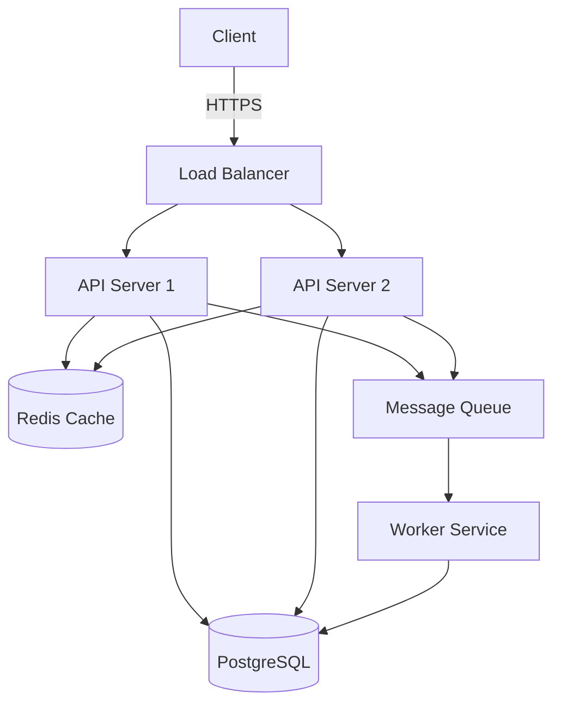

# Documentation

## Table of Contents

- [Why Documentation Matters](#why-documentation-matters)
- [Types of Documentation](#types-of-documentation)
- [README Files](#readme-files)
- [API Documentation](#api-documentation)
- [Architecture Decision Records (ADRs)](#architecture-decision-records-adrs)
- [RFCs — Request for Comments](#rfcs--request-for-comments)
- [Runbooks](#runbooks)
- [Documentation as Code](#documentation-as-code)
- [Writing Good Documentation](#writing-good-documentation)
- [Interview Questions](#interview-questions)

---

## Why Documentation Matters

> "Code tells you how, comments tell you why." — Jeff Atwood

```
Without Documentation:
├── New team members take weeks to onboard
├── Knowledge is trapped in people's heads ("tribal knowledge")
├── Same questions are answered repeatedly
├── Architectural decisions are lost when people leave
├── Debugging takes longer (no context for why things are)
└── On-call engineers struggle during incidents

With Documentation:
├── Onboarding time reduced by 50-70%
├── Knowledge is shared and searchable
├── Decisions are recorded with context
├── Incident response is faster and more consistent
├── New contributors can self-serve
└── Code reviews are more efficient
```

### The Documentation Quadrant

```
              Learning-oriented          Task-oriented
            ┌──────────────────────┬──────────────────────┐
            │                      │                      │
  Beginner  │     Tutorials        │   How-to Guides      │
            │  "Learning by doing" │  "Step-by-step       │
            │                      │   instructions"      │
            ├──────────────────────┼──────────────────────┤
            │                      │                      │
  Expert    │   Explanations       │   Reference          │
            │  "Understanding      │  "Technical          │
            │   concepts"          │   descriptions"      │
            │                      │                      │
            └──────────────────────┴──────────────────────┘

  Based on Diátaxis documentation framework
```

---

## Types of Documentation

```
Documentation Types
├── Project Documentation
│   ├── README.md — Project overview, setup, usage
│   ├── CONTRIBUTING.md — How to contribute
│   ├── CHANGELOG.md — Version history
│   ├── LICENSE.md — Legal terms
│   └── CODE_OF_CONDUCT.md — Community standards
│
├── Technical Documentation
│   ├── Architecture docs — System design, components
│   ├── ADRs — Why we made certain decisions
│   ├── RFCs — Proposals for changes
│   ├── API docs — Endpoints, parameters, responses
│   └── Database schema docs — Tables, relationships
│
├── Process Documentation
│   ├── Runbooks — Step-by-step operational procedures
│   ├── Playbooks — Incident response procedures
│   ├── Onboarding guides — New team member setup
│   └── Release checklists — Deployment procedures
│
├── Code Documentation
│   ├── Inline comments — Why, not what
│   ├── Docstrings — Function/class descriptions
│   ├── Type annotations — Self-documenting code
│   └── Generated docs — JSDoc, Sphinx, etc.
│
└── User Documentation
    ├── User guides — How to use the product
    ├── FAQs — Common questions
    ├── Tutorials — Learning-oriented guides
    └── Release notes — What's new in each version
```

---

## README Files

The README is the **front door** of your project. It's the first thing people see.

### README Template

```markdown
# Project Name

One-line description of what this project does.

## Features

- Feature 1: Brief description
- Feature 2: Brief description
- Feature 3: Brief description

## Quick Start

### Prerequisites

- Node.js >= 18
- PostgreSQL >= 14
- Redis >= 6

### Installation

```bash
git clone https://github.com/org/project.git
cd project
npm install
cp .env.example .env
# Edit .env with your configuration
npm run db:migrate
npm run dev
```

### Usage

```bash
# Example usage
npm start
# Open http://localhost:3000
```

## API Reference

| Endpoint | Method | Description |
|---|---|---|
| `/api/users` | GET | List all users |
| `/api/users/:id` | GET | Get user by ID |
| `/api/users` | POST | Create a user |

## Architecture

Brief description of the system architecture.
Include a diagram if helpful.

## Development

### Running Tests

```bash
npm test
npm run test:coverage
```

### Linting

```bash
npm run lint
npm run lint:fix
```

## Contributing

See the [repository contribution guidance](https://github.com/vanos001/placement_prep)

## License

MIT License — see [LICENSE](LICENSE)
```

### README Best Practices

```
✅ Do:
├── Start with what the project does (one sentence)
├── Include a quick start section
├── Show usage examples
├── List prerequisites
├── Add badges (build status, coverage, version)
├── Link to detailed docs
├── Keep it concise — detailed docs go elsewhere
└── Update it when the project changes

❌ Don't:
├── Write a novel — keep it under 300 lines
├── Include installation instructions for the OS
├── Assume knowledge — explain acronyms
├── Leave outdated information
├── Skip the "why" — explain the problem it solves
└── Forget about contributing guidelines
```

---

## API Documentation

Good API documentation is critical for developer experience (DX).

### OpenAPI/Swagger Specification

```yaml
openapi: 3.0.0
info:
  title: User API
  version: 1.0.0
  description: API for managing users

paths:
  /api/users:
    get:
      summary: List all users
      parameters:
        - name: page
          in: query
          schema:
            type: integer
            default: 1
        - name: limit
          in: query
          schema:
            type: integer
            default: 20
            maximum: 100
      responses:
        200:
          description: Successful response
          content:
            application/json:
              schema:
                type: object
                properties:
                  users:
                    type: array
                    items:
                      $ref: '#/components/schemas/User'
                  total:
                    type: integer
                  page:
                    type: integer

    post:
      summary: Create a new user
      requestBody:
        required: true
        content:
          application/json:
            schema:
              $ref: '#/components/schemas/CreateUser'
      responses:
        201:
          description: User created
        400:
          description: Validation error
        409:
          description: Email already exists

components:
  schemas:
    User:
      type: object
      properties:
        id:
          type: string
          format: uuid
        name:
          type: string
        email:
          type: string
          format: email
        created_at:
          type: string
          format: date-time

    CreateUser:
      type: object
      required:
        - name
        - email
      properties:
        name:
          type: string
          minLength: 2
          maxLength: 100
        email:
          type: string
          format: email
```

### API Documentation Best Practices

```
Every endpoint should document:
├── HTTP method and URL
├── Description (what it does)
├── Authentication requirements
├── Request parameters (path, query, headers)
├── Request body (schema, examples)
├── Response format (schema, examples)
├── Error responses (with status codes)
├── Rate limiting info
└── Example curl command

Tools:
├── Swagger/OpenAPI — Industry standard
├── Postman — Collections with documentation
├── Redoc — Beautiful API doc rendering
├── Stoplight — Design + documentation
└── ReadMe — Developer portal
```

---

## Architecture Decision Records (ADRs)

ADRs document **architectural decisions** along with their context and consequences.

### ADR Template

```markdown
# ADR-001: Use PostgreSQL as Primary Database

## Status
Accepted

## Date
2024-01-15

## Context
We need a relational database for our e-commerce platform that:
- Handles complex queries (joins, aggregations)
- Supports JSON data (product attributes)
- Provides ACID compliance for financial transactions
- Has strong ecosystem and community support

## Decision
We will use PostgreSQL 15 as our primary database.

## Alternatives Considered

### MySQL
- Pros: Wider adoption, simpler setup
- Cons: Weaker JSON support, less feature-rich
- Rejected: JSON support is critical for flexible product attributes

### MongoDB
- Pros: Flexible schema, horizontal scaling
- Cons: No ACID transactions (at the time), joins are expensive
- Rejected: Financial transactions require ACID compliance

### CockroachDB
- Pros: Distributed SQL, PostgreSQL compatible
- Cons: Higher operational complexity, smaller community
- Rejected: Overkill for current scale, revisit at 10x growth

## Consequences

### Positive
- Strong JSON support via JSONB for product attributes
- ACID compliance for financial transactions
- Rich ecosystem of tools and extensions
- Team has existing PostgreSQL experience

### Negative
- Vertical scaling limits (mitigated by read replicas)
- More complex than MySQL for simple use cases

### Risks
- If we need horizontal scaling, we'll need to shard or migrate
- Mitigation: Design schema with sharding in mind

## References
- PostgreSQL vs MySQL comparison: [link]
- JSONB performance benchmarks: [link]
```

### ADR Best Practices

```
✅ Do:
├── Write ADRs at the time of the decision (not months later)
├── Include context — WHY was this decision made?
├── List alternatives considered and why they were rejected
├── Describe consequences (positive AND negative)
├── Keep them short — 1-2 pages max
├── Number them sequentially (ADR-001, ADR-002, ...)
├── Store them in version control alongside code
└── Review and update status if decisions change

❌ Don't:
├── Write ADRs for trivial decisions
├── Skip the alternatives section
├── Only list positive consequences
├── Make them too technical for stakeholders to understand
├── Forget to link to related ADRs
└── Let them become outdated without updating status
```

### When to Write an ADR

```
Write an ADR when:
├── Choosing a database technology
├── Selecting an authentication strategy
├── Deciding on API design (REST vs GraphQL)
├── Choosing a deployment architecture
├── Selecting a message queue technology
├── Deciding on a caching strategy
├── Choosing between microservices and monolith
└── Any decision that would be costly to reverse
```

---

## RFCs — Request for Comments

RFCs are **proposals for changes** that need team input before implementation.

### RFC Template

```markdown
# RFC: Implement Rate Limiting

## Summary
Implement API rate limiting to protect against abuse and ensure
fair resource usage.

## Motivation
- Current API has no rate limiting, making it vulnerable to abuse
- Production incidents caused by single clients making 10,000+ req/s
- Need to ensure fair usage across all clients

## Detailed Design

### Algorithm
Use token bucket algorithm with Redis backend.

### Limits
| Tier | Requests/min | Burst |
|---|---|---|
| Free | 60 | 10 |
| Pro | 600 | 100 |
| Enterprise | 6000 | 1000 |

### Response Headers
```
X-RateLimit-Limit: 600
X-RateLimit-Remaining: 594
X-RateLimit-Reset: 1705334400
```

### Error Response
```json
{
  "error": "rate_limit_exceeded",
  "message": "Too many requests. Retry after 30 seconds.",
  "retry_after": 30
}
```

## Alternatives Considered

1. **Leaky bucket** — More complex, similar results
2. **Fixed window** — Simpler but has burst issues at window boundaries
3. **API gateway rate limiting** — Considered but want application-level control

## Drawbacks
- Additional Redis infrastructure
- Slight latency increase (~2ms per request)
- Need to handle Redis failures gracefully

## Open Questions
1. Should rate limits be per-IP or per-API-key?
2. How do we handle rate limiting for internal services?

## Implementation Plan
1. Week 1: Core rate limiter with Redis
2. Week 2: Integration with API gateway
3. Week 3: Monitoring and alerting
4. Week 4: Rollout to production (10% → 50% → 100%)
```

### RFC Process

```
1. Author writes RFC and shares with team
2. Team reviews and comments (1-2 week review period)
3. Author addresses feedback and revises
4. Decision meeting (if needed) to resolve open questions
5. RFC is accepted, rejected, or deferred
6. Accepted RFCs become the source of truth for implementation
```

---

## Runbooks

Runbooks are **step-by-step operational procedures** for handling specific situations, especially during incidents.

### Runbook Template

```markdown
# Runbook: High CPU Usage Alert

## Overview
This runbook covers the procedure for handling high CPU usage
alerts on production servers.

## Severity
P2 — Service degradation, immediate attention required

## Symptoms
- CPU usage > 90% for 5+ minutes
- Response times increasing
- Possible timeout errors for users

## Detection
- Alert: `cpu_usage_critical` in PagerDuty
- Dashboard: Grafana → Production → CPU Usage
- Logs: Check for spike in request volume

## Diagnosis Steps

### Step 1: Identify the affected service
```bash
# Check which process is using the most CPU
ssh prod-web-01 "top -b -n 1 | head -20"

# Check container resource usage
kubectl top pods -n production --sort-by=cpu
```

### Step 2: Determine the cause
```bash
# Check if it's a traffic spike
curl -s "http://prometheus:9090/api/v1/query?query=rate(http_requests_total[5m])"

# Check for recent deployments
kubectl rollout history deployment/api-server -n production

# Check for slow queries
ssh prod-db-01 "pg_stat_activity" | grep -i "active"
```

### Step 3: Common causes and solutions

#### Traffic Spike
- Check analytics for unusual traffic patterns
- Enable rate limiting if not already active
- Scale horizontally: `kubectl scale deployment api-server --replicas=10`

#### Bad Deployment
- Rollback: `kubectl rollout undo deployment/api-server -n production`
- Verify: Check metrics after rollback

#### Runaway Query
- Identify the query: `SELECT * FROM pg_stat_activity WHERE state = 'active'`
- Kill if necessary: `SELECT pg_terminate_backend(pid)`

## Escalation
- If not resolved in 30 minutes → escalate to senior engineer
- If customer-facing impact → notify product manager
- If data integrity risk → escalate to database team

## Prevention
- Set up auto-scaling policies
- Implement query timeout limits
- Add circuit breakers for external services
- Review and optimize slow queries quarterly
```

### Runbook Best Practices

```
✅ Do:
├── Write runbooks BEFORE incidents happen
├── Include exact commands (copy-pasteable)
├── Test runbooks regularly (game days)
├── Update after every incident
├── Include screenshots/links to dashboards
├── Define clear escalation paths
├── Keep language simple — stress impairs comprehension
└── Version control your runbooks

Structure:
├── Overview — What is this runbook for?
├── Severity — How urgent is it?
├── Symptoms — How do I know this is happening?
├── Detection — What alerted me?
├── Diagnosis — How do I figure out the cause?
├── Resolution — How do I fix it?
├── Escalation — Who do I contact if I can't fix it?
└── Prevention — How do I prevent this from happening again?
```

---

## Documentation as Code

Documentation as Code treats documentation with the same practices as source code.

### Principles

```
1. Version Control
   ├── Store docs in the same repo as code
   ├── Track changes with git
   ├── Review documentation changes in PRs
   └── Branch documentation like code

2. Automation
   ├── Generate API docs from code (Swagger, JSDoc)
   ├── Auto-build and publish docs on merge
   ├── Lint documentation (markdownlint, vale)
   └── Check for broken links automatically

3. Review Process
   ├── Documentation PRs require review
   ├── Technical writers review for clarity
   ├── Engineers review for accuracy
   └── Track documentation coverage

4. Single Source of Truth
   ├── Docs and code live together
   ├── Generated docs stay in sync with code
   ├── No duplicate documentation
   └── Link to canonical sources
```

### Documentation Tools

```
Static Site Generators:
├── MkDocs (Python) — Simple, Markdown-based
├── Docusaurus (React) — Meta's doc framework
├── Hugo (Go) — Fast, flexible
├── Sphinx (Python) — Great for technical docs
└── VuePress (Vue) — Vue-powered docs

API Documentation:
├── Swagger UI — Interactive API explorer
├── Redoc — Beautiful API reference
├── Postman — Collections + documentation
└── ReadMe — Developer portals

Documentation Linting:
├── markdownlint — Markdown style checker
├── Vale — Prose linter for documentation
├── write-good — Linter for English prose
└── alex — Catch insensitive language

Diagrams as Code:
├── Mermaid — Markdown-based diagrams
├── PlantUML — UML diagrams from text
├── draw.io — Visual diagrams (exportable)
└── Structurizr — C4 model diagrams
```

### Mermaid Diagrams in Documentation

```markdown
# Example: System Architecture


```

---

## Writing Good Documentation

### The Diátaxis Framework

```
┌─────────────────────────────────────────────────────┐
│                    Diátaxis                          │
├──────────────────┬──────────────────────────────────┤
│                  │                                  │
│   Tutorials      │   How-to Guides                  │
│   (Learning)     │   (Goals)                        │
│                  │                                  │
│   - Lesson-like  │   - Task-oriented                │
│   - Safe space   │   - Steps to achieve a goal      │
│   - Builds       │   - Assumes some knowledge       │
│     confidence   │   - Practical, focused            │
│                  │                                  │
├──────────────────┼──────────────────────────────────┤
│                  │                                  │
│   Explanation    │   Reference                      │
│   (Understanding)│   (Information)                  │
│                  │                                  │
│   - Conceptual   │   - Descriptive                  │
│   - Provides     │   - Accurate, complete           │
│     context      │   - Organized for lookup         │
│   - "Why" things │   - Theoretical                   │
│     are this way │                                  │
│                  │                                  │
└──────────────────┴──────────────────────────────────┘
```

### Writing Tips

```
Clarity:
├── Use simple language — avoid jargon when possible
├── Define technical terms on first use
├── Use short sentences and paragraphs
├── One idea per paragraph
└── Use active voice: "Run the command" not "The command should be run"

Structure:
├── Start with the most important information
├── Use headings to create scannable sections
├── Use bullet points for lists
├── Include code examples that work
└── Provide context before details

Code Examples:
├── Make them copy-pasteable
├── Include expected output
├── Show error cases too
├── Keep them minimal but complete
└── Test them before publishing

Maintenance:
├── Set a review schedule (quarterly minimum)
├── Assign documentation owners
├── Track documentation debt
├── Automate freshness checks
└── Remove outdated docs (bad docs < no docs)
```

---

## Interview Questions

### Beginner

**Q1: What should a good README contain?**

A good README should include: project description, features, prerequisites, installation instructions, usage examples, API reference (if applicable), development setup (tests, linting), contributing guidelines, and license information. It should be concise enough to read in 5 minutes.

**Q2: What is an ADR and when should you write one?**

An Architecture Decision Record documents a significant architectural decision, including the context (why), the decision, alternatives considered, and consequences. Write ADRs when making decisions that would be costly to reverse — database choice, API design patterns, authentication strategy, etc.

**Q3: Why is documentation important in software engineering?**

Documentation enables knowledge sharing, reduces onboarding time, preserves institutional knowledge, speeds up debugging, and helps teams scale. Without it, knowledge is trapped in individuals' heads, creating single points of failure and making it difficult for new team members to contribute.

### Intermediate

**Q4: How do you keep documentation up to date?**

(1) Store docs with code in version control so they're reviewed in PRs. (2) Automate what you can — generate API docs from code annotations. (3) Set up CI checks for broken links and outdated content. (4) Assign documentation owners for each area. (5) Include documentation updates in the Definition of Done. (6) Schedule quarterly documentation reviews. (7) Make it easy to contribute — lower the barrier to update docs.

**Q5: What is the difference between a runbook and a playbook?**

A runbook is a step-by-step procedure for a specific operational task (e.g., "How to scale the database"). A playbook is a broader incident response guide that covers a category of incidents (e.g., "Security incident response"). Runbooks are tactical and specific; playbooks are strategic and encompassing. A playbook may reference multiple runbooks.

**Q6: How do you document APIs effectively?**

Use OpenAPI/Swagger specification for REST APIs. Every endpoint should document: HTTP method, URL, description, authentication, parameters, request body schema, response schemas for success and error cases, rate limiting, and example requests/responses. Tools like Swagger UI provide interactive documentation where developers can try API calls directly. For GraphQL, use schema descriptions and tools like GraphiQL.

### Advanced

**Q7: How would you implement documentation as code in a large organization?**

(1) Store all documentation in git repositories alongside the code they document. (2) Use CI/CD pipelines to build and deploy documentation sites automatically. (3) Implement documentation linting in CI (markdownlint, Vale for prose quality). (4) Create documentation templates and standards. (5) Use API doc generation tools (Swagger for REST, GraphQL Playground for GraphQL). (6) Implement documentation coverage metrics — track which modules have docs. (7) Create a documentation platform team that maintains the tooling and standards. (8) Use Mermaid/PlantUML for diagrams stored as code.

**Q8: A team argues that "the code is the documentation." How do you respond?**

The code shows *what* and *how*, but not *why*. Code can't explain: why this architecture was chosen over alternatives, what business constraints influenced the design, what trade-offs were made, what the system was like before (context), or how to get started as a new developer. Code is necessary documentation, but it's not sufficient. Good documentation complements code by providing context, rationale, and guidance. The best approach is self-documenting code (clear naming, small functions) supplemented by high-level documentation (ADRs, architecture docs, runbooks).

**Q9: You're tasked with creating documentation for a legacy system with no existing docs. How do you approach it?**

(1) Start with the most critical: a README with setup instructions and a high-level architecture diagram. (2) Interview the people who built it — capture tribal knowledge before they leave. (3) Document the "what" first (API contracts, database schema, deployment process). (4) Then document the "why" (ADRs for key decisions, business rules). (5) Create runbooks for the most common operational tasks. (6) Use code analysis tools to generate initial API docs. (7) Prioritize based on pain points — what causes the most confusion? (8) Write docs incrementally during regular work — every time you learn something, document it.
