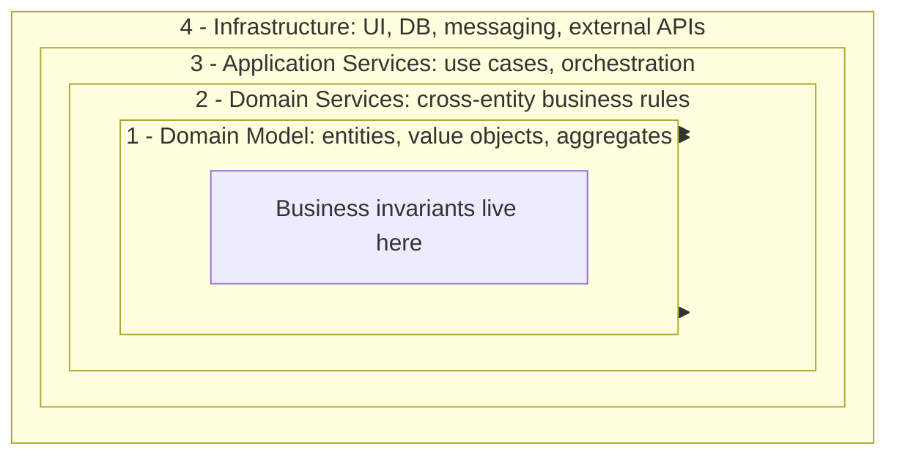
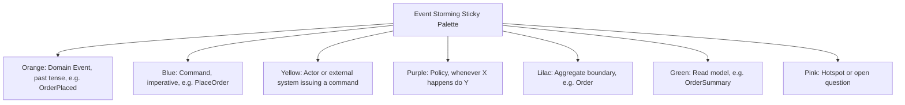

# Onion Architecture & Event Storming

> Two complementary tools for designing software around the business domain: **Onion Architecture** structures the code so the domain sits at the center, and **Event Storming** is a collaborative modeling technique that surfaces that domain before you write a single line of code.

## Table of Contents

- [Onion Architecture](#onion-architecture)
- [Onion Layers and Dependency Direction](#onion-layers-and-dependency-direction)
- [Inversion of Control and Testability](#inversion-of-control-and-testability)
- [Onion Architecture in Code](#onion-architecture-in-code)
- [Onion vs Hexagonal vs Clean Architecture](#onion-vs-hexagonal-vs-clean-architecture)
- [When to Choose Onion Architecture](#when-to-choose-onion-architecture)
- [Software Architecture Patterns Compared](#software-architecture-patterns-compared)
- [Event Storming](#event-storming)
- [Event Storming Formats](#event-storming-formats)
- [Event Storming Building Blocks](#event-storming-building-blocks)
- [Sticky Color Legend](#sticky-color-legend)
- [Workshop Flow and Warroom Format](#workshop-flow-and-warroom-format)
- [DDD Alignment and Bounded Context Discovery](#ddd-alignment-and-bounded-context-discovery)
- [Event Storming vs Alternatives](#event-storming-vs-alternatives)
- [Common Pitfalls](#common-pitfalls)
- [Interview Questions](#interview-questions)
- [References](#references)

---

## Onion Architecture

Onion Architecture was introduced by **Jeffrey Palermo** in a 2008 blog series ("The Onion Architecture", parts 1–3) as a reaction against the conventional three-tier architecture where the database sat at the foundation and every other layer depended downward on it. Palermo's central insight, drawn from **Eric Evans' "Domain-Driven Design" (2003)**, was that the *business domain* — not the database, not the UI, not the framework — must be the most stable and most depended-upon part of the system. The architecture is named "onion" because its layers are concentric: the domain model is the innermost core, and every outer layer may depend only on the layers inside it. The dependencies always point inward.

This inward dependency rule is what separates Onion from layered architectures such as the traditional n-tier model, where the data layer tends to leak upward through repositories that the business logic calls directly. **Robert C. Martin** later generalized the same idea in "Clean Architecture" (2017), and the concentric diagram Palermo drew in 2008 is the direct ancestor of the "Entities → Use Cases → Interface Adapters → Frameworks" circle that every Clean Architecture blog post reproduces. Onion Architecture is therefore best understood not as a competitor to Clean Architecture but as one of its most influential precursors, with a stronger emphasis on the DDD building blocks (entities, value objects, aggregates, repositories) that sit at the center.

## Onion Layers and Dependency Direction



A canonical Onion Architecture has four rings. The **Domain Model** (innermost) holds entities, value objects, and aggregates — pure business objects with no reference to databases, HTTP, or any framework. The **Domain Services** ring holds operations that span multiple aggregates or that do not naturally belong to a single entity (e.g. a `TransferService` moving money between two `Account` aggregates). The **Application Services** ring (also called "use cases") orchestrates a single business transaction: load aggregates from repositories, invoke domain operations, persist results, and publish domain events. The **Infrastructure** (outermost) ring contains everything that talks to the outside world — controllers, database repositories, message-bus publishers, email gateways, UI adapters.

The single rule that makes the onion "an onion" is that **dependencies always point inward**. The domain model depends on nothing. Domain services depend only on the domain model. Application services depend on domain services and the domain model. Infrastructure depends on everything inside it. Crucially, the inner rings define *interfaces* (repository abstractions, message-bus abstractions) and the outer rings *implement* them — a textbook application of the Dependency Inversion Principle. This inversion is what lets you swap PostgreSQL for an in-memory fake in tests, or replace a REST controller with a gRPC one, without touching a single line of domain code.

## Inversion of Control and Testability

The inward dependency rule is enforced through **inversion of control**: the inner layers define abstractions (`IOrderRepository`, `IPaymentGateway`, `IDomainEventBus`) and the outer layers provide concrete implementations. At runtime, a composition root in the infrastructure layer wires the implementations together and injects them into the application services. This is the same mechanism that the SOLID principles (see [`./design.md`](./design.md)) prescribe — in particular the Dependency Inversion Principle — but applied at the architectural rather than the class level.

The payoff is **testability**. Because the domain model has no external dependencies, unit tests for business rules run in microseconds with no test doubles. Application services can be tested with in-memory fakes of the repository and event-bus interfaces, exercising the full use-case flow without a database. Only a thin slice of integration tests needs the real database, message broker, or HTTP server. A second payoff is **latency of change**: when a business rule changes, only the domain model is touched; when a persistence technology changes, only the infrastructure ring is touched. The blast radius of a change is bounded by the ring it lives in, which is exactly the separation of concerns that Palermo was after.

## Onion Architecture in Code

The inward dependency rule is most visible in the import graph of a working codebase. The snippet below shows a minimal Onion arrangement in Python: the domain model imports nothing from outside; the domain service imports only the domain model; the application service imports the domain model and two *abstractions* (`IOrderRepository`, `IDomainEventBus`) that it does not define; the infrastructure ring defines those abstractions' concrete implementations.

```python
# --- Ring 1: Domain Model (no imports from outer rings) ---
from dataclasses import dataclass
from decimal import Decimal

@dataclass
class OrderLine:
    sku: str
    quantity: int
    unit_price: Decimal

class Order:                                  # aggregate root
    def __init__(self, order_id: str):
        self.order_id = order_id
        self._lines: list[OrderLine] = []

    def add_line(self, sku: str, qty: int, price: Decimal) -> None:
        if qty <= 0:
            raise ValueError("quantity must be positive")   # business invariant
        self._lines.append(OrderLine(sku, qty, price))

    @property
    def total(self) -> Decimal:
        return sum((l.unit_price * l.quantity for l in self._lines), Decimal(0))

# --- Ring 2: Domain Services (depends only on the domain model) ---
class PricingService:
    def apply_discount(self, order: Order, rate: Decimal) -> Decimal:
        return order.total * (Decimal(1) - rate)

# --- Ring 3: Application Service (depends on domain + abstractions) ---
class PlaceOrderUseCase:
    def __init__(self, repo: "IOrderRepository", bus: "IDomainEventBus"):
        self._repo = repo
        self._bus = bus

    def execute(self, cmd: "PlaceOrderCommand") -> str:
        order = Order(cmd.order_id)
        for line in cmd.lines:
            order.add_line(line.sku, line.qty, line.price)
        self._repo.save(order)
        self._bus.publish(OrderPlaced(cmd.order_id, order.total))
        return cmd.order_id

# --- Ring 4: Infrastructure (implements the abstractions) ---
class SqlOrderRepository(IOrderRepository):     # implements the port
    def save(self, order: Order) -> None: ...

class KafkaDomainEventBus(IDomainEventBus):     # implements the port
    def publish(self, event: object) -> None: ...
```

Two things to notice. First, the `PlaceOrderUseCase` references `IOrderRepository` and `IDomainEventBus` as forward-declared strings — those interfaces are *defined* in an inner ring (or in a shared abstractions package) and *implemented* here in infrastructure. Second, the `Order` aggregate enforces its own invariant (`qty > 0`) rather than trusting the database or the controller to validate it. That invariant living in the domain ring is what makes the rule testable in isolation and durable across a change of database, UI, or message bus.

## Onion vs Hexagonal vs Clean Architecture

Onion, Hexagonal (Ports and Adapters, **Alistair Cockburn** 2005), and Clean Architecture (**Robert C. Martin** 2017) are three closely related architectural styles that all enforce the same core invariant: the domain is independent of infrastructure. The differences are mostly in vocabulary and emphasis. Hexagonal focuses on the *ports* (interfaces) and *adapters* (implementations) metaphor and is silent on how the inside is structured. Onion mandates a specific inside — domain model, domain services, application services — and draws the concentric picture. Clean Architecture generalizes both into a four-ring schema and adds explicit rules about crossing ring boundaries with the Dependency Rule.

| Aspect | Onion (Palermo 2008) | Hexagonal / Ports & Adapters (Cockburn 2005) | Clean Architecture (Martin 2017) |
|---|---|---|---|
| Core idea | Concentric layers, dependencies inward | Application surrounded by ports; adapters plug in | Dependency Rule: source dependencies point inward |
| Inside structure | Domain model + domain services + application services | Unspecified — left to the team | Entities + use cases + interface adapters |
| Metaphor | Onion rings | Hexagon with ports on each face | Concentric circles |
| Strongest emphasis | DDD building blocks at center | Symmetry of driving/driven adapters | Boundaries between rings, testability |
| Typical use | DDD-rich business applications | Replacing UI, DB, or messaging without touching core | General-purpose, language-agnostic |
| Relationship | Precursor to Clean Architecture | Precursor to both Onion and Clean | Synthesis of Onion + Hexagonal + others |

In practice a team rarely picks "pure" Onion *or* Hexagonal *or* Clean — most modern DDD codebases blend them, taking the concentric picture from Onion, the ports-and-adapters vocabulary from Hexagonal, and the explicit Dependency Rule from Clean Architecture. For interview purposes, the key claim to be able to defend is that all three agree on the direction of dependencies: inward, toward the domain.

## When to Choose Onion Architecture

Onion Architecture pays its complexity tax when the business domain is rich, long-lived, and central to the company's competitive advantage. If the rules around "how an order becomes shippable" are subtle, evolve over years, and are worth protecting from framework churn, then the investment in a pure domain model with inverted dependencies is justified — the domain becomes a long-lived asset while infrastructure becomes a replaceable commodity. Onion also shines in regulated domains (banking, healthcare, insurance) where the business rules themselves are auditable artifacts that must survive a migration from, say, a monolith on .NET to microservices on the JVM.

The architecture is the wrong tool for shallow domains. A CRUD admin panel, a stateless API gateway, or a thin read-heavy reporting service gains nothing from four concentric rings — the domain model would be anaemic and the repository abstractions would merely mirror the table schema. For such systems a straightforward layered or even framework-first architecture (a Rails controller that talks directly to ActiveRecord models) is simpler, faster to build, and easier to onboard new engineers onto. The heuristic Palermo himself offered is: *if you cannot name a domain expert who cares about the rules in the center, you do not have an onion to peel.* When in doubt, start with a simpler architecture and let the domain's complexity pull you inward.

## Software Architecture Patterns Compared

Onion Architecture sits in a broader landscape of architectural patterns. The table below positions it against the other common styles a candidate should be able to contrast in an interview. The columns capture the dominant direction of dependency, where the business logic lives, and the typical coupling profile.

| Pattern | Dependency direction | Where logic lives | Coupling profile | Typical domain complexity |
|---|---|---|---|---|
| Layered (n-tier) | Top to bottom | Service layer | UI depends on service depends on DB | Low to medium |
| Onion | Outer to inner (inward) | Domain model at center | Outer rings depend on abstractions defined inside | High |
| Hexagonal (Ports & Adapters) | Adapters to ports to application | Application core | Symmetric adapters around ports | Medium to high |
| Clean Architecture | Outer to inner (inward) | Entities + use cases | Same as Onion, more prescriptive rings | High |
| Microservices (decomposed) | Service to service over network | Each service owns its logic | API contracts; runtime coupling via network | Variable |
| Event-driven | Producer to bus to consumer | Spread across consumers | Temporal coupling via events | Medium to high |

The pattern that pairs most naturally with Onion at the code level is **event-driven** at the system level: the domain model emits domain events (see [`../backend/patterns/event-driven.md`](../backend/patterns/event-driven.md)), which become the integration mechanism between separately deployed services. Event sourcing (see [`../backend/patterns/event-sourcing.md`](../backend/patterns/event-sourcing.md)) and CQRS (see [`../backend/patterns/cqrs.md`](../backend/patterns/cqrs.md)) are common companions because they take the domain-event concept to its logical conclusion — the event becomes the source of truth, and the aggregate state is derived from it.

## Event Storming

Event Storming is a **collaborative, low-tech modeling workshop** invented by **Alberto Brandolini** and first presented publicly in 2013 ("Introducing Event Storming", published as a series of papers and conference talks, later consolidated into his "Event Storming" book on Leanpub). Brandolini's premise, which he summarizes as "the cost of exploration is lower than the cost of ignoring it", is that the cheapest way to discover what a software system actually does is to gather the people who understand the business in front of a long roll of paper and have them narrate the domain as a sequence of *domain events*. A domain event is something that has happened in the business that domain experts care about — `OrderPlaced`, `PaymentAuthorized`, `ShippingConfirmed` — phrased in the past tense.

The technique deliberately privileges breadth over depth in its first hour: participants are told to write events on **orange sticky notes** and place them along a wall in roughly chronological order, left to right, with no concern for how the software will implement them. Misunderstandings surface immediately because two experts will often place the same event at different points or disagree on its name; those disagreements are captured on **pink "hotspot" stickies** rather than resolved by the loudest voice in the room. By the end of a session a wall is covered in hundreds of stickies that together form a far richer model than any single person could have produced alone — and crucially, the model belongs to the whole room rather than to a single analyst.

## Event Storming Formats

Brandolini distinguishes three levels of Event Storming, each with a different goal and a different audience.

The **Big Picture** variant is the broadest. It runs for a full day, invites everyone with a stake in the business — engineers, product managers, customer support, sales, legal — and produces an end-to-end map of the domain as a sequence of events. The goal is not to design software but to build a shared language and to expose where the real complexity hides. Big Picture sessions are often the first time a support agent and a backend engineer have ever compared notes on the same process, and the surprises that emerge (typically: "wait, that's how finance thinks of an order?") are the whole point.

The **Process Modeling** variant narrows the scope to a single business process — say, "from order placement to delivery" — and adds commands, actors, and policies to the event timeline. The goal is to make the flow executable in the participants' heads: who triggers what, what decisions are made, what happens when something fails. This is the right level for redesigning an existing process end to end.

The **Software Event Storming** variant is the most detailed. It introduces aggregates, read models, and explicit boundaries, and is meant to produce directly implementable design artifacts — aggregate boundaries, event names, command handlers — that a development team can take into a DDD implementation. The output of a Software Event Storming session often becomes the first draft of the bounded context map and the aggregate design that engineers code against the following week.

## Event Storming Building Blocks

An Event Storming wall is built from a small alphabet of sticky-note types, each with a fixed color and a fixed meaning. Keeping the vocabulary small is deliberate: the constraint forces participants to classify every contribution, and the color of a sticky tells you at a glance whether you are looking at a fact, an intent, or an open question.

- **Domain event (orange)** — a fact that has happened, in the past tense: `OrderPlaced`, `InvoiceIssued`. Events are the backbone of the model; everything else attaches to them.
- **Command (blue)** — an intent to make something happen: `PlaceOrder`, `IssueInvoice`. A command is what *triggers* an event; the same command may be rejected (insufficient funds) and produce no event.
- **Actor (yellow)** — a human role or external system that issues a command: `Customer`, `Warehouse Clerk`, `Stripe webhook`.
- **Policy (purple)** — a reactive rule of the form "whenever *X* happens, do *Y*": "whenever `OrderPlaced`, execute `ChargeCard`". Policies are the glue that turns a list of events into a running process.
- **Read model (green)** — a view built from events to support a query or a UI screen: `OrderSummary`, `DailyRevenueReport`.
- **Aggregate (lilac / red)** — a consistency boundary enclosing a cluster of entities that must change transactionally: the `Order` aggregate owns `OrderPlaced`, `OrderShipped`, `OrderCancelled`.
- **Hotspot (pink)** — an open question, a disagreement, or a known unknown: "is `RefundIssued` inside the `Order` aggregate or a separate `Refund` aggregate?" Hotspots are first-class citizens — they are explicitly not resolved during the storming, only recorded.

The alphabet is small on purpose: with only seven colors, every contribution must be classified, and the wall reads like a typed graph rather than a pile of opinions. A pink sticky stuck on top of two orange events signals "we disagree about the relationship between these two events", and that signal is visible to anyone who walks into the room.

## Sticky Color Legend



The table below is the canonical reference for sticky colors used in a Software Event Storming session. Brandolini's palette has been remarkably stable since 2013; minor variations exist (some practitioners use lilac for aggregates, others use red), but the orange/blue/purple/pink quartet is universal.

| Color | Element | Example | Direction |
|---|---|---|---|
| Orange | Domain event | `OrderPlaced` | Past tense, factual |
| Blue | Command | `PlaceOrder` | Imperative, intent |
| Yellow | Actor / user | `Customer` | Issues commands |
| Purple | Policy | "On `OrderPlaced`, do `ChargeCard`" | Reactive |
| Lilac / Red | Aggregate boundary | `Order` | Consistency boundary |
| Green | Read model | `OrderSummary` | Projection of events |
| Pink | Hotspot | "Is refund its own aggregate?" | Open question |
| Brown (optional) | External system | `Stripe`, `SAP` | Outside our control |

The colors are not decorative — they encode the *type* of each element so the wall reads like a typed graph. A blue command with no orange event to its right signals "this command has no observable effect — is it real?". The discipline of color is what lets a stranger walk into the warroom, spend thirty seconds scanning the wall, and understand the shape of the domain without needing a guided tour.

## Workshop Flow and Warroom Format

```mermaid
flowchart LR
    KICK["Kick-off: name the domain to explore"]
    EVENTS["Unlimited orange stickies: domain events in past tense"]
    TIMELINE["Arrange events along a timeline, left to right"]
    CMD["Add blue commands triggering each event"]
    POL["Add purple policies: whenever X happens, do Y"]
    AGG["Group events and commands into lilac aggregates"]
    BC["Draw bounded-context boundaries around clusters"]
    EXPORT["Photograph the wall; pivot to design and ADRs"]
    KICK --> EVENTS
    EVENTS --> TIMELINE
    TIMELINE --> CMD
    CMD --> POL
    POL --> AGG
    AGG --> BC
    BC --> EXPORT
```



A typical Event Storming workshop runs in a physical or virtual **warroom**: a long blank wall (or a Miro/Mural board) that the team can stand in front of, a roll of paper tape as the timeline, and a generous supply of sticky notes in the seven colors above. Brandolini's recommended agenda starts with a five-minute kick-off in which the facilitator names the domain to explore ("everything that happens between a customer placing an order and the warehouse shipping it") and then explicitly invites "unlimited orange sticky notes" — every participant writes every event they can think of, in silence, for ten minutes.

The messy pile of orange stickies is then arranged along the wall into a rough timeline, and the facilitator introduces commands (blue), actors (yellow), and policies (purple) one color at a time, each round surfacing new questions that become pink hotspots. Aggregates (lilac) and read models (green) appear only in the Software Event Storming variant. A session typically ends with a "pivot to design" — grouping events and commands under aggregate boundaries, drawing tentative bounded-context lines around cohesive clusters, and photographing the wall for the post-session write-up. The format is deliberately exploratory: there is no right answer, no UML to produce, and no commitment to implement anything discovered. The deliverable is a shared mental model and a photograph, not a document.

## DDD Alignment and Bounded Context Discovery

Event Storming is the most effective on-ramp into **Domain-Driven Design** because it produces, almost as a side effect, every artifact a DDD team needs: a ubiquitous language (the names on the stickies), a set of aggregates (the lilac boundaries), a catalogue of domain events (the orange stickies), and — most valuably — a first cut at the **bounded context map**. Bounded contexts emerge on the wall when the facilitator notices that a cluster of stickies shares a vocabulary that means something different elsewhere: `Order` in the fulfillment cluster is a shipping instruction, while `Order` in the finance cluster is an invoice line-item. Drawing a physical line around each cluster, with a pink hotspot on every term that crosses a boundary, is how the team discovers where one system ends and another begins.

This discovery is the single highest-value outcome of an Event Storming session. Bounded context boundaries drawn from sticky notes are usually within one or two iterations of the boundaries the running system will eventually settle on, because they reflect genuine linguistic differences in the business rather than guesses made by an architect in isolation. Once those boundaries exist, each context can be implemented with its own Onion Architecture internally (see the cross-references below), and the contexts integrate through the domain events that the storming already named. Event Storming thus closes the loop: the workshop produces the events, the events define the contexts, and the contexts host the onions. For deeper coverage of how events flow between contexts, see [`../backend/patterns/event-driven.md`](../backend/patterns/event-driven.md) and [`../oop-patterns/README.md`](../oop-patterns/README.md).

## Event Storming vs Alternatives

Event Storming is one of several collaborative modeling techniques. The table below contrasts it with the two it is most often compared to: **User Story Mapping** (Jeff Patton 2005) and **Event Modeling** (Adam Dymek 2018).

| Dimension | Event Storming | User Story Mapping | Event Modeling |
|---|---|---|---|
| Primary artifact | Wall of colored stickies along a timeline | Backbone of user tasks with prioritized stories beneath | Linear sequence of events with UI mockups and read models |
| First-class element | Domain event | User task / story | Domain event |
| Typical participants | Domain experts + engineers | Product + design + engineering | Design + engineering |
| Origin discipline | DDD | Agile / UX | DDD + UX |
| Output | Bounded contexts, aggregates, hotspots | Release plan, MVP slice | Implementable blueprint (events, views, commands) |
| Time horizon | One day per workshop | Recurring per release | One to several days per feature |
| Best for | Discovering a new domain | Prioritizing a backlog | Designing a single bounded context in detail |

User Story Mapping answers "what should we build and in what order"; Event Storming answers "what is actually happening in this business"; Event Modeling answers "how do we implement this slice in an event-sourced system". They are complementary rather than competing — a mature team might run an Event Storming workshop to discover the bounded contexts, switch to User Story Mapping to plan the first release inside one context, and then use Event Modeling to design the event-sourced implementation of the first aggregate. Knowing which tool to reach for, and being able to say why, is a reliable interview signal that a candidate understands modeling as a *portfolio* of techniques rather than a single religion.

## Common Pitfalls

Both Onion Architecture and Event Storming have well-known failure modes that are worth being able to name in an interview.

**Onion pitfalls.** The most common is the **anaemic domain model**: engineers keep the four rings but put all the logic in application services, leaving entities as bags of getters and setters. The result is a layered architecture wearing an onion costume — the domain ring exists in name only, and the benefit (testable business rules) is lost. A second pitfall is **over-abstracting the infrastructure**: defining `IRepository<T>` for every entity, even trivial CRUD ones, adds ceremony without payoff and is a sign that Onion was the wrong choice for that bounded context. A third is **leaking framework types inward**: an entity that imports an ORM decorator or an HTTP status code has broken the inward dependency rule, and the architecture will rot from that point outward until the domain is once again coupled to a specific framework.

**Event Storming pitfalls.** The most common is **letting engineers dominate the room**: the workshop's value comes from domain experts, and if engineers start debating implementation ("we'll just use Kafka here") the model degenerates into a system diagram. A second is **trying to resolve hotspots in situ**: pink stickies exist precisely because resolving them mid-storm breaks the breadth-first flow and turns a discovery exercise into a design argument. A third is **skipping the Big Picture and jumping straight to Software Event Storming**: without the shared language built in the broad phase, the detailed phase produces aggregates and events that no domain expert recognizes, and the implementation that follows encodes a model nobody in the business actually holds.

## Interview Questions

1. **What is the single defining rule of Onion Architecture, and how does it differ from a traditional layered architecture?** — Dependencies point inward toward the domain; in n-tier they typically point downward toward the database, which leaks persistence concerns into the business layer.
2. **Why is the Dependency Inversion Principle essential to Onion Architecture?** — The inner layers cannot depend on concrete infrastructure, so they define abstractions (ports) that the outer layers implement; without DI the inward rule cannot be enforced.
3. **How would you test an application service in an Onion Architecture?** — Inject in-memory fakes of the repository and event-bus interfaces defined by the inner layers; no database or message broker is needed.
4. **Compare Onion, Hexagonal, and Clean Architecture in two sentences.** — All three enforce inward dependencies; Hexagonal focuses on ports/adapters, Onion prescribes DDD rings, Clean Architecture generalizes both with an explicit Dependency Rule.
5. **What are the three formats of Event Storming, and when would you use each?** — Big Picture (discover a domain end-to-end), Process Modeling (redesign one business process), Software Event Storming (produce implementable aggregate and event design).
6. **What does a pink sticky note represent, and why is it never resolved during the workshop?** — A hotspot: an open question or disagreement. Resolving it would derail the breadth-first exploration; it is captured and addressed afterwards.
7. **How does Event Storming help discover bounded contexts?** — Cohesive clusters of stickies that share a vocabulary with different meanings reveal context boundaries; lines drawn around clusters become the context map.
8. **When would you NOT use Onion Architecture?** — For shallow CRUD domains where the domain model would be anaemic; the four rings add ceremony without payoff, and a simpler layered or framework-first architecture is the better fit.

## References

- **Jeffrey Palermo, "The Onion Architecture" series (2008)** — the original three-part blog posts on CodeBetter that named the architecture and drew the first concentric diagram. Still the most cited primary source.
- **Eric Evans, "Domain-Driven Design: Tackling Complexity in the Heart of Software" (Addison-Wesley, 2003)** — the book that gave Onion its center. Evans' definitions of entity, value object, aggregate, repository, and domain event are the vocabulary of the inner ring.
- **Robert C. Martin, "Clean Architecture: A Craftsman's Guide to Software Structure and Design" (Prentice Hall, 2017)** — generalizes Onion and Hexagonal into the Dependency Rule and the four-ring schema most modern teams recognize.
- **Alistair Cockburn, "Hexagonal Architecture" (2005)** — the ports-and-adapters paper that Onion's outer ring implements in practice.
- **Alberto Brandolini, "Introducing Event Storming" (2013) and the "Event Storming" book (Leanpub)** — the primary sources for every concept in the second half of this page. Brandolini's conference talks on YouTube are the next best thing to attending a workshop in person.
- **Adam Dymek, "Event Modeling" (eventmodeling.org, 2018)** — the most influential post-Event-Storming refinement, focused on turning storming output into implementable blueprints.
- **Jeff Patton, "User Story Mapping" (O'Reilly, 2014)** — the canonical reference for the most common alternative collaborative modeling technique.

### Cross-references

- [Software Design Principles (SOLID)](./design.md) — the class-level principles that the architectural-level Dependency Inversion implements.
- [OOP & Design Patterns](../oop-patterns/README.md) — patterns for the domain model and infrastructure rings.
- [Event-Driven Architecture](../backend/patterns/event-driven.md) — how the domain events surfaced in Event Storming become an integration mechanism.
- [Event Sourcing](../backend/patterns/event-sourcing.md) — taking domain events to their logical conclusion as the source of truth.
- [CQRS](../backend/patterns/cqrs.md) — separating the read models (green stickies) from the write model (aggregates).
