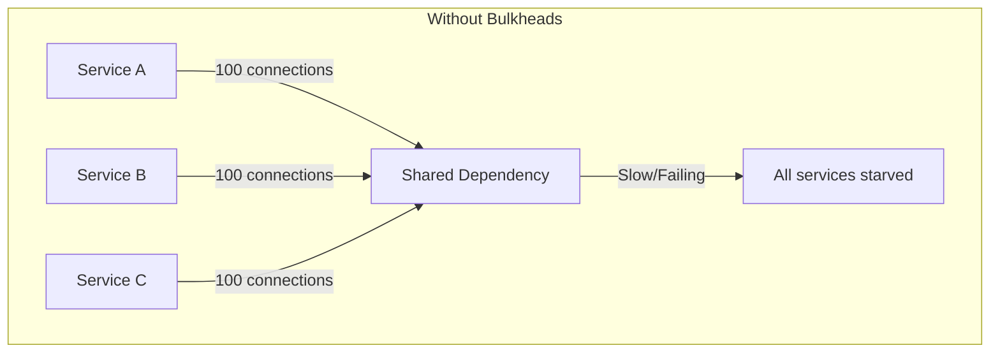
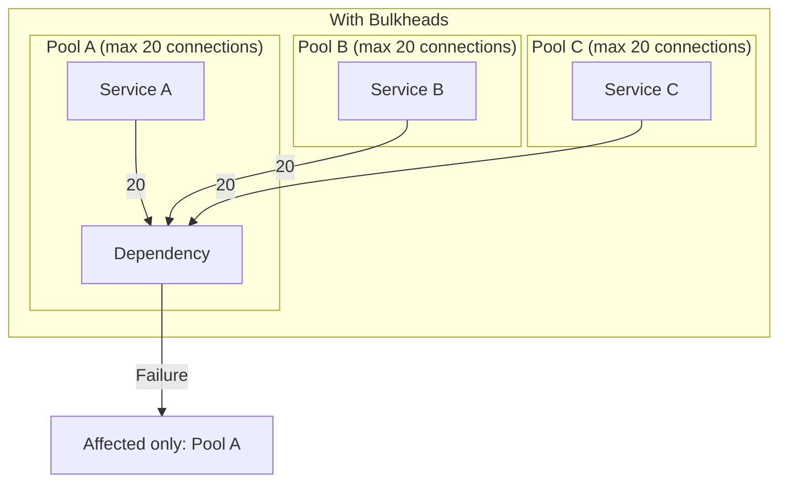
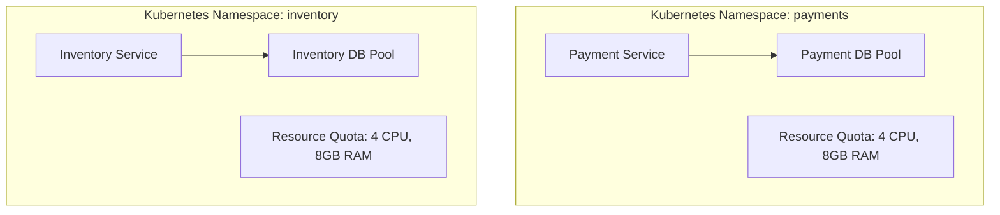
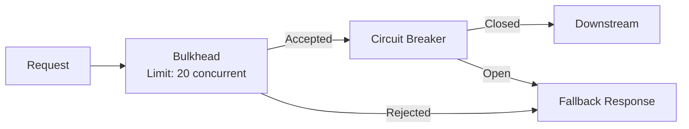

# Bulkhead Pattern (Failure Isolation)

## Overview

The bulkhead pattern isolates different parts of a system so that a failure in one component does not cascade to others. Borrowed from shipbuilding — where watertight compartments (bulkheads) prevent a hull breach from sinking the entire ship — this pattern partitions resources into isolated pools, ensuring that a failing dependency cannot consume all available resources.

## The Problem



When Service A makes too many requests to a slow dependency, it exhausts the connection pool. Services B and C are starved of connections and fail too — a cascading failure.

## The Solution



## Types of Bulkheads

### 1. Thread Pool Bulkhead

Dedicated thread pool per dependency. A slow dependency can only block its own threads.

```java
// Resilience4j Thread Pool Bulkhead
ThreadPoolBulkheadConfig config = ThreadPoolBulkheadConfig.custom()
    .maxThreadPoolSize(10)
    .coreThreadPoolSize(5)
    .queueCapacity(20)      // Bounded queue
    .keepAliveDuration(Duration.ofSeconds(10))
    .build();

ThreadPoolBulkhead paymentBulkhead = ThreadPoolBulkhead.of("payment", config);
ThreadPoolBulkhead inventoryBulkhead = ThreadPoolBulkhead.of("inventory", config);

// Each runs in its own thread pool
CompletableFuture<String> result = ThreadPoolBulkhead
    .decorateSupplier(paymentBulkhead, () -> paymentService.process(order))
    .submit();
```

| Property | Description |
|----------|-------------|
| `coreThreadPoolSize` | Minimum threads always alive |
| `maxThreadPoolSize` | Maximum concurrent threads |
| `queueCapacity` | Waiting queue size (bounded!) |
| `keepAliveDuration` | Idle thread timeout |

### 2. Semaphore Bulkhead

Limits concurrent executions without separate thread pools. Lighter weight, works with existing thread models (e.g., async/event-loop).

```java
// Resilience4j Semaphore Bulkhead
BulkheadConfig config = BulkheadConfig.custom()
    .maxConcurrentCalls(20)
    .maxWaitDuration(Duration.ofMillis(500))  // Reject after 500ms wait
    .build();

Bulkhead paymentBulkhead = Bulkhead.of("payment", config);

// If 20 calls are in-flight, new calls are rejected fast
Supplier<Response> decorated = Bulkhead.decorateSupplier(
    paymentBulkhead, () -> paymentService.process(order)
);
```

```python
# Python implementation using asyncio
import asyncio

class Bulkhead:
    def __init__(self, name, max_concurrent, max_wait=0.5):
        self.name = name
        self.semaphore = asyncio.Semaphore(max_concurrent)
        self.max_wait = max_wait
    
    async def __aenter__(self):
        try:
            await asyncio.wait_for(self.semaphore.acquire(), timeout=self.max_wait)
            return self
        except asyncio.TimeoutError:
            raise BulkheadRejectedException(
                f"Bulkhead '{self.name}' at capacity"
            )
    
    async def __aexit__(self, *args):
        self.semaphore.release()

# Usage
payment_bulkhead = Bulkhead("payment", max_concurrent=20)
inventory_bulkhead = Bulkhead("inventory", max_concurrent=50)

async def process_payment(order):
    async with payment_bulkhead:
        return await payment_client.charge(order)
```

### 3. Connection Pool Bulkhead

Dedicated connection pools per consumer or per tenant.

| Component | Without Bulkhead | With Bulkhead |
|-----------|-------------------|---------------|
| Database connection pool | 100 shared connections | 30 per service (3 services) |
| HTTP client | 200 shared connections | 50 per downstream |
| Redis connection pool | 50 shared | 10 per service |

### 4. Process/Container Bulkhead

Isolate components at the infrastructure level:



- **Separate pods/containers** per service
- **Resource quotas** (CPU, memory limits) per namespace
- **Separate node pools** for critical vs non-critical workloads

## Bulkhead vs Circuit Breaker

| Aspect | Bulkhead | Circuit Breaker |
|--------|----------|-----------------|
| **Purpose** | Limit concurrent calls | Stop calling a failing service |
| **Mechanism** | Resource partitioning | State machine (closed/open/half-open) |
| **Trigger** | Always active | Activated by error threshold |
| **Recovery** | Instant (when a slot frees) | Gradual (half-open state) |
| **Protection against** | Resource exhaustion | Cascading failures from errors |
| **Complementary?** | Yes — use together | Yes — use together |

They solve different problems and should be used together:



## Sizing a Bulkhead

### Factors to Consider

| Factor | How to Determine |
|--------|-----------------|
| **Normal load** | Baseline QPS × average latency |
| **Peak load** | Peak QPS × p99 latency |
| **Available resources** | Total connection pool / number of consumers |
| **Acceptable latency** | Bulkhead queue wait time budget |
| **Failure impact** | How critical is this dependency? |

### Sizing Formula

```
bulkhead_size = max_concurrent = peak_qps × p99_latency_seconds × safety_factor

Example:
  peak_qps = 1000
  p99_latency = 0.2 seconds
  safety_factor = 1.5
  
  bulkhead_size = 1000 × 0.2 × 1.5 = 300 concurrent calls
```

### Common Pitfalls

| Pitfall | Why It's Wrong |
|---------|---------------|
| **Setting too high** | Bulkhead never triggers, defeating its purpose |
| **Setting too low** | Excessive rejections under normal load |
| **Shared bulkhead across tenants** | One noisy tenant affects all others |
| **Unbounded queue** | Queue grows unbounded, OOM risk |
| **No monitoring** | Can't tell if bulkhead is rejecting too often |

## Monitoring Bulkheads

| Metric | Alert Threshold |
|--------|----------------|
| `bulkhead_available` | < 20% of max (pressure warning) |
| `bulkhead_rejected` | > 0 (investigate) or > 1% of calls (critical) |
| `bulkhead_queue_wait_time` | p99 > 100ms (consider increasing pool) |
| `bulkhead_active_calls` | Consistently > 80% of max (approaching capacity) |

```yaml
# Prometheus alert rule
- alert: BulkheadRejectRateHigh
  expr: |
    rate(bulkhead_rejected_total[5m]) 
    / rate(bulkhead_calls_total[5m]) > 0.01
  for: 2m
  labels:
    severity: warning
  annotations:
    summary: "Bulkhead {{ $labels.name }} rejecting > 1% of calls"
```

## Real-World Examples

### Example 1: Payment Service Isolation

```
Total DB connections: 100
├── Payment Service:  40 connections (critical, needs more headroom)
├── Order Service:    30 connections
├── User Service:     20 connections
└── Analytics Service: 10 connections (non-critical, smallest pool)
```

If Analytics makes a bad query that holds connections, only 10 are affected.

### Example 2: Multi-Tenant API

```
Tenant: Enterprise-A  → Bulkhead: 50 concurrent requests
Tenant: Enterprise-B  → Bulkhead: 50 concurrent requests
Tenant: Free-tier     → Bulkhead: 10 concurrent requests (shared pool)
```

## Interview Questions

1. **What's the difference between a bulkhead and a circuit breaker?** Bulkhead limits how many concurrent calls can be made (resource isolation). Circuit breaker stops making calls entirely when a dependency is failing (failure detection). They're complementary: bulkhead prevents resource exhaustion, circuit breaker prevents wasted calls.

2. **How would you implement bulkheads in a Go microservice?** Use buffered channels as semaphores: `make(chan struct{}, maxConcurrent)`. Each request acquires a slot (`ch <- struct{}{}`) and releases it (`<-ch`). If the channel is full, the request is immediately rejected.

3. **When would you use a thread pool bulkhead vs semaphore bulkhead?** Thread pool: when the dependency call is blocking (e.g., JDBC database calls) and you want to prevent slow calls from consuming your main thread pool. Semaphore: when using async/event-loop frameworks (Netty, Vert.x) where blocking is unacceptable.

4. **How do bulkheads relate to resource quotas in Kubernetes?** K8s resource limits (CPU, memory) are a form of container-level bulkhead. They prevent one pod from consuming node resources. Bulkheads at the application level provide finer-grained isolation for specific dependencies within a service.

5. **What happens when a bulkhead rejects a request?** Return a fallback response: a cached result, a "service unavailable" error with retry-after header, or a degraded experience. The client should handle this gracefully — it's better than a timeout or a cascading failure.

## Key Takeaways

- Bulkheads isolate failures by partitioning resources into independent pools
- Four types: thread pool, semaphore, connection pool, and process/container
- Thread pool bulkheads prevent slow dependencies from exhausting your thread pool
- Semaphore bulkheads are lightweight and work with async frameworks
- Size bulkheads based on peak load × p99 latency × safety factor
- Always combine with circuit breakers: bulkheads limit concurrency, circuit breakers stop calling failing services
- Monitor rejection rate and available capacity — alert when approaching limits
- For multi-tenant systems, per-tenant bulkheads prevent noisy-neighbor problems

## Cross-References

- [Reliability Patterns](./reliability-patterns.md) — Retry, circuit breaker, timeout
- [Circuit Breakers](../distributed/microservices/circuit-breakers.md) — Complementary pattern
- [Canary Releases](./canary-releases.md) — Safe rollout strategy
- [Kubernetes Scheduling](../cloud/kubernetes/scheduling.md) — Resource limits as bulkheads
- [Production Engineering](../production-engineering/deployments.md) — Deployment isolation
- [Capacity Planning](./capacity-planning.md) — Sizing bulkheads
