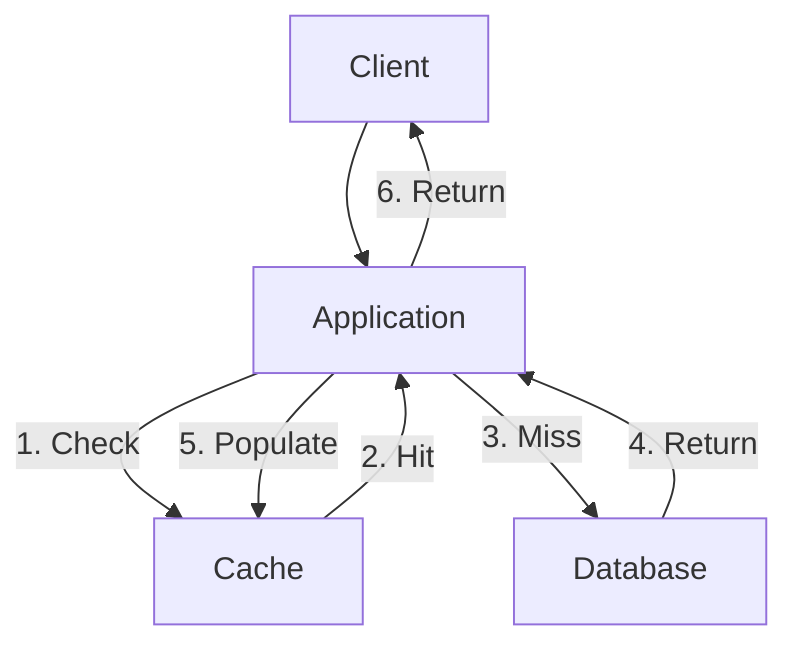
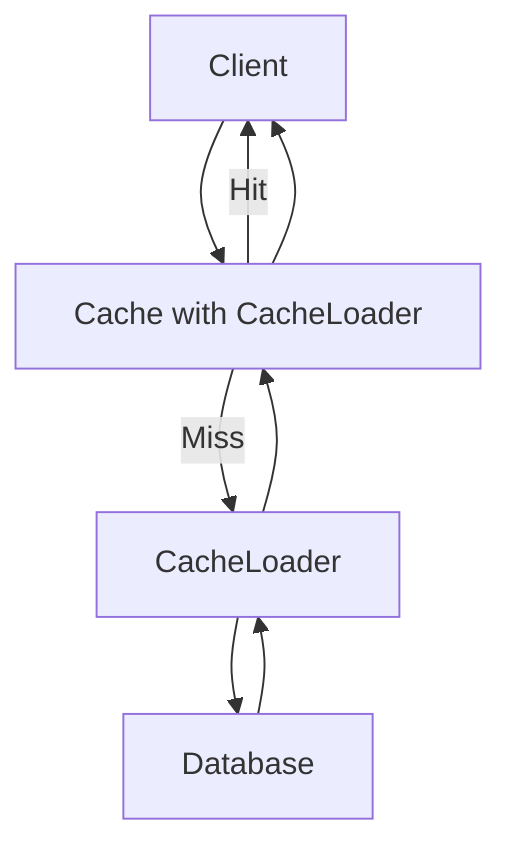
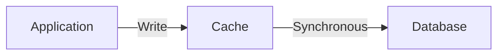
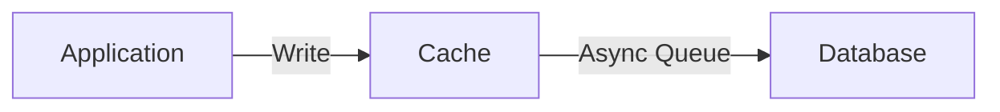
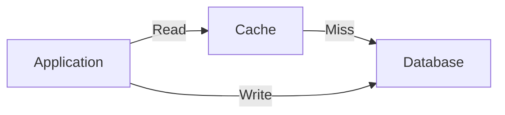
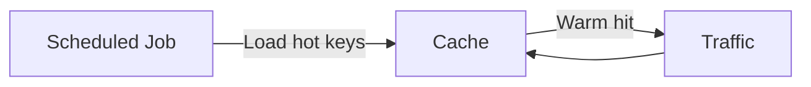
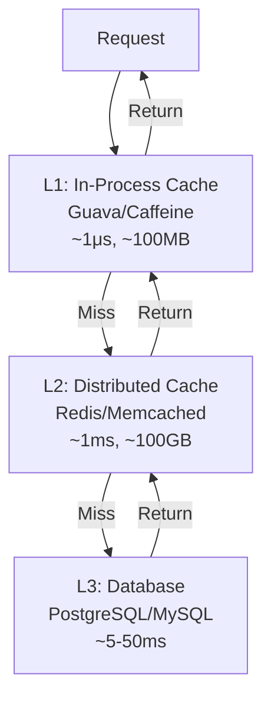

# Cache Patterns for SRE and Backend Systems

## Overview

Caching is one of the most effective strategies for improving system performance and reliability. However, caching introduces complexity: consistency, invalidation, and cache stampedes are real operational challenges. This guide covers the essential caching patterns, their trade-offs, and when to use each.

## The Fundamental Patterns

### 1. Cache-Aside (Lazy Loading)

The application is responsible for loading data into the cache. The cache is passive.



```python
async def get_user(user_id: str) -> User:
    # 1. Try cache
    user = await cache.get(f"user:{user_id}")
    if user is not None:
        return user
    
    # 2. Cache miss — load from DB
    user = await db.query("SELECT * FROM users WHERE id = %s", user_id)
    
    # 3. Populate cache
    await cache.set(f"user:{user_id}", user, ttl=3600)
    return user
```

| Pros | Cons |
|------|------|
| Simple to implement | First request always misses (cold start) |
| Cache only stores what's needed | Stale data if TTL hasn't expired and DB is updated |
| Application controls what's cached | Duplicate cache fills on thundering herds |

### 2. Read-Through

The cache provider automatically loads data from the database on a miss.



```java
// Caffeine cache with read-through
Cache<String, User> cache = Caffeine.newBuilder()
    .maximumSize(10_000)
    .expireAfterWrite(1, TimeUnit.HOURS)
    .build(new CacheLoader<String, User>() {
        public User load(String userId) {
            return userRepository.findById(userId);
        }
    });

// Application just calls cache.get() — no awareness of miss handling
User user = cache.get("user:123");
```

| Pros | Cons |
|------|------|
| Application code is simpler | Cache library must support it |
| Centralized loading logic | Less control over loading behavior |

### 3. Write-Through

The application writes to the cache, and the cache synchronously writes to the database.



```python
class WriteThroughCache:
    def __init__(self, cache, db):
        self.cache = cache
        self.db = db
    
    async def set(self, key, value):
        await self.db.set(key, value)      # Write to DB first
        await self.cache.set(key, value)    # Then to cache
    
    async def get(self, key):
        value = await self.cache.get(key)
        if value is None:
            value = await self.db.get(key)
            if value:
                await self.cache.set(key, value)
        return value
```

| Pros | Cons |
|------|------|
| Cache and DB always in sync | Write latency = cache + DB latency |
| No stale reads (after write) | Higher write latency |
| Data never lost if cache fails | Not suitable for write-heavy workloads |

### 4. Write-Behind (Write-Back)

The application writes to the cache, which asynchronously writes to the database.



| Pros | Cons |
|------|------|
| Very fast writes (cache only) | Data loss if cache fails before flushing |
| Batching can reduce DB load | Complexity in error handling |
| Absorbs write spikes | Eventual consistency (stale reads possible) |

### 5. Write-Around

The application writes directly to the database, bypassing the cache. The cache is populated only on read misses (cache-aside behavior for reads).



| Pros | Cons |
|------|------|
| No wasted cache writes for data that won't be read | First read after write is a cache miss |
| Good for write-heavy, read-light data | Stale data until TTL expires or invalidation |

## Pattern Comparison

| Pattern | Read Latency | Write Latency | Consistency | Complexity | Best For |
|----------|-------------|---------------|-------------|------------|----------|
| **Cache-Aside** | Low (after warm) | Low (no cache write) | Eventual | Low | General purpose, read-heavy |
| **Read-Through** | Low (after warm) | Low (no cache write) | Eventual | Low | Simple apps, ORM integration |
| **Write-Through** | Low | Higher (2 writes) | Strong | Medium | Data that must be immediately consistent |
| **Write-Behind** | Low | Very low | Eventual | High | Write-heavy, tolerate some data loss |
| **Write-Around** | Low (after warm) | Low | Eventual | Low | Write-heavy, rarely read data |

## Advanced Patterns

### Cache Stampede Protection (Request Coalescing)

Multiple concurrent requests for the same missing key can all hit the database simultaneously.

```python
import asyncio

class StampedeSafeCache:
    def __init__(self, cache, db, lock_timeout=10.0):
        self.cache = cache
        self.db = db
        self._locks = {}
        self._lock_timeout = lock_timeout
    
    async def get(self, key, loader):
        # 1. Check cache
        value = await self.cache.get(key)
        if value is not None:
            return value
        
        # 2. Acquire per-key lock
        if key not in self._locks:
            self._locks[key] = asyncio.Lock()
        
        async with self._locks[key]:
            # 3. Double-check cache (another coroutine may have populated it)
            value = await self.cache.get(key)
            if value is not None:
                return value
            
            # 4. Load from DB
            value = await loader(key)
            await self.cache.set(key, value)
            return value
```

### Cache Warming

Pre-populate the cache before it receives real traffic.



| Strategy | When to Use |
|----------|-------------|
| **Startup warming** | Load top-N items on application start |
| **Scheduled refresh** | Periodically update hot data before TTL expires |
| **Event-driven** | Invalidate and reload on data change |

### Cache Invalidation

> "There are only two hard things in Computer Science: cache invalidation and naming things." — Phil Karlton

| Strategy | Mechanism | Pros | Cons |
|----------|-----------|------|------|
| **TTL (Time-to-Live)** | Auto-expire after fixed time | Simple, no coordination | Stale data until expiry |
| **Event-based** | Publish invalidation on write | Near real-time | Requires pub/sub infrastructure |
| **Version-based** | Include data version in cache key | Simple, consistent | Old versions accumulate until TTL |
| **Write-through** | Update cache on every write | Always fresh | Higher write latency |

```python
# Version-based cache key
def get_cache_key(entity_type, entity_id, version):
    return f"{entity_type}:{entity_id}:v{version}"

# On read
user = await cache.get(get_cache_key("user", "123", user.version))

# On write — version increments, old cache entry becomes orphaned (evicted by TTL)
user.version += 1
await db.update(user)
```

### Multi-Level Caching



| Level | Technology | Latency | Capacity | Eviction |
|-------|-----------|---------|-----------|----------|
| L1 | Caffeine, Guava | ~1 μs | ~100 MB (heap) | LRU/LFU |
| L2 | Redis, Memcached | ~1 ms | ~100 GB (cluster) | LRU/LFU/TTL |
| L3 | Database | ~5-50 ms | ~TB | N/A |

## Common Pitfalls

| Pitfall | Symptom | Fix |
|---------|---------|-----|
| **No TTL** | Memory fills up, unbounded growth | Always set a TTL, even if long |
| **Too short TTL** | Low cache hit rate, DB overload | Tune based on data change frequency |
| **Too long TTL** | Stale data served to users | Use event-based invalidation alongside TTL |
| **Caching everything** | Cache contains cold data, wasting memory | Cache only frequently accessed data |
| **Thundering herd** | DB spike when cache expires | Stagger expirations (jitter), use stampede protection |
| **Cache as truth** | Trusting cached data without validation | Always have a source of truth (database) |
| **Inconsistent serialization** | Same data, different cache entries | Use canonical serialization (JSON with sorted keys) |

## Key Metrics

| Metric | Formula | Target |
|--------|---------|--------|
| **Hit rate** | hits / (hits + misses) | > 90% for hot data |
| **Miss rate** | misses / (hits + misses) | < 10% |
| **Eviction rate** | evictions / second | Near 0 (indicates wrong sizing) |
| **Latency (p99)** | Cache get time | < 1ms (distributed), < 100μs (local) |
| **Memory usage** | Used / max | < 80% (headroom for bursts) |

## Interview Questions

1. **How would you design a caching layer for a news feed?** Two-level cache: L1 (in-process) for the current user's feed with 5-min TTL, L2 (Redis) for pre-computed feeds with 15-min TTL. Write-through for the user's own posts, cache-aside for reading others. Invalidate on new post events.

2. **How do you handle cache invalidation in a distributed system?** Use a combination: set a reasonable TTL as a safety net, and use event-based invalidation (publish to a topic when data changes) for timely updates. Use version-based cache keys as a fallback.

3. **What causes a cache stampede and how do you prevent it?** A stampede occurs when a popular cache key expires and many requests simultaneously try to repopulate it. Prevent with: per-key locking (only one request loads), randomized TTL jitter (stagger expirations), or probabilistic early expiration (refresh before TTL).

4. **When would you NOT use a cache?** When: data changes very frequently (no benefit from caching), every request is unique (no cache hits), consistency requirements are strict (real-time financial data), or the cache hit rate would be too low to justify the complexity.

5. **How does write-through compare to write-behind for an order system?** Write-through for orders: every order must be persisted immediately (no data loss acceptable). Write-behind for order analytics or counters: eventual persistence is fine, and writes are very high throughput.

## Key Takeaways

- Cache-aside is the default pattern: simple, flexible, works for most read-heavy workloads
- Write-through for strong consistency; write-behind for write-heavy with tolerance for data loss
- Always use TTLs as a safety net, even with event-based invalidation
- Protect against cache stampedes with per-key locking or early expiration
- Multi-level caching (L1 local + L2 distributed) dramatically reduces p99 latency
- Monitor hit rate, eviction rate, and memory usage as key SLOs
- Cache the right data: frequently accessed, relatively stable, expensive to compute

## Cross-References

- [ElastiCache](../cloud/aws/elasticache.md) — Managed Redis and Memcached
- [Redis Deep Dive](../redis/README.md) — Redis data structures and internals
- [Advanced Caching](../dbms/caching/advanced-caching.md) — Advanced caching theory
- [Bulkhead Pattern](./bulkheads.md) — Isolating cache client resources
- [Multi-Region Architecture](./multi-region.md) — Cross-region cache invalidation
- [Feature Flags](./feature-flags.md) — Feature-specific cache warming