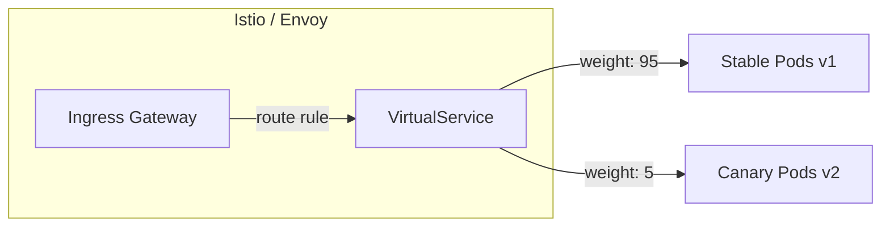
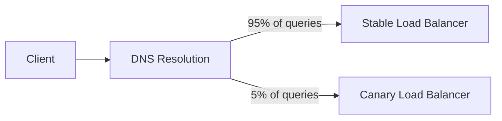

# Canary Releases (Progressive Delivery)

## Overview

A canary release is a deployment strategy that gradually rolls out a new version of software to a small subset of users before making it available to everyone. Named after the historic practice of using canaries in coal mines to detect toxic gases, this technique limits the blast radius of a bad deployment by exposing it to real production traffic at a controlled pace.

## Why Canary Releases?

| Big Bang Deploy | Canary Release |
|-----------------|----------------|
| All users get v2 instantly | 1% → 5% → 25% → 50% → 100% |
| Bug affects everyone | Bug affects only canary users |
| Rollback = full redeploy | Rollback = reduce traffic to 0% |
| No production signal before full launch | Real production metrics validate at each stage |
| High risk, high stress | Low risk, controlled exposure |

## How Canary Releases Work

```mermaid
graph TB
    Users[All Users] --> Router[Traffic Router]
    Router -->|95%| Stable[v1 (Stable)]
    Router -->|5%| Canary[v2 (Canary)]
    Stable --> Metrics[Metrics Collector]
    Canary --> Metrics
    Metrics --> Analyzer[Anomaly Detector]
    Analyzer -->|Healthy| Increase[Increase Canary %]
    Analyzer -->|Unhealthy| Rollback[Rollback to 0%]
    Increase --> Router
```

## Canary Stages

| Stage | Traffic % | Duration | Focus |
|-------|-----------|----------|-------|
| Initial | 1% | 15-30 min | Crash detection, basic errors |
| Expand | 5% | 30-60 min | Error rates, latency percentiles |
| Grow | 25% | 1-2 hours | Business metrics, edge cases |
| Majority | 50% | 2-4 hours | Full workload validation |
| Complete | 100% | — | Full rollout, clean up canary |

## Implementation Approaches

### 1. Infrastructure-Level Canary (Service Mesh)



```yaml
# Istio VirtualService for canary
apiVersion: networking.istio.io/v1beta1
kind: VirtualService
spec:
  hosts:
    - myapp.example.com
  http:
    - route:
        - destination:
            host: myapp-stable
            port:
              number: 8080
          weight: 95
        - destination:
            host: myapp-canary
            port:
              number: 8080
          weight: 5
```

### 2. Application-Level Canary (Feature Flags)

```python
# In your application code
from flagsmith import Flagsmith

flagsmith = Flagsmith(environment_key=os.environ["FLAGSMITH_KEY"])

def get_service_version(user_id):
    is_canary = flagsmith.is_feature_enabled(
        "new-payment-processor",
        identity={"id": user_id}
    )
    if is_canary:
        return PaymentProcessorV2()
    return PaymentProcessorV1()
```

### 3. DNS-Level Canary



### 4. Edge/CDN-Level Canary

Using Cloudflare Workers, AWS CloudFront Functions, or similar edge compute:

```javascript
// CloudFront Function for canary routing
function handler(event) {
    var request = event.request;
    var canaryPercentage = 5;
    var hash = simpleHash(request.headers['x-user-id']);
    
    if (hash < canaryPercentage) {
        request.uri = request.uri.replace('/api/', '/api-canary/');
    }
    return request;
}

function simpleHash(str) {
    var hash = 0;
    for (var i = 0; i < str.length; i++) {
        hash = ((hash << 5) - hash) + str.charCodeAt(i);
        hash |= 0;
    }
    return Math.abs(hash) % 100;
}
```

## Metrics to Monitor

### Signal Categories

| Category | Metrics | Threshold Example |
|----------|---------|-------------------|
| **Availability** | 5xx error rate, uptime | < 0.1% 5xx |
| **Performance** | p50/p95/p99 latency | < 200ms p99 |
| **Correctness** | Business error rate, data consistency | 0 invalid states |
| **Business** | Conversion rate, revenue per request | No regression > 0.5% |
| **Resource** | CPU, memory, connection counts | < 80% utilization |

### Automated Analysis

```python
# Pseudocode for automated canary analysis
def analyze_canary(stable_metrics, canary_metrics, window="15m"):
    results = {}
    
    # Error rate comparison
    stable_errors = get_error_rate(stable_metrics, window)
    canary_errors = get_error_rate(canary_metrics, window)
    
    if canary_errors > stable_errors * 1.5:  # 50% increase threshold
        results["error_rate"] = "FAIL"
    elif canary_errors > stable_errors * 1.2:
        results["error_rate"] = "WARN"
    else:
        results["error_rate"] = "PASS"
    
    # Latency percentile comparison
    for p in [50, 95, 99]:
        stable_p = get_latency_percentile(stable_metrics, p, window)
        canary_p = get_latency_percentile(canary_metrics, p, window)
        
        if canary_p > stable_p * 1.5:  # 50% regression
            results[f"p{p}_latency"] = "FAIL"
        else:
            results[f"p{p}_latency"] = "PASS"
    
    return results
```

## Traffic Sharding Strategies

| Strategy | Mechanism | Consistency |
|----------|-----------|-------------|
| **Random** | Random % assignment | User sees both versions over time |
| **Cookie-based** | Sticky to version via cookie | Consistent per session |
| **User-ID hash** | `hash(user_id) % 100 < canary_pct` | Consistent per user, deterministic |
| **Header-based** | Feature flag / request header | Controlled rollout |

**Best practice**: Use user-ID or session-based hashing so the same user always sees the same version.

## Comparison: Canary vs Blue-Green vs Rolling

| Feature | Canary | Blue-Green | Rolling |
|---------|--------|------------|----------|
| **Traffic splitting** | Gradual % | Instant switch | Gradual instance swap |
| **Rollback speed** | Instant (change %) | Instant (switch) | Slow (replace instances) |
| **Risk exposure** | Low (small %) | Zero (until switch) | Medium (growing %) |
| **Resource cost** | Both versions running | 2x infrastructure | ~1.5x (mixed) |
| **Production validation** | Yes (real traffic) | No (until full switch) | Yes (real traffic) |
| **Best for** | Risk-sensitive, data-driven | Quick rollback needs | Simple deployments |

## Canary Release Checklist

- [ ] Define rollback criteria (error rate, latency thresholds)
- [ ] Set up separate metrics dashboards for stable vs canary
- [ ] Configure alerts with appropriate sensitivity (avoid alert fatigue)
- [ ] Test canary infrastructure in staging first
- [ ] Ensure canary and stable share the same database schema (backward compatible)
- [ ] Verify logging distinguishes between versions
- [ ] Set minimum canary duration before promotion
- [ ] Document manual override procedure
- [ ] Plan for canary version cleanup after full rollout

## Tools

| Tool | Type | Key Feature |
|------|------|-------------|
| **Argo Rollouts** | Kubernetes controller | Progressive delivery with analysis |
| **Flagger** | Kubernetes controller | Automated canary analysis (Prometheus)
| **Istio** | Service mesh | Traffic splitting at L7 |
| **LaunchDarkly** | Feature flags | User-level targeting |
| **Flagsmith** | Feature flags | Self-hosted option |
| **AWS CodeDeploy** | Managed service | Built-in canary deployments |
| **Spinnaker** | Deployment platform | Multi-provider canary support |

## Interview Questions

1. **How would you design a canary system from scratch?** Deploy canary and stable versions behind a traffic router. Hash user IDs to consistently route a small percentage to canary. Compare metrics (error rate, p99 latency) between canary and stable using a statistical test. Promote or rollback based on predefined thresholds.

2. **How do you handle database schema changes during a canary?** Make schema changes backward compatible: add new columns as nullable, not rename or remove. Deploy the schema change first, then canary the application. Clean up old columns after both versions are using the new schema.

3. **What statistical methods do you use for canary analysis?** Use statistical significance tests (t-test for latency, chi-squared for error rates) or simpler threshold-based rules. More sophisticated: Bayesian analysis, CUSUM for sequential change detection. The key is minimizing false positives (flapping) and false negatives (missing real regressions).

4. **When is canary not appropriate?** When: the change is very low risk (typo fix), the user base is too small for meaningful canary, the feature requires all users on the same version (multiplayer game), or when you need instant full rollback capability (use blue-green instead).

5. **How long should a canary run?** Depends on traffic volume and the metric you're measuring. Low-traffic services may need hours to accumulate statistical significance. High-traffic services can validate in minutes. Never skip the minimum observation window, even if metrics look perfect.

## Key Takeaways

- Canary releases limit blast radius by exposing new versions to a small percentage of real traffic
- Traffic routing can be at the infrastructure (mesh), application (feature flag), DNS, or edge level
- Monitor error rates, latency percentiles, and business metrics; automate the analysis
- User-ID hashing provides consistent routing — the same user always sees the same version
- Database changes must be backward compatible during canary periods
- Argo Rollouts, Flagger, and Istio are popular tools for Kubernetes-based canary deployments
- Canary > Blue-Green > Rolling for risk-sensitive production deployments

## Cross-References

- [Reliability Patterns](./reliability-patterns.md) — Circuit breakers, retries
- [Bulkhead Pattern](./bulkheads.md) — Isolation for failure containment
- [Feature Flags](./feature-flags.md) — Application-level canary implementation
- [Multi-Region Architecture](./multi-region.md) — Canary across regions
- [Kubernetes Deployments](../cloud/kubernetes/deployments.md) — Rolling updates
- [Circuit Breakers](../distributed/microservices/circuit-breakers.md) — Downstream failure protection
- [SLO/SLI/SLA](./slo-sli-sla.md) — Defining canary pass/fail criteria
