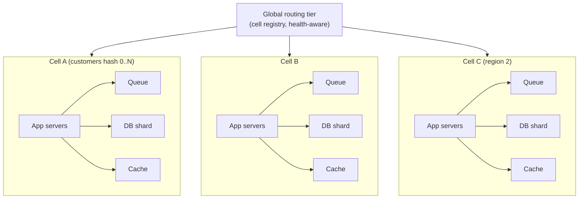

# Cell-Based Architecture and Blast-Radius Isolation

A cell is a self-contained slice of a service — its own compute, storage,
queues, and caches — serving a subset of customers or traffic. Cells exist
for one purpose: **when a component fails, the blast radius is one cell, not
the service.** Load balancers route around dead cells the way
[bulkheads](./bulkheads.md) compartmentalize a hull, but at application
granularity: a corrupt deployment, a runaway query, a poisoned cache, or a
region outage touches the customers assigned to that cell and nobody else.

This page covers cell anatomy, the blast-radius math, how cells interact
with cascading failure dynamics (retry storms, cache stampedes, overload),
brownouts and graceful degradation, and multi-region failover at cell
granularity with explicit RPO/RTO accounting. Shard assignment machinery is
in [Database Sharding](../dbms/advanced/database-sharding.md) and
[Consistent Hashing](../distributed/partitioning/consistent-hashing.md);
per-service resilience patterns are in [Reliability Patterns](./reliability-patterns.md).

## Anatomy of a cell

Properties that make the box a *cell* rather than a replica pool:

- **Data locality.** The cell's database holds the state for its assigned
  keys. Cross-cell calls for cell-local data are bugs — they re-couple the
  failure domains the cells exist to separate.
- **Failure isolation by construction.** Every resource the request path
  touches (queue, cache, connection pool, disk) is cell-local. A shared
  queue behind two cells is a shared fate, not two cells.
- **A routing decision made elsewhere.** The global tier maps
  customer/tenant/key → cell, keeps per-cell health, and can evict a cell
  without the cells knowing about each other. WhatsApp's famously shallow
  per-message path and Facebook's Shard Manager formalize the same shape:
  a control plane owns *which node owns which shard* while data-plane
  servers never talk sideways ([Shard Manager, SOSP 2021](https://doi.org/10.1145/3477132.3483546)).
- **Independent deployability.** Cells can be canaried one at a time: a bad
  rollout affects the smallest cell, then traffic ramps. This couples cell
  architecture with [canary releases](./canary-releases.md) and
  [feature flags](./feature-flags.md).

## Blast radius, quantified

With `C` equal-capacity cells and a uniform customer hash, a single-cell
catastrophe hits `1/C` of customers. The design questions are:

1. **What is the worst credible single-cell event?** Corrupt deploy, data
   corruption, poisoned cache, thundering-herd self-attack. If any of those
   can happen, the cell is the unit that contains it — and `1/C` is the
   worst-case customer impact.
2. **Headroom.** If a cell dies, its traffic must fit on survivors without
   pushing them into [overload](#cascading-failure-dynamics). N cells need
   capacity for N+1: at 10 cells each runs at ≤90% of nominal peak — which
   is also why "we'll just add one cell" is arithmetic, not architecture.
3. **Fragmentation cost.** Small cells isolate better but multiply
   control-plane work, per-cell warmup, and tail-heavy utilization; large
   cells amortize but concentrate risk. The right size is set by the
   maximum acceptable incident impact (e.g., "no single-cell failure may
   exceed 1% of users" ⇒ ≥ 100 cells), not by server convenience.

**Shuffle sharding** (AWS) sharpens this: instead of each customer hashing
to one cell, each customer draws a small random subset of *shards* across
the fleet, so two customers share very few shards — a poisoned shard's
expected victim count drops multiplicatively compared to naive hashing.
It is blast-radius engineering applied to the shard level rather than the
cell level.

## Cascading failure dynamics inside and across cells

Cells change overload dynamics, not just failure geometry:

- **Retry storms stop at cell edges.** A cell's database slows → that
  cell's app servers time out → *their* callers retry → without cells the
  retry amplification propagates upstream service-wide. With cells, the
  amplification loop is contained by per-cell timeout/retry budgets and
  the global router can just stop sending the cell traffic
  ([Handling Overload, Google SRE](https://sre.google/sre-book/handling-overload/)).
- **Cache stampedes stay local.** A cell restart empties *its* cache; the
  thundering herd hits *its* database. Other cells never see the wave.
  Per-cell stampede protection (request coalescing, locks) still applies —
  see [Cache Patterns](./cache-patterns.md).
- **Poison-message / poisoned-cache isolation.** A payload that crashes
  workers stays in one queue; a cache entry that wedges a parser wedges one
  cache. Both are blast-radius stories that plain horizontal scaling cannot
  tell, because with a shared cache a bad entry is *everywhere*.
- **Brownouts.** Under stress a cell can shed optional work — disable
  recommendations, search facets, analytics pings — while core
  request/response stays up. A brownout is graceful degradation applied per
  cell: users see a reduced feature set instead of errors, and the operator
  sees *which* cells are degraded rather than a global brownout with no
  unit of recovery.

The counterweight: cells add moving parts (routing, registry, rebalancing,
migration). A bug in the *global* router or the shard-assignment control
plane is a blast radius of 100% — the control plane therefore needs its own
redundancy, rate limits, and canary discipline, and it must be able to
fail *stale* (serve the last-known-good assignment) rather than fail open.

## Cell-granularity failover: active-active vs active-passive

Multi-region design stops being binary once cells exist:

| Strategy | Mechanism | RPO / RTO profile |
|---|---|---|
| Active-active cells across regions | All cells serve; state replicated per-cell (async) | RPO ≈ replication lag; RTO ≈ router failover (seconds–minutes) |
| Active-active compute, passive data per cell | Compute scales everywhere; DB primary pinned per region | RPO 0 for local writes; cross-region reads stale |
| Active-passive region | Standby region, whole-region failover | RPO = backup/log shipping window; RTO = minutes–hours (DNS, warm-up) |

Cell-based active-active changes the *unit* of failover: instead of
failing over a region (all users, all systems, one dramatic event), the
router drains cells one at a time — smaller, reversible, rehearseable steps.
The cost shows up as [multi-region](./multi-region.md) complexity:
conflict resolution for cell-owned keys is usually avoided by construction
(a key has exactly one home cell — cross-region replication is one-way),
which is precisely the directory-based
[shard routing](../dbms/advanced/database-sharding.md) model with regions
as the placement dimension.

Disaster-recovery accounting then happens per cell: RPO = worst-case
replication lag at failover time; RTO = detection + drain + re-home +
cache warm-up. Rehearsals ([chaos engineering](./chaos-engineering.md),
GameDays) kill a cell deliberately and measure both numbers instead of
trusting the diagram.

## Cost and capacity considerations

- **Cell count vs fleet utilization.** N+1 headroom plus fragmentation
  means steady-state utilization is bounded by `(N)/(N+1)` times target
  load — 10 cells cap out near 90% before any cell fails. Sizing cells to
  the blast-radius budget (requirement 3 above) is what reconciles
  reliability math with the [FinOps](./finops-cloud-cost.md) budget.
- **Stateful cells need rebalancing.** Adding a cell reassigns keys →
  migration traffic and dual-writes or CDC-based moves; rendezvous or
  [consistent hashing](../distributed/partitioning/consistent-hashing.md)
  minimizes how many assignments move.
- **The control plane is a product.** Registry, assignment, health, and
  migration tooling are engineered and monitored like any other service —
  Facebook built Shard Manager as a platform exactly because every team was
  re-implementing it.

## Interview questions

1. **How does cell-based architecture differ from ordinary horizontal scaling?**
   Horizontal scaling replicates *stateless* capacity behind a shared data
   layer — the blast radius of a bad deploy or data-layer fault is still
   100%. Cells shard the *full stack including state* per customer subset,
   so internal faults propagate to one cell; the router is the only shared
   component and it fails stale rather than open.
2. **A single customer is famous and overloads their cell. What do you do?**
   Celebrity/hot-key traffic cannot be fixed by cell count (one customer =
   one cell = one hot cell). Answers: cell-local [rate limiting](./reliability-patterns.md)
   and shedding for that key, splitting the celebrity's workload across
   more cells only if state permits, or offloading read traffic to a
   fan-out cache tier. Recognize that cells bound *customer-count* damage,
   not per-customer load.
3. **Why not just make every cell tiny?** Fragmentation: control-plane
   operations scale with cell count, caches and warm-up amortize worse,
   and N+1 capacity headroom as a fraction of the fleet grows. The cell
   count is derived from the required blast-radius bound, and that bound
   is a product decision.
4. **What fails that cells don't fix?** The global router, shared
   dependencies outside cells (identity, DNS, config service), and
   correlated deploy errors shipped to *all* cells simultaneously.
   Mitigations: fail-stale routing, per-cell rollout waves, and keeping
   shared dependencies themselves cell-isolated or massively redundant.

## Key Takeaways

- A cell is full-stack (state included) isolation; the blast radius of any
  single-cell event is `1/C`, and cell count comes from the impact budget.
- Cells turn cascading failures (retry storms, stampedes) into local
  events, enable per-cell brownouts, and make failover a sequence of small
  reversible steps with measurable RPO/RTO.
- The global routing/control plane is the new shared fate — it must fail
  stale, be redundant, and ship in waves.
- Hot customers, shared dependencies, and fleet fragmentation are the
  limits of the model; every design review should name them.

## Cross-References

- [Bulkheads](./bulkheads.md) — the resource-pool isolation pattern inside a service.
- [Multi-Region Architecture](./multi-region.md) — replication topologies and regional DR.
- [Database Sharding](../dbms/advanced/database-sharding.md) — key-to-shard mapping and rebalancing machinery.
- [Consistent Hashing](../distributed/partitioning/consistent-hashing.md) and [Rendezvous Hashing](../distributed/advanced/rendezvous-hashing.md) — assignment algorithms.
- [Chaos Engineering](./chaos-engineering.md) — rehearsing cell-kill scenarios.
- [HLD Availability](../interview/system-design/hld/availability.md) — availability math and redundancy tiers.

## References

- B. Lee et al., "[Shard Manager: A Generic Shard Management Framework for Geo-distributed Applications](https://doi.org/10.1145/3477132.3483546)", *SOSP 2021* — Meta's shard-placement control plane; the production formalization of cell ownership.
- Google SRE Book, "[Handling Overload](https://sre.google/sre-book/handling-overload/)" and "[Addressing Cascading Failures](https://sre.google/sre-book/addressing-cascading-failures/)" — load shedding, retry budgets, and cascade dynamics.
- Microsoft Azure Well-Architected Framework, "[Reliability design patterns](https://learn.microsoft.com/en-us/azure/well-architected/reliability/design-patterns)" — bulkhead, deployment-stamp, and cell-style isolation guidance.
- AWS Architecture Blog, "[Shuffle Sharding: Massive and Magical Fault Isolation](https://aws.amazon.com/blogs/architecture/shuffle-sharding-massive-and-magical-fault-isolation)" — fine-grained blast-radius isolation beyond cell granularity.
- AWS Well-Architected Reliability Pillar, "[Welcome](https://docs.aws.amazon.com/wellarchitected/latest/reliability-pillar/welcome.html)" — failure-isolation and recovery objectives.
