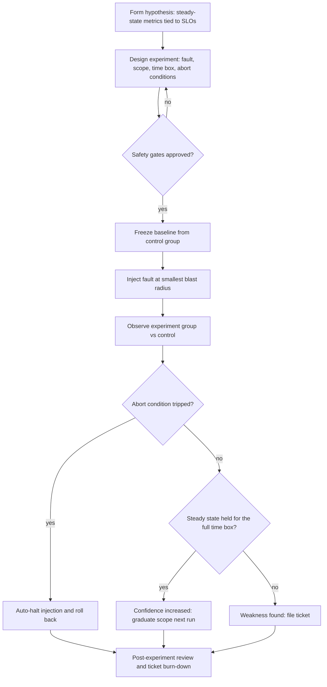

# Chaos Engineering

Chaos engineering is the discipline of experimenting on a distributed system *on purpose*, under controlled conditions, to build confidence that it survives the turbulence production will inevitably throw at it. Instead of waiting for an outage to reveal weaknesses, you inject realistic faults, observe whether the steady state holds, and convert every discovered weakness into an engineering ticket. Netflix pioneered the practice with Chaos Monkey; it is now a standard reliability discipline with formal principles, dedicated tooling, and a role in CI/CD and on-call culture.

## Principles

1. **Build a hypothesis** about steady-state behavior
2. **Vary real-world events** (server failure, network latency, resource exhaustion)
3. **Run experiments** in production (or staging)
4. **Automate** experiments to run continuously
5. **Minimize blast radius** (start small, expand gradually)

Unpacked, each principle carries weight: an experiment without a falsifiable hypothesis is just breaking things; the faults you vary must resemble real incidents — the catalog in [Common Failure Modes](../failure-modes/common-failures.md) is your fault zoo; production is the only environment honest enough to expose emergent coupling, so you graduate there after staging proves the experiment safe; automation matters because systems and teams drift — a service that passed a GameDay six months ago may fail the same experiment today; and blast-radius discipline is what separates an experiment from an outage you caused yourself.

## Steady State Hypothesis

A chaos experiment is only meaningful relative to a *steady state* — a set of measurable outputs that define "normal":

```
"Under normal conditions, our API serves 1000 rps with p99 < 200ms 
and error rate < 0.1%."

If this holds during chaos experiment → system is resilient.
If this breaks → found a weakness to fix.
```

Choose the steady-state metrics to be the same numbers your SLOs are written against — request rate, success rate, p99 latency — so an experiment's verdict maps directly onto error-budget accounting (see [SLOs and Error Budgets](./slo-error-budget.md)). The metrics must be *user-visible symptoms*, not internal implementation details: "CPU below 60%" is not a steady state, but "p99 under 200 ms" is. CPU saturation during an experiment may be acceptable; a user-visible latency regression never is.

## Formal Methodology

The formal experiment loop — **hypothesis → inject → observe → halt** — is what separates chaos engineering from vandalism:

1. **Define the steady state** from SLO metrics (request rate, error rate, p99 latency).
2. **Hypothesize** that injecting a specific fault will *not* move those metrics.
3. **Inject** the fault at the smallest useful blast radius.
4. **Observe** the experiment group and the dashboards; observation must be automated enough to catch fast regressions a human would miss.
5. **Halt** — when the time box completes cleanly, or when an abort condition trips.

Abort conditions are a first-class part of experiment design, not an afterthought. Before injecting anything, you write down the exact metric thresholds — "p99 above 500 ms for 60 seconds", "error rate above 1%" — that will automatically stop the injection and roll back. Human-only aborts fail in practice: GameDay observers blink, context-switch, or hesitate to kill their own experiment, and automation doesn't hesitate. Every experiment therefore ships with four artifacts — steady-state metrics, fault and scope, time box, and abort conditions plus rollback plan — and closes with a review: did the hypothesis survive, and what tickets did we open?

Two practical notes sharpen the loop. First, measure against a *fresh* baseline, not the baseline from memory: traffic and system state drift between runs, so capture control-group numbers immediately before injecting. Second, keep an honest observation window — a fault injected for 30 seconds tells you little about caches, queues, and autoscalers that react on minute timescales; most real coupling appears 2–10 minutes into an incident, which is also why too-short experiments systematically under-report weaknesses.



## Fault Taxonomy

| Category | Example Faults | What It Reveals |
|---|---|---|
| **Resource** | CPU exhaustion, memory pressure, disk-full, file-descriptor exhaustion | Leak detection, autoscaling triggers, OOM behavior, alerting gaps |
| **Network** | Partition, added latency, packet loss, DNS failure | Timeout coverage, retry behavior, fallback and caching paths |
| **Dependency** | Upstream returning errors, upstream responding slowly | Circuit breakers, graceful degradation, backlog behavior |
| **State** | Clock skew, certificate expiry, quota exhaustion | Auth failures, lease/fencing bugs, hard-to-see time dependencies |
| **Load** | Thundering herd, retry storms, traffic spikes | Admission control, load shedding, queue durability |

The dependency row deserves emphasis: **a slow upstream is usually worse than a dead one**. A dead upstream fails fast — circuit breakers open, errors return quickly, callers shed load and move on. A *slow* upstream keeps every caller hanging until timeouts expire, occupying threads, connections, and memory across the whole call graph — the classic recipe for cascading failure (see [Bulkheads](./bulkheads.md) and [Circuit Breakers](../backend/patterns/circuit-breaker-deep.md)). Retry storms are the load-class fault with self-amplifying character: callers hammering a struggling dependency with retries make the struggle worse (see [Retry with Exponential Backoff](../backend/patterns/retry-timeout.md)).

**State faults are the sneakiest class.** Clock skew breaks lease and fencing logic that is perfectly *correct* under synchronized clocks; certificate expiry becomes a fleet-wide auth outage because nothing monitored the not-after date; quota exhaustion surfaces as throttling only after a deploy doubles the API call rate. Load faults, meanwhile, compound with your own defenses: a thundering herd after a cache flush plus retry storms from callers can turn a two-minute dependency blip into a forty-minute outage. Neither class appears in ordinary functional testing — which is exactly why the taxonomy insists on injecting them.

## Common Experiments

| Experiment | Tool | What It Tests |
|---|---|---|
| Kill a server | Chaos Monkey | Failover, redundancy |
| Add network latency | TC, Toxiproxy | Timeouts, retries |
| Fill disk | dd, chaos-mesh | Alerting, cleanup |
| CPU stress | stress-ng | Autoscaling, throttling |
| DNS failure | Block DNS | Fallback, caching |
| Dependency failure | Mock server | Circuit breakers |

Every row of this table should trace back to a fault class in the taxonomy above and a hypothesis in your experiment backlog — an experiment with no hypothesis attached is entropy, not engineering. Notice the mapping is not one-to-one: "kill a server" is a resource fault that surfaces dependency behavior, "DNS failure" is a network fault that surfaces state-fault weaknesses (stale caches, missing fallbacks). The tool column names the cheapest injector for the job — you rarely need a full chaos platform for a disk-fill experiment.

## Experiment Design Depth

**Baseline and differential testing.** A good experiment compares like with like: run the fault against an *experiment group* of instances while an identical *control group* serves normally, then diff the two. This isolates the fault's effect from normal traffic variation, diurnal cycles, and deployment noise — without a control group you cannot tell whether a latency bump was your injection or the lunch-hour traffic. Netflix's ChAP automated exactly this pattern.

**Canary-scoped injection before fleet-wide.** First inject into one instance in staging, then one canary instance in production, then a percentage dial (1% → 10% → 100%), watching the steady state at every step. Never jump straight to fleet-wide injection; the first production run of any new experiment is a canary by definition.

**Multi-failure scenarios.** Real incidents are rarely single-fault: a dependency dies *while* a node is being drained and a deploy is rolling out. Advanced experiments combine faults — but only after each constituent fault has passed cleanly on its own, and with extra-tight abort conditions, because compound faults fail in compound ways.

**Continuous chaos vs GameDays.** GameDays (below) are scheduled, human-supervised exercises — great for building response muscle memory. Continuous chaos is automated, small-radius, runs on a schedule or in CI/CD (see the testing-lifecycle view in [Chaos Testing](../testing/chaos-testing.md)), and catches resilience regressions the moment they merge. Mature programs do both: automation finds the boring weaknesses early; GameDays rehearse the scary ones with people in the loop.

**Campaign design.** Treat experiments as a *campaign*, not one-off stunts: maintain a hypothesis backlog ("retry storms if the queue stalls", "session loss if a cache node dies", "lease expiry under clock skew"), rank it by risk (severity × likelihood × confidence gap), and burn through it iteratively — closing hypotheses the system proves resilient against, converting failures into tickets, and re-testing after the fixes land.

### Scope-Graduation Ladder

| Stage | Scope | Abort Slack |
|---|---|---|
| Staging | Whole environment, any fault | Wide — the point is to break things |
| Prod canary | One instance / one cell | Tight — first contact with real traffic |
| Prod percentage | 1% → 10% → 50% | Tight, with an error-budget check at each step |
| Fleet | All instances, one proven fault class | Very tight; only for long-green experiments |

### Worked Experiment, End to End

A representative production experiment, fully specified:

- **Hypothesis**: "Killing one of four cache nodes will not move API p99 beyond 250 ms, because consistent hashing rebalances keys and the client falls through to origin for the missing keys."
- **Scope**: one cache pod, one namespace, one region, off-peak window, 15-minute time box.
- **Abort conditions**: API p99 > 500 ms for 60 s, error rate > 1%, or origin QPS > 2× baseline — wired to the injector's stop condition, not to a human watching.
- **Run**: freeze a baseline from control nodes, kill the pod, diff experiment dashboards against control.
- **Result**: p99 spiked to 900 ms and origin QPS hit 3× — the client's single-request timeout fired before the fallback could engage. Weakness found, ticket filed: raise the cache client's timeout budget and add request coalescing at origin. Re-test after the fix: p99 peaked at 210 ms. Hypothesis now holds.

### Common Anti-Patterns

- Running chaos without steady-state metrics — that is entropy with a dashboard
- Injecting during incidents, deploys, or other high-risk windows
- An experiment suite that never finds weaknesses is not measuring anything — recalibrate the fault severity or the metrics
- Treating a failed experiment as team failure instead of filing an architecture ticket
- Hand-widening scope mid-run instead of turning the graduated dials agreed in the permit

## Tools

| Tool | Platform | Approach |
|---|---|---|
| **Chaos Monkey** | AWS | Random instance termination |
| **Litmus** | Kubernetes | CRD-based experiments |
| **chaos-mesh** | Kubernetes | Pod/network/IO chaos |
| **Gremlin** | Multi-cloud | SaaS chaos platform |
| **Toxiproxy** | Network | Proxy with fault injection |
| **AWS FIS** | AWS | Managed fault injection with alarm-wired stop conditions |

## Tool Mechanics Deep Dive

**Chaos Mesh** models everything as Kubernetes CRDs. `NetworkChaos` injects partition, delay, loss, duplication, and reordering (netem under the hood); `PodChaos` kills pods or containers; `StressChaos` applies CPU/memory load to targeted pods; `IOChaos` delays or faults filesystem calls. Two more CRDs make it operational at scale: `Schedule` runs experiments on a cron so chaos becomes continuous, and `Workflow` chains experiments into multi-step scenarios (kill a pod, then partition the network, then observe degradation). Label/namespace selectors define the blast radius mechanically.

**Litmus** centers on the `ChaosEngine` CRD, which binds an experiment to a target workload with declared steady-state checks and abort criteria. Its experiment hub is a catalog of prebuilt experiments (pod kill, network latency, disk fill, node drain) that teams compose rather than hand-roll, and results land as CRD status plus verdict reports.

**AWS FIS** (Fault Injection Service) is the managed option: IAM-controlled actions stop EC2 instances, throttle EBS volumes, kill Fargate tasks, or disrupt Availability-Zone network traffic, driven from versioned experiment templates. Its **stop conditions** — CloudWatch alarms that halt the experiment the moment a metric crosses a threshold — are the abort-automation pattern as a first-class feature.

**Gremlin** is the commercial SaaS platform with safety controls baked in: halt-on-metric automation, blast-radius dials by host/container/percentage, safety checks that refuse unsafe experiments, and a Global Halts button. Attacks range from `Blackhole` (network partition) to `Time Travel` (clock skew — the cheap way to test certificate expiry without waiting months).

**Toxiproxy** works at the application-protocol level: a TCP proxy sits between your service and its dependency, and a REST API toggles "toxics" — added latency, bandwidth limits, timeouts, slicers (truncate responses), connection resets. Because it handles real connections, you can test application-level protocol behavior (half-open connections, truncated responses, slow headers) that packet-level tools make awkward. In test environments, point the dependency's hostname at the proxy and inject on demand.

Choosing between them: Kubernetes-native shops usually start with Chaos Mesh or Litmus; AWS-centric teams get FIS stop conditions almost for free; Gremlin buys polish, safety UX, and multi-cloud coverage; Toxiproxy remains the fastest path to protocol-level fault testing in front of a single dependency. Most mature setups run one injector *class* per fault type rather than one tool for everything.

## Game Days

Scheduled chaos experiments with the full team:

1. **Plan**: Define experiment, expected outcome, rollback plan
2. **Execute**: Run experiment while team observes
3. **Observe**: Monitor dashboards, alerts, response time
4. **Discuss**: What worked, what didn't, what to improve
5. **Action items**: Fix weaknesses found

A GameDay is a rehearsal, not a stunt: the current [on-call](./on-call.md) watches the dashboards as they would during a real incident, the incident commander role is staffed, and communication happens in the real channels. Afterward, every finding flows into the same pipeline as a production incident — tickets with owners, then re-testing (see [Postmortem Culture](./postmortem-culture.md)).

Staff the roles explicitly: an incident commander who calls aborts, an experiment operator who owns the injection dials, observers mapped to specific dashboards, and a scribe capturing the timeline for the post-experiment review. Rotating these roles across the team is half the value of the day — it spreads incident-response skill instead of concentrating it in one person.

## Production Safety Gates

Before any production experiment, a mature organization runs a permit flow:

- **Experiment permit / approval** — a lightweight document (hypothesis, scope, duration, abort conditions, rollback plan) approved by the owning team and the on-call. Ad-hoc "someone ran chaos" is how teams create the very incidents they were trying to prevent.
- **Abort automation** — stop conditions wired to metrics (CloudWatch alarms for AWS FIS, Prometheus queries for Chaos Mesh/Litmus), not just humans watching dashboards.
- **On-call awareness** — the current on-call knows an experiment is running, what its alert signatures look like, and how to halt it instantly; experiments are scheduled around other operational work.
- **Blast-radius automation** — namespace/region/percentage dials enforced by tooling (Kubernetes selectors, FIS resource tags, Gremlin target dials), so widening an experiment is a deliberate dial turn, not a hand-edit.
- **Legal/compliance windows** — regulated systems often restrict experiments to change-freeze-safe windows; financial close, holiday freezes, and audit periods are not chaos time.

A minimal pre-injection checklist, runnable in five minutes: steady-state metrics visible on a dashboard everyone can see; abort conditions wired to automation and *tested* (fire the alarm once before trusting it); rollback executed once in staging; on-call acknowledgment in the incident channel; time box visible on a shared countdown.

## Blast Radius Control

- Start in staging, graduate to production
- Start with single instance, expand gradually
- Use feature flags to control experiments
- Have automated rollback
- Time-box experiments
- Exclude critical paths initially

Cell-based architectures make several of these bullet points true by construction — an experiment runs inside one cell and physically cannot cross the isolation boundary (see [Cell Architecture](./cell-architecture.md)).

## Downstream Coupling Traps

The most valuable chaos findings are second-order effects — the system's *response* to the fault, not the fault itself:

- **Injected latency → retry storms.** Add 500 ms of latency to a dependency and every caller's timeout fires at once; if those clients retry without backoff and jitter, your small experiment becomes a self-inflicted DDoS that outlives the injection (see [Retry with Exponential Backoff](../backend/patterns/retry-timeout.md) and [Circuit Breakers](../backend/patterns/circuit-breaker-deep.md)).
- **Alert storms.** One experiment can fire hundreds of derived alerts (per-instance, per-metric, per-panel), burying the real signal. If the on-call cannot tell experiment alerts from real ones, your alerting layer just failed the experiment too.
- **Cache-expiration thundering herd.** Freeze a dependency and let it recover: every cache entry that expired during the freeze is re-requested simultaneously, so the recovering dependency faces 100% load at its weakest moment. Request coalescing, staggered TTLs, and warm-up belong in the fix.
- **Findings become tickets — always.** The point of chaos engineering is *fixing*, not surviving. An experiment the team heroically coped with but changed nothing after is a failed experiment: every weakness gets an owner, a ticket, and a re-test date.

## What to Measure

The chaos program itself needs a steady state — measure whether it is improving the system:

- **MTTD / MTTR deltas** — time-to-detect and time-to-recover for the injected fault, trended across repeated runs of the same experiment; a falling MTTR is the program working.
- **Alerts fired during the experiment** — for each fault, which alerts fired and how fast. Every *silent* failure — something broken that no alert caught — is an undetected production outage waiting for the real thing.
- **Error-budget burn during injection** — did the experiment's steady-state violations consume error budget (see [SLOs and Error Budgets](./slo-error-budget.md))? Routine experiments that chronically burn budget mean the SLOs or the architecture need revisiting before the next run.
- **Post-experiment action-item burn-down** — tickets opened per experiment, age of open tickets, and the number that actually matters: re-test results after fixes ship.

Program-level metrics belong on the same dashboards as the experiments themselves. If leadership can see "silent failures caught per quarter" and "mean age of chaos action items" trending the right way, the program survives budget season; if the only artifact is war stories, it does not.

## Netflix Case Studies

Netflix built the discipline in production. **Chaos Monkey** randomly terminates instances (later containers) in production during business hours, forcing every service to survive instance loss and making auto-recovery table stakes. **ChAP** (Chaos Automation Platform) generalized the method into *comparative experiments* — running control and experiment groups side by side and diffing their behavior, so results are statistically meaningful rather than anecdotal. **Chaos Kong** evacuates an entire AWS region, verifying that traffic fails over to the surviving region and that the whole DR path — data replication, DNS, capacity — works at scale. The through-line: start at the smallest unit, automate relentlessly, and grow the blast radius only as fast as evidence allows.

## Interview Questions

**Q: What is chaos engineering?**
A: Intentionally injecting failures into systems to find weaknesses before they cause real outages. The goal is to build confidence in the system's ability to handle turbulent conditions. Netflix pioneered this with Chaos Monkey.

**Q: How do you safely run chaos experiments in production?**
A: (1) Define steady-state metrics, (2) start with smallest blast radius, (3) have automated rollback, (4) time-box the experiment, (5) exclude critical paths initially, (6) run during low-traffic periods, (7) have the team watching dashboards.

**Q: What is a Game Day?**
A: A scheduled chaos engineering exercise where the team practices responding to failures. Similar to fire drills. The team runs chaos experiments, observes system behavior, and identifies improvement opportunities. Builds muscle memory for incident response.

**Q: How is chaos engineering different from testing?**
A: Traditional tests assert what the system *should* do under expected inputs; chaos engineering experiments on what the system does under *unexpected conditions*, and the outcome is a verdict on a hypothesis rather than pass/fail against requirements. Tests cover known behavior; chaos probes emergent behavior — cascades, coupling, fallback paths — that only shows up under real fault conditions in a real environment.

**Q: How do you choose a steady-state hypothesis?**
A: Pick user-visible metrics tied to your SLOs — request rate, error rate, latency percentiles — not internal health gauges like CPU or memory. The hypothesis must be falsifiable ("injecting X will not move metric Y beyond Z"), and the metrics should be the same ones dashboards and alerts already watch, so the experiment's verdict maps onto error-budget accounting.

**Q: How do you control blast radius during injection?**
A: In layers: by environment (staging → production), by selection (one instance → canary → percentage dial → fleet), and by time (time-boxed windows during low traffic). Enforce the scope in tooling — Kubernetes label selectors, FIS resource tags, Gremlin target dials — and wire automated abort conditions (metric thresholds that stop the injection) so halting never depends on a human noticing in time.

**Q: You inject 300 ms of latency into a dependency and your service falls over. What happened?**
A: Most likely a downstream coupling trap: clients timed out and retried without backoff or jitter, turning a 300 ms degradation into a retry storm and full saturation — or the circuit breaker was missing or misconfigured, so threads and connections piled up behind the slow dependency. The fix is on the client side: exponential backoff with jitter, timeout budgets, circuit breakers, and bulkheads — then re-run the same experiment to prove the fix.

**Q: Should chaos run continuously in CI/CD, or only as GameDays?**
A: Both, at different scopes. Continuous, small-radius experiments (automated in staging, or tightly dialed in production) catch resilience regressions the way unit tests catch logic regressions — cheaply and early. GameDays rehearse the rare, large, human-coordinated scenarios — like region evacuation — that you cannot safely run unattended. Continuous chaos keeps the *system* resilient; GameDays keep the *team* resilient.

## Key Takeaways

- Chaos engineering is hypothesis-driven fault injection against a measurable steady state — not random breakage
- Steady-state metrics are your SLO metrics; the experiment verdict is "did the error budget hold"
- Abort conditions are automated from metrics *before* injection starts; humans observe, automation halts
- Grow blast radius gradually: staging → one instance → canary → percentage dials → fleet
- Slow dependencies are more dangerous than dead ones — test latency and partial failures, not just errors
- Watch for second-order traps: retry storms, alert storms, cache-expiration thundering herds
- Every experiment produces findings; every finding becomes a ticket; every fix gets re-tested
- Measure the program itself: MTTD/MTTR trends, silent-failure count, action-item burn-down

## Cross-References

- [Chaos Testing](../testing/chaos-testing.md) — the testing-lifecycle view of chaos experiments
- [SLOs and Error Budgets](./slo-error-budget.md) — steady-state metrics and burn-rate abort conditions
- [Postmortem Culture](./postmortem-culture.md) — where experiment findings land
- [On-Call](./on-call.md) — who watches the dashboards during a GameDay
- [Circuit Breakers](../backend/patterns/circuit-breaker-deep.md) — the client behavior fault injection stresses
- [Retry with Exponential Backoff](../backend/patterns/retry-timeout.md) — the retry-storm trap
- [Bulkheads](./bulkheads.md) — isolation that bounds blast radius
- [Cell Architecture](./cell-architecture.md) — cells make chaos experiments scoped by design
- [Common Failure Modes](../failure-modes/common-failures.md) — the failure zoo chaos explores

## References

- [Principles of Chaos Engineering](https://principlesofchaos.org/)
- [Netflix Chaos Engineering](https://netflix.github.io/chaosmonkey/)
- [Chaos Engineering Book — Casey Rosenthal](https://www.oreilly.com/library/view/chaos-engineering/9781491988459/)
- Chaos Mesh documentation — https://chaos-mesh.org/docs/
- LitmusChaos documentation — https://docs.litmuschaos.io/
- Toxiproxy source repository (Shopify) — https://github.com/shopify/toxiproxy
- Gremlin — https://www.gremlin.com/
- Google SRE books (free online) — https://sre.google/books/
