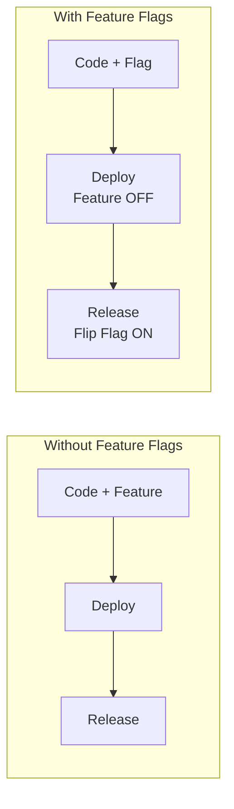
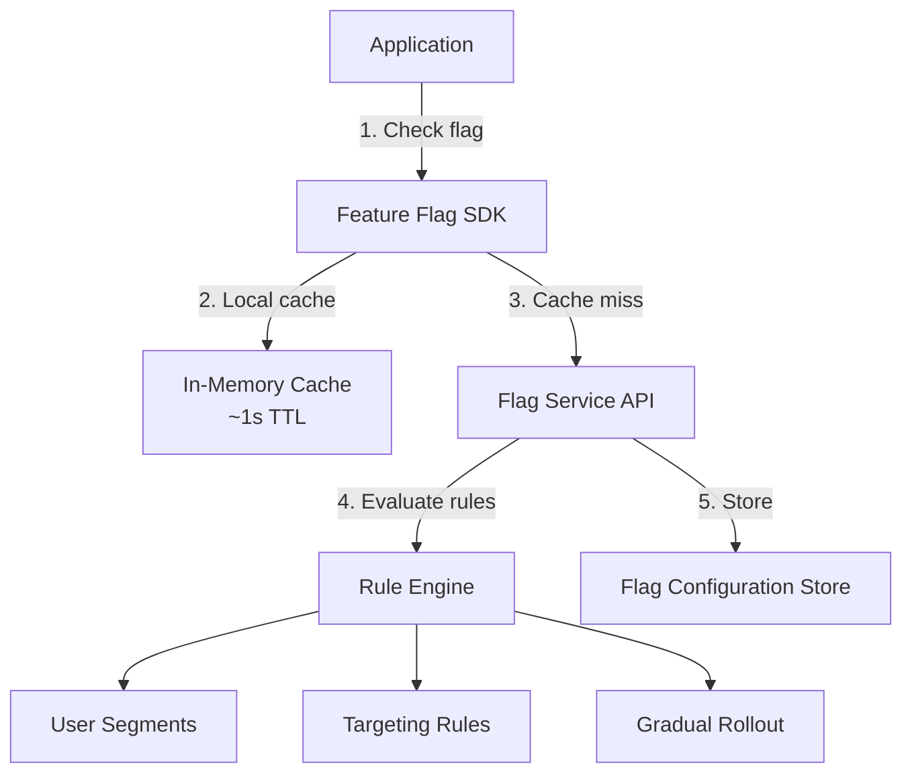
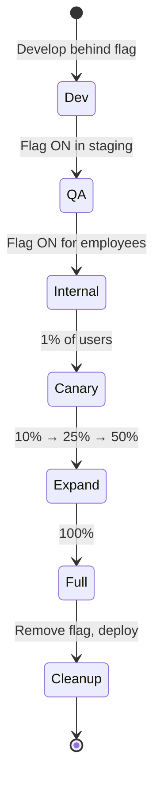

# Feature Flags (Feature Toggles)

## Overview

A feature flag (or feature toggle) is a mechanism that allows you to enable or disable application features at runtime without deploying new code. Feature flags decouple deployment from release, enabling safer rollouts, targeted delivery, and rapid experimentation.



## Why Feature Flags?

| Benefit | Description |
|---------|-------------|
| **Decouple deploy from release** | Deploy code dormant, activate when ready |
| **Trunk-based development** | Merge incomplete features behind flags |
| **Targeted rollouts** | Enable for specific users, segments, regions |
| **Instant rollback** | Turn off a feature without redeploying |
| **A/B testing** | Route users to different implementations |
| **Kill switches** | Disable problematic features in production |
| **Gradual rollout** | 1% → 10% → 50% → 100% |

## Flag Types

### Classification by Lifecycle

| Type | Purpose | Lifecycle | Example |
|------|---------|-----------|--------|
| **Release flag** | Manage feature rollout | Short-lived (hours to weeks) | New checkout flow |
| **Experiment flag** | A/B test different implementations | Short-lived (test duration) | Two recommendation algorithms |
| **Ops flag** | Operational control / kill switch | Long-lived | Disable expensive background job |
| **Permission flag** | Entitlement-based access | Long-lived | Premium feature for paid users |

### Classification by Persistence

| Type | Stored Where | Evaluated When |
|------|--------------|----------------|
| **Static/Config** | Config file, environment variable | Application startup |
| **Dynamic/API** | Feature flag service | Every request (cached) |
| **Compiled** | Build-time constant | Compile time |

## Implementation

### Simple Implementation (Config File)

```python
# config/flags.yaml
features:
  new_checkout:
    enabled: true
    rollout_percentage: 25
    allowed_countries: ["us", "uk"]

# feature_flags.py
import yaml

class FeatureFlags:
    def __init__(self, config_path="config/flags.yaml"):
        with open(config_path) as f:
            self._config = yaml.safe_load(f)["features"]
    
    def is_enabled(self, flag_name, user_context=None):
        flag = self._config.get(flag_name, {})
        if not flag.get("enabled", False):
            return False
        
        # Rollout percentage check
        rollout = flag.get("rollout_percentage", 100)
        if user_context and rollout < 100:
            user_hash = hash(user_context["user_id"]) % 100
            return user_hash < rollout
        
        # Country check
        allowed = flag.get("allowed_countries")
        if user_context and allowed:
            return user_context.get("country") in allowed
        
        return True

flags = FeatureFlags()
```

### Production-Grade: Feature Flag Service



### Usage in Application Code

```java
// Clean: flag wraps the behavior
public OrderSummary getOrderSummary(User user, Order order) {
    if (featureFlags.isEnabled("new-pricing-engine", user)) {
        return newPricingEngine.calculate(user, order);
    }
    return legacyPricingEngine.calculate(user, order);
}
```

**Bad**: flags scattered everywhere with complex nested logic.
**Good**: flags at decision boundaries, clean if/else, one flag per feature.

## Targeting and Segmentation

| Targeting Method | Description | Example |
|------------------|-------------|--------|
| **User ID** | Specific users | Beta testers, employees |
| **User segment** | Group-based attributes | Premium users, enterprise |
| **Percentage rollout** | Deterministic hash-based | 5% of users |
| **Geography** | Country, region, city | EU-only for GDPR compliance |
| **Device/Platform** | OS, browser, app version | iOS first, Android later |
| **Custom attributes** | Any user property | Users with >100 orders |
| **Environment** | Staging, production | Test in production with real traffic |

### Deterministic Rollout

Percentage rollouts must be deterministic — the same user always gets the same result:

```python
import hashlib

def should_see_feature(user_id, percentage):
    """Deterministic: same user always gets same result"""
    hash_value = int(hashlib.md5(user_id.encode()).hexdigest(), 16)
    return (hash_value % 100) < percentage

# User "abc" at 25%: hash("abc") % 100 = 42 → False (not in first 25%)
# User "abc" at 50%: hash("abc") % 100 = 42 → True (in first 50%)
# This never changes for the same user_id
```

## Gradual Rollout Workflow



## Comparison: Feature Flag Services

| Feature | LaunchDarkly | Flagsmith | Unleash | Flipt |
|---------|-------------|----------|---------|-------|
| **Hosting** | SaaS only | SaaS + self-hosted | Self-hosted | Self-hosted |
| **Open source** | No | Yes (API) | Yes | Yes |
| **Pricing** | Enterprise (USD) | Free tier + paid | Free | Free |
| **SDKs** | 15+ languages | 8+ | 10+ | gRPC, REST |
| **A/B testing** | Yes | No | No | No |
| **Gradual rollout** | Yes | Yes | Yes | Yes |
| **Targeting rules** | Rich | Rich | Rich | Basic |
| **Best for** | Enterprise, experiments | Simple teams, self-host | Self-hosted, K8s-native | Simple, self-hosted |

## Anti-Patterns

| Anti-Pattern | Why It's Bad | Fix |
|--------------|-------------|-----|
| **Flag sprawl** | Hundreds of flags, unclear which are active | Audit regularly, remove dead flags |
| **Long-lived release flags** | Code branches in production forever | Timebox: remove within 2 weeks of full rollout |
| **Deep nesting** | `if flagA and flagB and flagC` | One flag per feature; compose in the rule engine |
| **No default** | `if flag: new_code` without else | Always handle both code paths |
| **Flags in hot loops** | Checking flag on every iteration | Cache flag evaluation at request start |
| **No monitoring** | Don't know which flags are being evaluated | Log flag evaluations, monitor flag service latency |

## Cleanup Strategy

Dead flags accumulate technical debt. Implement a cleanup process:

1. **Tag every flag with creation date and owner**
2. **Set an expiry date** (e.g., 90 days for release flags)
3. **Automated alerts** when flags exceed their expiry
4. **Periodic audit** (monthly): identify and remove dead flags
5. **Remove the flag from code** after full rollout (don't just leave it `true`)

```python
# Bad: flag left in forever
if feature_flags.is_enabled("new_checkout"):  # Always True
    new_checkout()
else:
    old_checkout()  # Dead code

# Good: flag removed after full rollout
new_checkout()  # Just the new code
```

## Interview Questions

1. **How do feature flags relate to trunk-based development?** Feature flags allow developers to merge incomplete or risky features into the main branch behind a flag. The code is deployed but dormant. This eliminates long-lived feature branches and reduces merge conflicts.

2. **What happens if the feature flag service is down?** SDKs use local caching with a fallback value (usually the last known state). This means flags continue to work during outages, but you can't change flag values until the service recovers.

3. **How do you prevent feature flag sprawl?** Track every flag in a registry with owner, creation date, type, and expiry. Automate alerts for stale flags. Make cleanup a part of the deployment checklist. Limit the number of active flags per service.

4. **What's the difference between a feature flag and a canary release?** A feature flag controls which users see a feature within the same deployed version. A canary release deploys a new version of the entire service and routes traffic to it. They're complementary: use flags for feature-level control and canaries for infrastructure-level safety.

5. **How would you implement feature flags for a mobile app?** Use a remote config/flag SDK that fetches flags on app launch and caches locally. Handle offline scenarios by using the cached value. For critical flags, fetch on every app foreground. Consider using Firebase Remote Config or a similar mobile-first solution.

## Key Takeaways

- Feature flags decouple deployment from release, enabling safer and more flexible software delivery
- Four main types: release flags (short-lived), experiment flags, ops flags, and permission flags (long-lived)
- Deterministic percentage rollout (hash-based) ensures the same user always sees the same version
- Clean up release flags after full rollout — dead flags accumulate technical debt
- Feature flag services (LaunchDarkly, Unleash, Flagsmith) provide SDKs, targeting rules, and dashboards
- Always handle both code paths (flag on/off) and monitor flag service health
- Combine with canary releases: flags for feature-level, canaries for infrastructure-level safety

## Cross-References

- [Canary Releases](./canary-releases.md) — Progressive delivery with traffic splitting
- [Multi-Region Architecture](./multi-region.md) — Per-region flag configuration
- [CI/CD Pipelines](../cloud/cicd/pipelines.md) — Deploy flags with code
- [SLO/SLI/SLA](./slo-sli-sla.md) — Measure flag impact on reliability
- [A/B Testing](../ml/mlops/ab-testing.md) — Feature flags for experiments
- [Production Engineering](../production-engineering/deployments.md) — Deployment strategies
