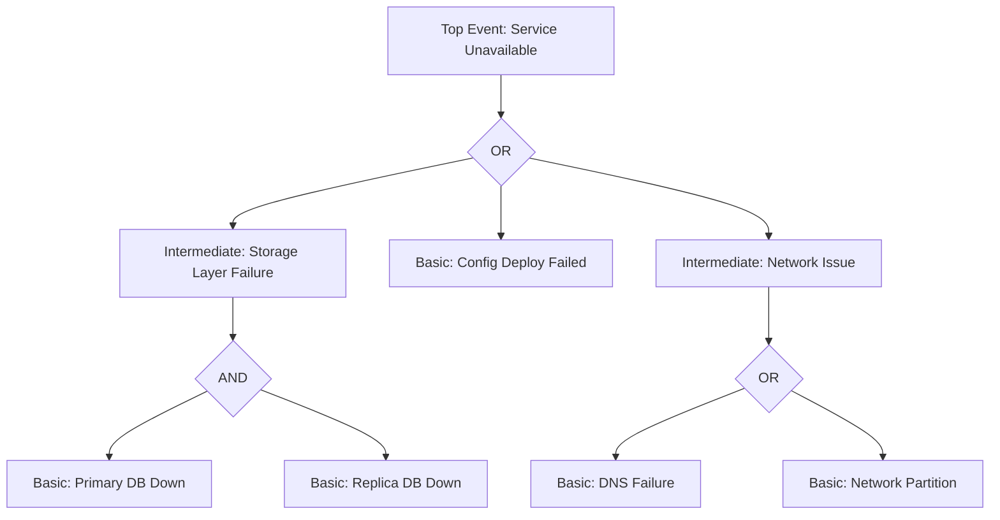
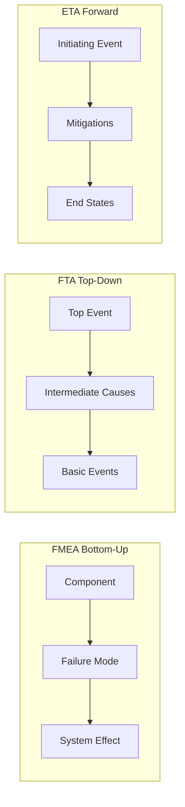

# FMEA and Fault Trees

> Two complementary ways to reason about failure *before* it happens: FMEA asks "what could go wrong with this component?" and works upward; fault trees ask "what could cause this disaster?" and work downward.

## 1. Overview — Why Structured Failure Analysis Matters

Reliability engineering is dominated by **reactive** artifacts — dashboards, alerts, postmortems, blameless reviews. All of these describe failures that have *already* happened. **FMEA (Failure Mode and Effects Analysis)** and **FTA (Fault Tree Analysis)** are the two canonical **proactive** techniques: structured, repeatable methods for finding ways a system can fail *before* it ships, before an incident, before a customer notices. Both originated in high-stakes domains — FMEA in 1940s US munitions work and formalized in MIL-STD-1629A, FTA in 1962 at Bell Labs for the Minuteman ICBM — and both are now codified as international standards used by aerospace (ARP4761, DO-178C), automotive (ISO 26262), medical device (ISO 14971), and nuclear (NUREG) regulators.

In a typical SRE or production-engineering context these techniques are *rarely* applied with the rigor of an aerospace safety case, but their vocabulary and their mental models are everywhere. When a team runs a **pre-mortem** before a launch, they are doing an informal FMEA. When an incident commander asks "what is the set of conditions that would have produced this symptom?", they are sketching a fault tree. When a design review asks "what is the single point of failure here?", they are searching for a minimal cut set. This page covers both techniques formally — definitions, standards, worksheets, gates, quantitative methods — so you can apply them with discipline when the cost of a bug justifies it, and so you can speak the language fluently in interviews on reliability, safety, and systems design. The two methods are most powerful when used together: FMEA enumerates failure modes exhaustively bottom-up, FTA chases the causal chains that lead to a specific unacceptable top event top-down.

A note on scope. This page is about *analysis* — reasoning on paper about how a system can fail. It is *not* about the patterns you build once the analysis is done; those are covered in `./reliability-patterns.md` (circuit breakers, bulkheads, retries, redundancy). It is also not about the experimental validation of those analyses; that is chaos engineering, covered in `./chaos-engineering.md`. The right mental model is a three-step loop: **analyze** (FMEA + FTA on paper) → **build** (reliability patterns in code) → **validate** (chaos engineering in production) → **learn** (incident + postmortem feeds back into the next analysis). This page is the first step.

## 2. FMEA — Failure Mode and Effects Analysis

**FMEA** is a systematic, team-based technique for identifying all of the ways a system, design, process, or service can fail, then ranking those failure modes by risk so that the highest-risk ones get attention first. The technique is standardized internationally as **IEC 60812** (*Analysis techniques for system reliability – Procedure for failure mode and effects analysis*), with industry-specific variants: **SAE J1739** (automotive, the standard referenced by ISO 26262), **MIL-STD-1629A** (military, the original 1980s procedural spec), and AIAG-VDA harmonized automotive handbook. The two most-cited practitioner references are Stamatis's *Failure Mode and Effects Analysis* (a comprehensive handbook covering theory, implementation, and case studies) and Carlson's *The FMEA Handbook* (a practical, example-driven guide from a long-time Ford reliability engineer).

The defining output of FMEA is the **Risk Priority Number**, computed as:

\\[
\text{RPN} = S \times O \times D
\\]

where each factor is rated on a 1–10 scale: **Severity (S)** is the consequence of the failure if it occurs (1 = negligible, 10 = safety hazard or total loss); **Occurrence (O)** is the likelihood the failure cause will be present (1 = remote, 10 = near-certain); **Detection (D)** is the likelihood that current controls will *catch* the cause before it reaches the customer (1 = almost certain to detect, 10 = almost certain to miss). An RPN therefore ranges from 1 to 1000. A failure mode with S=10, O=4, D=8 scores 320; one with S=8, O=8, D=2 scores 128. The first ranks higher even though its severity is high and likelihood is moderate — and that is the point of the multiplicative form: it forces attention onto failures that are severe *and* hard to detect, not merely frequent. Many teams discard the raw RPN in favor of a **criticality matrix** (S × O alone) because the Detection axis is conceptually muddled — it conflates "how likely we are to find the bug" with "how bad the bug is" — but the full RPN remains the IEC 60812 default.

## 3. Types of FMEA

FMEA is not a single technique but a family. The four canonical types differ in their object of analysis (a system architecture, a component design, a manufacturing process, or a delivered service) and in the kinds of failure modes they hunt for. Choosing the right type matters: a Process FMEA applied to a software architecture will miss design flaws because it is tuned to sequential process steps, while a Design FMEA applied to a runbook will miss procedural errors because it is tuned to physical components. All four share the same worksheet format and the same S-O-D rating logic; they differ in the *content* of each row.

| FMEA Type | Object of Analysis | Typical Failure Modes | When Performed | Primary Standard |
|-----------|--------------------|------------------------|----------------|------------------|
| **System FMEA** (SFMEA) | System architecture, subsystem interactions, interfaces | Missing function, incorrect interface contract, cascading failure, single point of failure | Concept / architecture phase | IEC 60812, ARP4761 |
| **Design FMEA** (DFMEA) | Component or product design — hardware, software module, mechanical part | Wrong material, software logic error, tolerance stack-up, thermal limit exceeded | Design phase, before freeze | SAE J1739, IEC 60812 |
| **Process FMEA** (PFMEA) | Manufacturing or operational process — assembly line, deploy pipeline, change management | Skipped step, wrong parameter, tooling drift, misconfigured environment, missed validation | Before process rollout, after process change | SAE J1739, AIAG-VDA |
| **Service FMEA** | Delivered service — customer-facing flow, support workflow, on-call response | SLA breach, escalation failure, wrong communication, delayed response | Service design, after major incident | IEC 60812 (adapted) |

A microservices deploy pipeline is a natural target for a Process FMEA: each step (build, unit test, integration test, image scan, canary, promote) is a row, and the failure modes are "build cache poisoned", "test flakiness masks real failure", "image scan bypassed", "canary metric misconfigured". A Service FMEA on an on-call rotation might enumerate "primary on-call unreachable", "runbook out of date", "escalation policy points to departed engineer", "severity mis-triaged". For most SRE work, Process and Service FMEAs are the highest-leverage variants because they map directly onto artifacts you already own.

A practical naming convention matters when several FMEA types coexist on the same system: prefix each worksheet with its type and scope (`PFMEA-deploy-pipeline-v3`, `SFMEA-payment-service-2024Q3`, `DFMEA-outbox-library`) so that an incident responder looking for prior analysis of a failure mode can find it quickly. Versioning matters too — an FMEA worksheet is a living document, and the version tied to a particular architecture snapshot is the one to consult when investigating an incident that occurred while that architecture was live. Treating FMEAs as code (checked into the service's repository, reviewed in PRs, updated alongside architectural changes) is the modern practice and removes the "where is the FMEA?" friction that kills their use.

## 4. The FMEA Worksheet

An FMEA is delivered as a **worksheet** — typically a spreadsheet or a structured document — where each row is one failure mode and each column captures one piece of the analysis. The exact column set varies by standard (SAE J1739 and AIAG-VDA differ in column ordering and naming) but the IEC 60812 core is stable across all of them. The columns walk left-to-right from "what is the thing" through "how can it fail", "what happens if it fails", "how bad / how often / can we catch it", to "what do we do about it". A complete row is itself a small argument: *this component, in this failure mode, produces this effect, with this severity, because of this cause, with this likelihood, against these controls, which detect it this poorly, giving this RPN, so we will do this.*

```mermaid
flowchart LR
    A["Item / Function"] --> B["Potential Failure Mode"]
    B --> C["Potential Effect of Failure"]
    C --> D["Severity Rating S"]
    D --> E["Potential Cause / Mechanism"]
    E --> F["Occurrence Rating O"]
    F --> G["Current Design / Process Controls"]
    G --> H["Detection Rating D"]
    H --> I["RPN = S times O times D"]
    I --> J["Recommended Actions"]
    J --> K["Action Owner / Due Date"]
    K --> L["Revised RPN After Action"]
```

| Column | Content | Example (deploy pipeline) |
|--------|---------|---------------------------|
| Item / Function | What the thing does | `canary_deploy` step: route 5% traffic to new build |
| Potential Failure Mode | How it can fail | Canary metrics not collected → bad build promoted |
| Potential Effect | Consequence if it fails | Customer-facing 5xx for 10 min, SEV-2 |
| Severity (S) | 1–10 | 8 |
| Potential Cause | Why the mode occurs | Metrics dashboard missing canary tag filter |
| Occurrence (O) | 1–10 | 4 |
| Current Controls | What exists to detect/prevent | Manual review of dashboard |
| Detection (D) | 1–10 | 7 |
| RPN | S × O × D | 224 |
| Recommended Actions | Mitigation | Add automated canary gate; alert on missing tag |
| Action Owner / Due | Accountability | @sre-lead, 2 weeks |
| Revised RPN | Re-score after action | S=8, O=2, D=3 → 48 |

The **revised RPN** column closes the loop: after the recommended action is implemented, the row is re-scored. A successful action lowers O (less likely to happen) or D (more likely to be caught), rarely S (the consequence if it does happen is unchanged). Tracking the delta between original and revised RPN across a worksheet is how a team measures whether its reliability investment is working. Worksheets are living documents, not one-time deliverables — every incident should produce new rows or revised ratings on existing ones.

## 5. When to Use FMEA — and When Not To

FMEA pays off when the cost of a failure is high, when the system is being designed or changed, and when a cross-functional team can be assembled for a few hours of structured analysis. The textbook triggers are: **(1) new design or architecture** — System FMEA during the concept phase catches missing redundancy and single points of failure before code is written; **(2) new process or process change** — Process FMEA before rolling out a new deploy pipeline or change-management workflow; **(3) after a major incident** — extending the worksheet with the failure mode just observed, rating it honestly, and asking "why didn't our existing controls catch this?"; **(4) regulatory or contractual requirement** — ISO 26262, ISO 14971, DO-178C, and AS9100 all mandate FMEA for the relevant artifacts; **(5) before a high-stakes launch** — a pre-mortem is an informal FMEA, and formalizing it forces the team to enumerate failure modes that hand-waving would skip.

FMEA's limitations are real and should be named explicitly so they can be compensated for. First, **the ratings are subjective**: S, O, and D are agreed by team consensus, and the same failure mode scored by two teams can produce RPNs differing by 3×. Second, **FMEA is component-centric and can miss systemic interactions** — it asks "what happens if component X fails?" but does not naturally model "what happens if X and Y both fail in a specific order?". The 2003 Northeast blackout, the 2018 AWS Kinesis incident, and many cascading-failure outages were interactions between components, not single-component failures; an FMEA on each component in isolation would not have surfaced them. Third, **FMEA is time-consuming**: a non-trivial system can produce hundreds of rows, and a single workshop rarely finishes the worksheet — it iterates over weeks. Fourth, **RPN arithmetic is questionable**: multiplying three ordinal scales has no statistical meaning (a Severity-8 failure is not "twice as bad" as a Severity-4 failure), and the multiplication over-weights high-D items in ways that distort priorities. Fifth, FMEA encourages checklist thinking — once a row exists with a recommended action, teams can stop questioning whether the analysis itself was complete. The right response is to combine FMEA with **fault tree analysis** (for causal chains and common-cause failures) and with **formal verification** (see `../cs-theory/formal-methods.md`) for the small subset of properties where exhaustive proof is feasible.

## 6. Fault Tree Analysis (FTA)

**Fault Tree Analysis** is a top-down, **deductive** technique that starts from an undesired **top event** (e.g. "service unavailable", "data corrupted", "rocket fails to launch") and systematically decomposes it into the combinations of lower-level faults that could cause it, using **Boolean logic gates** to combine events. The result is a tree — rooted at the top event, with intermediate events as internal nodes, gates connecting parents to children, and **basic events** (component failures, human errors, external events) as leaves. FTA was developed in 1962 by H. A. Watson at Bell Labs under contract to the US Ballistic Systems Division for the Minuteman ICBM, and was rapidly adopted by the nuclear industry after Three Mile Island. The canonical reference is Vesely, Goldberg, Roberts, and Haasl's ***Fault Tree Handbook*** (NUREG-0492, US Nuclear Regulatory Commission, 1981) — freely available and still the most thorough introduction. The technique is standardized as **IEC 61025** (*Fault tree analysis*), and the modern textbook treatment is Rausand and Høyland's ***System Reliability Theory: Models, Statistical Methods, and Applications*** (Wiley, 2nd ed., 2003), which covers both qualitative cut-set analysis and quantitative probability calculations in depth.

The fundamental contrast with FMEA is **direction of reasoning**. FMEA is **inductive / bottom-up**: pick a component, ask "what if it fails?", enumerate effects. FTA is **deductive / top-down**: pick a top event, ask "what could cause this?", decompose recursively. FMEA answers "what happens if Y fails?". FTA answers "what could cause X?". The two techniques are therefore complementary, not substitutes — FMEA exhaustively enumerates failure modes but stops at single-component analysis; FTA chases causal chains to any depth but only for the specific top event you chose to analyze. A mature reliability program uses both: FMEA to make sure no failure mode is forgotten, FTA to verify that the system cannot reach an unacceptable state from any combination of them.

Graphically, a fault tree is drawn with the **top event** in a rectangle at the top, **gates** as the standard Boolean symbols (a flat D-shape for AND, a curved shield for OR, a voting gate with "k/N" inside), and **basic events** as circles at the leaves. Intermediate events are rectangles that sit between gates. The visual convention matters less than the logic — a fault tree is fundamentally a Boolean expression, and any tool that can evaluate Boolean expressions can evaluate a fault tree. Modern FTA software (CAFTA, RiskSpectrum, OpenFTA, SCRAM) automates both the cut-set enumeration (a #P-hard problem in general, but tractable for trees of a few hundred events) and the probability calculation.

## 7. FTA Gates and Events

A fault tree is built from a small, fixed vocabulary of **gates** and **events**. The gates are the Boolean operators that combine child events into parent events; the events are the nodes — basic events at the leaves (a component failure, a human error, an external condition), intermediate events in the body (an outcome of a gate that feeds another gate), and the top event at the root. The two fundamental gates are AND and OR; the rest are refinements that capture real-world timing or voting semantics.

| Gate | Boolean Meaning | Fault Occurs When | Typical Use |
|------|-----------------|-------------------|-------------|
| **AND** | Logical conjunction | *All* input faults occur | Redundant components all fail (common-cause failure) |
| **OR** | Logical disjunction | *Any* input fault occurs | Non-redundant components; multiple independent failure paths |
| **Voting / k-of-n** | At least k of n | k or more of n inputs occur | Triple modular redundancy (2-of-3); quorum systems |
| **Priority-AND** | Sequential AND | All inputs occur *in the specified order* | Protection bypassed before fault occurs |
| **Inhibit** | Conditional OR | Input occurs AND inhibiting condition is true | Fault only matters in a specific operating mode |
| **Exclusive-OR (XOR)** | Exactly one | Exactly one input occurs | Rare; used for mutually exclusive failure paths |

An **AND gate** models redundancy and lowers the probability of the parent event: two independent components each with 1% failure probability produce an AND-gated event with probability \\(0.01 \times 0.01 = 10^{-4}\\). This is why redundancy is the first lever reliability engineers pull. An **OR gate** models any-of-failure paths and *raises* the probability: two independent components each at 1% under an OR gate give \\(1 - (1 - 0.01)^2 \approx 0.0199\\), nearly double the single-component rate. The **voting gate** generalizes both: a 2-of-3 gate fires when any two of its three inputs fire, used wherever a majority vote decides correctness (TMR processors, consensus quorums, multi-zone storage). The **priority-AND** and **inhibit** gates capture timing and conditional semantics that pure Booleans miss — a circuit breaker that fails open is harmless unless a downstream fault is also present, modeled as an inhibit gate with the downstream fault as the condition. Basic events carry probability data (failure rate λ, repair rate μ, exposure time t) that flows up through the gates to produce a top-event probability.

## 8. Minimal Cut Sets and Quantitative FTA

A **cut set** is any set of basic events whose simultaneous occurrence guarantees the top event. A **minimal cut set** is a cut set with no redundant member — remove any event and it is no longer a cut set. The set of all minimal cut sets is the qualitative heart of a fault tree: it tells you exactly which combinations of failures can cause the top event, and it lets you rank them by likelihood. A tree with a single-event minimal cut set has a **single point of failure** — the most important finding an FTA can produce. A tree whose smallest cut sets are all size 2 or larger has genuine redundancy, and the analysis shifts to **common-cause failures**: conditions (shared power, shared config, shared operator, shared vendor) that can defeat the redundancy by causing multiple basic events simultaneously.

The example below shows a fault tree for a service-unavailability top event. An OR gate at the top means any of three paths can cause it: a storage-layer failure (modeled as an AND gate requiring both primary and replica DB to be down — a size-2 cut set), a config-deploy failure (a single basic event — a size-1 cut set, a single point of failure), or a network issue (an OR gate over DNS failure and network partition, each a size-1 cut set).

The minimal cut sets of this tree are \\(\\{C_1 = \{\text{Config Deploy Failed}\}\\), \\(C_2 = \{\text{DNS Failure}\}\\), \\(C_3 = \{\text{Network Partition}\}\\), \\(C_4 = \{\text{Primary DB Down}, \text{Replica DB Down}\}\\}\\). Three single-event cut sets and one size-2 cut set. The quantitative analysis multiplies probabilities within each cut set (AND) and sums them across cut sets (OR) under the **rare-event approximation**:

\\[
P(\text{top}) \;\approx\; \sum_{i=1}^{n} \prod_{j \in C_i} P(e_j)
\\]

This approximation is valid when individual basic-event probabilities are small (typically \\(P < 0.1\\)); it ignores higher-order intersection terms and slightly overestimates the top probability. For the example, if each basic event has probability \\(p\\), then \\(P(\text{top}) \approx 3p + p^2\\). The dominant terms are the three single-event cut sets — the config-deploy and network paths — and the redundant storage path contributes only at second order. The action implied by this analysis is unambiguous: eliminate the single-event cut sets first (add a config-deploy canary gate, add DNS fallback, add multi-AZ network redundancy), because each one of them contributes more to the top probability than the storage path contributes even when both halves fail. This is how FTA turns a drawing into a prioritized engineering work list.

## 9. FMEA vs FTA vs ETA — Choosing the Right Technique

FMEA and FTA are not the only structured failure-analysis techniques. **Event Tree Analysis (ETA)** is the third member of the canonical triad: it is **inductive / bottom-up** like FMEA but, instead of asking "what happens if this component fails?", it asks "given that this *initiating event* occurred, what are the possible end states?" An event tree starts from an initiating event (a cooling pump trip, a primary DB failure, a network partition) and branches left/right at each subsequent safety function or mitigation (did the backup kick in? did the operator respond correctly? did the alert fire?), producing a fan of possible outcomes from "no consequence" to "catastrophe". ETA is the natural complement to FTA: FTA takes a top event and finds its causes; ETA takes an initiating event and finds its consequences. A full **PRA (Probabilistic Risk Assessment)** as practiced in the nuclear industry links the two — FTA computes the frequency of each initiating event, ETA propagates each initiating event through its consequence tree, and the two together produce a full risk curve.

| Technique | Direction | Question | Starting Point | Output | Best For |
|-----------|-----------|----------|----------------|--------|----------|
| **FMEA** | Bottom-up, inductive | "What if component Y fails?" | A component or step | Worksheet of failure modes ranked by RPN | Exhaustive enumeration; design reviews; process audits |
| **FTA** | Top-down, deductive | "What could cause top event X?" | An undesired top event | Tree of causal chains; minimal cut sets | Verifying a specific safety property; finding single points of failure |
| **ETA** | Forward, inductive | "Given event A happened, what outcomes are possible?" | An initiating event | Tree of consequence sequences with probabilities | Consequence analysis; layered defense evaluation; accident scenario modeling |

A practical workflow is to **start with FMEA** on a new design to enumerate failure modes exhaustively, **then build a fault tree** for each top event that is severe enough to warrant it (data loss, safety violation, full outage), **and finally run an event tree** from any initiating event whose consequence chain is non-obvious. The three techniques each catch what the others miss: FMEA catches forgotten failure modes; FTA catches causal interactions and single points of failure; ETA catches surprise end-states from a single initiating event.

## 10. Reliability Analysis Techniques — Wider Landscape

Beyond FMEA, FTA, and ETA, several other structured techniques appear in reliability engineering and safety cases. Each has a niche where it is the right tool, and a mature engineer knows when to reach for each.

| Technique | Family | What It Produces | Strength | Limitation |
|-----------|--------|------------------|----------|------------|
| **FMEA** | Inductive | Ranked failure-mode worksheet | Exhaustive, simple, team-friendly | Misses interactions; subjective ratings |
| **FTA** | Deductive | Causal tree; minimal cut sets; probability | Models interactions; quantitative | One top event per tree; can grow huge |
| **ETA** | Inductive | Consequence tree from initiating event | Models layered defenses | Needs FTA to feed initiating-event rates |
| **HAZOP** | Inductive | Deviation table with guide words | Catches subtle process deviations (more/less/as-well-as) | Process-centric; steep learning curve |
| **Markov / State Machines** | Probabilistic | State-transition model with rates | Models repair, redundancy, time-dependent failure | State space explodes for n components |
| **Monte Carlo Simulation** | Numerical | Sampled reliability distribution | Handles arbitrary distributions and dependencies | Slow convergence; opaque to reviewers |
| **Reliability Block Diagram (RBD)** | Combinatorial | Series/parallel block network | Simple, intuitive for redundancy | Cannot model k-of-n or conditional logic well |
| **Formal Verification / Model Checking** | Deductive | Exhaustive proof over all states | Proves absence of a class of bugs | State-space explosion; high up-front cost |

The choice is driven by what you need to know. If you need a *ranked list* of failure modes to drive a work backlog, FMEA. If you need to *prove* a specific top event cannot occur (or compute its probability), FTA. If you need to know *all the ways* an initiating event can play out, ETA. If you need to model time-dependent behavior with repair, Markov. If you need certainty that *no* execution violates a property — for the small subset of systems where this is worth the cost — formal verification (see `../cs-theory/formal-methods.md`).

In practice most SRE teams do not pick a single technique and commit to it; they reach for whatever matches the question in front of them. A launch readiness review leans on FMEA. A "could this design cause a data-loss incident?" question leans on FTA. A "what happens if our primary region fails?" question leans on ETA. A "will this consensus protocol ever deadlock?" question leans on formal verification. The fluency to switch between them — and to know which questions each one answers poorly — is itself a reliability-engineering skill, and one that interviewers probing for senior-level systems thinking will often test with a scenario question that has no single correct answer but does have a clearly *better* analytical framing.

## 11. Use in Safety-Critical Systems

FTA and FMEA are *required* by regulation in several domains, and the vocabulary of these domains shows up in SRE and production-engineering interviews whenever the question turns to safety, redundancy, or risk. **Nuclear power** has used FTA since the Reactor Safety Study (WASH-1400, 1975) — the first large-scale PRA — and every US commercial nuclear plant maintains a living PRA with thousands of fault trees. **Aerospace** codifies FMEA and FTA in SAE ARP4761 (*Guidelines and Methods for Conducting the Safety Assessment Process on Civil Airborne Systems and Equipment*) and DO-178C / DO-254 for software and hardware, with **Top Event** probabilities typically required below \\(10^{-9}\\) per flight hour for catastrophic failures. **Automotive** ISO 26262 (*Road vehicles – Functional safety*) mandates FMEA for design (DFMEA) and process (PFMEA), and uses **ASIL** (Automotive Safety Integrity Level) ratings A–D derived from severity, exposure, and controllability — a triaxial scheme that mirrors S-O-D. **Medical devices** follow ISO 14971, which requires risk analysis using FMEA, FTA, or equivalent. **Rail** uses EN 50128 / EN 50129 with analogous SIL ratings.

In ordinary cloud-software SRE work, none of these standards apply directly, but their discipline transfers. The questions to ask in a design review — "what is the single point of failure here?", "what is the common-cause failure that defeats our redundancy?", "what is the top event we will not tolerate, and what is its probability?" — are exactly the questions FTA forces you to answer. The artifacts you produce — a blameless postmortem that includes a fault tree of the incident, an FMEA worksheet attached to a launch design doc, a pre-mortem that names specific failure modes and their mitigations — are the artifacts that distinguish a senior reliability engineer from someone who only reads dashboards.

The threshold probabilities mandated by safety standards are worth knowing as interview color. Aerospace ARP4761 and DO-178C require catastrophic-failure probabilities below \\(10^{-9}\\) per flight hour — "extremely improbable" in the regulator's language. Automotive ISO 26262 ASIL D (the highest level) targets \\(10^{-8}\\) per hour for safety goals, ASIL A targets \\(10^{-6}\\). Nuclear PRAs typically target core-damage frequency below \\(10^{-4}\\) per reactor-year, with newer designs pushing toward \\(10^{-5}\\) or \\(10^{-6}\\). These numbers anchor the question "how reliable is reliable enough?" — a question SRE teams answer (often implicitly) via their SLOs, where a 99.99% availability SLO over a year corresponds to about \\(5 \times 10^{-4}\\) probability of any given hour being down. The gap between cloud SRE targets and safety-critical targets is roughly four orders of magnitude, which is why aerospace techniques are a useful *reference* for SREs but not a literal template.

For more on the patterns that FMEA and FTA recommend building (circuit breakers, bulkheads, retries, redundancy), see `./reliability-patterns.md`; for how the analysis feeds into incident response, see `./incident-management.md`; for the error-budget framing that turns reliability into a quantifiable target, see `./slo-sli-sla.md`; for a catalog of the failure modes these techniques exist to prevent, see `../failure-modes/README.md`.

## 12. Rating Scales — Anchoring S, O, and D

The subjective ratings are the single biggest threat to FMEA's reproducibility. Two engineers rating the same failure mode can disagree by 3 points on each axis, producing RPNs that differ by an order of magnitude. The remedy recommended by SAE J1739, AIAG-VDA, and Stamatis is **anchored rating scales** — published tables that give a concrete example for each 1–10 value, so a team calibrates against a shared reference instead of personal intuition. The exact anchors vary by standard and by domain (automotive SAE J1739 differs from medical ISO 14971), but the shape is consistent: Severity is anchored to safety / regulatory / functional impact, Occurrence to historical defect rates, Detection to the likelihood the current control catches the cause before release.

| S | Severity anchor (effect on customer / system) | O | Occurrence anchor (failures per thousand units / runs) | D | Detection anchor (likelihood current control catches it) |
|---|-----------------------------------------------|---|--------------------------------------------------------|---|----------------------------------------------------------|
| 1 | No effect noticeable | 1 | Remote: \\(< 1\\) in \\(10^6\\) | 1 | Almost certain to detect (automated gate fails the build) |
| 3 | Minor nuisance, customer notices but works around | 3 | Low: 1 in 10,000 | 3 | High: detected by routine automated testing |
| 5 | Moderate: partial function lost, customer unhappy | 5 | Moderate: 1 in 1,000 | 5 | Moderate: detected by manual review or staging soak |
| 7 | High: major function lost, SLA breach, SEV-2 | 7 | High: 1 in 100 | 7 | Low: only detected after deploy by monitoring |
| 8 | Very high: SEV-1, regulatory exposure | 8 | Very high: 1 in 20 | 8 | Very low: detected only by customer report |
| 10 | Catastrophic: safety hazard, total loss, regulatory violation | 10 | Almost certain: \\(> 1\\) in 10 | 10 | Absolute uncertainty: no detection mechanism exists |

A team should adopt one anchored scale, publish it in the FMEA template, and re-rate every row against the same anchors. Two further refinements are common. First, many teams **cap Severity at 10 regardless of cause** — a safety hazard is a 10 whether it occurs once or a million times; the multiplicative RPN then reflects only the O and D variation among safety-critical rows, which is the right prioritization. Second, AIAG-VDA's harmonized handbook (2019) introduces **AP (Action Priority)** — High / Medium / Low — as a replacement for raw RPN, on the grounds that multiplying ordinal scales is statistically meaningless. AP uses a lookup table over the (S, O, D) triple: a Severity-9 or 10 row is High priority regardless of O and D; a Severity-5–8 row is High only if O and D are both above 4; lower-severity rows step down through Medium to Low. AP is increasingly the preferred prioritization scheme in automotive work; the older RPN remains dominant in legacy worksheets and in SRE adaptations.

## 13. Worked Example — FMEA and FTA on a Payment Service

Consider a payment service that accepts a charge request, writes it to a primary database, replicates asynchronously to a replica, and emits a receipt event. The unacceptable top event is **"customer charged but no receipt delivered"** — a class of bug that produces support tickets, chargebacks, and reputation damage out of proportion to its raw frequency.

**Step 1 — FMEA on the design.** The team walks each component and enumerates failure modes. The primary DB write can fail outright (mode A) or succeed-but-be-perceived-as-failed by a client that times out and retries (mode B). The replication can lag beyond the receipt-emission window (mode C). The receipt emitter can crash between DB commit and event publish (mode D). Each row is rated S-O-D: mode D scores high on Severity (8), low on Occurrence (3), and high on Detection (8) — RPN 192 — because the team has no current way to detect that a committed charge lost its receipt. Modes A and B are lower Severity (5) because the customer is not silently charged. Mode C is the surprise: S=7, O=5, D=6, RPN 210 — the highest-priority row, even though it is "only" a lag issue, because it produces a wrong-but-plausible receipt.

**Step 2 — FTA on the top event.** "Customer charged but no receipt delivered" decomposes under an OR gate into three paths: receipt never published (intermediate event → AND gate over emitter-crashed AND retry-did-not-fire); receipt published to wrong destination (basic event — misconfigured topic); receipt published but not delivered to customer (intermediate → OR over email-provider-down AND customer-email-bounced AND suppression-list-falsely-triggered). The minimal cut sets are enumerated. The single-event cut sets — misconfigured topic, suppression-list false-positive — are the single points of failure the FMEA did not surface, because they are not component failures but configuration/operational failures spanning the boundary of the payment service and the email provider.

**Step 3 — ETA from the initiating event "emitter crash between commit and publish."** The tree branches at each mitigation: did the outbox pattern forward the event on emitter restart? (yes → no consequence; no → did the reconciliation job catch it within SLA?). The end states range from "no consequence, self-healed in 30s" to "permanent receipt loss, customer opens ticket." The probability of the worst end state is the product of the initiating-event frequency (from FTA) and the conditional probability that both mitigations fail (from ETA).

**Step 4 — actions.** The FMEA's high-RPN rows and the FTA's single-event cut sets together produce a prioritized backlog: implement the transactional outbox pattern (eliminates mode D entirely by making publish a side-effect of commit); add a config-deploy canary that verifies the topic name (eliminates the misconfigured-topic single-event cut set); add a reconciliation job that scans for committed-but-unpublished charges every 5 minutes (lowers Detection D on mode D from 8 to 2, RPN 192 → 48); switch email provider to one with a suppression-list API and integrate it (eliminates the false-positive single-event cut set). Revised RPNs and revised top-event probability are recomputed after each action lands, closing the loop. This four-step flow — FMEA to enumerate, FTA to verify the top event, ETA to scope consequences, then targeted actions with re-scoring — is the template for any reliability analysis where the cost of a missed failure mode justifies a few hours of structured work.

## 14. Common Pitfalls and Practitioner Tips

Both FMEA and FTA have well-known failure modes of their own — ways the analysis goes wrong and produces a worksheet or a tree that *looks* rigorous but does not actually reduce risk. The most common FMEA pitfall is **rating inflation**: without anchored scales, every failure mode ends up scored S=7, O=5, D=5 (RPN 175) because no one wants to be the engineer who calls their own component's failure "minor." The remedy is to publish anchored scales, to require at least one row rated S=2 or below (forcing the team to use the low end), and to have a facilitator challenge any cluster of identical ratings. The second FMEA pitfall is **recommended actions with no owner and no due date** — a row with S=8, O=5, D=7 and "consider adding monitoring" produces no actual reliability improvement. Every recommended action must have an owner, a due date, and a revised-RPN target, or it is not a real action.

The most common FTA pitfall is **incomplete basic events** — the analyst draws the tree down to "primary DB down" and stops, treating it as a basic event, when in fact the DB can fail because of disk exhaustion, OOM kill, network partition, bad deploy, or operator action. A tree whose leaves are not genuinely basic is incomplete; the rule of thumb is that each basic event should have a probability you can defend from data (failure rate λ × exposure time t) or from a sub-tree that decomposes it further. The second FTA pitfall is **ignoring common-cause failures**: an AND gate over "primary DB down" and "replica DB down" assumes the two are independent, but if they share a config, a deploy pipeline, an operator, or a power bus, the AND gate's independence assumption is violated and the true probability is much higher. Modeling common-cause failure explicitly — by adding a basic event under the AND gate that represents the shared cause — is the fix.

| Pitfall | Symptom | Remedy |
|---------|---------|--------|
| FMEA rating inflation | All rows cluster at S=7 O=5 D=5 | Anchored scales; force spread; facilitator challenge |
| FMEA action without owner | "Consider adding monitoring" | Require owner, due date, revised-RPN target |
| FTA shallow basic events | "DB down" treated as atomic | Decompose until each leaf has a defensible probability |
| FTA ignoring common cause | AND gate over redundant components | Add shared-cause basic event under the AND |
| Both: one-shot exercise | Worksheet filed and forgotten | Re-score after each incident; living document |
| Both: analysis without build | Tree drawn, no actions implemented | Tie every High-AP row or single-event cut set to a tracked ticket |

A final tip: **time-box the analysis**. A four-hour FMEA workshop with the right people in the room produces 80% of the value of a four-week effort; the remaining 20% rarely justifies the calendar cost. Run the workshop, capture the high-priority rows, file tickets for the actions, and re-convene after the next incident. Reliability analysis is a *practice*, not a project — its value compounds over time as the worksheet accumulates institutional memory of how the system has failed and how it was fixed.

## 15. Interview Questions

**Q1: What is FMEA, and how is the RPN computed?**
A: FMEA (Failure Mode and Effects Analysis, standardized as IEC 60812) is a systematic bottom-up technique for identifying how a system can fail and ranking those failure modes. Each row is rated on three 1–10 scales — Severity (S), Occurrence (O), Detection (D) — and the Risk Priority Number is \\(\text{RPN} = S \times O \times D\\), ranging 1–1000. Higher RPN means higher-priority work. Critically, Detection is "how likely current controls are to *catch* the cause before it reaches the customer" — a high D means we are flying blind, and that is what inflates the RPN.

**Q2: What are the four main types of FMEA, and when would you use each?**
A: System FMEA (architecture-level, concept phase), Design FMEA (component design, before freeze), Process FMEA (manufacturing or operational process, before rollout), and Service FMEA (delivered service workflow). For an SRE team, Process FMEA on the deploy pipeline and Service FMEA on the on-call rotation are usually highest-leverage — they map onto artifacts you already own and produce actionable, ranked improvements.

**Q3: What are the main limitations of FMEA?**
A: (1) Ratings are subjective — the same failure mode can score very differently across teams. (2) FMEA is component-centric and can miss systemic interactions and common-cause failures that defeat redundancy. (3) It is time-consuming; non-trivial systems produce hundreds of rows. (4) Multiplying three ordinal scales has no statistical meaning, so RPN arithmetic is questionable. (5) It can encourage checklist thinking — once a row exists, teams may stop questioning whether the analysis itself is complete. The remedy is to combine FMEA with FTA for causal chains and with formal verification for the small set of properties where proof is feasible.

**Q4: What is a fault tree, and how does it differ from FMEA?**
A: A fault tree (IEC 61025, canonical reference NUREG-0492) is a top-down deductive analysis that starts from an undesired top event and decomposes it through Boolean gates (AND, OR, voting, priority-AND, inhibit) into combinations of basic events. FMEA is bottom-up and asks "what happens if component Y fails?"; FTA is top-down and asks "what could cause top event X?". They are complementary — FMEA enumerates exhaustively but stops at single-component analysis; FTA chases causal chains to any depth but only for the specific top event chosen.

**Q5: What is a minimal cut set, and why does it matter?**
A: A cut set is any set of basic events whose simultaneous occurrence guarantees the top event. A *minimal* cut set is one with no redundant member. The minimal cut sets are the qualitative output of FTA: they tell you exactly which combinations of failures can cause the top event. A single-event minimal cut set is a single point of failure — the most important finding an FTA can produce, because that one event alone takes down the system. The size of the smallest cut set is a measure of redundancy.

**Q6: How do you compute the probability of a top event from a fault tree?**
A: For each minimal cut set, multiply the probabilities of its basic events (the AND semantics). Then sum the cut-set probabilities across all minimal cut sets (the OR semantics). This is the **rare-event approximation**: \\(P(\text{top}) \approx \sum_i \prod_{j \in C_i} P(e_j)\\). It is valid when individual basic-event probabilities are small (typically < 0.1) and slightly overestimates the top probability by ignoring higher-order intersection terms.

**Q7: When would you use FTA over FMEA, or both together?**
A: Use FMEA when you need an exhaustive ranked list of failure modes — design review, new process, post-incident learning. Use FTA when you need to verify a specific severe top event cannot occur, or compute its probability — a safety property, a "service unavailable" scenario, a data-loss path. Use both together: FMEA to make sure no failure mode is forgotten, then a fault tree for each top event severe enough to warrant it. The FMEA finds the modes; the FTA finds the interactions and single points of failure the FMEA missed.

**Q8: Where are FMEA and FTA mandated by standards?**
A: Aerospace (ARP4761 for safety assessment, DO-178C for software); automotive (ISO 26262 mandates DFMEA and PFMEA, with ASIL ratings derived analogously to S-O-D); medical devices (ISO 14971 requires risk analysis via FMEA, FTA, or equivalent); nuclear (every US plant maintains a living PRA with thousands of fault trees, dating to WASH-1405); rail (EN 50128/50129 with SIL ratings). In ordinary cloud SRE none of these apply directly, but their discipline — pre-mortems, blameless postmortems with fault trees, FMEA worksheets on launch design docs — transfers cleanly.

**Q9: What is the most common FMEA pitfall, and how do you fix it?**
A: Rating inflation — without anchored scales, every failure mode ends up scored around S=7, O=5, D=5 because no engineer wants to call their own component's failure "minor." The result is an RPN distribution with no signal: every row is medium-priority, so nothing is. The fix is three-fold. First, adopt published anchored rating scales (SAE J1739 or AIAG-VDA provide them) so each 1–10 value has a concrete example. Second, force spread by requiring at least one row rated at S=2 or below — this calibrates the low end. Third, have a facilitator challenge any cluster of identical ratings: if six rows all score S=7 O=5 D=5, at least four of them are wrong. The same discipline applies to FTA: if every basic event is rated \\(10^{-3}\\), the tree has no signal — decompose further until probabilities vary by orders of magnitude.

## References

- **IEC 60812** — *Analysis techniques for system reliability – Procedure for failure mode and effects analysis*
- **SAE J1739** — *Potential Failure Mode and Effects Analysis in Design (Design FMEA), Potential Failure Mode and Effects Analysis in Manufacturing and Assembly Processes (Process FMEA), and Potential Failure Mode and Effects Analysis for Software (Software FMEA)*
- **MIL-STD-1629A** — *Procedures for Performing a Failure Mode, Effects and Criticality Analysis* (the original 1980 military standard)
- **AIAG-VDA** — *Failure Mode and Effects Analysis (FMEA) Handbook* (harmonized automotive, 1st ed. 2019)
- Stamatis, D. H. — *Failure Mode and Effects Analysis: FMEA from Theory to Execution* (ASQ Quality Press, 2nd ed., 2003)
- Carlson, C. S. — *Effective FMEAs: Achieving Safe, Reliable, and Economical Products and Processes using Failure Mode and Effects Analysis* (the "FMEA Handbook", Springer, 2012)
- **IEC 61025** — *Fault tree analysis (FTA)*
- Vesely, W. E., Goldberg, F. F., Roberts, N. H., Haasl, D. F. — *Fault Tree Handbook* (NUREG-0492, US NRC, 1981) — [freely available from the NRC](https://www.nrc.gov/docs/ML1007/ML100780485.pdf)
- Rausand, M., Høyland, A. — *System Reliability Theory: Models, Statistical Methods, and Applications* (Wiley, 2nd ed., 2003)
- **ISO 26262** — *Road vehicles – Functional safety*
- **ARP4761** — *Guidelines and Methods for Conducting the Safety Assessment Process on Civil Airborne Systems and Equipment*
- **ISO 14971** — *Application of risk management to medical devices*

## Cross-References

This page sits in the middle of the reliability-engineering material in `src/sre/` and connects to several related pages whose content complements it. The techniques here are the *analytic* half of reliability engineering; the pages below are the *constructive* half — the patterns you build once the analysis tells you what to build — and the *operational* half — how you respond when the analysis missed something.

- [Reliability Patterns](./reliability-patterns.md) — circuit breakers, bulkheads, retries with exponential backoff and jitter, timeouts, graceful degradation, health checks. These are the patterns FMEA's recommended actions typically point at: a high-Detection row is lowered by adding a health check; a high-Occurrence row is lowered by adding a retry-with-backoff or a bulkhead.
- [Incident Management](./incident-management.md) — postmortems are where the failure modes FMEA missed get added back to the worksheet. A mature team treats every SEV-1/SEV-2 postmortem as an FMEA update: the incident exposed a failure mode either not previously enumerated or under-rated, and the worksheet is revised accordingly.
- [SLI, SLO, SLA, and Error Budgets](./slo-sli-sla.md) — the quantitative target that turns reliability analysis into a budget. The top event of an FTA is almost always an SLO violation; the probability computed for the top event is what the error budget is spent on.
- [Real-World Failure Modes](../failure-modes/README.md) — the catalog of failure modes these techniques exist to prevent. Browse it as input to FMEA brainstorming — every entry is a candidate row.
- [Formal Methods](../cs-theory/formal-methods.md) — model checking (TLA+, Alloy, SPIN) and theorem proving as exhaustive alternatives when FTA's "rare-event approximation" is not enough. For the small subset of properties where exhaustive proof is feasible — distributed consensus protocols, critical state machines — formal verification subsumes both FMEA and FTA: it proves a property holds for *all* reachable states, not just the combinations the analyst happened to draw.
- [Chaos Engineering](./chaos-engineering.md) — the experimental counterpart to FMEA and FTA. Where FMEA and FTA reason about hypothetical failures on paper, chaos engineering *injects* them in production to validate that the system actually behaves as the analysis predicted.

Taken together, these pages form a closed loop: FMEA and FTA tell you *what* to worry about and *how likely* it is; reliability patterns tell you *what to build* to mitigate it; chaos engineering tells you *whether your mitigation actually works*; incident management tells you *what you missed*; SLOs tell you *how much risk you can afford*; formal methods tell you *when you can prove correctness instead of estimating it*.
