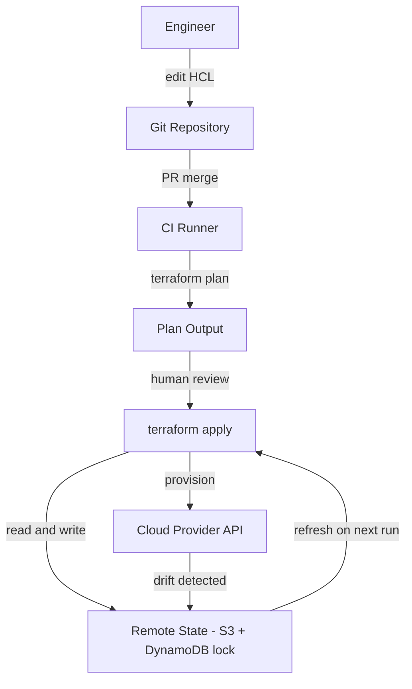
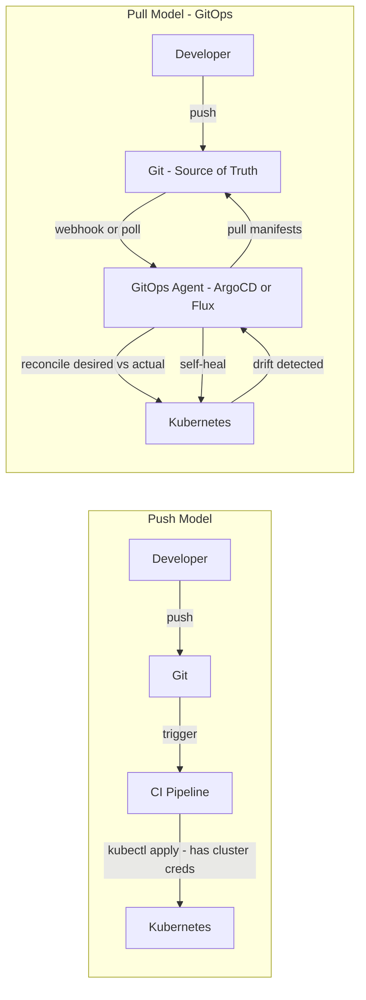
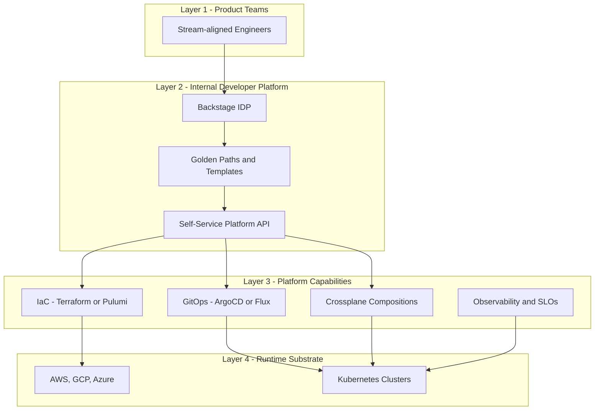

# Infrastructure / Platform Engineering

## Overview

Infrastructure / Platform Engineering is the discipline of treating infrastructure — servers, networks, databases, queues, IAM, clusters — as a software product: versioned, tested, reviewable, and deployable through the same pull-request workflow as application code. The movement has three converging forces. First, **Infrastructure as Code (IaC)** lets teams declare cloud resources programmatically. Second, **GitOps** makes Git the single source of truth and a reconcilation loop the enforcement mechanism. Third, **Platform Engineering** wraps these primitives behind a curated Internal Developer Platform (IDP) so that product teams consume infrastructure through golden paths instead of filing tickets.

Kief Morris in *Infrastructure as Code* (O'Reilly) frames the goal: *"Define your infrastructure as code, manage it through version control, and apply automated testing and deployment practices."* Skelton & Pais in *Team Topologies* add the organizational framing — a **stream-aligned team** should be able to go from idea to production without waiting on a operations team, which is only possible if a **platform team** exposes self-service capabilities with thin, well-documented interfaces.

This page synthesizes the major tool families and patterns. Per-tool deep dives live in [IaC Overview](../iac/README.md), [Terraform](../iac/terraform.md), [Ansible](../iac/ansible.md), [GitOps](../cloud/cicd/gitops.md), and [Packer](../cloud/packer.md).

## IaC Principles

| Principle | What it Means | Why it Matters |
|-----------|---------------|----------------|
| **Declarative** | Describe desired end-state, not the steps to get there | Tool computes the diff; safe re-runs |
| **Versioned** | All infra lives in Git with history and PR review | Audit trail, blame, rollback to a prior commit |
| **Idempotent** | Running the same code twice yields the same state | Eliminates "did it already run?" drift |
| **Reusable** | Modules, compositions, roles compose building blocks | DRY, consistent baselines across teams |
| **Testable** | `plan`/`diff`/`validate` before apply; policy-as-code | Catch mistakes before they hit prod |

### Mutable vs Immutable Infrastructure

| Aspect | Mutable (In-place) | Immutable (Replace) |
|--------|--------------------|---------------------|
| Update model | SSH in, run playbook | Bake new image, swap instance |
| Tools | Ansible, Chef, Puppet, Salt | Packer + Terraform, Crossplane |
| Drift risk | High — servers mutate over time | Near-zero — instances never touched |
| Rollback | Re-run old playbook (may not converge) | Launch previous image tag |
| Patch cycle | Continuous, per-server | Re-bake image, rolling replace |
| Cultural fit | Pets (long-lived, named) | Cattle (ephemeral, numbered) |

Most real systems are **hybrid**: immutable AMIs/OCI images for compute, mutable config management for long-lived stateful services (e.g., a hand-tuned Postgres primary).

## Terraform

Terraform (HashiCorp) is the dominant multi-cloud IaC tool. It uses **HCL** (HashiCorp Configuration Language), a declarative DSL, and reconciles desired state against real cloud resources through a directed acyclic graph (DAG) of dependencies.

### Core Concepts

- **Provider** — a plugin that exposes resources for a cloud (AWS, GCP, Azure, Kubernetes, Datadog, …).
- **Resource** — a single infrastructure object (`aws_instance`, `kubernetes_namespace`).
- **Data source** — read-only lookup of an existing object (latest AMI, caller identity).
- **Module** — a reusable, versioned collection of resources (a "function" for infra).
- **State** (`terraform.tfstate`) — a JSON document mapping HCL resources to real cloud IDs. This file is the source of truth that `plan` diffs against.
- **Workspace** — a named variant of the same configuration (e.g., `dev`, `staging`, `prod`) sharing one module tree but separate state files.
- **Backend** — where state is stored (S3 + DynamoDB lock, GCS, Terraform Cloud, Atlantis).

### State Flow



### Remote State Best Practices

- Store state in a **remote backend** with locking — never in Git (contains secrets and IDs).
- Enable **state encryption** at rest (S3 SSE-KMS, GCS CMEK).
- Use **separate state per environment** (`prod/`, `staging/`) — a single state file is a blast radius.
- Mark sensitive outputs with `sensitive = true`.
- Run `terraform plan` in CI on every PR; gate `apply` behind a manual approval.

### Workspaces vs Directories

| Pattern | How | Pros | Cons |
|---------|-----|------|------|
| **Workspaces** | `terraform workspace select prod` | One config, N state files | Easy to mis-target; shared backend |
| **Directory per env** | `envs/prod/`, `envs/staging/` | Hard separation; per-env tfvars | Code duplication unless modules used |
| **Terragrunt** | Thin HCL wrapper per env | DRY, explicit, supports `apply-all` | Extra tool to learn |

## Pulumi

Pulumi replaces HCL with **real programming languages** — TypeScript, Python, Go, C#, Java. The same control flow, loops, and abstraction facilities available to application code become available to infrastructure code.

```python
# pulumi_program.py — provision an S3 bucket + CDN in Python
import pulumi_aws as aws
import pulumi_awsx as awsx

bucket = aws.s3.BucketV2("static-site")
cdn = aws.cloudfront.Distribution("cdn",
    origins=[aws.cloudfront.DistributionOriginArgs(
        domain_name=bucket.bucket_regional_domain_name,
        origin_id="s3-origin",
        s3_origin_config=aws.cloudfront.DistributionOriginS3OriginConfigArgs(
            origin_access_identity="...",
        ),
    )],
    enabled=True,
    default_cache_behavior=aws.cloudfront.DistributionDefaultCacheBehaviorArgs(
        viewer_protocol_policy="redirect-to-https",
        allowed_methods=["GET", "HEAD"],
        cached_methods=["GET", "HEAD"],
        target_origin_id="s3-origin",
        forwarded_values=aws.cloudfront.DistributionDefaultCacheBehaviorForwardedValuesArgs(query_string=False),
    ),
)
pulumi.export("cdn_domain", cdn.domain_name)
```

Pulumi maintains its own state backend (Pulumi Service, self-hosted, or cloud storage) and supports **stacks** — the equivalent of Terraform workspaces but as first-class objects in code (`pulumi.stack.yaml`). The trade-off: HCL's restricted DSL is harder to misuse; a Turing-complete language can build inscrutable abstractions if discipline lapses.

## CloudFormation

AWS CloudFormation is the native AWS IaC service. Templates are JSON or YAML; the service manages a **stack** (a versioned, rollback-able unit of resources).

```yaml
# snippet — CloudFormation YAML with intrinsic functions
Resources:
  WebBucket:
    Type: AWS::S3::Bucket
    Properties:
      BucketName: !Sub "web-${AWS::Region}-${AWS::AccountId}"
      VersioningConfiguration:
        Status: Enabled
      LifecycleConfiguration:
        Rules:
          - Id: ExpireOld
            Status: Enabled
            ExpirationInDays: 90
Outputs:
  BucketArn:
    Value: !GetAtt WebBucket.Arn
```

- **Drift Detection** — CloudFormation can periodically compare the stack template against the live resources and report any out-of-band changes (the AWS console surfaces a `DRIFTED` status).
- **Nested Stacks** — compose large templates from smaller ones.
- **StackSets** — deploy a stack across many accounts and regions in one operation (enterprise multi-account pattern).
- **Change Sets** — preview exactly what `UpdateStack` will do before executing.
- **CDK** — the AWS Cloud Development Kit lets you author in TypeScript/Python/Java and synthesizes CloudFormation underneath, blending Pulumi-style ergonomics with native CloudFormation deployment.

## Comparison: IaC Tools

| Feature | Terraform | Pulumi | CloudFormation | CDK |
|---------|-----------|--------|----------------|-----|
| Language | HCL (DSL) | TS, Py, Go, C#, Java | JSON/YAML | TS, Py, Java, C# |
| Paradigm | Declarative | Imperative program | Declarative | Imperative → declarative |
| Multi-cloud | Yes (best in class) | Yes | AWS only | AWS only |
| State | Self-managed or Terraform Cloud | Pulumi Service or self-hosted | AWS-managed | AWS-managed (via CFN) |
| Drift detection | `terraform plan` diff | `pulumi refresh` | Built-in stack drift detection | Inherits from CFN |
| Native cloud integration | Provider plugins | Provider packages | First-class AWS | First-class AWS |
| Locking | Backend lock (DynamoDB, etc.) | Service concurrency | AWS-managed | AWS-managed |
| Cost | Free OSS; paid Cloud/Enterprise | Free OSS; paid Service | Free (pay for resources) | Free |

## Configuration Management

While IaC tools *provision* infrastructure (create the VM, VPC, database), **configuration management** tools *configure* the operating system and applications on already-provisioned hosts: install packages, manage files, ensure services are running. The boundary is fuzzy but the rule of thumb is *provisioning = lifecycle of the resource* and *configuration = lifecycle of the software on the resource*.

### Ansible

Agentless — uses SSH/WinRM. **Playbooks** (YAML) declare **tasks** that call **modules** (`apt`, `template`, `service`, `git`). **Roles** package tasks + vars + templates + handlers for reuse. **Inventory** lists target hosts. **Handlers** are tasks triggered only when a notifying task reports a change (e.g., restart nginx only if its config was rewritten). Modules are idempotent by design — running a playbook twice converges to the same state. (See [Ansible deep dive](../iac/ansible.md).)

### Chef

Chef uses a **master-agent** model: a Chef Infra Server distributes **cookbooks** (collections of **recipes** written in Ruby DSL) to nodes that run `chef-client` periodically. Strong Ruby heritage makes complex logic natural; the trade-off is steeper learning curve and operational overhead of running the Chef Server.

### Puppet

Puppet uses its own declarative DSL (**manifests**, grouped into **modules**). A Puppet Master compiles a **catalog** for each node based on its facts (system inventory). Agents enforce the catalog periodically. Puppet excels at large estates with role-based classification (via Hiera for data separation).

### Salt (SaltStack)

Salt uses **states** (YAML, via the `state.sls` system) executed by **minions** that communicate with a **master** over ZeroMQ. Notable for high-speed parallel execution across tens of thousands of nodes and event-driven automation (reactor system).

### Comparison: Config Management Tools

| Feature | Ansible | Chef | Puppet | Salt |
|---------|---------|------|--------|------|
| Architecture | Agentless (SSH) | Master-agent | Master-agent | Master-agent (ZeroMQ) |
| Language | YAML + Jinja2 | Ruby DSL | Puppet DSL | YAML + Python |
| Unit | Playbook / Role | Recipe / Cookbook | Manifest / Module | State / Pillar |
| Idempotency | Built into modules | By convention | Built-in | Built-in |
| Inventory | Static INI or dynamic | Chef Server | PuppetDB | Salt Mine |
| Strength | Simple, low setup | Powerful logic | Mature, classification | Speed at scale |
| Typical use | Ad-hoc + config | App deployment | Enterprise estates | Event-driven ops |

## Immutable Infrastructure

Immutable infrastructure rejects the SSH-and-patch loop entirely. Compute units — AMIs, VM images, OCI container images — are **baked** by a build pipeline and never modified post-launch. To update, you bake a new image and roll out new instances; old ones are destroyed. Benefits: deterministic deployments, no configuration drift, trivial rollback (launch previous image), and auditable artifacts.

**HashiCorp Packer** is the canonical image-builder. A Packer template (HCL2) defines a `source` (e.g., `amazon-ebs`) and one or more `provisioners` (shell, Ansible, file uploads) that run during the build. A single template can emit AMIs for multiple regions, GCE images, and Docker images in parallel.

### Image Baking Pipeline

```mermaid
graph LR
    AppCode["Application Source"] -->|push| CI["CI Build"]
    CI -->|package| Template["Packer Template"]
    Template -->|bake| Image["Versioned AMI or OCI Image"]
    Image -->|smoke test| Validate["Validation Suite"]
    Validate -->|publish| Registry["Artifact Registry"]
    Registry -->|reference| Terraform["Terraform Launches New Image"]
    Terraform -->|rolling replace| ASG["Auto Scaling Group - immutable rollout"]
```



The pipeline enforces the contract: nothing reaches production that wasn't built from a reviewed commit and tested as an artifact. Stateful systems (databases, caches with warm data) typically *cannot* be made fully immutable and rely on config management + backups instead.

## GitOps

GitOps (coined by Weaveworks) applies DevOps source-control practices to infrastructure: Git is the single source of truth, and an in-cluster agent **pulls** the desired state and continuously reconciles it against the live cluster. The four principles are **declarative**, **versioned and immutable**, **pulled automatically**, and **continuously reconciled** (drift detection).

### Pull vs Push Deployment



### GitOps vs Traditional Push Deployment

| Aspect | Push (CI/CD) | Pull (GitOps) |
|--------|--------------|---------------|
| Source of truth | Pipeline + scripts | Git repository |
| Direction | CI pushes to cluster | Agent in cluster pulls from Git |
| Cluster credentials | CI needs kubeconfig | Agent runs in-cluster; no inbound creds |
| Drift detection | Manual / custom | Built-in reconciliation loop |
| Rollback | Re-run old pipeline | `git revert` → agent re-applies |
| Audit trail | Pipeline logs (ephemeral) | Git history (durable, signed) |
| Multi-cluster | Each cluster needs CI access | One repo, N agents |
| Security surface | CI has prod push rights | CI has no cluster rights at all |

### ArgoCD vs Flux

| Feature | ArgoCD | Flux |
|---------|--------|------|
| UI | Rich web UI + CLI | CLI-first (Weave GitOps adds UI) |
| Architecture | Centralized server | Distributed controllers |
| Multi-tenancy | Projects + RBAC | Namespaced controllers |
| Helm | Native | `HelmRelease` CRD |
| Kustomize | Native | `Kustomization` CRD |
| SSO | Built-in (Dex, OIDC) | External |
| CNCF status | Graduated | Graduated |

Both tools (and the broader GitOps pattern) are covered in depth in [GitOps](../cloud/cicd/gitops.md).

## Platform Engineering

**Platform Engineering** is the discipline of building an Internal Developer Platform (IDP) that presents product teams with a curated, opinionated set of self-service capabilities — so they can build, deploy, and operate software without filing tickets or learning every underlying tool. Skelton & Pais (*Team Topologies*) describe the platform team as one of the four fundamental team types, interacting with stream-aligned teams via a **thin, documented, versioned platform interface**.

The most important idea is the **golden path**: a supported, paved-road template for a common workload (e.g., "a stateless Go microservice with gRPC, Prometheus metrics, and ArgoCD deployment"). Golden paths reduce cognitive load, encode organizational standards by default, and make compliance a side effect rather than a gate.

### Platform Layers



The platform team owns Layer 2 and Layer 3 as a **product** — with its own roadmap, user research, versioning, and deprecation policy. A common failure mode is to build an IDP without treating it as a product, leading to low adoption and "shadow IT" returning.

## Backstage

**Backstage** (open-sourced by Spotify in 2020, now CNCF Incubating) is the leading IDP framework. It is a React frontend + Node backend organized around three pillars:

1. **Service Catalog** — a single registry of all software (services, websites, libraries, data pipelines, ML models). Each entity has a YAML descriptor (`catalog-info.yaml`) stored alongside its source, imported into Backstage via integrations. The catalog answers "who owns this?", "where does it run?", "what does it depend on?".
2. **Software Templates** — scaffolding generators (`create-react-app`-style but for whole services) that produce a new repo with CI, Dockerfile, Helm chart, and catalog-info pre-wired. Templates encode golden paths.
3. **TechDocs** — a documentation publishing pipeline: Markdown in the repo is transformed (MkDocs + plugins) into a searchable, side-by-side-with-the-service docs site inside Backstage.

Plugins extend Backstage for ArgoCD, GitHub, Sentry, PagerDuty, Kubernetes, and Terraform — letting engineers see deployment status, incidents, and metrics without context-switching.

## Crossplane

**Crossplane** is a CNCF project that turns Kubernetes into a **control plane for everything**. It extends the Kubernetes API with **Custom Resource Definitions (CRDs)** for cloud resources (`RDSInstance`, `S3Bucket`, `Vpc`) and a controller that reconciles them against cloud provider APIs — Terraform-style provisioning, but the API server is Kubernetes.

```yaml
# A Postgres instance provisioned via Crossplane composition
apiVersion: aws.platform.example.org/v1alpha1
kind: AppPostgres
metadata:
  name: orders-db
  namespace: orders
spec:
  writeConnectionSecretToRef:
    name: orders-db-conn
  parameters:
    storageGB: 50
    multiAZ: true
    backupRetentionDays: 14
```

Key concepts:

- **Managed Resource (MR)** — a 1:1 mapping to a cloud resource (e.g., `Bucket`).
- **Composite Resource (XR)** — a higher-level, opinionated abstraction that creates many MRs (a "Postgres + networking + secrets" bundle).
- **Composition** — the template that maps XR inputs to MRs.
- **Provider Config** — credentials and connection details for a cloud provider.

Crossplane's appeal is **unification**: infrastructure and applications are declared in the same cluster API, gated by the same RBAC, audited by the same `kubectl`, and reconciled by the same controller pattern. The cost is that you have now made Kubernetes your infra control plane — a significant operational commitment.

## Comparison: IDP / Platform Frameworks

| Framework | Origin | Model | Strength |
|-----------|--------|-------|----------|
| **Backstage** | Spotify (2020), CNCF Incubating | React frontend + plugin ecosystem | Catalog, templates, TechDocs; huge plugin ecosystem |
| **Humanitec** | Commercial | Platform Orchestrator (Resource Graph) | Dynamic resource matching, score-based config |
| **Port** | Commercial | Builder-based portal + RBAC | No-code portal builder, microservices adoption |
| **OpsLevel** | Commercial | Service maturity + catalog | Maturity scorecards, service health |
| **Cortex** | Commercial | Catalog + initiatives | Compliance + initiative tracking |
| **Custom (Crossplane + ArgoCD + Internal portal)** | DIY | Kubernetes-native | Maximum flexibility, no SaaS dependency |

## Infrastructure Patterns

These patterns describe how to safely *deploy infrastructure changes* (in addition to application changes — see [Canary Releases](./canary-releases.md) for application-layer progressive delivery).

### Blue-Green Infrastructure

Two identical environments — Blue and Green — each a complete Terraform workspace. Traffic is switched at the DNS or load-balancer layer. Rollback is a traffic switch back; teardown of the old env is deferred until confidence is high.

| Aspect | Detail |
|--------|--------|
| Cost | 2× infrastructure during cutover |
| Rollback speed | Seconds (DNS or LB switch) |
| Best for | Database migrations, infra rewrites |
| Risk | Data divergence between Blue and Green on shared stateful resources |

### Canary Infrastructure

Stand up a small parallel stack (e.g., new VPC + EKS cluster + node pools at 5% of capacity), route a fraction of traffic to it, observe, then progressively shift traffic and tear down the old stack. Distinct from application canary (which rolls a Deployment inside one cluster) — infra canary rolls out the *platform* itself.

### Terraform Workspace Promotion

A common pattern for environment promotion:

```
modules/             # reusable building blocks
  vpc/
  eks/
  rds/
envs/
  dev/               # workspace: dev
  staging/           # workspace: staging
  prod/              # workspace: prod
```

Each env directory consumes the same modules with env-specific `tfvars`. Promotion = `terraform plan` against the next env after PR approval, then `apply`. State is fully isolated per env; a mistake in `dev` cannot touch `prod`.

## Anti-Patterns

1. **Manually editing resources** created by IaC — guarantees drift on the next `plan`.
2. **Storing state in Git** — exposes secrets and IDs, breaks locking.
3. **Single Terraform state for all envs** — one typo takes down prod.
4. **Push-based CI to clusters** with long-lived admin kubeconfigs — bypasses GitOps audit.
5. **Golden path with no maintainer** — paved road grows weeds and is abandoned.
6. **Baking secrets into images** — use runtime secret injection (Vault, External Secrets).

## Interview Questions

1. **Compare Terraform and Pulumi. When would you choose each?**
   Terraform uses HCL (a restricted DSL) and excels for teams that want a declarative, hard-to-misuse tool with the largest provider ecosystem. Pulumi uses real languages (TS, Python, Go) and wins when infra logic needs loops, conditionals, or shared libraries that HCL expresses awkwardly. Choose Terraform for broad multi-cloud coverage and conservative governance; choose Pulumi when your infra team is comfortable in code and wants to share modules with application code.

2. **What is Terraform state and why is it controversial?**
   State is the JSON mapping between HCL resources and real cloud IDs; without it, `plan` cannot compute a diff. The controversy: state is a single point of failure, can contain secrets, and must be locked to prevent concurrent `apply`. Best practice is remote state with locking (S3 + DynamoDB, Terraform Cloud, Atlantis) — never commit it to Git. Alternatives like Pulumi Service and CloudFormation (AWS-managed state) remove the operational burden at the cost of vendor coupling.

3. **Explain the GitOps pull model and its security advantages.**
   In the pull model, an agent (ArgoCD, Flux) runs **inside** the target cluster and polls Git for desired state, reconciling drift on each cycle. CI never needs cluster credentials — it only updates the GitOps repo. This shrinks the attack surface (no inbound cluster access), makes Git the durable audit trail, and makes rollback a `git revert`. Drift detection and self-heal become a built-in property rather than custom scripting.

4. **When is immutable infrastructure not appropriate?**
   Stateful systems whose data cannot be rebuilt — a primary Postgres database with terabytes of warm data, an Elasticsearch cluster with shard rebalancing costs, or a long-lived cache that warms over days — are poor fits. Immutable infrastructure works best for stateless compute and disposable data layers. For stateful services, combine immutable base images with config management for runtime concerns and rely on backups + replication for resilience.

5. **What is platform engineering, and how does it differ from DevOps?**
   Platform engineering is the deliberate construction of an Internal Developer Platform as a product, with golden paths and self-service APIs consumed by stream-aligned teams. DevOps is a cultural movement emphasizing collaboration and shared ownership. Platform engineering *operationalizes* DevOps by providing the substrate (catalog, templates, IaC, GitOps) that makes self-service real — rather than asking every team to be experts in every tool.

6. **How does Crossplane differ from Terraform?**
   Both provision cloud resources declaratively. Terraform runs as an external CLI that talks to cloud APIs and stores state externally; Crossplane runs as a controller inside Kubernetes, exposing cloud resources as CRDs that `kubectl` can manage. Crossplane unifies the API surface for application + infra engineers and benefits from Kubernetes RBAC, admission controllers, and GitOps tooling — at the cost of making Kubernetes your infra control plane and a deep CRD model to learn.

7. **How would you safely refactor a Terraform module used by 50 services?**
   Step 1: add the new module alongside the old (don't replace). Step 2: write a `moved` block or use `terraform state mv` to remap resources without destroy/create. Step 3: migrate one service at a time, starting with the lowest-traffic one, verifying `plan` shows zero diffs before `apply`. Step 4: once all services have migrated, deprecate and remove the old module in a final PR. Throughout, keep state isolated per service so a refactor mistake cannot cascade.

8. **Design a platform that lets a product team create a new microservice end-to-end without infra team involvement.**
   A Backstage Software Template scaffolds a repo with Dockerfile, Helm chart, ArgoCD `Application`, and `catalog-info.yaml`. On merge, ArgoCD deploys to a shared multi-tenant EKS cluster. Crossplane Compositions give the team a CRD to request a database (RDS instance provisioned on demand) and a DNS name. OPA/Gatekeeper enforces pod security and label standards at admission. Backstage surfaces deployment status, SLOs, and on-call owner. The platform team owns Backstage, the cluster baseline, and the Crossplane compositions as a versioned product; the product team never touches Terraform or kubectl.

## Key Takeaways

- IaC turns cloud resources into a version-controlled, reviewable, idempotent software product — declarative is the dominant style, but Pulumi/CDK show that real languages are viable.
- Configuration management (Ansible, Chef, Puppet, Salt) complements IaC by configuring the OS; Ansible's agentless model dominates for new projects.
- Immutable infrastructure via Packer eliminates drift at the cost of a build pipeline and a harder stateful-systems story.
- GitOps makes Git the source of truth and replaces push-based CI-to-cluster deployment with an in-cluster reconciler — better security, audit, and rollback.
- Platform engineering treats the IDP as a product: Backstage for the portal, golden paths for the developer experience, and Crossplane/Terraform/ArgoCD underneath.
- Crossplane unifies infra and application management inside Kubernetes — powerful, but a significant operational commitment. The platform team's job is to *enable* stream-aligned teams, not to operate their infrastructure.

## References

- HashiCorp, *Terraform Documentation* — https://developer.hashicorp.com/terraform/docs
- Pulumi Corporation, *Pulumi Documentation* — https://www.pulumi.com/docs/
- AWS, *AWS CloudFormation User Guide* — https://docs.aws.amazon.com/cloudformation/
- Ansible, *Ansible Documentation* — https://docs.ansible.com/
- Kief Morris, *Infrastructure as Code: Managing Servers in the Cloud* (O'Reilly, 2nd ed.)
- Spotify Backstage, *Backstage Documentation* — https://backstage.io/docs/
- Crossplane, *Crossplane Documentation* — https://docs.crossplane.io/
- Matthew Skelton and Manuel Pais, *Team Topologies: Organizing Business and Technology Teams for Fast Flow* (IT Revolution, 2019)

## Cross-References

- [IaC Overview](../iac/README.md) — Imperative vs declarative, mutable vs immutable
- [Terraform](../iac/terraform.md) — HCL, state, modules, drift detection
- [Ansible](../iac/ansible.md) — Playbooks, roles, idempotency
- [GitOps](../cloud/cicd/gitops.md) — ArgoCD, Flux, Kustomize, secret management
- [Packer](../cloud/packer.md) — Immutable machine image baking
- [Kubernetes Deployments](../cloud/kubernetes/deployments.md) — What GitOps deploys
- [Kubernetes Operators](../cloud/kubernetes/operators.md) — Controller pattern that Crossplane extends
- [Canary Releases](./canary-releases.md) — Progressive delivery for application changes
- [Multi-Region Architecture](./multi-region.md) — Pattern where infra-as-code multiplies
- [Reliability Patterns](./reliability-patterns.md) — How platform capabilities protect reliability
- [SRE Overview](./README.md) — Where platform engineering meets SRE toil reduction
