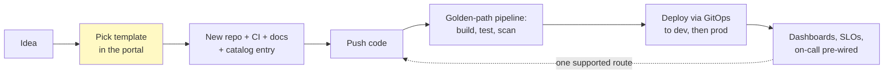
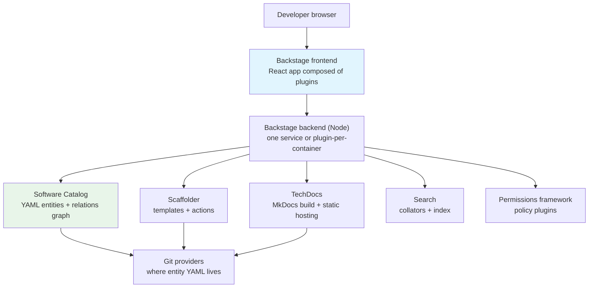
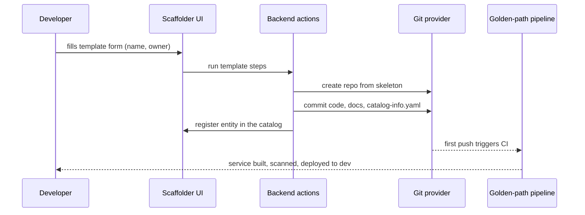

# Internal Developer Platforms & Backstage

## Overview

As engineering organizations grow past a few teams, every team re-solves the same problems: how to scaffold a service, wire CI/CD, provision a database, get TLS, find who owns the service that keeps paging them, and remember which of the seventeen dashboards is the real one. Each of these is a small cognitive tax — and the taxes compound into **cognitive load** that slows every feature. An **Internal Developer Platform (IDP)** attacks this by treating infrastructure as a **product** whose users are internal developers: a dedicated **platform team** builds self-service capabilities, and product teams consume them through **golden paths** — the pre-approved, fully-wired way to go from code to production — instead of filing tickets.

The most popular open-source building block for the *portal* layer of an IDP is **[Backstage](https://backstage.io/)**, created at Spotify and donated to the CNCF ([source](https://github.com/backstage/backstage)). It gives you a service catalog, scaffolding templates, docs-as-code, search, and a plugin ecosystem — but Backstage alone is *not* an IDP; it is the front door. The platform behind the door (the pipelines, environments, policies) is what you still have to build — see the broader discipline in [Infrastructure / Platform Engineering](./infrastructure-platform-engineering.md).

## Detailed Explanation

### The Problem: Cognitive Load and the Golden Path

A developer in a 200-engineer company typically needs to hold in their head: Kubernetes manifests, CI YAML, three cloud consoles, a legacy deploy script, and tribal knowledge about service dependencies. Manual ("we'll build your infra for you") and laissez-faire ("here is raw Kubernetes, good luck") models both fail at scale. The middle path is the **golden path** (Spotify's term for a **paved road**): one supported, documented, automated route that covers ~80% of use cases — deviating is possible, but you own the consequences. The **platform-as-product** mindset means the platform team treats developers as customers: they gather requirements, ship releases, measure adoption, and can be fired (i.e., teams route around them) if the product is worse than the ticket queue.

### Terminology Map

The vocabulary is a minefield in interviews; this is the Team Topologies-aligned framing ([Team Topologies](https://teamtopologies.com/)):

| Term | What it means | Analogy |
|---|---|---|
| **Platform engineering** | The *discipline/team* that builds and operates the platform as a product | The product team behind the tool |
| **Internal Developer Platform (IDP)** | The whole set of capabilities — CI/CD, environments, observability, policies — plus the self-service layer on top | The product itself |
| **Portal** | The UI/API surface over the platform: catalog, templates, docs (Backstage is a portal) | The storefront |
| **Golden path / paved road** | The pre-supported, batteries-included route to production | The recommended aisle through the store |
| **Platform team** (Team Topologies) | A *platform team* builds capabilities consumed mostly by other engineers | — |
| **Stream-aligned team** (Team Topologies) | The value-delivering team that should ship without intermediaries | The customer |
| **Enabling team** (Team Topologies) | A coaching team that builds capability in others, not deliverables | Consultants |

Key distinction: the platform team's customers are engineers, and their product metric is **adoption**, not uptime alone.

### Anatomy of a Golden Path



Every hop above used to be a ticket or a tribal ritual. The path is *golden*, not mandatory: teams can leave it, but then they inherit the operational burden the platform normally absorbs — that is the deal.

### Backstage Architecture

Backstage is not one app — it is a **plugin-based React + Node monorepo** you assemble into your own portal. There is no official hosted Backstage: you always own a build (the [docs](https://backstage.io/docs) are the map for that assembly).



- **Frontend plugins** — React components registered into the app (a CI status card, a catalog page, a cost dashboard). The "New Frontend System" made plugins composable without deep app surgery.
- **Backend plugins** — Node/Express routers providing the plugin APIs (catalog ingestion, scaffolder actions, TechDocs builds). Organizations add **custom actions** and **custom processors** as their own backend plugins.
- **Software catalog** — the heart: a graph of YAML entities ingested from Git (via discovery providers/processors), stored and indexed by the catalog plugin.
- **Scaffolder** — runs software templates: form → steps → new repo + CI + catalog registration.
- **TechDocs** — docs-as-code: MkDocs files next to the code, built by the TechDocs backend, served in-context.
- **Search** — pluggable collators index catalog entities, TechDocs, and anything else.
- **Permissions** — a framework where policy plugins decide who can see/do what (no built-in RBAC in OSS; that's a frequent gap organizations fill).

### The Entity Model

Everything in the catalog is an **entity** — a YAML file (usually `catalog-info.yaml`) committed beside the code, describing `kind`, `metadata`, and `spec`. The common kinds:

| Kind | Represents |
|---|---|
| `Component` | A piece of software: service, website, library |
| `API` | A contract (OpenAPI, gRPC, GraphQL) a component provides |
| `Resource` | Infrastructure it depends on: database, queue, cluster |
| `System` | A group of components/resources delivering one capability |
| `Domain` | A business domain grouping related systems |
| `Group` | A team or org unit that can own entities |
| `User` | A person |
| `Template` | A Scaffolder software template |
| `Location` | A pointer that ingests many entities at once |

```yaml
apiVersion: backstage.io/v1alpha1
kind: Component
metadata:
  name: payments-service
  title: Payments Service
  tags: [java, payments]
  annotations:
    github.com/project-slug: acme/payments-service
    backstage.io/techdocs-ref: dir:.
spec:
  type: service            # website | library | service ...
  lifecycle: production   # experimental | production | deprecated
  owner: team-payments    # -> Group entity
  system: billing         # -> System entity
  providesApis: [payments-api]   # -> API entity
  dependsOn: [resource:orders-db]
```

From these files Backstage derives a **relations graph** — `ownedBy` / `ownerOf`, `partOf` / `hasPart`, `providesApi` / `apiProvidedBy`, `dependsOn` / `dependencyOf` — which powers dependency views, blast-radius analysis during incidents ("what breaks if this resource goes down?"), and ownership routing for alerts and TechDocs. The catalog is deliberately **descriptive**: it does not deploy anything; it is the index that makes everything else findable.

### Scaffolder: Templates and Actions

A `Template` entity defines a form (parameters), steps (actions), and outputs. Built-in actions include `fetch:template` (render a cookiecutter-style skeleton), `publish:github` (create the repo), and `catalog:register` (add the new component to the catalog). Platforms add custom actions (e.g., provision a database via Terraform, register in PagerDuty) as backend plugins:

```yaml
apiVersion: scaffolder.backstage.io/v1beta3
kind: Template
metadata:
  name: spring-service
  title: Golden Path - Spring Boot Service
spec:
  owner: platform-team
  parameters:
    - title: Service details
      properties:
        name: { type: string, title: Service name }
        owner: { type: string, title: Owning team, ui:field: OwnerPicker }
  steps:
    - id: fetch
      action: fetch:template
      input: { url: ./skeleton, values: { name: ${{ parameters.name }} } }
    - id: publish
      action: publish:github
      input: { repoUrl: ${{ parameters.repoUrl }}, description: ${{ parameters.name }} }
    - id: register
      action: catalog:register
      input: { repoContentsUrl: ${{ steps.publish.output.repoContentsUrl }} }
```

The payoff: a new service goes from "an idea + a Jira ticket + two weeks of setup" to "running in production behind the golden path in under an hour, with CI, dashboards, docs, and ownership pre-wired."



### TechDocs, Search, Permissions in Practice

- **TechDocs** works because docs live *next to code*: an `mkdocs.yml` plus Markdown in the repo, referenced by the `backstage.io/techdocs-ref` annotation. The TechDocs backend builds the site (locally or CI-side) and publishes static files. The discipline payoff is real: docs get PR-reviewed, versioned, and found where you already look things up.
- **Search** runs as collators (catalog, TechDocs, custom) feeding an index, exposed through a frontend search bar — the "Ctrl+K of the company."
- **Permissions** is a framework, not a product: you write a policy plugin (e.g., "only the owning group can register entities in the production domain"). Most orgs under-invest here, then wonder why executives see everything.

### What Backstage Does *Not* Do

Backstage is the portal — the parts behind it are still yours to build, and that is where most of the work hides:

| Capability | What the platform must add behind the portal |
|---|---|
| Build & deploy | The CI/CD that Scaffolder-generated repos target (e.g., [Argo CD](../cloud/cicd/argocd.md) on a [GitOps](../cloud/cicd/gitops.md) loop) |
| Environments | Namespace/cluster provisioning, config, secrets management |
| Guardrails | Policy-as-code, admission control, security scanning |
| Observability | Dashboards, alert routes, SLO scaffolding per service |
| Infrastructure | The [IaC](../iac/README.md) that provisions what templates ask for |

A portal with an empty table behind it is the single most common IDP failure mode.

### Build vs Adopt

| Option | What you get | Cost / risk |
|---|---|---|
| **OSS Backstage** | Full control, huge plugin ecosystem, CNCF governance | You own a Node/React app forever — real engineering (Spotify has a large team on it) |
| **Spotify's internal model** | Backstage plus their backend platform (portal + paved road) | Not for sale as a whole; a proof the model scales to 2,000+ engineers |
| **Commercial SaaS portals** (Roadie, Cortex, Port, OpsLevel — name-level only) | Hosted Backstage-style portal or scorecard product; faster start | Less customization; per-seat cost; data leaves your perimeter |

Rule of thumb heard in interviews: **Backstage is a (large) head start, not a shortcut.** Budget a dedicated team of 3–6 engineers for a year before most organizations get real adoption. If you have fewer than ~50 engineers, a wiki + templates + CI defaults may beat a portal.

### Adoption Reality

- **Maintenance cost of a portal.** Backstage is a product you must staff, upgrade (plugin API churn has historically been significant), and secure. The graveyard of failed IDPs is full of portals built for a mandate, then abandoned when the founding engineer left.
- **Plugin sprawl.** Every team wants a plugin; soon the portal has 60 half-maintained ones, inconsistent UX, and a slow build. Governance (a plugin review process, shared design system, deprecated-plugin policy) is as important as the code.
- **Catalog drift.** Entities rot: owners leave, annotations point to deleted repos, dependencies go stale. Countermeasures: automated ingestion (generate entities from repos/CI), ownership checks (a component with no valid owner fails a check), scorecards, and pruning unmaintained entities.
- **Scorecards / maturity models.** Products like Cortex/Spotify's Tech Insights score services on production-readiness (on-call set? SLOs defined? tests? security scans?). Maturity frameworks (CMM-style levels, e.g., 1 = manual/absent → 5 = optimized/self-service everywhere) give leadership a language for where the platform is and what to invest in next — never let the score become the goal.

### Platform Engineering Metrics

Measure the platform like a product, not a project. Two families:

1. **Delivery outcomes** — the DORA four: deployment frequency, lead time for changes, change failure rate, time to restore. A good IDP should move these; if you can't show DORA movement, the golden path is decoration. (Cross-ref: [DORA Metrics](../software-engineering/metrics.md) has the full definitions and performance tiers; current research lives at [dora.dev](https://dora.dev/).)
2. **Platform-specific** — adoption (% of services on the golden path), **time-to-first-deploy** for a new service (the classic onboarding metric), ticket volume eliminated, golden-path deviation rate, developer satisfaction/NPS, and portal reliability (it is now production infrastructure — give it [SLOs](./slo-error-budget.md) like any other system).

### The Kubernetes Operator Analogy

A useful framing for interviews: a **platform team behaves like a [Kubernetes operator](../cloud/kubernetes/operator-pattern.md)** for developer experience. The platform publishes a **declarative desired state** (golden paths, standards, scorecard criteria). Developers' actual behavior is the **observed state**. The platform continuously **reconciles**: automation nudges non-compliant services (auto-generated tickets, scorecard badges, bots opening PRs), templates and defaults evolve, and drift is corrected — with humans only handling exceptions. A team that only *answers tickets* is a manual controller; a team that encodes its answers into self-service automation is a real platform team.

### Common Mistakes

- ❌ **Buying Backstage instead of building a platform** — a catalog with nothing behind it is a company wiki with extra steps.
- ❌ **Mandating adoption** — portals die when they're a compliance tool; win by making the golden path genuinely the fastest route.
- ❌ **Boiling the ocean in v1** — shipping catalog + templates + docs + scorecards + search at once; start with the catalog and one template.
- ❌ **No dedicated team** — 10% of a platform engineer's time produces an abandoned portal.
- ❌ **Ignoring catalog drift** until executives quote stale ownership in an incident review.
- ❌ **Measuring portal uptime but not developer outcomes** — you will maintain a very reliable, very unused product.
- ❌ **Golden paths without an exit** — the path must not be a cage; documented deviation keeps trust.

## Summary

IDPs exist to move cognitive load from a thousand product engineers onto one platform team that automates it. The vocabulary matters: platform engineering is the discipline, the IDP is the product, the portal (often Backstage) is the interface, and golden paths are the recommended route. Backstage contributes the catalog (a YAML entity graph with ownership and dependencies), the Scaffolder (templates that create fully-wired services), TechDocs (docs-as-code), search, and a plugin ecosystem — but success is decided by adoption, maintenance staffing, and whether DORA and developer-experience metrics actually move. Build the platform like a product, measure it like one, and let the operator-style reconcile loop — not tickets — keep the estate compliant.

## Cross-References

- [Infrastructure / Platform Engineering](./infrastructure-platform-engineering.md) — the broader IaC/GitOps discipline the portal sits on
- [DORA Metrics](../software-engineering/metrics.md) — the delivery metrics platforms should move
- [GitOps](../cloud/cicd/gitops.md) — the reconciliation pattern most golden paths are built on
- [Argo CD](../cloud/cicd/argocd.md) — the deploy-side engine commonly exposed through an IDP
- [Kubernetes Operator Pattern](../cloud/kubernetes/operator-pattern.md) — the controller analogy for platform teams
- [IaC Overview](../iac/README.md) — Terraform/Ansible underneath the self-service layer
- [Feature Flags](./feature-flags.md) — a platform capability commonly surfaced via the portal
- [SLOs and Error Budgets](./slo-error-budget.md) — treat your portal as a product with an SLO

## Interview Questions

**Q1: What problem does an internal developer platform solve, and when is it the wrong investment?**
**Answer:** It solves cognitive load: in a growing org, every team re-solves scaffolding, CI/CD, environments, and observability, and the accumulated context-switching slows delivery and increases incidents. An IDP centralizes those capabilities as a self-service product with golden paths, so a stream-aligned team ships without tickets. It's the wrong investment when the org is small (under ~50 engineers, a wiki and templates suffice), when there's no dedicated platform team to maintain it, or when infrastructure is still so unstable that automating the portal would just productize chaos — stabilize first, portal second.

**Q2: Explain the terms IDP, portal, platform engineering, and golden path — how do they relate?**
**Answer:** Platform engineering is the discipline (and team) of building infrastructure as a product for internal customers. The IDP is the product itself: the full set of self-service capabilities (build, deploy, environments, observability, policies). The portal is the interface layer over the platform — catalog, templates, docs — and Backstage is the leading open-source portal. The golden path (or paved road) is the pre-supported route through that platform: one templated, compliant, automated way to go from code to production. So: the platform team builds the IDP, developers meet it through the portal, and golden paths are the recommended highway on it.

**Q3: Walk me through Backstage's architecture. What are plugins, and why did Spotify build it that way?**
**Answer:** Backstage is a React frontend plus Node backend assembled from plugins. Frontend plugins contribute UI (catalog pages, CI cards); backend plugins contribute APIs and integrations (catalog ingestion processors, Scaffolder actions, TechDocs builds). The core plugins are: the software catalog (a graph of YAML entities from Git), Scaffolder (software templates), TechDocs (MkDocs docs-as-code), search, and a permissions framework. Spotify built it plugin-first because every team wanted different integrations — plugins let orgs compose their own portal and share contributions, which is why it open-sourced the framework rather than the full product.

**Q4: Describe the catalog entity model. What problem does the relations graph solve?**
**Answer:** Every entity is a YAML file in Git with apiVersion, kind, metadata, and spec — kinds include Component, API, Resource, System, Domain, Group, User, and Template. Backstage parses them into a relations graph: ownedBy/ownerOf, partOf/hasPart, providesApi/apiProvidedBy, dependsOn/dependencyOf. That graph turns "who owns this service?" and "what breaks if this database dies?" into queries instead of Slack archaeology — it routes incidents, powers dependency maps and blast-radius analysis, and gives scorecards something to grade. The catalog is descriptive, not executable: it indexes reality, it doesn't deploy.

**Q5: Build vs buy for the portal: OSS Backstage, a SaaS portal, or roll your own?**
**Answer:** Decide with team size and maintenance appetite. OSS Backstage gives maximum control and the biggest ecosystem, but you must staff it — a realistic golden-path program needs a dedicated 3–6 person team for a year, and plugin upgrades never stop. SaaS portals (Roadie/Cortex/Port/OpsLevel class) get you a hosted catalog, scorecards, and templates quickly at per-seat cost with less customization and data leaving your perimeter. Rolling your own is almost always wrong — you'd rebuild a worse Backstage. Small orgs: skip the portal entirely. Large orgs with platform staffing: Backstage; large orgs without: hosted.

**Q6: Your Backstage catalog is six months old and half the ownership fields are stale. What went wrong and what do you do?**
**Answer:** The catalog was treated as a one-time migration instead of a living index. Fixes: (1) automate ingestion — generate/update entities from repo metadata, CODEOWNERS, and CI rather than trusting hand-written YAML; (2) make validity a check — components with dead annotations or missing owners fail a scorecard gate or a CI check; (3) assign a data owner per domain and prune unowned entities rather than letting them lie; (4) connect the graph to something people value daily (incident routing, docs) so keeping it accurate is self-interested, not a favor to the platform team.

**Q7: How do you measure whether a platform team is succeeding?**
**Answer:** Like a product. Outcome metrics: the DORA four — deployment frequency, lead time for changes, change failure rate, time to restore — must move in the right direction for teams on the golden path. Platform metrics: adoption (% of services on the paved road), time-to-first-deploy for a new service (the onboarding classic), tickets eliminated, deviation rate, and developer satisfaction/NPS. Operational health: the portal itself gets SLOs because it's now production infrastructure. Leading with adoption plus time-to-first-deploy is the honest combo — they show people actually chose the platform and it made them faster.

**Q8: An interviewer asks: "How would you bootstrap a platform team from scratch?" Walk through your first year.**
**Answer:** First, earn the mandate: interview 10–20 engineers, quantify the pain (time to provision a service, tickets, onboarding weeks) and get sponsorship tied to DORA improvement. Second, staff it as a product team — engineers, not an ops queue — and pick a beachhead: one golden path (e.g., the standard service template wiring repo + CI + deploy + dashboards) and the catalog that makes services findable. Third, ship thin and measure: get five real teams onto the path, instrument adoption and time-to-first-deploy, and iterate on feedback like any PM. Fourth, expand breadth (TechDocs, scorecards, more templates) only after the beachhead is loved. Throughout, run operator-style: encode standards as automated checks and bots, not tickets — the goal is a reconcile loop for developer experience, with a roadmap reviewed against the maturity model each quarter.
