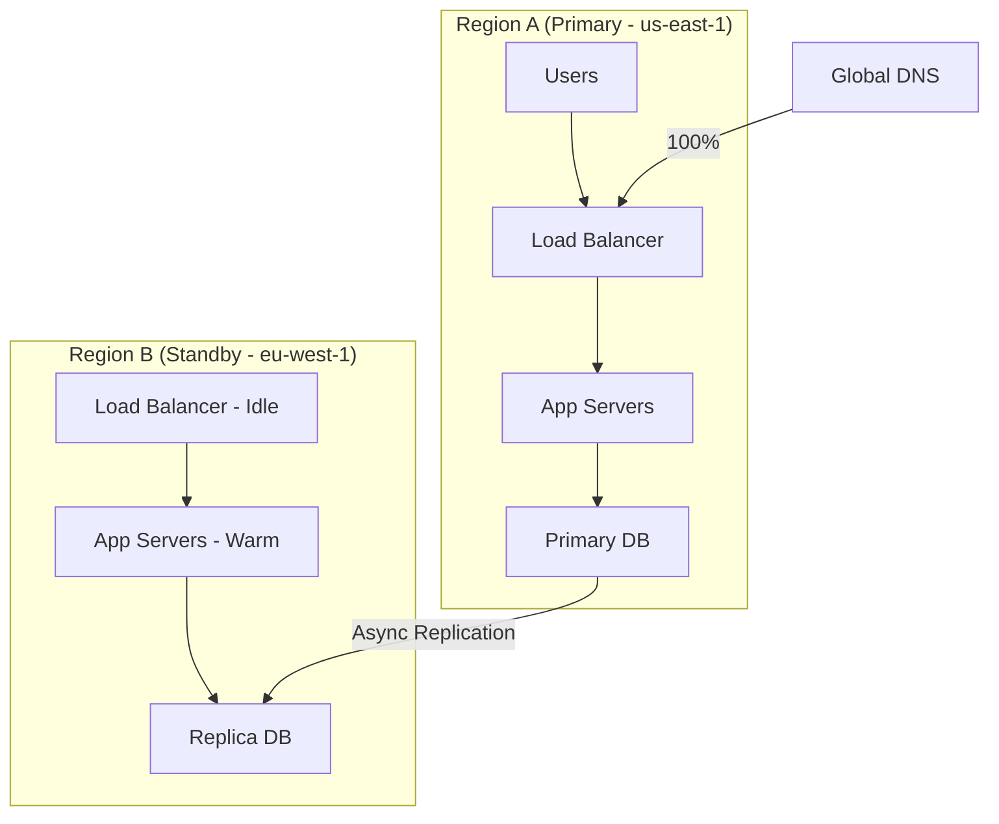
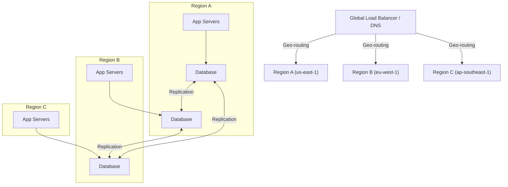
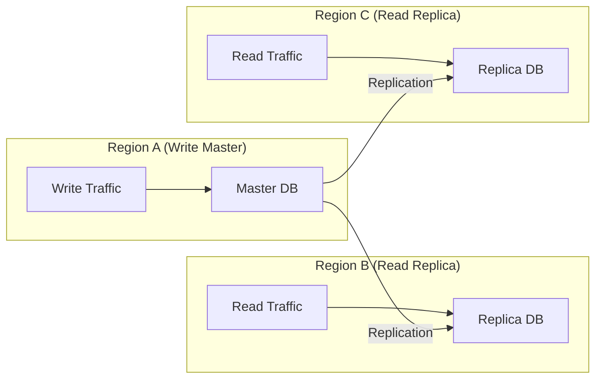

# Multi-Region Architecture

## Overview

Multi-region architecture distributes an application across two or more geographic regions to achieve higher availability, lower latency for global users, and disaster recovery capability. A well-designed multi-region system can survive the complete loss of an entire data center or cloud region with minimal user impact.

## Why Multi-Region?

| Single Region | Multi-Region |
|---------------|-------------|
| Region outage = total downtime | Region outage = failover to another |
| High latency for distant users | Low latency (serve from nearest region) |
| Data residency may violate compliance | Data stays in required jurisdictions |
| Single blast radius | Failures contained to one region |

## Architecture Patterns

### Pattern 1: Active-Passive (Warm Standby)



| Aspect | Details |
|--------|--------|
| **Traffic** | 100% to primary; standby receives no user traffic |
| **Failover** | DNS update to point to standby (minutes) |
| **RPO** | Seconds to minutes (async replication) |
| **Cost** | Lower (standby can be smaller) |
| **Complexity** | Medium |
| **Risk** | Standby may not handle full production load |

### Pattern 2: Active-Active



| Aspect | Details |
|--------|--------|
| **Traffic** | Distributed across all regions |
| **Failover** | Automatic (traffic routes away from failed region) |
| **RPO** | Near-zero (sync or async with conflict resolution) |
| **Cost** | Higher (full capacity in each region) |
| **Complexity** | High (conflict resolution, data consistency) |
| **Risk** | Data conflicts, split-brain scenarios |

### Pattern 3: Active-Active with Single Master

A common pragmatic approach: traffic is active in all regions, but writes go to a designated master region.



## Key Components

### Global Traffic Management

| Component | Options | Role |
|-----------|---------|------|
| **DNS** | Route 53, Cloudflare, Google Cloud DNS | Geo-routing, health checks, failover |
| **CDN** | CloudFront, Cloudflare, Fastly | Static content, edge caching |
| **Global LB** | AWS Global Accelerator, GCP Global LB | Anycast, regional health checks |

### Routing Strategies

| Strategy | Mechanism | Use Case |
|----------|-----------|----------|
| **Geolocation** | Route to nearest region | Latency optimization |
| **Latency-based** | Measure RTT, route to fastest | Dynamic latency optimization |
| **Weighted** | % split across regions | Gradual traffic migration |
| **Health-based** | Avoid unhealthy regions | Failover |

### Data Replication

| Technology | Consistency | Latency | Use Case |
|------------|-------------|---------|----------|
| **Synchronous** | Strong | High | Financial data, ordering |
| **Asynchronous** | Eventual | Low | Social feeds, analytics |
| **Multi-master** | Eventual (CRDTs/conflict resolution) | Low | Collaborative apps, global writes |
| **CQRS** | Read = eventual, Write = strong | Medium | Read-heavy with write consistency needs |

#### Conflict Resolution Strategies

| Strategy | Description | Example |
|----------|-------------|--------|
| **Last-write-wins** | Higher timestamp wins | Simple, acceptable for some data |
| **CRDTs** | Mathematically conflict-free data types | Counters, sets, registers |
| **Application-level** | Custom merge logic | Shopping cart merge |
| **Tombstone + reconcile** | Mark conflicts, resolve asynchronously | Profile updates |

### Stateful Session Management

Challenge: a user logs in on Region A, then hits Region B.

| Solution | Mechanism |
|----------|-----------|
| **Sticky sessions** | Route user to same region (defeats failover) |
| **Shared session store** | Redis cluster spanning regions (latency) |
| **Stateless tokens** | JWT with region-agnostic claims |
| **Session replication** | Replicate session data across regions |

Best practice: **stateless JWT + short expiry**. Avoid sticky sessions in multi-region.

## Database Topologies

### Single Master, Multi-Region Replicas

```
        Region A (Master)
        ┌─────────────┐
        │  Primary DB │
        └──────┬──────┘
               │
     ┌─────────┼─────────┐
     │         │         │
  ┌──▼───┐ ┌──▼───┐ ┌──▼───┐
  │Repl 1│ │Repl 2│ │Repl 3│
  │Reg B │ │Reg C │ │Reg D │
  └──────┘ └──────┘ └──────┘
```

Writes go to Region A. Reads go to nearest replica. Failover promotes a replica to master.

### Multi-Master

```
  Region A        Region B        Region C
  ┌─────────┐    ┌─────────┐    ┌─────────┐
  │ DB (RW) │◄──►│ DB (RW) │◄──►│ DB (RW) │
  └─────────┘    └─────────┘    └─────────┘
       ▲              ▲              ▲
       └──────────────┴──────────────┘
              Bidirectional
              replication
```

## Failure Scenarios

| Scenario | Detection | Mitigation |
|----------|-----------|------------|
| **Region outage** | Health checks fail | DNS/LB routes traffic away |
| **Network partition** | Packet loss, timeout | Degraded mode (serve cached data) |
| **Replication lag** | Lag monitoring | Throttle writes or serve from master |
| **Split-brain** | Quorum, lease-based leadership | Reject writes without quorum |
| **Data center-specific bug** | Anomaly detection | Canary per region, automated rollback |

## Cost Optimization

| Technique | Savings | Trade-off |
|-----------|---------|----------|
| **Scale down non-primary regions** | 30-50% | Slower failover (need to scale up) |
| **Use spot/preemptible for batch** | 60-70% | Can be evicted (non-critical workloads) |
| **Data tiering** | 20-40% | Slower access to cold data |
| **Right-size per region** | 10-30% | Requires accurate traffic forecasting |

## Interview Questions

1. **How would you design a multi-region e-commerce platform?** Use active-active with a single write master for orders (strong consistency). Product catalog can be multi-master with CRDTs for inventory counters. Use global load balancer for geo-routing. Cache product data at CDN edge. Use canary deployments per region.

2. **How do you handle database failover?** Automated failover: health checks detect master failure, orchestrator (or managed service) promotes the most up-to-date replica. Critical: verify the replica is caught up before promotion (check replication lag). DNS update routes writes to new master.

3. **What's the RPO and RTO for active-active vs active-passive?** Active-active: RPO ≈ 0 (sync replication), RTO ≈ 0 (automatic failover). Active-passive: RPO = seconds to minutes (async replication), RTO = minutes (DNS propagation + warm-up).

4. **How do you test multi-region failover?** Run chaos engineering: simulate region failure (shut down entire region), verify traffic reroutes, check data consistency post-failover, measure RTO. Run regularly (monthly game days), automate with tools like Chaos Monkey, Litmus.

5. **What's the biggest challenge in multi-region architecture?** Data consistency across regions. The CAP theorem means you must trade off consistency for availability during partitions. Choose the right consistency model per data type: strong for financial data, eventual for social features, and always have a conflict resolution strategy.

## Key Takeaways

- Active-passive is simpler and cheaper; active-active provides better latency and instant failover
- Global traffic management (DNS, CDN, anycast LB) routes users to the nearest healthy region
- Data replication is the hardest part: choose sync vs async based on consistency requirements
- Stateless application design (JWT, no sticky sessions) simplifies multi-region
- Plan for failure: chaos engineering, regular failover drills, automated runbooks
- Cost scales with the number of fully-provisioned regions — use scaling strategies
- Start with active-passive, evolve to active-active as the system and team mature

## Cross-References

- [CAP Theorem](../distributed/fundamentals/cap.md) — Consistency-availability trade-off
- [Replication](../distributed/replication/primary-backup.md) — Replication strategies
- [Consensus](../distributed/consensus/raft.md) — Leader election for failover
- [Cloud VPN](../cloud/vpn.md) — Cross-region connectivity
- [Canary Releases](./canary-releases.md) — Per-region canary deployments
- [Disaster Recovery](../cloud/disaster-recovery.md) — DR planning
- [Chaos Engineering](./chaos-engineering.md) — Testing multi-region resilience
