# Section D — Advanced Distributed Storage (Topics 321–400)

## Section Overview

This section goes beyond the foundational storage topics in [../overview.md](../overview.md) into the internals of distributed filesystems, advanced erasure coding math, deep storage engine theory, content-addressable deduplication, next-generation memory/storage tiers, and low-level storage reliability mechanisms. These topics appear in senior SRE, storage-engineer, and database-internals interviews at companies running petabyte-scale infrastructure.

## Topic Map

```mermaid
graph TD
    D[Section D: Advanced Distributed Storage] --> DFS[distributed-fs.md]
    D --> EC[erasure-coding-deep.md]
    D --> SE[storage-engines.md]
    D --> DC[dedup-cas.md]
    D --> TP[tiered-persistent.md]
    D --> SI[storage-internals.md]

    DFS --> DFS1[Ceph RADOS + BlueStore + Reef]
    DFS --> DFS2[HDFS NameNode + EC]
    DFS --> DFS3[GFS / Colossus / MinIO / S3]
    DFS --> DFS4[JuiceFS / GlusterFS / Lustre / BeeGFS]

    EC --> EC1[Reed-Solomon + LRC + Regenerating]
    EC --> EC2[Fountain Codes]
    EC --> EC3[Replication vs EC Trade-offs]

    SE --> SE1[LSM Amplifications + Compaction]
    SE --> SE2[Bloom/Cuckoo/Quotient Filters]
    SE --> SE3[Learned Indexes + Bε Trees]
    SE --> SE4[WAL / Journaling / CoW / Snapshots]

    DC --> DC1[Chunking + Fingerprinting]
    DC --> DC2[CAS + Immutable Storage]

    TP --> TP1[SCM / PMem / CXL]
    TP --> TP2[NVMe-oF / RDMA / Disaggregated Storage]
    TP --> TP3[Computational Storage / SmartNIC]

    SI --> SI1[QoS / Noisy Neighbor / GC]
    SI --> SI2[Crash Consistency / Torn Writes]
    SI --> SI3[Atomic Writes / Checksums]
```

## Reading Order

| Order | File | Focus | Prerequisites |
|-------|------|-------|---------------|
| 1 | [distributed-fs.md](./distributed-fs.md) | Production distributed storage systems | [../distributed.md](../distributed.md), [../ceph.md](../ceph.md) |
| 2 | [erasure-coding-deep.md](./erasure-coding-deep.md) | Math-heavy EC theory | [../erasure-coding.md](../erasure-coding.md) |
| 3 | [storage-engines.md](./storage-engines.md) | LSM/B-Tree internals, filters, learned structures | [../sstable.md](../sstable.md), [../lsm-compaction.md](../lsm-compaction.md), [../wal.md](../wal.md) |
| 4 | [dedup-cas.md](./dedup-cas.md) | Dedup and content-addressable storage | [../blobdb.md](../blobdb.md) |
| 5 | [tiered-persistent.md](./tiered-persistent.md) | PMem, NVMe-oF, disaggregated/computational storage | [../tiered-storage.md](../tiered-storage.md), [../nvme.md](../nvme.md), [../nvmeof.md](../nvmeof.md) |
| 6 | [storage-internals.md](./storage-internals.md) | QoS, crash consistency, checksums | Any of the above |

## Foundations vs Advanced

| Dimension | Foundations (../) | Advanced (./) |
|-----------|-------------------|----------------|
| Ceph | Architecture overview, CRUSH basics | BlueStore internals, Reef release, OSD recovery pipeline |
| Erasure Coding | What, why, basic RS | Galois-field arithmetic, LRC, regenerating codes, fountain codes |
| LSM | Compaction types, amplification | Learned bloom filters, Bε trees, fractal tree merge cost |
| Tiering | Hot/warm/cold, policies | SCM/PMem, CXL, disaggregated architectures, computational storage |
| Object Storage | S3 API, metadata, consistency models | S3 internal partitioning, MinIO erasure sets, strong consistency mechanics |

## Cross-References

- [../overview.md](../overview.md) — Storage fundamentals
- [../distributed.md](../distributed.md) — Distributed storage theory
- [../ceph.md](../ceph.md) — Ceph architecture
- [../ceph-crush.md](../ceph-crush.md) — CRUSH algorithm
- [../erasure-coding.md](../erasure-coding.md) — Erasure coding basics
- [../sstable.md](../sstable.md) — SSTable format
- [../lsm-compaction.md](../lsm-compaction.md) — Compaction strategies
- [../wal.md](../wal.md) — Write-ahead logging
- [../bitcask.md](../bitcask.md) — Bitcask engine
- [../blobdb.md](../blobdb.md) — BlobDB
- [../nvme.md](../nvme.md) — NVMe protocol
- [../nvmeof.md](../nvmeof.md) — NVMe over Fabrics
- [../tiered-storage.md](../tiered-storage.md) — Tiered storage
- [../ssd.md](../ssd.md) — SSD internals
- [../hdd.md](../hdd.md) — HDD internals
- [../../distributed/advanced/impossibility-models.md](../../distributed/advanced/impossibility-models.md) — FLP, failure detectors
- [../../distributed/advanced/consensus-advanced.md](../../distributed/advanced/consensus-advanced.md) — Raft/Paxos deep dive
