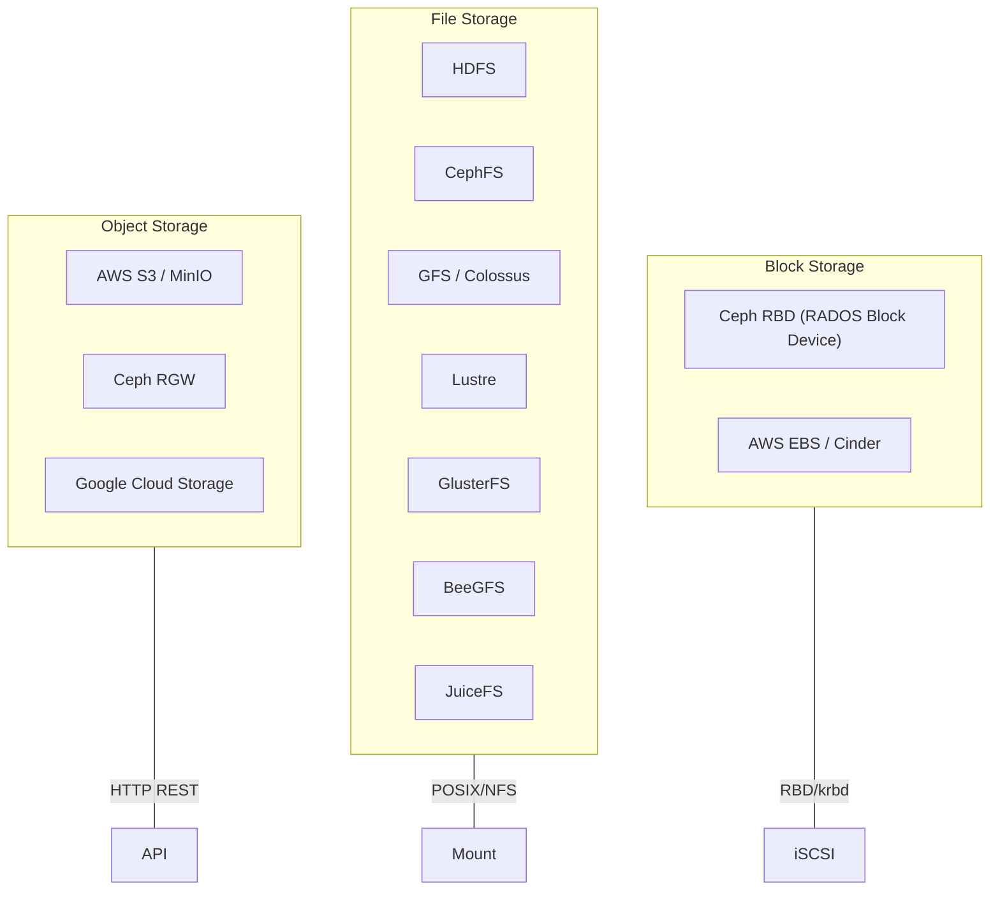

# Distributed Filesystems and Object Storage Internals

> Builds on [../distributed.md](../distributed.md), [../ceph.md](../ceph.md), [../ceph-crush.md](../ceph-crush.md), and [../object-storage.md](../object-storage.md). This file goes into production-grade internals: Ceph's BlueStore and Reef, HDFS NameNode federation and erasure coding, Google's evolution from GFS to Colossus, and modern systems like JuiceFS, MinIO, and HPC filesystems.

## Distributed Storage Taxonomy



## Ceph Deep: RADOS, BlueStore, and Reef

### RADOS Object Placement

RADOS (Reliable Autonomic Distributed Object Store) stores every piece of data — whether accessed via RBD, CephFS, or RGW — as an object in a placement group (PG). The PG is the unit of replication and recovery. CRUSH maps PGs to OSDs without a central lookup table (see [../ceph-crush.md](../ceph-crush.md)).

```
Client Write Path:
  1. Client hashes object name → PG ID
  2. CRUSH(PG ID, cluster_map) → [OSD.primary, OSD.replica1, ...]
  3. Client sends write to primary OSD
  4. Primary replicates to replicas (or uses erasure coding)
  5. Replicas ACK → Primary ACKs client
```

### BlueStore Internals

BlueStore replaced FileStore (which used XFS/ext4 as a local backend) to eliminate the double-write problem and reduce CPU overhead from filesystem journaling.

```
BlueStore Layout on a single OSD drive:
+------------------------------------------+
|  BlueStore DB (RocksDB on raw partition)  |  <-- metadata, WAL for RocksDB
|  - object map (onode tree)                |
|  - extent map                             |
|  - collection metadata                    |
+------------------------------------------+
|  BlueStore WAL (fast device, optional)    |  <-- deferred writes buffer
+------------------------------------------+
|  Block Device (main data area)            |  <-- actual object data
|  - allocated in blobs (extents)           |
|  - checksummed per 4K-16K block           |
+------------------------------------------+
|  RocksDB (embedded, shares DB partition)  |
+------------------------------------------+

  Optional: WAL + DB on NVMe, data on HDD (bluestore_wal_path, bluestore_db_path)
```

Key data structures inside BlueStore:

- **Onode**: per-object metadata (similar to an inode): size, flags, layout of extents, omap (key-value metadata).
- **Extent map**: maps logical byte ranges of an object to physical locations on the block device, stored in RocksDB.
- **Blobs**: contiguous regions on the block device. BlueStore uses a blob-based allocator instead of a filesystem block allocator.
- **Freelist manager**: tracks free space on the block device, also stored in RocksDB.

### Ceph Reef and Recovery Pipeline

Ceph Reef (v18, LTS) introduced significant recovery and scrubbing improvements:

- **OSD scrub improvements**: Scrub now uses more efficient I/O scheduling, interleaving scrub reads with client I/O to avoid latency spikes.
- **Recovery backoff**: Dynamic throttling based on client load. If client ops are latency-sensitive, recovery IOPS are reduced.
- **Async recovery**: Recovery operations are batched and pipelined, reducing per-object recovery latency.
- **BlueStore compression improvements**: Zstd compression now supports per-pool compression ratios and compression mode hints.

> **Interview Angle**: "How does Ceph handle a disk failure?" Walk through: (1) MON detects OSD down via heartbeat timeout, (2) cluster map update propagated, (3) PGs needing recovery identified, (4) recovery backoff kicks in, (5) PG peering selects new acting set, (6) data copies pulled from surviving replicas, (7) CRUSH remapping for degraded PGs. Mention the difference between **degraded** (rebuilding) and **peered** (ready to serve).

## HDFS Internals

### NameNode Architecture

```
Client                                    NameNode
  |                                          |
  |--- 1. create(path) ----------------------->|
  |<-- 2. lease, block locations --------------|
  |                                          |
  |--- 3. open(path) ------------------------->|
  |<-- 4. list of block + DataNode locations --|
  |                                          |
  |--- 5. read(DataNode1, block_0) ---------->|  (bypasses NameNode)
  |<-- 6. data bytes -------------------------|
  |                                          |
  |--- 7. close(path) ----------------------->|
  |<-- 8. commit --------------------------------|
```

The NameNode stores the entire filesystem namespace and block-to-DataNode mapping in memory (the **FsImage**) for fast lookups. All mutations are appended to the **EditLog** (WAL) for durability. On startup or checkpoint, the EditLog is merged into a new FsImage by the SecondaryNameNode or Standby NameNode.

### HDFS Federation and High Availability

**Federation** (Hadoop 2.x) splits the single-namespace bottleneck by running multiple NameNodes, each owning a distinct volume (e.g., `/user`, `/data`). A **ViewFS** client-side mount table routes path prefixes to the correct NameNode. Federation doesn't help with per-namespace availability.

**HA** uses an active/standby NameNode pair with shared EditLog storage (typically on a quorum of JournalNodes using QJM — Quorum Journal Manager, or on BookKeeper). ZKFC (ZooKeeper Failover Controller) manages leader election via ZooKeeper ephemeral nodes.

```
Federation + HA combined:

  ns1 (/user): Active NN1 <--QJM--> Standby NN1
  ns2 (/data): Active NN2 <--QJM--> Standby NN2

  Client mount table (ViewFS):
    /user → ns1
    /data → ns2
```

### HDFS Erasure Coding

HDFS 3.x introduced erasure-coded storage policies alongside traditional 3× replication:

| Policy | Stripe Size | Data Blocks | Parity Blocks | Cell Size | Overhead |
|--------|------------|-------------|---------------|-----------|----------|
| RS-6-3-1024k | 1024 KB | 6 | 3 | 1024 KB | 1.5× |
| RS-3-2-1024k | 1024 KB | 3 | 2 | 1024 KB | 1.67× |
| RS-6-3-64k | 64 KB | 6 | 3 | 64 KB | 1.5× |
| XOR-2-1-1024k | 1024 KB | 2 | 1 | 1024 KB | 1.5× |

HDFS EC uses the **stripe** layout: each logical stripe of data is split into cells, encoded, and placed on separate DataNodes. Reads can reconstruct from any *k* of *k+m* blocks. EC is significantly more CPU-intensive for writes and partial reads but saves 33-50% storage for large, cold datasets.

> **Interview Angle**: "When would you choose replication vs erasure coding in HDFS?" Replication for hot data, small files, or random-read workloads (lower CPU, lower latency). EC for cold/archival data with large sequential files. Never EC for files smaller than a stripe.

## Google File System and Colossus

### GFS Design (2003)

GFS (Ghemawat, Gobioff, Leung, SOSP 2003) made deliberate choices for Google's workload: large append-only files, infrequent random writes, high sustained throughput over low latency.

Key design decisions:
- **Single Master** (metadata only): All metadata in memory. Ops go through master; data transfers go client-to-chunkserver directly.
- **Large chunks** (64 MB): Reduces master metadata, amortizes control-plane overhead, improves sequential throughput.
- **Append-at-least-once**: Clients append to a chunk; if multiple clients append concurrently, duplicates and padding may occur. Record-level checksums in the application layer handle this.
- **Mutation with lease**: Master grants a lease to one chunkserver for a chunk; that chunkserver sequences mutations to maintain consistency.

### Colossus (GFS successor)

Colossus addressed GFS's single-master bottleneck and other scaling limits:

| Aspect | GFS | Colossus |
|--------|-----|----------|
| Metadata | Single master | Sharded across multiple masters |
| Chunk size | 64 MB | Up to several MB (more flexible) |
| Recovery | Master-driven, slow | Decentralized, faster |
| Filesystem features | Flat namespace, no hard links | Full POSIX-like features |
| Replication | 3× only | Replication + erasure coding |
| Scale | ~10,000 clients | 100,000+ servers |

Colossus shards the metadata namespace across many master nodes. Each master handles a subset of files. Clients route to the correct master via a directory service. This eliminated the single-master memory bottleneck and enabled exabyte-scale clusters.

## JuiceFS

JuiceFS separates metadata from data: metadata lives in a supported KV store (TiKV, Redis, etcd, PostgreSQL, MySQL), while data is stored as objects in S3/compatible backends.

```
Client                     Metadata Engine (Redis/TiKV/...)              Object Store (S3/MinIO)
  |                                |                                      |
  |--- open/getattr(path) --------->|                                      |
  |<-- inode info, chunk list ------|                                      |
  |                                |                                      |
  |--- read(chunk_id) --------------|--- get(chunk_id) ------------------>|
  |<-- data bytes ------------------|<-- object data ---------------------|
  |                                |                                      |
  |--- write(data, path) ---------->|                                      |
  |<-- chunk_id assigned -----------|--- put(chunk_id, data) ----------->|
```

- **POSIX compatible**: Supports hard links, `fsync`, `fallocate`, `mmap`.
- **Cache**: Local page cache + kernel page cache (via FUSE). Write-back caching with configurable flush interval.
- **Compaction**: Background process merges small objects to reduce metadata and S3 LIST overhead.
- **Use cases**: AI/ML training data sharing, CI/CD artifact caching, shared database storage.

> **Interview Angle**: "What's the main bottleneck in JuiceFS?" Metadata operations are bound by the KV store latency. Each `stat`, `readdir`, `lookup` hits the metadata engine. For metadata-heavy workloads (many small files), Redis gives ~100 µs ops; for durability with many files, TiKV is better but slower (~2-5 ms).

## GlusterFS

GlusterFS is a scale-out filesystem using a **translate, translate, translate** architecture: I/O passes through a stack of translators (xlator), each implementing one feature.

```
Client I/O stack (simplified):
  FUSE → posix → io-threads → io-cache → write-behind
       → client → protocol/server → dht → replicate
       → afr (auto-heal) → posix → disk
```

Key volume types:
- **Distributed (DHT)**: Hash-based distribution across bricks. No redundancy.
- **Replicated (AFR)**: Full copy on each brick. Self-heal on failure recovery.
- **Dispersed (EC)**: Uses erasure coding across bricks.
- **Distributed-Replicated**: DHT across replica sets (most common in production).

GlusterFS has no centralized metadata server — the DHT translator on each client computes brick location from a hash of the path. This eliminates the metadata bottleneck but makes rebalancing expensive (directory-level granularity).

## Lustre and BeeGFS (HPC Filesystems)

### Lustre

Lustre is the dominant HPC filesystem (used at most Top500 supercomputer sites). Architecture:

- **MDT (Metadata Target)**: Stores directory entries and file metadata. Uses a distributed lock manager (DLM) for coherence.
- **OST (Object Storage Target)**: Stores file data as objects. A single file can stripe across multiple OSTs for aggregated bandwidth.
- **MDS (Metadata Server)**: Serves MDT. Typically 1-2 active per filesystem.
- **OSS (Object Storage Server)**: Serves OSTs. Many OSS nodes for bandwidth scaling.

```
Client A  Client B  Client C
   \          |         /
    \         |        /
     MDS ---- MDT (metadata)
    /    \n    |     |
  OSS1   OSS2   OSS3
   |       |       |
  OST1   OST2   OST3
```

Lustre's key strength: **striped I/O**. A large file can be striped across N OSTs, and concurrent clients read/write different stripes in parallel, achieving hundreds of GB/s aggregate throughput. The `lfs setstripe` command controls stripe count and size.

### BeeGFS

BeeGFS (formerly FhGFS) is a German-origin HPC filesystem with similar goals to Lustre but simpler deployment:

- **Management daemon**: Single metadata service (simpler than Lustre DLM).
- **Storage daemons**: Serve data on each node.
- **Client daemon**: Kernel module providing FUSE-less access (direct VFS integration). No FUSE overhead.

BeeGFS strips files across storage nodes like Lustre but uses a simpler, RAID-5-like internal redundancy rather than relying on external RAID. It's popular in European HPC sites and easier to operate than Lustre.

| Feature | Lustre | BeeGFS |
|---------|--------|--------|
| Metadata | MDT + DLM | Single management node |
| Client | Kernel module (ldiskfs) | Kernel module (no FUSE) |
| Striping | Per-file stripe settings | Per-directory striping hints |
| Scale | 100,000+ clients | 1,000+ clients |
| Locking | DLM with intent locks | Simpler locking model |

## MinIO

MinIO is a high-performance S3-compatible object storage server written in Go, designed for on-premise deployments.

### Erasure Sets

MinIO partitions the server set into fixed-size **erasure sets** (default: up to 16 drives per set). Each set independently encodes objects using Reed-Solomon. This design means:

```
32 drives → 2 erasure sets × 16 drives each
  Set 0: drives 0-15  → RS(12+4) encoding
  Set 1: drives 16-31 → RS(12+4) encoding

  Write of object "foo/bar":
    hash("foo/bar") % 2 → Set 0
    Encode into 16 chunks, write one per drive in Set 0
```

- **No metadata server**: All metadata (bucket/index) is stored alongside data as `.xl.meta` files on each drive.
- **Strong read-after-write consistency**: MinIO uses a quorum-based commit protocol. A write is acknowledged only after a quorum of drives in the erasure set have persisted the data and metadata. Reads require quorum as well, preventing stale reads.
- **Bitrot protection**: Every object is hashed with HighwayHash. On read, if the hash doesn't match, MinIO reconstructs the corrupted chunk from parity.
- **Healing**: On drive replacement, MinIO reconstructs missing chunks in parallel from surviving drives.

## S3 Internals

### Partitioning and Placement

AWS S3 partitions objects across many storage nodes. The partitioning strategy is not publicly documented but inferred:

- **Account-level partitioning**: Each AWS account is assigned a set of partitions.
- **Object placement**: Within an account, objects are hashed to partitions. The partition count can grow dynamically.
- **Consistency**: S3 provides **strong read-after-write consistency** for all regions (since December 2020, previously eventual for PUT-then-GET in some cases).

### S3 Consistency Model

```
Operation        Guarantees
PUT new object   Immediately readable, listable
PUT overwrite    Immediately readable, new version returned
PUT then DELETE  DELETE wins (no stale read returns old object)
LIST            Eventually consistent (may lag by seconds)
```

S3 achieves strong consistency through a combination of quorum writes to multiple Availability Zones, synchronous replication within the write path, and read-repair mechanisms. LIST remains eventually consistent because the metadata index is updated asynchronously after the data path commit.

## Comparison Table

| System | Type | Metadata | Consistency | Scale | Best For |
|--------|------|----------|-------------|-------|----------|
| Ceph | Unified (block/file/object) | CRUSH (decentralized) | Strong (Paxos cluster map) | Exabyte | Private cloud, Kubernetes |
| HDFS | File | Centralized NameNode | Strong (single source) | Petabyte | Batch/analytics workloads |
| Colossus | File | Sharded masters | Strong | Exabyte | Google internal |
| JuiceFS | File (POSIX) | External KV store | Strong (KV store) | Petabyte | ML, shared data, hybrid cloud |
| GlusterFS | File | DHT (decentralized) | Strong (AFR) | Petabyte | General-purpose scale-out NAS |
| Lustre | File (HPC) | MDT + DLM | Strong | Petabyte | HPC, large sequential I/O |
| BeeGFS | File (HPC) | Management daemon | Strong | Petabyte | Mid-size HPC clusters |
| MinIO | Object (S3) | Embedded (.xl.meta) | Strong (quorum) | Petabyte | On-prem S3 replacement |
| S3 | Object (S3) | AWS-managed | Strong (read-after-write) | Exabyte | Cloud-native workloads |

> **Interview Angle**: "Design a distributed storage system for ML training." Consider: large files (model checkpoints, datasets), shared access from many GPUs, POSIX compatibility (PyTorch `DataLoader`), and cost. JuiceFS with S3 backend + Redis metadata is a strong answer. CephFS for fully on-prem. Avoid HDFS (not POSIX, no small-file support).
