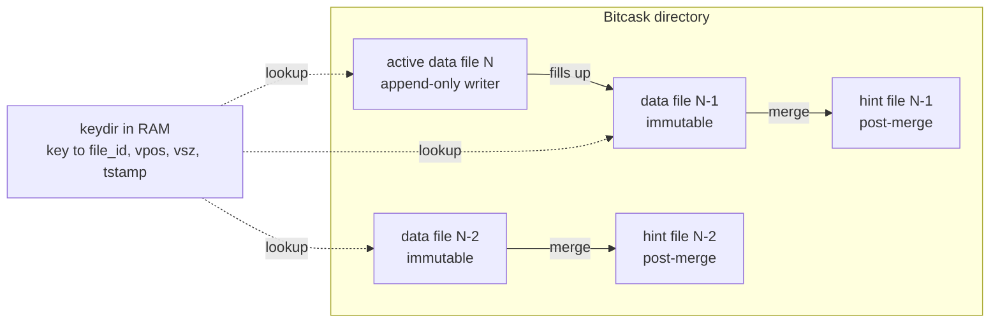
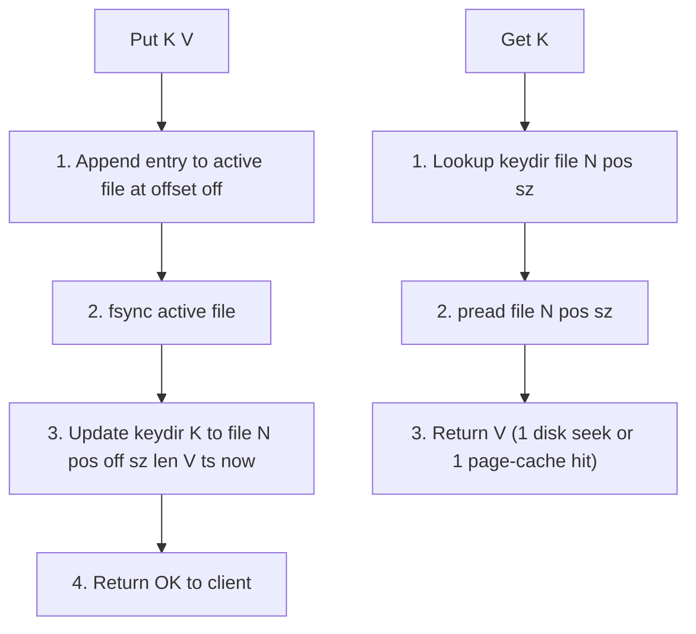
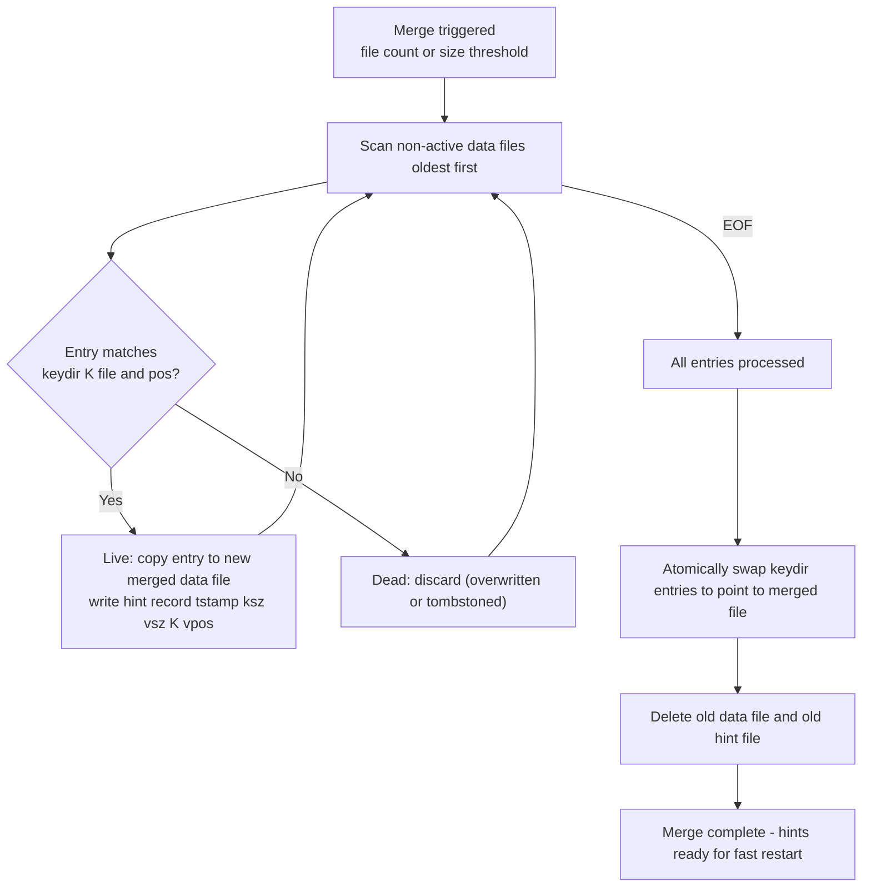

# Bitcask — A Log-Structured Hash Table for Fast Key/Value Storage

## Overview

**Bitcask** is the storage engine invented at **Basho Technologies** for **Riak**, the Dynamo-style distributed key-value store. Introduced in the 2010 paper *"Bitcask: A Log-Structured Hash Table for Fast Key/Value Data"* by Malkhi and Burrows, Bitcask combines an append-only log-structured on-disk format with an in-memory hash table called the **keydir**. The result is a deliberately simple engine that delivers single-disk-seek reads, single-sequential-write updates, and very fast crash recovery — without the multi-level indirection of LSM trees or B-trees. Bitcask is sometimes summarized as "WAL as a database": every write is appended to one active file, and lookups go directly to the value's on-disk offset via an in-RAM hash map. Riak replaced its earlier storage backends (gb_trees, innostore, dets) with Bitcask starting around 2010 because the older engines could not deliver predictable low latency under high write throughput. Bitcask remains a teaching exemplar of log-structured storage and the direct ancestor of derivatives such as Basho's own riak_kv integration, Erlio/Filed, Facebook's **Haystack** photo store (same log-plus-index pattern at exabyte scale), and Microsoft Research's **FASTER** (a concurrent, lock-free KV with a hybrid in-memory hash plus append-only log).

> Related: [WAL](./wal.md), [LSM Compaction](./lsm-compaction.md), [SSTable Format](./sstable.md), [BlobDB](./blobdb.md), [Storage Overview](./overview.md), [Storage Engines](../dbms/internals/storage-engine.md).

## Design Goals

The Bitcask paper explicitly lists five design goals, all driven by Riak's operational profile — a Dynamo-style KV store serving low-latency reads and writes for web and social workloads at multi-TB scale.

1. **Low latency for reads and writes** — every read is one disk seek; every write is one sequential append followed by a single `fsync`. No read-modify-write of data pages, no B-tree page splits, no LSM multi-level merges on the hot path.
2. **High throughput** — sequential writes saturate the disk spindle / SSD page-program rate. The CPU work per write is a hash insertion; per read is a hash lookup plus one `pread`.
3. **Datasets larger than RAM** — only the **keydir** (key plus value-position metadata) lives in RAM. The values themselves stay on disk; only the entry being read is paged in. Thus a 50-byte-key + 1-MB-value workload uses ~50 bytes of RAM per key but stores terabytes of value bytes.
4. **Crash-friendly fast recovery** — because the on-disk format is a self-describing append-only log, recovery is a linear scan that rebuilds the keydir. With hint files produced by merge, restart reads only hint files (which omit values), making recovery O(live-key-count) bytes instead of O(total-bytes-ever-written).
5. **Simple, predictable code path** — no concurrency control on disk (single active file, append-only), no compaction on the hot path, no fanout. Riak observed that earlier engines (InnoDB, dets) had unpredictable tail latency from background activity; Bitcask moves that work into the explicit merge step.

These goals explain every architectural choice that follows: the append-only layout (write speed), the in-RAM keydir (single-seek reads), the merge + hint-file pair (bounded disk usage and fast restart), and the single-writer-per-vnode constraint (simplicity over concurrency).

## On-Disk Layout

Bitcask's storage directory contains a set of **data files** plus, optionally, **hint files** produced by the merge process. Exactly one data file is **active** for writing at any moment — the others are immutable, read-only, and waiting to be merged or deleted. A data file is a flat sequence of binary entries: no index, no footer, no padding. Each entry is self-describing:

```
+--------+--------+--------+--------+--------+--------+
|  crc   | tstamp | ksz    | vsz    |  key   | value  |
+--------+--------+--------+--------+--------+--------+
  4 bytes  8 bytes  4 bytes  4 bytes  ksz      vsz
```

- **crc** — 32-bit CRC of everything that follows (detects torn writes after a crash; on replay, entries failing CRC are truncated).
- **tstamp** — 64-bit write timestamp (seconds or milliseconds since epoch; used for tombstone expiry and to break ties during merge).
- **ksz, vsz** — 4-byte little-endian lengths. A `vsz` of `0` is reserved in some implementations for tombstones (delete markers).
- **key, value** — raw bytes, no entry-level compression (Riak applies Snappy at the vnode level if configured).

When the active file reaches `max_file_size` (typically a few GB, configurable), it is closed and renamed to a stable read-only name; a new active file is opened. Closed data files are immutable and can be safely `mmap`-ed by concurrent readers. There is no in-place update of any byte: an update writes a new entry with the same key in the active file, and the older entry is logically dead but physically present until merge reclaims it.



The diagram shows the canonical shape: one active writer, many immutable readers, hint files parallel to merged-out data files, and the in-RAM keydir indexing into every file by `(file_id, value_pos, value_sz)`. Reads never need to consult more than one file because the keydir pins the single live copy.

## The keydir — Write and Read Paths

The **keydir** is Bitcask's signature data structure: an in-RAM hash table mapping every live key to a small fixed-size record:

```
keydir[key] = { file_id, value_pos, value_sz, tstamp }
```

- **file_id** identifies the data file holding the value.
- **value_pos** is the absolute byte offset within that file.
- **value_sz** is the number of bytes to read.
- **tstamp** is the write timestamp (used to detect stale entries during concurrent merge handoff).

The keydir is the **only** on-disk-to-RAM coupling Bitcask maintains. There is no Bloom filter, no SSTable index, no B-tree interior nodes — just one hash entry per live key. The **write path** is: (1) compute the entry bytes, (2) append to the active file and remember the offset `off`, (3) `fsync`, (4) update `keydir[K]` to `{file_id=N, value_pos=off, value_sz=len(V), tstamp=now}`. The append is sequential and the only disk I/O on the hot path. The keydir update is a single hash insertion. The **read path** is: (1) `keydir[K]` lookup, (2) `pread(file_id, value_pos, value_sz)`, (3) verify CRC and return the bytes. That is one disk seek (or one page-cache hit if the OS has the page cached). Updates are atomic from the reader's perspective: the write first appends to disk, then atomically swaps the keydir entry; readers either see the old entry (pointing to the old value, still valid until merge) or the new one.

The trade-off is explicit and famous: **the entire keydir must fit in RAM**. With a typical entry size of ~50 bytes (key of 20 bytes plus ~30 bytes of metadata/pointers/overhead), one million keys costs ~50 MB and one billion costs ~50 GB. This is why Bitcask is ideal for "many keys, large values" workloads (e.g., user profiles, media metadata) and poor for "huge number of tiny keys" (e.g., edge lists in a graph DB) where LSM trees with Bloom filters and disk-resident indexes are preferable.



Both paths are minimal: write is one sequential append plus one hash update; read is one hash lookup plus one `pread`. There is no read amplification across multiple files and no write amplification beyond the unavoidable `1×` of writing the value once.

## Merge Process and Hint Files

Because writes only ever append, dead entries (overwritten or deleted keys) accumulate on disk. Without reclamation, disk usage grows without bound. The **merge process** is Bitcask's garbage collector: a background scan that compacts live data and produces **hint files** for fast restart.

Merge iterates over the set of non-active, immutable data files (oldest first, usually). For each entry, it checks the keydir: if `keydir[K].file_id` and `keydir[K].value_pos` point to **this** entry, the entry is live; otherwise it is dead and discarded. Live entries are written into a new merged data file, preserving their original `(tstamp, ksz, vsz, key, value)` layout. For each live entry, merge also writes a parallel **hint file** record containing `tstamp | ksz | vsz | key | value_pos` — note **no value**, so hint files are typically an order of magnitude smaller than their data files. When the merge completes, the old data files and old hint files (if any) are deleted, the new merged data file is registered in the keydir, and the new hint file is kept for future restarts.

Hint files exist for one reason: **fast crash recovery**. On startup, Bitcask can rebuild the keydir by scanning hint files instead of data files. Since hint files omit values, restart reads far fewer bytes — for a workload with 1 KB values, restart scans ~50 bytes per live key from hints instead of ~1050 bytes from data files, a 20× speedup.



Merge is the only place where Bitcask does significant background work. It is also the only place where dead bytes are reclaimed — analogous to LSM compaction but with a simpler single-pass design (no leveled merges, no overlap resolution, because the keydir already knows the single live copy of each key).

## Crash Recovery

Recovery rebuilds the keydir from disk after a crash or a normal restart. Because the on-disk format is a self-describing append-only log, this is a deterministic linear scan. Bitcask prefers hint files when available; otherwise it falls back to data files.

**Fast path (hint files present):** scan each hint file in order; for each `tstamp | ksz | vsz | key | value_pos` record, build a `keydir[key]` entry pointing to `(file_id, value_pos, value_sz)`. Because hint files are written only by merge and merge already discarded dead entries, every hint record is live at the time of merge. The only correctness caveat is that writes after the last merge are not in any hint file — so after loading hints, Bitcask must also scan the data files created **after** the last merge (including the active file). This combined scan rebuilds the complete keydir.

**Slow path (no hint files, e.g., first run or after crash mid-merge):** scan every data file in chronological order; for each entry, compute its `(file_id, value_pos)` and either insert or overwrite the keydir entry. Because the scan is chronological, later entries overwrite earlier ones, so the final keydir contains the most recent live entry per key. If CRC fails on a trailing entry (torn write during the crash), Bitcask truncates the file at that point and continues — that entry was never durable.

**Tombstone handling:** deletes are recorded as entries with `vsz=0` (or a tombstone flag). On recovery they appear in the keydir as "deleted" markers; reads of such keys return not-found. Merge physically removes tombstones once it can prove no older live entry exists in an older file — analogous to LSM tombstone dropping during compaction.

Recovery time is bounded by the smaller of (sum of hint-file bytes) and (sum of data-file bytes). For a steady-state workload where merge keeps the oldest files compacted into hints, recovery is dominated by hint-file scan and is typically seconds-to-minutes for tens of GB of live data. This is dramatically faster than LSM replay (which must re-apply every WAL record into a MemTable) or B-tree crash recovery (which may need REDO/UNDO log scanning as in [ARIES](../dbms/transactions/aries.md)).

## Worked Example — Byte-Level Walkthrough

To make the design concrete, walk through writing the key `"user:42"` (7 bytes) with the value `"alice"` (5 bytes) into a fresh Bitcask, then reading it back. Assume `tstamp = 1700000000` (0x6553F100, big-endian for clarity) and `crc = 0xDEADBEEF` (placeholder; real CRC32 is computed over the entry body). The on-disk entry occupies `4 + 8 + 4 + 4 + 7 + 5 = 32 bytes`:

```
offset  bytes (hex, big-endian for readability)
0x00    DE AD BE EF                  crc (4 B)
0x04    00 00 00 00 65 53 F1 00       tstamp (8 B)
0x0C    00 00 00 07                   ksz = 7
0x10    00 00 00 05                   vsz = 5
0x14    75 73 65 72 3A 34 32          "user:42" (7 B)
0x1B    61 6C 69 63 65                "alice" (5 B)
0x20    ... next entry ...
```

After `fsync`, the keydir for this key is updated to:

```
keydir["user:42"] = {
    file_id   = 1,            // active data file
    value_pos = 0x1B,         // offset of "alice" within file 1
    value_sz  = 5,
    tstamp    = 1700000000
}
```

A subsequent `Get("user:42")` does `pread(fd=1, offset=0x1B, size=5)`, returns `61 6C 69 63 65`, recomputes CRC over the whole 32-byte entry (cheap — the OS page cache already has the front of the entry), and returns `"alice"`. That is exactly one disk seek if the page is cold, zero seeks if warm.

Now overwrite with `value = "bob"` (3 bytes). A new entry is appended at offset `0x20` of the same file (assuming it is still active):

```
0x20    XX XX XX XX                  new crc
0x24    00 00 00 00 65 53 F2 00       newer tstamp
0x2C    00 00 00 07                   ksz = 7
0x30    00 00 00 03                   vsz = 3
0x34    75 73 65 72 3A 34 32          "user:42"
0x3B    62 6F 62                      "bob"
0x3E    ...
```

The keydir entry is updated to `{file_id=1, value_pos=0x3B, value_sz=3, tstamp=...}`. The original entry at offset `0x14` is now **dead** — still on disk, never updated in place. A subsequent merge will skip it because `keydir["user:42"].value_pos` no longer points to `0x1B`. The merge writes only the live entry at `0x20` to a new file plus a hint record `(tstamp, ksz=7, vsz=3, key="user:42", value_pos=offset-in-new-file)`, and the old data file is deleted. Total bytes written across the write, overwrite, and merge: 32 (first write) + 30 (overwrite) + ~14 (merge live copy) + ~14 (merge hint) = ~90 bytes for ~37 bytes of live data, an effective write amplification of roughly `2.4×` — and as more overwrites accumulate against a single merge, the ratio trends toward the steady-state `~1×` bound.

The keydir memory cost can be expressed as a simple closed form. For \\(N\\) keys with average key length \\(\bar{k}\\) bytes and per-entry pointer overhead \\(o\\) (typically \\(\approx 30\\) bytes for `file_id` + `value_pos` + `value_sz` + `tstamp` + hash chain pointer), the keydir occupies:

\\[ M = N \times (\bar{k} + o) \\]

For the canonical Riak example with \\(N = 10^6\\), \\(\bar{k} = 20\\), \\(o = 30\\): \\(M = 10^6 \times 50 = 50\\) MB. For \\(N = 10^9\\): \\(M = 50\\) GB — beyond typical server RAM, which is precisely why Bitcask deployments plateau around hundreds of millions of keys per vnode.

## Comparison With Other Storage Engines

Bitcask's design choices stand out most clearly when compared against the two dominant alternatives — LSM trees and B-trees — and against the modern value-separated design (BlobDB / WiscKey). The first table compares the high-level architecture and operational profile.

| Aspect | Bitcask | LSM-tree (RocksDB, Cassandra) | B-tree (InnoDB, Postgres heap) | BlobDB / WiscKey |
|--------|---------|-------------------------------|--------------------------------|------------------|
| On-disk structure | Append-only log + in-RAM keydir hash | WAL + MemTable + tiered SSTables | Pages with in-place updates + WAL | LSM of keys + append-only blob log of values |
| Read cost | 1 disk seek (hash lookup + `pread`) | 1-2 I/Os (Bloom + index + data block) after MemTable miss | 1 I/O (B-tree traversal cached in interior pages) | 2 I/Os (LSM pointer lookup + blob `pread`) |
| Write cost | 1 sequential append + 1 `fsync` | 1 WAL append + MemTable insert + async compaction rewrites | 1 WAL append + page dirty + random page write later | 1 blob append + 1 LSM put + GC rewrites |
| Write amplification | 1× (merge rewrites only dead bytes) | 10-30× (leveled) / 2-4× (tiered) | ~1× (in-place, but random I/O) | ~1-2× (LSM rewrites only pointers) |
| Background work | Single-pass merge | Leveled/tiered compaction | Checkpoint + page flush | Compaction + blob GC |
| Index in RAM | Full keydir (~50 B/key) | Bloom + block cache (subset) | Interior B-tree pages (cached subset) | Bloom + block cache + blob cache |

The second table quantifies the **keydir memory cost** that is Bitcask's defining trade-off. Numbers are rough but illustrate the order of magnitude; production deployments budget ~50-100 bytes per key.

| Keys | Avg key size | Entry overhead | keydir RAM (estimate) | Workload fit |
|------|--------------|-----------------|------------------------|--------------|
| 1 M | 20 B | ~30 B | ~50 MB | Fits comfortably in any server |
| 100 M | 20 B | ~30 B | ~5 GB | Needs dedicated RAM; OK for KV cache servers |
| 1 B | 20 B | ~30 B | ~50 GB | Exceeds typical RAM — switch to LSM with Bloom |
| 1 M | 256 B (URLs) | ~30 B | ~290 MB | OK but the key bytes dominate overhead |
| 10 M | 1 KB (paths) | ~30 B | ~10.3 GB | Awkward — key bytes dominate; LSM better |

The third table focuses on **write amplification (WA)**, the metric most often cited in Bitcask's favour. WA is defined as bytes written to storage divided by bytes written by the client; for Bitcask it is provably 1× on the hot path because writes only append once and merge only rewrites live data.

| Engine | Hot-path WA | Background WA (steady state) | Total effective WA | Notes |
|--------|-------------|-------------------------------|--------------------|-------|
| Bitcask | 1× | ~1× per merge pass over live data | ~1-2× | Single rewrite of live bytes at merge; dead bytes discarded |
| LSM leveled (RocksDB default) | 1× (WAL + MemTable) | 10-30× as keys flow L0 → L_max | ~10-30× | Each key rewritten once per level |
| LSM size-tiered / universal | 1× | 2-4× | ~2-4× | Fewer rewrites, but higher RA and SA |
| B-tree (in-place) | 1× WAL + 1× random page | ~1× | ~2× | Random I/O penalty on HDDs; SSDs amortize |
| BlobDB / WiscKey | 1× blob + 1× LSM pointer | 1-2× for pointer rewrites | ~1-2× | Wins for large values; loses for tiny values |

## Riak Multi-Bitcask and Derivatives

Riak shards data across **virtual nodes (vnodes)** — typically 64 vnodes per physical node in a Riak cluster — and each vnode owns a disjoint key range. Riak's `riak_kv_bitcask` backend runs **one Bitcask instance per vnode**, so a 64-vnode node has 64 separate keydirs, 64 active files, and 64 concurrent merge workers (rate-limited to avoid I/O starvation). This **multi-bitcask** design has three benefits. First, vnode migration (handoff) becomes a directory copy — Bitcask's data directory for a vnode is self-contained and portable. Second, a single vnode crash does not block reads or writes to other vnodes. Third, per-vnode keydir sizing lets operators trade RAM for parallelism: smaller per-vnode keydirs are easier to fit, and per-vnode merge is bounded in duration.

Derivative systems extend Bitcask's core idea. Facebook's **Haystack** (OSDI 2010) applies the same log-plus-index pattern to photo storage at exabyte scale, with a similar in-memory index of photo-id to (volume, offset, size) and a periodic compactor. Microsoft Research's **FASTER** (SIGMOD 2018) is a concurrent, lock-free KV that combines an in-memory hash index with an append-only hybrid log on disk; the log is divided into an in-memory mutable region, an in-memory read-only region, and an on-disk region — extending Bitcask's design with concurrent writers and epoch-based recovery. Erlio's **Filed** and several embedded KV libraries adopt the same hash-plus-log shape for similar reasons: simplicity, single-seek reads, sequential writes. Compared with LSM-derived systems (see [LSM Compaction](./lsm-compaction.md)) these engines sacrifice range scans (no sorted order) and disk-resident indexes (RAM cost scales with key count) in exchange for absolute write throughput and predictable read latency.

## Configuration Knobs (Riak / riak_kv_bitcask)

Bitcask's tunable surface is intentionally small — most operational behaviour is fixed by the design. The handful of knobs that do exist trade RAM, I/O bandwidth, and recovery time against each other.

| Knob | Default | Effect |
|------|---------|--------|
| `data_root` | `./data/bitcask` | Directory per Bitcask instance (one per vnode in multi-bitcask) |
| `max_file_size` | ~2 GB | Active file rotation threshold. Larger → fewer files, longer merge, slower restart. Smaller → more files, more frequent merge, faster per-merge |
| `open_timeout` | 4 s | Time to wait for file open during heavy load; protects against fd exhaustion |
| `sync_strategy` | `seconds` | `none` = never fsync (unsafe), `seconds` = periodic fsync (default), `ots` = fsync on every write (safest, slowest) |
| `merge_window` | always | Time-of-day windows when merge is allowed (e.g., `{"start": 1, "end": 5}` for 01:00-05:00). Avoids merge during peak traffic |
| `max_merge_workers` | 1 per vnode | Cap concurrent merge workers per vnode; raise for faster reclaim, lower to protect foreground latency |
| `merge_check_interval` | 3 m | How often to consider triggering merge based on trigger thresholds |
| `frag_merge_trigger` | 60 | Fragmentation ratio (%) above which merge is triggered for a file |
| `dead_bytes_merge_trigger` | 128 MB | Total dead bytes across files above which merge is triggered |
| `frag_threshold` | 50 | Below this fragmentation ratio (%) a file is skipped during merge |
| `dead_bytes_threshold` | 32 MB | Below this dead-byte count a file is skipped during merge |
| `small_file_threshold` | 10 MB | Files smaller than this are merged even if not fragmented, to consolidate many tiny files |
| `expiry_secs` | off | If set, entries older than this are expired during merge (TTL support) |

A common production profile is `sync_strategy=seconds` with `merge_window` set to off-peak hours, `max_file_size` around 1-2 GB to bound restart time, and `dead_bytes_merge_trigger` tuned so that merge runs once per hour under steady write load. Operators should alert on `bitcask_merge_total` stalls (no merges for > 1 h) and on `bitcask_keydir_memory` exceeding 60% of system RAM.

## Pitfalls and Operational Notes

- **keydir must fit in RAM.** The classic Bitcask failure mode is OOM under key-count growth. Monitor live-key count; if `keys × 50 B` approaches 60-70% of system RAM, plan migration to LSM (RocksDB/LevelDB) or to BlobDB-style separation before the cluster thrashes.
- **Merge I/O can stall writers.** Merge reads every byte of the files it processes and writes the live subset. On HDDs this saturates the spindle; on SSDs it consumes page-program budget. Riak rate-limits merge (`max_merge_workers`, IoScheduler) but operators must still size for the worst case. Watch `pending_merge_bytes` and disk queue depth.
- **No range scans.** The keydir is a hash, not a sorted map. Range queries require an external index (Riak Search, secondary indexes). If the workload is range-scan-heavy, use an LSM engine with sorted SSTables — see [SSTable Format](./sstable.md).
- **Torn writes after power loss.** Bitcask relies on CRC to detect partial writes. If the storage device lies about `fsync` (some consumer SSDs and RAID controllers do), Bitcask may believe a write is durable when it is not. Use enterprise SSDs with power-loss protection, and disable write-back cache that bypasses the device's own capacitors.
- **Single active file per vnode is a serialization point.** Throughput per vnode is bounded by the sequential write rate of one file. Scale horizontally by adding vnodes or vertically by giving Bitcask more active files (multi-bitcask).
- **Active file size tuning.** Small `max_file_size` (e.g., 256 MB) causes frequent file rotation and many small merge candidates; large (e.g., 8 GB) lengthens merge latency and slows restart. Riak defaults to a few GB per file.
- **Hint files must be present for fast restart.** If merge is disabled or never finishes, restart scans full data files. Alert on `merge_lag_seconds` and `hint_files_ratio`.

## Interview Questions

**Q: Why does Bitcask achieve single-seek reads?**
The keydir is an in-RAM hash table mapping each key to `(file_id, value_pos, value_sz)`. A read does one hash lookup (no I/O) plus one `pread` at the exact byte offset in one data file. No B-tree traversal, no Bloom filter, no multi-level SST consultation — the address of the value is already in RAM.

**Q: Why must the keydir fit in RAM?**
There is no on-disk index of keys; the keydir IS the index. If it spilled to disk, reads would require a disk lookup of the keydir entry before the `pread` of the value — two seeks instead of one, defeating the design. The trade-off is explicit: ~50 bytes of RAM per live key.

**Q: How does merge differ from LSM compaction?**
LSM compaction merges overlapping sorted runs at multiple levels, rewriting keys ~10-30× as they descend levels (see [LSM Compaction](./lsm-compaction.md)). Bitcask merge is a single pass: read all non-active files, keep only entries that the keydir still points to, write them to one new file plus a hint file, delete the old files. Each live byte is rewritten at most once per merge — write amplification is ~1×.

**Q: What is a hint file and why does it matter?**
A hint file is written by merge alongside the merged data file, containing `tstamp | ksz | vsz | key | value_pos` for each live entry — no value bytes. On restart, Bitcask scans hint files to rebuild the keydir, reading far fewer bytes than scanning the data files (20× speedup for 1 KB values). Hint files are the reason Bitcask can recover in seconds rather than minutes.

**Q: How does crash recovery handle a torn write?**
Each entry has a CRC over `tstamp | ksz | vsz | key | value`. On recovery, Bitcask scans files chronologically; if an entry's CRC fails, the file is truncated at that offset and scan continues from the next file. Torn writes are treated as never-happened, which is correct because the client never received an ack for them.

**Q: Bitcask vs B-tree for a read-heavy workload with random writes?**
B-trees (InnoDB-style) are read-optimized: interior pages cache the navigation, and a single page I/O returns the row. Random writes are in-place updates that turn into random I/O — slow on HDDs, acceptable on SSDs. Bitcask turns random writes into sequential appends (good on HDD) but its read cost is one seek regardless of access pattern, with no caching benefit beyond the OS page cache. For pure read-heavy with few writes, B-tree usually wins; for write-heavy with reads, Bitcask wins.

**Q: Bitcask vs BlobDB — both are "log of values + index of keys". What's the difference?**
Bitcask uses an in-RAM hash as the index; BlobDB uses an LSM tree of `(key, BlobIndex)` pairs. Bitcask requires the entire index in RAM; BlobDB's LSM can spill to disk with Bloom filters, so it scales to billions of keys. Bitcask's reads are 1 seek; BlobDB's reads are 2 seeks (LSM lookup + blob `pread`). Bitcask has no range scans; BlobDB inherits LSM range scans over keys. See [BlobDB](./blobdb.md).

**Q: Why does Riak use one Bitcask per vnode?**
Each vnode owns a disjoint key range. Running a separate Bitcask per vnode means (1) vnode handoff is a self-contained directory copy, (2) per-vnode merge work is bounded, (3) per-vnode keydir sizing is independently tunable, and (4) a failed vnode's recovery does not block other vnodes. The cost is 64× the per-instance overhead (file handles, merge threads, RAM for 64 keydirs).

## Cross-References

- [WAL](./wal.md) — Bitcask's active file is essentially a per-vnode WAL; same durability reasoning
- [LSM Compaction](./lsm-compaction.md) — alternative compaction model; write amplification 10-30× for leveled
- [SSTable Format](./sstable.md) — sorted, immutable, indexed files (Bitcask data files are unsorted and un-indexed)
- [BlobDB](./blobdb.md) — same log-of-values pattern but with LSM index instead of in-RAM hash
- [Storage Overview](./overview.md) — where Bitcask fits in the storage-engine taxonomy
- [Storage Engines](../dbms/internals/storage-engine.md) — broader engine comparison
- [ARIES](../dbms/transactions/aries.md) — contrast with WAL + REDO/UNDO recovery model

## References

- Malkhi & Burrows — Bitcask: A Log-Structured Hash Table for Fast Key/Value Data (Basho, 2010) — design goals, keydir, merge, hint files
- Basho / riak_kv source — Bitcask implementation in Erlang, multi-bitcask per vnode, IoScheduler merge throttling [GitHub Basho]
- Bitcask-internals docs — entry layout crc/tstamp/ksz/vsz/key/value, active file rotation, hint file format [Basho docs]
- Beacon — Bitcask Internals: keydir memory cost ~50 B/key, write amplification 1×, comparison to LevelDB/RocksDB
- Facebook Haystack (Beaver et al., OSDI 2010) — same log-plus-index pattern at exabyte scale for photo storage
- FASTER (Chandramouli et al., SIGMOD 2018) — concurrent lock-free KV with hybrid log; extends Bitcask's design with epoch-based recovery
- WiscKey (Ren et al., FAST 2016) — key-value separation; alternative to Bitcask for large-value workloads at scale
