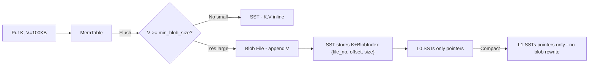
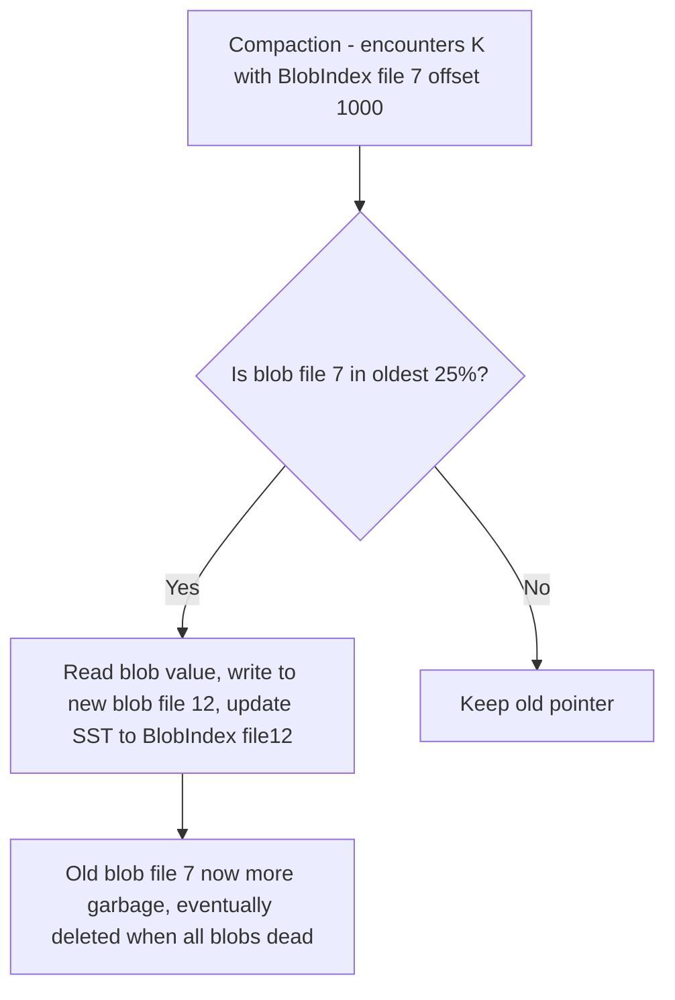

# BlobDB — Key-Value Separation for Large Values

## Overview

LSM's write amplification (WA) is high because compactions repeatedly rewrite entire key-values. For **large values** (100KB-10MB), rewriting value many times is wasteful and kills SSD endurance. **BlobDB** (RocksDB Integrated BlobDB, Badger, WiscKey paper) separates **keys** (small, sorted) in LSM from **values** (big, blobs) in dedicated blob files. LSM stores only pointer `BlobIndex {file_number, offset, size, compression}` → compaction rewrites only keys + pointers, not blobs → WA drops from 10-30× to ~1-2×.

> Related: [LSM Trees](../dbms/internals/lsm-trees.md), [WAL](./wal.md), [LSM Compaction](./lsm-compaction.md), [SSTable Format](./sstable.md), [Block Storage](./block-storage.md)

## WiscKey Insight (FAST 2016)

Traditional LSM:

```
Flush: MemTable (K,V large) → SST (K,V large) 64MB
Compact L0→L1: read 4 SSTs (256MB values) + write 256MB values again → WA accumulates
```

With separation:

```
Flush: MemTable (K,V) → if V >= threshold (e.g., 1KB) → write V to Blob file (sequential), SST stores K+BlobIndex (maybe 30 bytes)
Compact: merge SSTs containing K+BlobIndex only → rewrite 30 bytes per key, not 100KB value → WA ~1
```

Result: 75-78% lower WA in RocksDB benchmarks (overwrite workload WA 6.1-6.8 leveled vs 1.4-1.7 BlobDB), 2.3-4.7× faster initial load.

## Design



Blob file format: append-only log of blobs, each blob may have header (magic, checksum, compression type, TTL). Blob files have size limit `blob_file_size` (e.g., same as `write_buffer_size`).

### Garbage Collection — Reclaiming Dead Blobs

Update/delete of key creates garbage blob in old blob file (old value no longer referenced by LSM). Need GC to reclaim space.

RocksDB BlobDB GC integrated with compaction:

- During compaction, if key's value is in blob file and blob file is "old" (in oldest 25% of files by `blob_garbage_collection_age_cutoff=0.25`), relocating valid blobs encountered to new blob file and updating LSM pointer.
- Age cutoff tunes WA vs SA: lower cutoff (0.1) → GC more aggressive → lower SA but higher WA (more relocations).
- GC triggered when garbage ratio high (Garbage blobs / total blobs).



Pebble/Badger alternative: The Blob Level idea — treat GC rewritten blobs as SST with keys being blob pointers.

## API & Options (RocksDB)

| Option | Default | Meaning |
|--------|---------|---------|
| `enable_blob_files` | false | Enable separation |
| `min_blob_size` | 0 (disabled unless set) | Values >= this go to blob files (e.g., 1KB) |
| `blob_file_size` | 256 MB | Limit per blob file, influences SA |
| `blob_compression_type` | no compression | All blobs in same file same compression (Snappy/Zstd) |
| `enable_blob_garbage_collection` | false | Active relocation |
| `blob_garbage_collection_age_cutoff` | 0.25 | Oldest 25% considered for GC |
| `blob_garbage_collection_force_threshold` | 1.0 | If garbage ratio > threshold, force GC |
| `enable_blob_direct_write` | false | Write directly to blob file during Put, not just flush/compaction — reduces WAL/MemTable size |

For mixed short-lived + long-lived values, config `blob_files_only_for_level >= L` — only extract to blob at deeper levels, avoiding SA for short-lived values that die quickly in L0.

### Compaction Style Recommendation

RocksDB advises **leveled** with BlobDB, not universal. Since BlobDB already gives low WA, no need to sacrifice RA with universal. Leveled + BlobDB gives low WA + low RA.

## Performance (RocksDB Benchmarks)

- **Initial load (bulk)**: BlobDB WA 1.0-1.02 vs leveled 1.6 → 2.3-4.7× faster overall because compaction only sorts keys.
- **Overwrite workload (random)**: BlobDB WA 1.4-1.7 vs leveled 6.1-6.8 (75-78% lower), universal 5.7-6.2 (70-77% lower)
- **Point lookup + write mix**: WA 1.4-1.8 vs leveled 10.8-12.5 (83-88% lower)
- **Range scan + write mix**: WA 1.4-1.8 vs leveled 13.6-14.9 (88-90% lower)

Write performance second stage much faster because compaction reads/sorts/writes keys only.

## Trade-offs

| Aspect | Without BlobDB | With BlobDB |
|--------|----------------|-------------|
| WA | High 10-30× for large values | Low 1-2× |
| RA | Index + data block (one I/O) | Index + data block pointer + blob file I/O (extra I/O for large value) — small values inline avoid extra I/O |
| SA | Low leveled ~10% | Higher due to garbage blobs + 2× peak during GC — tune via file size & age cutoff |
| Cache | Block cache caches data blocks | Need separate blob cache or cache blob files |
| Range scan | Data blocks sequential | Need to fetch blobs randomly — slower range scan for large values unless using prefetch |

When **not** to use: values <1KB (pointer overhead bigger than benefit), range scan heavy with large values (extra random I/O), small dataset where WA not concern.

## WiscKey vs Badger vs RocksDB Integrated BlobDB

- **WiscKey** (paper): separates all values from keys; values are appended to a log-structured vBlob/vLog file, while the LSM tree stores only the keys together with a pointer to the value's location in the vLog. The LSM tree stays small (just keys + small pointers) so it can be cached and searched efficiently. Garbage collection reclaims space by rewriting valid values in the vLog.
- **Badger** (Go): LSM stores keys + value log pointer, value log separate vlog files, GC via rewriting. Good for Go ecosystem.
- **RocksDB Integrated BlobDB**: integrated into LSM, compatible with most RocksDB features (transactions, compaction filter `FilterBlobByKey` — can decide to drop based on key only without reading blob, which is optimization).

Compaction filter optimization: if filter can decide to drop key solely based on key, avoid reading blob file → saves I/O.

## Interview Questions

**Q: What is BlobDB and why?**
Key-value separation for large values: LSM stores pointer (file_no, offset, size), blob file stores value. Avoids rewriting large values during compaction → WA from 10-30× to ~1-2×, improves SSD lifetime, faster writes.

**Q: How does GC work?**
Update/delete creates garbage blob. During compaction, if blob file is old (oldest 25%), valid blobs encountered relocated to new blob file and LSM updated. Old blob file deleted when all blobs garbage.

**Q: When to use BlobDB?**
Large values >=1KB, write-heavy, SSD endurance concern, point lookup heavy. Not for small values (<1KB) or range scan heavy large values (extra I/O).

**Q: BlobDB vs Badger?**
Both KV separation, Badger Go-native, value log + LSM keys. RocksDB BlobDB integrated, compatible with transactions, compaction filters, leveled compaction recommended.

**Q: Write amplification definition with BlobDB?**
RocksDB defines WA as (SST + blob files written by flush/compaction) / (flush bytes). BlobDB close to theoretical min 1.0 for bulk load because compaction sorts keys only.

## Cross-References

- [LSM Trees](../dbms/internals/lsm-trees.md) — overall LSM
- [WAL](./wal.md) — durability
- [LSM Compaction](./lsm-compaction.md) — leveled vs tiered, write stall
- [SSTable Format](./sstable.md) — data blocks, index, bloom, footer
- [Block Storage](./block-storage.md) — SSD endurance
- [Probabilistic Data Structures](../interview/system-design/probabilistic-data-structures.md) — bloom filters used in SST

## References

- RocksDB Wiki — BlobDB: Overview, design key-value separation WiscKey, write APIs, column family options enable_blob_files/min_blob_size/blob_file_size/blob_garbage_collection_age_cutoff [RocksDB Wiki]
- RocksDB Blog — Integrated BlobDB: API, performance write amplification 75-78% lower, initial load 2.3-4.7× faster [RocksDB Blog]
- RocksDB Blog — BlobDB Direct Write: BlobIndex reference instead of full value in WAL/MemTable
- Pebble Issue #112 — Blob storage / value separation: blob log, BlobIndex file_number/offset/size varint, GC via lives check [GitHub Pebble]
- WiscKey paper (FAST 16): key-value separation for LSM
