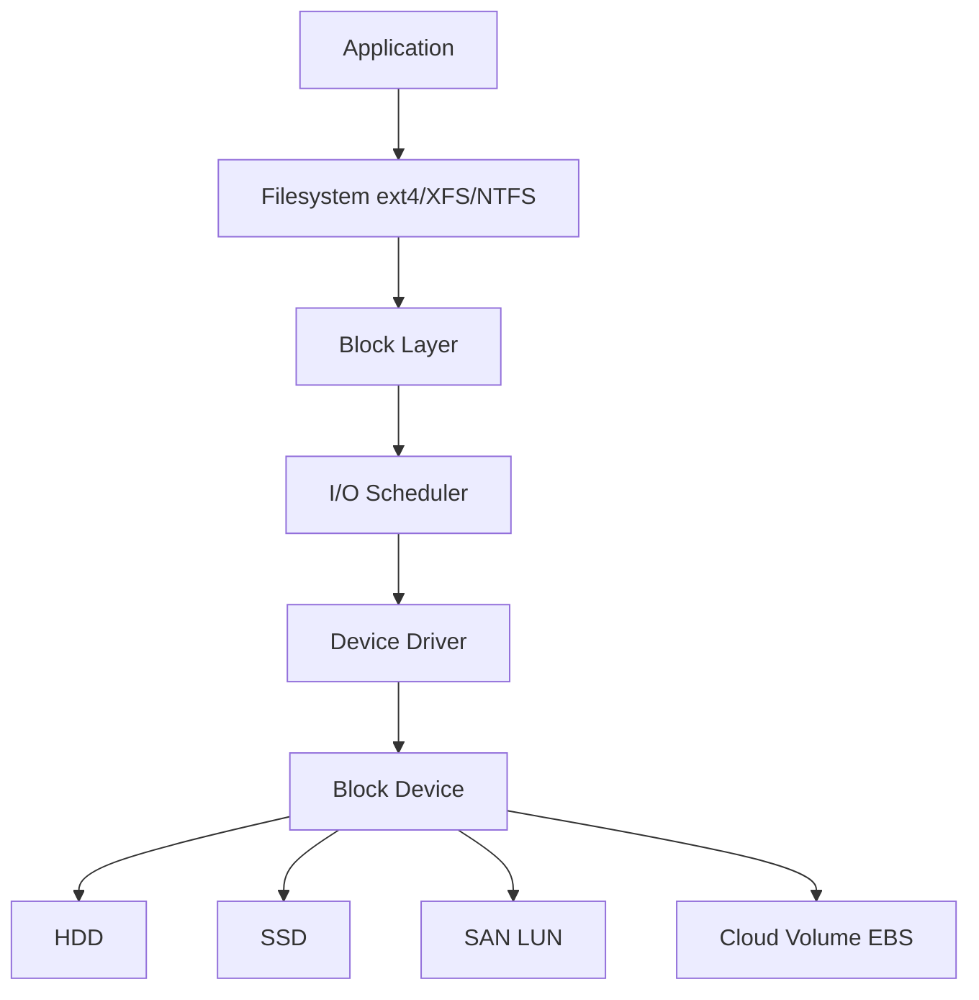
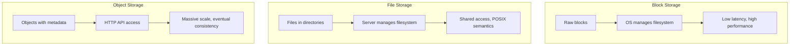
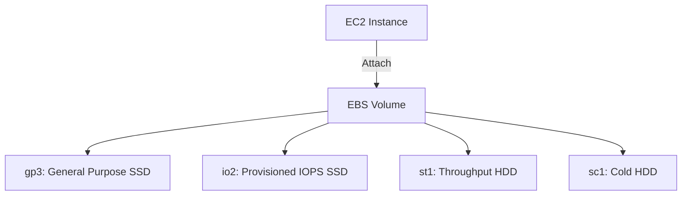
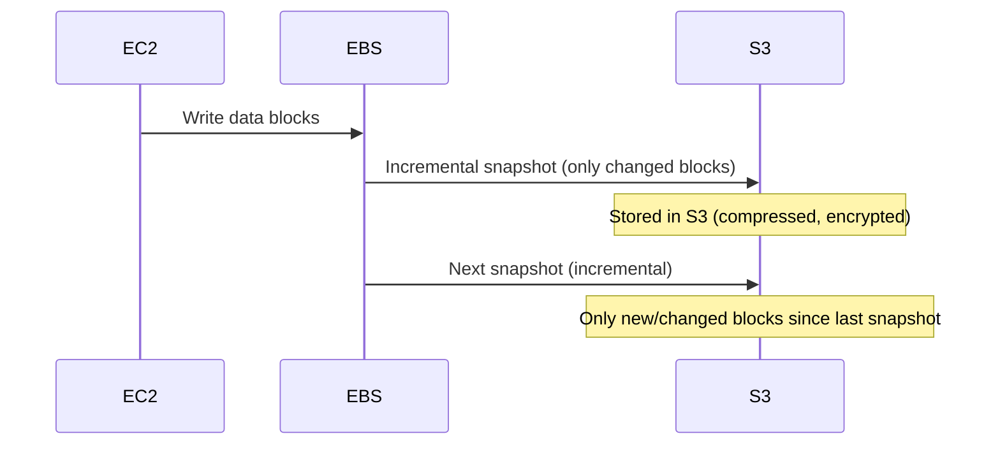
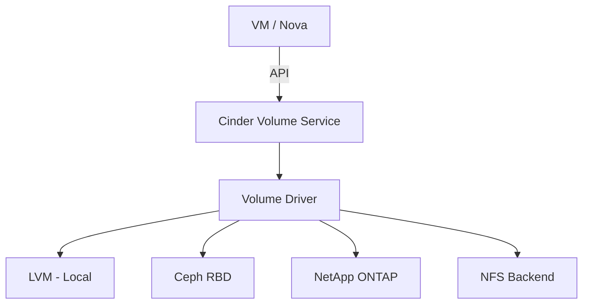
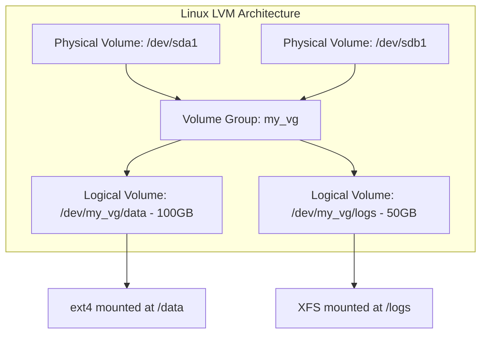
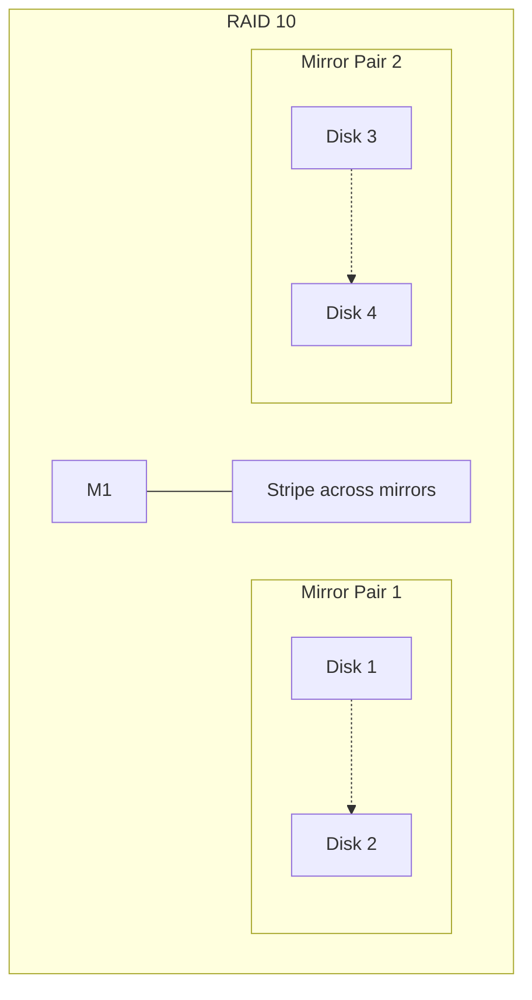
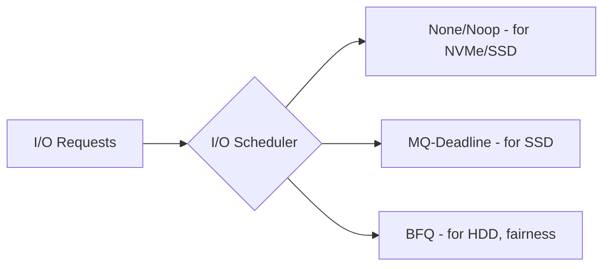
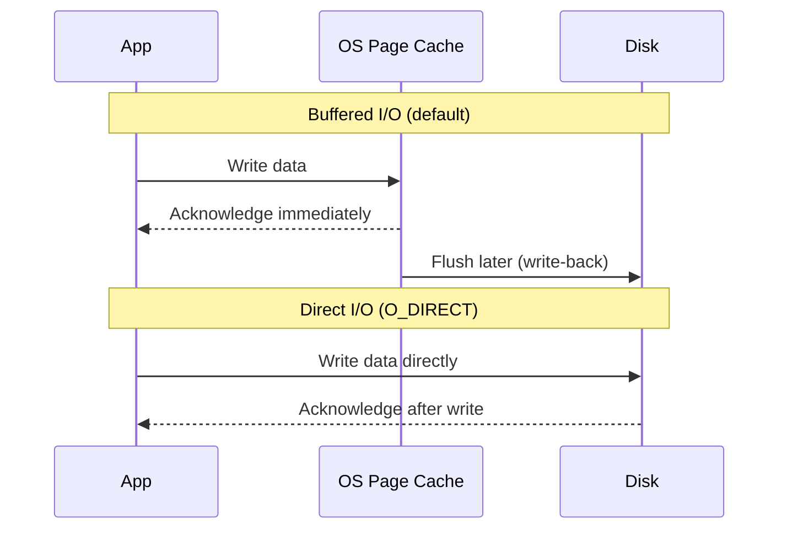

# Block Storage

## Overview

Block storage divides data into fixed-size blocks, each with a unique address, and presents them as raw volumes to the operating system. The OS manages these blocks using a filesystem (ext4, NTFS, XFS) or uses them directly (databases with O_DIRECT). Block storage is the foundation of traditional storage systems and cloud services like AWS EBS, Azure Managed Disks, and OpenStack Cinder.

## How Block Storage Works

### Block Device Abstraction

- **Block Size**: Typically 512 bytes or 4 KB. The filesystem organizes blocks into files.
- **Block Address**: Each block has a Logical Block Address (LBA). LBAs are sequential integers starting from 0.
- **I/O Operations**: Read/write operations target specific LBAs with specific sizes.

### Block Storage vs Other Types

## Cloud Block Storage

### AWS Elastic Block Store (EBS)

| Volume Type | Max IOPS | Max Throughput | Latency | Cost | Use Case |
|-------------|----------|----------------|---------|------|----------|
| gp3 | 16,000 | 1,000 MB/s | ~1 ms | $0.08/GB/mo | Most workloads |
| io2 Block Express | 256,000 | 4,000 MB/s | ~0.5 ms | $0.125/GB/mo | Databases, critical apps |
| st1 | 500 | 500 MB/s | ~10 ms | $0.045/GB/mo | Big data, logs |
| sc1 | 250 | 250 MB/s | ~15 ms | $0.015/GB/mo | Cold data |

### EBS Snapshots

- **Incremental**: Only changed blocks are copied, reducing time and storage cost.
- **Point-in-time**: Each snapshot is a consistent point-in-time copy.
- **Cross-region**: Snapshots can be copied to other regions for DR.

### OpenStack Cinder

Cinder is OpenStack's block storage service. It provides a vendor-agnostic API for creating and managing block volumes.

## Volume Management

### Logical Volume Manager (LVM)

LVM provides:
- **Striping**: Spread data across multiple physical volumes for performance.
- **Mirroring**: Duplicate data across physical volumes for redundancy.
- **Snapshots**: Copy-on-write snapshots of logical volumes.
- **Online resize**: Grow or shrink volumes without unmounting.

### RAID and Block Storage

RAID is implemented at the block storage layer, providing redundancy and/or performance without the application knowing.

## Performance Optimization

### I/O Schedulers

- **None/Noop**: Minimal overhead. Best for NVMe where the device handles scheduling.
- **MQ-Deadline**: Ensures requests are served within a deadline. Good for SSDs.
- **BFQ (Budget Fair Queuing)**: Provides fairness among processes. Good for HDDs and interactive workloads.

### Direct I/O vs Buffered I/O

- **Buffered I/O**: Uses OS page cache. Good for general workloads. Writes are acknowledged before hitting disk.
- **Direct I/O**: Bypasses page cache. Good for databases that manage their own cache. Ensures data reaches device.

## Interview Questions

1. **Q: What is block storage and how does it differ from file and object storage?**
   A: Block storage provides raw, fixed-size blocks with unique addresses. The OS manages the filesystem on top. File storage provides hierarchical files over a network protocol. Object storage provides flat-namespace objects accessed via HTTP APIs. Block storage offers the lowest latency and highest performance.

2. **Q: How do EBS snapshots work and why are they incremental?**
   A: EBS snapshots copy changed blocks to S3. The first snapshot copies all blocks. Subsequent snapshots only copy blocks that changed since the last snapshot. This saves time and storage cost. Snapshots are crash-consistent (unless using application-consistent snapshots with flush).

3. **Q: When would you use O_DIRECT vs buffered I/O?**
   A: Use O_DIRECT when the application manages its own cache (databases like PostgreSQL, MySQL) to avoid double caching. Use buffered I/O for general applications that benefit from OS page cache. O_DIRECT requires aligned buffers and I/O sizes.

4. **Q: Explain LVM and its benefits for block storage management.**
   A: LVM (Logical Volume Manager) abstracts physical disks into volume groups, which are divided into logical volumes. Benefits: online resize, striping across multiple disks for performance, mirroring for redundancy, and copy-on-write snapshots. It decouples logical volumes from physical disk layout.

5. **Q: How does RAID 10 compare to RAID 5 for a database workload?**
   A: RAID 10 (mirror + stripe) provides better write performance (no parity calculation), faster rebuild times (just mirror), and consistent performance. RAID 5 has better usable capacity but slower writes (parity overhead) and dangerous rebuild times with large disks. For databases, RAID 10 is preferred.

## Common Mistakes

- Not provisioning enough IOPS for database workloads — EBS gp3 baseline is 3,000 IOPS; databases often need 10,000+.
- Using snapshots as backups without testing restores — snapshots are incremental and depend on the chain.
- Not aligning partitions to block boundaries — misalignment causes double writes.
- Using buffered I/O for databases — leads to double caching (OS cache + database buffer pool).
- Ignoring I/O scheduler choice — NVMe with BFQ adds unnecessary overhead.

## Summary

Block storage provides raw, addressable blocks that the OS organizes into files. It offers the lowest latency and highest performance of the three storage types. Cloud services like EBS provide managed block volumes with different performance tiers. Key concepts include LVM for volume management, RAID for redundancy, I/O schedulers for request ordering, and the buffered vs direct I/O trade-off.

## Cross-References

- [HDD](./hdd.md) — Mechanical block storage device
- [SSD](./ssd.md) — Flash-based block storage
- [NVMe](./nvme.md) — High-performance block interface
- [Object Storage](./object-storage.md) — Object-based alternative
- [File Storage](./file-storage.md) — File-based alternative
- [Storage Overview](./overview.md) — Storage hierarchy
- [Cloud EBS](../cloud/aws/s3.md)

