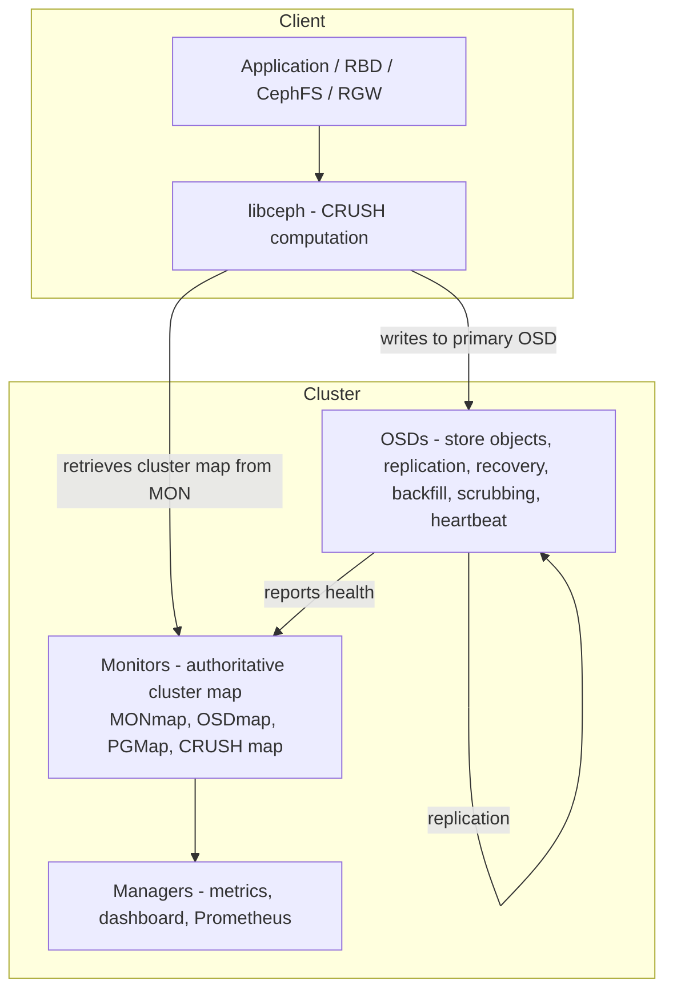
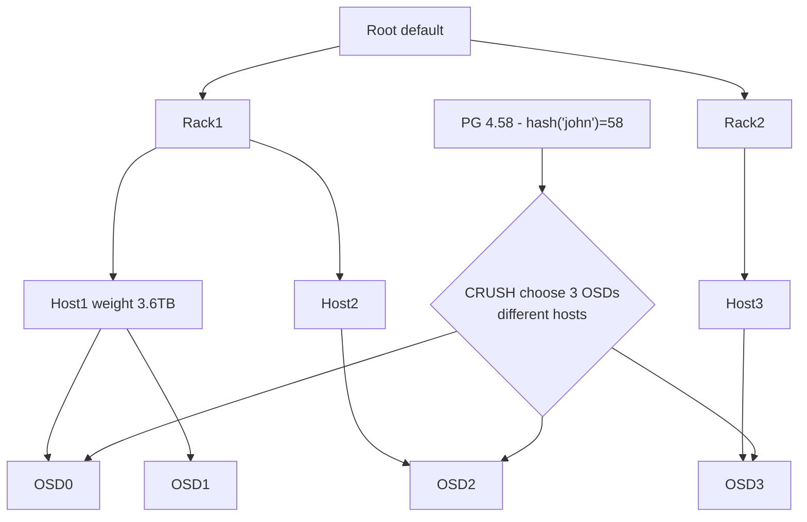

# Ceph CRUSH & RADOS Deep Dive

## Overview

**Ceph** is a distributed, self-healing object store with **no central metadata bottleneck**. Its secret is **CRUSH (Controlled Replication Under Scalable Hashing)** — a pseudo-random, deterministic algorithm that computes object location from cluster map, not from lookup service. Coupled with **RADOS (Reliable Autonomic Distributed Object Store)** — monitors, OSDs, PGs — Ceph scales linearly to exabytes.

> Related: [Ceph Overview](./ceph.md), [Distributed Storage](./distributed.md), [Erasure Coding](./erasure-coding.md), [Consistency Models](../dbms/distributed/consistency.md)

## RADOS Architecture



- **MON**: maintains authoritative cluster map (CRUSH map, OSD map, PG map, pool properties). Paxos/Raft-like consensus (Paxos until Pacific, now using `paxos` + `cephx`).
- **OSD**: stores objects on Bluestore (RocksDB + raw blocks). Handles replication, recovery, backfill, scrubbing (deep scrub verifies checksums), heartbeats.
- **MGR**: metrics, dashboard, Prometheus exporter, balancer module.

## No Metadata Lookup — Computation, Not Query

Traditional distributed FS (HDFS namenode) has central metadata server — bottleneck. Ceph clients **compute location locally**:

```
object_name -> hash -> pool PG -> CRUSH map -> OSD list
```

Client retrieves cluster map from MON (small, ~MB), then computes object location without contacting MON. Scales linearly because no lookup service.

## Placement Groups (PGs) — Reducing Metadata

If each object tracked individually, metadata explodes (10B objects). PGs aggregate objects into groups mapped to OSDs together.

- Each pool has **N PGs** (e.g., 128, 256, 512 — power of 2).
- Object → PG: `pg = hash(object_name) % num_PGs` + pool ID prefix (e.g., `pool 4.58` = pool 4, PG 58).
- PG → OSDs via CRUSH (e.g., PG mapped to OSDs [3,7,12] for replication size 3).

Benefits: tracking PGs (hundreds) vs objects (billions) reduces metadata overhead.

Recommended PG calculation:

```
Total PGs = (Target PGs per OSD * Total OSDs * Pool Data %) / Replication Factor
Round up to nearest power of 2
```

- Small cluster <5 OSDs: 128 PGs per OSD
- Medium 5-10 OSDs: 128-256
- Large 10-50 OSDs: 128-256
- Very large >50 OSDs: 100-200 to reduce memory overhead (each PG uses ~10-50KB RAM, peering expensive).

Example: 24 OSDs, replication 3, target 128 per OSD, pool holds 25% data → raw 256 → recommended 256 PGs.

## CRUSH Algorithm — Controlled Replication Under Scalable Hashing

Weil's CRUSH, designed for RADOS, is stable when many devices join/leave — only minimal data moves to re-balance, vs classic consistent hashing where massive rebalance would be needed.

CRUSH map is hierarchy: root → datacenter → room → row → rack → host → OSD, with weights (e.g., host straw 1 replica per host, rack straw 2 servers per rack).

Ruleset defines placement constraints: e.g., `chooseleaf firstn 3 type host` means 3 replicas on different hosts.

Properties:

- **Deterministic**: same object + same cluster map → same OSD list
- **Scalable**: no central lookup
- **Stability**: adding/removing OSD moves ~ `1/N` data, not all
- **Customizable**: via CRUSH map edit, you can declare failure domains (host, rack, row, datacenter) to ensure replicas not on same rack.



Administrators create custom CRUSH map:

```bash
ceph osd getcrushmap -o crush.running.map
crushtool -d crush.running.map -o crush.txt
# edit crush.txt - add host, rack rules
crushtool -c crush.txt -o crush.new.map
ceph osd setcrushmap -i crush.new.map
```

## OSD Internals — Shard-Based Concurrency

OSD daemon architecture: PGs distributed across `OSDShard` instances, each shard own thread pool + work queue, so normal I/O doesn't require global PG map lock. Operations enqueued via `OSDService::enqueue_back()` / `enqueue_front()`.

PG peering state machine coordinates distributed consistency: peering → active → clean, plus recovery/backfill states.

Replication backends: replicated vs erasure coded (e.g., 10+4). Erasure uses `jerasure` or `isa` plugin.

Scrubbing: light scrub (metadata) vs deep scrub (data + checksums). `OsdScrub` and `PgScrubber` manage scheduling.

## Data Striping

Client stripes large object into stripe units, maps stripe units to different RADOS objects, then CRUSH maps each object to PG → OSD. Striping params immutable after write. Used by CephFS for large files.

Since client writes to single pool, all striped objects share same CRUSH map and access controls.

## Failure & Recovery

- **Heartbeat**: OSDs ping peers, report to MON. If down, MON marks `down` + `out` after grace.
- **Peering**: surviving OSDs in PG's acting set elect primary, compare logs, decide missing objects.
- **Recovery**: primary pulls missing objects from peers, writes.
- **Backfill**: when new OSD added, data redistributed — CRUSH computes new mapping, minimal data movement.

## Tuning & Operations (Rook-Ceph)

```bash
# Toolbox
kubectl exec -it deploy/rook-ceph-tools -n rook-ceph -- bash
ceph osd dump
ceph pg stat
ceph pg dump | head -20
rados -p replicapool ls | head -20
ceph osd crush tree
ceph osd crush reweight osd.5 3.5 # weight = TiB usable
ceph osd pool set rbd_pool pg_num 256
ceph osd pool set rbd_pool pgp_num 256 # pgp_num effective
```

Balancer module (`ceph balancer on`) auto-reweights for even distribution.

## Interview Questions

**Q: How does Ceph avoid central metadata bottleneck?**
Clients compute object location via CRUSH using cluster map retrieved from MONs. No metadata server query per I/O. MON only provides map, OSDs handle replication.

**Q: What are PGs and why not track objects directly?**
PG aggregates objects into groups mapped to OSDs together. Tracking 10B objects individually metadata heavy. Tracking 256 PGs reduces overhead.

**Q: Explain CRUSH stability when adding new disk.**
CRUSH is pseudo-random but deterministic with hierarchy and weights. When adding OSD, only `1/N` data moves to new OSD to rebalance, vs consistent hashing where many keys move. Because CRUSH chooses via hierarchical straw algorithm, minimal data transfer.

**Q: How does CRUSH ensure replicas on different racks?**
Via CRUSH rule: `step chooseleaf firstn 3 type host` or `type rack`. Map hierarchy includes rack/host levels with failure domain. Rule ensures replicas on distinct failure domains.

**Q: What happens when OSD fails?**
Heartbeat timeout → MON marks down. If out, PGs that had that OSD as primary/acting remap via CRUSH to other OSDs. Peering elects new primary, recovery pulls missing objects from surviving replicas.

## Cross-References

- [Ceph Overview](./ceph.md) — basic
- [Distributed Storage](./distributed.md) — overview
- [Erasure Coding](./erasure-coding.md) — 10+4 Reed-Solomon used in Ceph cache tier
- [Consistency Models](../dbms/distributed/consistency.md) — Ceph provides strong consistency per PG via primary
- [RADOS Architecture](https://docs.ceph.com/en/latest/architecture/) — official docs

## References

- OneUptime — How to Understand Ceph RADOS Architecture: MON/MGR/OSD, object_name->hash->PG->CRUSH->OSD list, cluster map [OneUptime RADOS]
- DeepWiki — OSD Service and Placement Groups: OSDShard thread pool, enqueue_back/front, object-to-PG mapping, scrubbing OsdScrub/PgScrubber [DeepWiki]
- Ceph Docs — Architecture: scalability/hyperscale smart daemons, client computes location via CRUSH, pools size/replicas/CRUSH rule/PGs, PG ID calc pool ID + hash % PGs, dynamic cluster management [Ceph Docs]
- ADMIN Magazine — RADOS and Ceph Part 2: PGs, CRUSH map Controlled Replication Under Scalable Hashing, replication at PG level, custom crush map via `ceph osd getcrushmap` [ADMIN]
- OneUptime — Ceph Placement Group Tuning: formula Total PGs = (Target PGs per OSD * Total OSDs * Pool %)/Replication, power of 2, cluster sizes [OneUptime PG Tuning]
