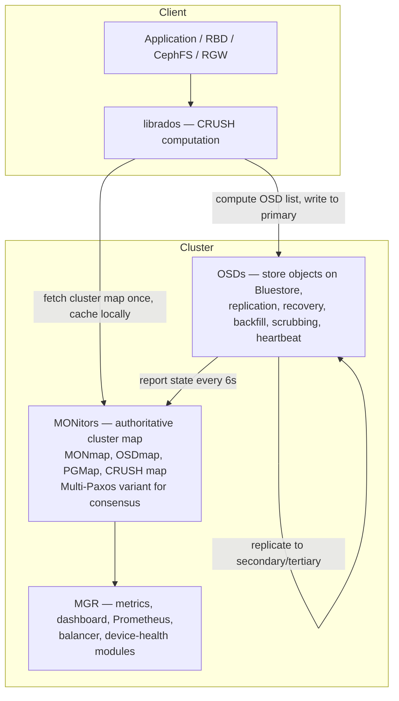
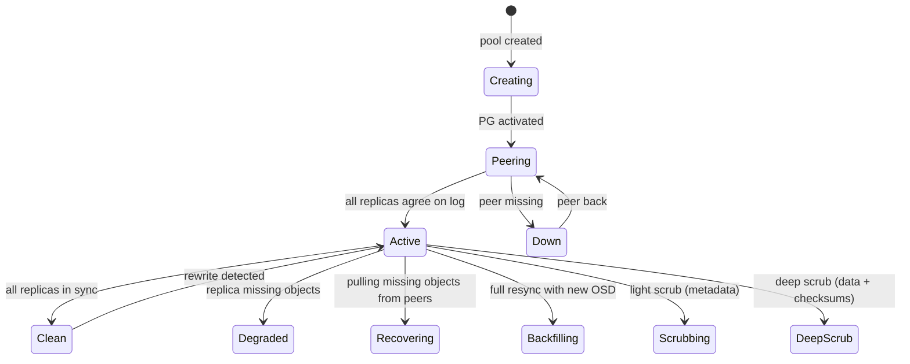
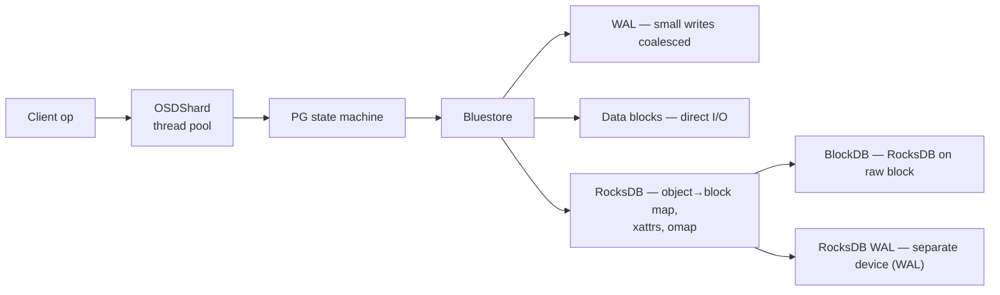

# Ceph CRUSH & RADOS Deep Dive

## Overview

**Ceph** is a distributed, self-healing object store with **no central metadata bottleneck**. Its secret is **CRUSH (Controlled Replication Under Scalable Hashing)** — a pseudo-random, deterministic algorithm that computes object location from the cluster map, not from a lookup service. Coupled with **RADOS (Reliable Autonomic Distributed Object Store)** — monitors, OSDs, PGs — Ceph scales linearly to exabytes.

Three properties make CRUSH distinctive among distributed placement algorithms:

- **Determinism**: any client, given the same cluster map and object name, computes the same OSD list. No coordination is needed for the read path.
- **Stability**: when an OSD is added or removed, only `~1/N` of the data moves to rebalance — the same K/N-stability property that classic consistent hashing (Karger et al. 1997) provides.
- **Failure-domain awareness**: the CRUSH map is a weighted hierarchy (root → datacenter → room → row → rack → host → OSD), and CRUSH rules constrain replicas to distinct failure domains, which naive consistent hashing does not provide.

> Related: [Ceph Overview](./ceph.md), [Distributed Storage](./distributed.md), [Erasure Coding](./erasure-coding.md), [Consistency Models](../dbms/distributed/consistency.md), [B-Trees & LSM-Trees](../dbms/indexing/README.md)

## RADOS Architecture



- **MON**: maintains the authoritative cluster map (CRUSH map, OSD map, PG map, pool properties). Uses a variant of Multi-Paxos to reach consensus on cluster-map updates. `cephx` is the Ceph authentication protocol (Kerberos-style mutual auth), not a consensus algorithm. Production clusters typically run 3 or 5 MONs for quorum.
- **OSD**: stores objects on Bluestore (RocksDB for metadata + raw block device for data). Each OSD daemon handles replication, recovery, backfill, scrubbing (deep scrub verifies checksums), heartbeats, and per-PG peering state. A typical OSD serves one disk or NVMe device.
- **MGR**: active/passive manager pair that exposes metrics, the dashboard, the Prometheus exporter, and the `balancer`, `devicehealth`, `pg_autoscaler`, and `telemetry` modules. The MGR is stateless — its data lives in the MON's metadata.

## No Metadata Lookup — Computation, Not Query

Traditional distributed filesystems like HDFS use a central namenode as the metadata server — a bottleneck under heavy load. Ceph clients **compute the location locally**:

```
object_name → hash → (pool, PG) → CRUSH map → OSD list
```

The client fetches the cluster map from a MON once (it is small, on the order of megabytes even for 10 000-OSD clusters), caches it locally, and computes every subsequent object location without contacting the MON. The MON is therefore only consulted on cluster-map changes (OSD failures, additions, weight changes), which is rare relative to the I/O rate. This is the architectural reason Ceph scales linearly: there is no lookup service in the data path.

## Placement Groups (PGs) — Reducing Metadata

If each object were tracked individually, the cluster's metadata would explode (10 billion objects in a large cluster is normal). PGs aggregate objects into groups that are mapped to OSDs together.

- Each pool has **N PGs** (e.g., 128, 256, 512 — a power of 2).
- Object → PG: `pg = hash(object_name) % num_PGs`, prefixed with the pool ID (e.g., `4.58` = pool 4, PG 58).
- PG → OSDs via CRUSH (e.g., PG mapped to OSDs `[3, 7, 12]` for replication factor 3).

Benefits: the cluster tracks thousands of PGs rather than billions of objects. PG state (peering, recovery progress, backfill position) is per-PG, not per-object.

Recommended PG calculation (the `pg_autoscaler` module computes this automatically when enabled):

```
Total PGs = (Target PGs per OSD × Total OSDs × Pool Data %) / Replication Factor
Round up to nearest power of 2
```

Rule-of-thumb targets per OSD:

| Cluster size | Target PGs per OSD | Rationale |
|--------------|--------------------|-----------|
| Small (< 5 OSDs) | 128 | Each OSD tracks few PGs; peering is cheap |
| Medium (5–10 OSDs) | 128–256 | Balanced |
| Large (10–50 OSDs) | 128–256 | Peering cost grows linearly |
| Very large (> 50 OSDs) | 100–200 | Each PG uses ~10–50 KB RAM on every OSD; peering becomes expensive |

Example: 24 OSDs, replication 3, target 128 per OSD, pool holds 25 % of cluster data → `(128 × 24 × 0.25) / 3 = 256` → recommended 256 PGs (already a power of 2).

The `pgp_num` (`placement groups for placement`) parameter controls how many PGs are actually used for placement — it equals `pg_num` after the cluster has finished splitting. During a PG-split operation, `pg_num` is increased first and `pgp_num` follows once peering completes, so reads continue to be served from the old PG layout while the new layout is being prepared.

## CRUSH Bucket Types

The CRUSH map is a hierarchy of *buckets* (interior nodes) and *devices* (leaves, i.e., OSDs). Each bucket has an algorithm that decides how its children are selected when CRUSH descends into it. Ceph supports four bucket algorithms; the choice trades off rebalancing cost against computation cost.

| Bucket type | Algorithm | When OSD added/removed | Use case |
|-------------|-----------|------------------------|----------|
| **uniform** | Modulo hash on bucket ID | Almost all items reorganize | Stable, fixed-size buckets (rarely used) |
| **list** | Linked list, weights summed linearly | New items appended; old items unaffected | Small buckets that grow slowly (legacy) |
| **tree** | Weighted binary tree, O(log N) lookup | Only subtree along the changed path is affected | Large buckets (> 1000 items) where straw is too slow |
| **straw** | Each item draws a random "straw"; longest wins | Minimal reorganization | Default; works well up to a few hundred items |
| **straw2** | Improved straw: weight-based, no correlation between sibling items | Minimal, only `1/N` of data moves | **Default since Ceph Jewel (2016)**; supersedes straw |

### Straw2 Algorithm — How It Actually Picks

For each child `i` with weight `w_i`, CRUSH draws a pseudo-random value `u_i` drawn from a hash of `(PG_id, child_id, retry_count)`. It then computes a "straw length":

```
straw_i = (w_i / sum_of_weights) × ln(u_i / (1 - u_i))
```

Wait, that is the classic straw formulation. The actual **straw2** algorithm in Ceph computes a draw `draw_i` and adjusts by an item-specific function:

```
draw_i = hash(pg_id, child_i, retry) mod FIXED_MAX
adjusted_i = f(draw_i, w_i)
```

where `f` is a function that scales the draw non-linearly by weight so that the probability of `i` being the maximum is proportional to `w_i / sum(w_j)`. The child with the largest `adjusted_i` wins. The point is that adding or removing a child only changes the winning probabilities for the siblings of that child — siblings in unrelated subtrees are unaffected, which is what gives CRUSH its `1/N`-stability property.

The full straw2 internal computation is documented in the Ceph source (`src/crush/mapper.c`); the high-level behavior is: each child competes independently with a weighted pseudo-random draw, the heaviest-weighted child wins most often, and adding a new child only redistributes data among the existing siblings of that child's bucket.

## CRUSH Rules

A CRUSH rule is a sequence of `take` / `choose` / `emit` steps that drives the placement computation. Example rule for a replicated pool that places three replicas on distinct hosts:

```
rule replicated_ruleset {
    id 0
    type replicated
    min_size 1
    max_size 10
    step take default
    step chooseleaf firstn 3 type host
    step emit
}
```

Step-by-step:

1. `take default` — start at the root bucket named `default`.
2. `chooseleaf firstn 3 type host` — select 3 distinct `host` buckets (descend into each to pick a leaf OSD). `firstn` returns the first N matches; `indep` returns N matches but tries to keep stable on retry.
3. `emit` — output the resulting OSD list.

Rule types:

- **replicated**: each replica is a single OSD. `size = 3` means 3 OSDs per object.
- **erasure**: each "replica" is a stripe chunk; `k+m` OSDs are selected. e.g., `k=10, m=4` means 14 OSDs per object.

The `chooseleaf` vs `choose` distinction: `choose` returns buckets of the named type; `chooseleaf` descends into each chosen bucket to pick a single leaf (OSD) within it. The `firstn` variant returns the first N matches; `indep` returns N matches but is more stable under failure (used for erasure-coded pools where chunk position matters).

## The upmap Balancer Override

Pure CRUSH has a known weakness: the pseudo-random distribution is statistically uniform but, at small scales, individual OSDs can end up significantly over- or under-filled. The **upmap** mechanism (Ceph Luminous+, 2017) lets the balancer module override CRUSH's choice for a specific PG by directly setting the up/set mapping — moving a single PG to a different OSD without touching the CRUSH map.

```
Normal:   PG 4.58 → CRUSH → [osd.3, osd.7, osd.12]
Upmap:    PG 4.58 → balancer table → [osd.3, osd.7, osd.18]   # osd.12 was over-full
```

The balancer module (`ceph balancer on`) continuously scans for PGs whose movement would reduce variance and submits upmap entries to the MON. This achieves ~1 % utilization variance across OSDs, compared to ~10 % for pure CRUSH. It is the default mode in modern Ceph.

## PG States — The Peering State Machine

A PG moves through a state machine driven by the OSDs that hold it:



Key states:

- **creating** — PG has been allocated but not yet peered.
- **peering** — the OSDs that hold the PG negotiate the authoritative log; they exchange `pg_info_t` and `pg_log_t` structures.
- **active** — the PG is serving client I/O.
- **clean** — all replicas have all objects, fully consistent.
- **degraded** — some objects are missing replicas; reads may still be served from the primary.
- **recovering** — missing objects are being copied from surviving replicas.
- **backfilling** — a new OSD has joined the acting set and is doing a full content scan (used when the new OSD has no log history for this PG).
- **scrubbing** / **deep** — light scrub checks object metadata; deep scrub reads every object and verifies checksums (catches silent bit rot).

Peering is governed by a Paxos-variant called **PGLOG**, which is a write-ahead log of object mutations. The primary OSD proposes log entries; replicas acknowledge; the primary advances the "commit" position. This is per-PG, so the cluster has thousands of independent Paxos instances, each scoped to one PG.

## OSD Internals — Bluestore and Shard-Based Concurrency

The OSD daemon is a multi-threaded process that runs PGs across `OSDShard` instances, each shard owning a subset of PGs with its own thread pool and work queue. This means normal I/O does not require a global PG-map lock — sharding enables near-linear scaling as OSDs are added.

**Bluestore** is the default object store backend (replaced Filestore in Ceph Luminous). It writes objects directly to a raw block device, bypassing the filesystem, and uses RocksDB to store metadata (object → block mapping, xattrs, omap). Architecture:



- **WAL**: write-ahead log for Bluestore itself; small writes are coalesced here before being flushed to data blocks. The WAL device can be a faster SSD separate from the data device.
- **BlockDB**: RocksDB's storage; can also be placed on a faster SSD.
- **Blob sharing**: Bluestore shares large blobs across objects when objects have overlapping content (deduplication at the block level), reducing space for cloned VM images.

## Replication vs Erasure Coding

Ceph pools are either **replicated** (default) or **erasure-coded**. The choice is per-pool.

| Aspect | Replicated | Erasure-coded |
|--------|------------|---------------|
| Storage overhead | 3× for size 3 | 1.4× for k=10, m=4 |
| Durability | Tolerates 2 failures | Tolerates 4 failures (with k=10, m=4) |
| Write performance | Fast (3 writes) | Slower (encoding + 14 writes) |
| Read performance | Fast (1 read from primary) | Slower (reconstruct if missing) |
| Random overwrite | Native | Requires partial-stripe write or cache tier |
| Use case | Hot data, RBD images | Cold/warm data, S3 RGW storage class |

Erasure-coded pools cannot serve random overwrites efficiently because rewriting a single byte requires recomputing the parity stripe. Ceph's workaround is a **cache tier**: writes go to a small replicated pool, and a background `cache-flusher` migrates cold objects to the erasure-coded pool. For RBD images, erasure coding is rarely used directly; instead, RBD images live in a replicated pool and only their snapshots are tiered to erasure-coded storage.

## Upper-Layer Services: RBD, CephFS, RGW

RADOS is the foundation; three services sit on top:

- **RBD (RADOS Block Device)**: thin-provisioned block devices striped across RADOS objects. Each 4 MB block of an RBD image is a separate RADOS object, so reads/writes parallelize across OSDs. Live migration, snapshots, cloning (copy-on-write), and mirroring (asynchronous, for disaster recovery) are supported. The Linux `rbd` kernel module maps RBD images as block devices.
- **CephFS**: POSIX-compliant filesystem. Metadata server (MDS) cluster stores directory structure in RADOS; file data goes directly to RADOS objects. Multiple active MDSs share the metadata workload. Supports snapshotting, quotas, and multi-filesystem tenancy.
- **RGW (RADOS Gateway)**: S3- and Swift-compatible object storage. Each bucket's objects are stored in a RADOS pool; bucket indices are stored as RADOS omap keys. Supports multisite replication (asynchronous, log-based) for cross-region disaster recovery, lifecycle policies, and S3 Select.

## Failure & Recovery

- **Heartbeat**: OSDs ping peers every 6 s; if no response within 20 s (default `osd_heartbeat_grace`), the OSD is reported to the MON. After a grace period (`mon_osd_down_out_interval`, default 300 s), the MON marks it `down` and `out`, and CRUSH remaps its PGs to other OSDs.
- **Peering**: surviving OSDs in a PG's acting set elect a primary, exchange log positions, and decide which objects are missing.
- **Recovery**: the primary pulls missing objects from peers and writes them locally. Recovery is throttled (`osd_recovery_max_active`, `osd_recovery_op_priority`) so it does not starve foreground I/O.
- **Backfill**: when a brand-new OSD joins the acting set, it has no log history for that PG, so the primary streams the entire PG content to it. Backfill is the slowest recovery mode — a large PG can take hours to backfill, which is why the `pg_autoscaler` is conservative about splitting PGs.

## Tuning & Operations

```bash
# Inspect cluster state
ceph status                       # one-line health summary
ceph osd tree                     # CRUSH hierarchy with weights
ceph osd df                       # per-OSD utilization
ceph pg dump | head -20           # PG state dump
ceph osd getcrushmap -o crush.map # extract CRUSH map
crushtool -d crush.map -o crush.txt
# edit crush.txt — add host, rack rules
crushtool -c crush.txt -o crush.new.map
ceph osd setcrushmap -i crush.new.map

# Test CRUSH behavior for an object
crushtool -i crush.map --test --min-x 0 --max-x 10 --num-rep 3 \
    --rule 0 --show-utilization

# Reweight an OSD (weight = TiB usable)
ceph osd crush reweight osd.5 3.5

# Change a pool's PG count (online, slow)
ceph osd pool set rbd_pool pg_num 256
ceph osd pool set rbd_pool pgp_num 256

# Enable the balancer and upmap
ceph balancer on
ceph balancer mode upmap

# Enable pg_autoscaler
ceph mgr module enable pg_autoscaler
ceph osd pool set rbd_pool pg_autoscale_mode on
```

## Performance Characteristics

Representative numbers for a healthy cluster (varies widely with hardware):

- **IOPS per OSD**: NVMe OSD ~50 000 random 4 KB reads; SATA SSD ~10 000; HDD ~100.
- **Latency**: 4 KB read latency ~0.5 ms on NVMe, ~2 ms on SATA SSD, ~10 ms on HDD. Replication adds 0.5–1× latency for the secondary ack.
- **Recovery rate**: ~50–200 MB/s per OSD, throttled to protect foreground I/O.
- **Cluster-wide throughput**: scales linearly with OSD count for sequential I/O; random I/O scales linearly until the MON's PG-map update rate becomes a bottleneck (~100 000 PGs total in the cluster).

## Comparison With Other Distributed Storage Systems

| Aspect | Ceph | HDFS | MinIO | Amazon S3 |
|--------|------|------|-------|-----------|
| Placement | CRUSH (computational) | Namenode (lookup) | Erasure-set hashing | Closed |
| Replication | Per-pool (size 3 default) | 3x fixed | Erasure default | Closed |
| Failure domain | Hierarchical CRUSH | Rack-aware | Server-aware | Region |
| Block device | RBD | n/a (files) | n/a | n/a |
| Filesystem | CephFS (POSIX) | HDFS API only | n/a | n/a |
| Object API | RGW (S3/Swift) | n/a | S3 | S3 |
| Metadata server | None (MON only) | Namenode (SPOF) | None | Closed |
| Best for | Unified block/file/object | Big-data Hadoop | Pure S3 workloads | Managed object |

## Interview Questions

**Q: How does Ceph avoid the central metadata bottleneck that plagues HDFS?**
Clients compute object location locally via CRUSH using the cluster map retrieved from MONs. The cluster map is small (megabytes), fetched once, and cached. No metadata server query is needed per I/O. The MON only provides the map and is consulted on cluster-map changes, which is rare relative to the I/O rate.

**Q: What are PGs and why not track objects directly?**
A Placement Group aggregates objects into groups that are mapped to OSDs together. Tracking 10 billion objects individually would be metadata-heavy on every OSD. Tracking a few thousand PGs reduces per-OSD memory and makes peering tractable (a PG has a single log; an object does not).

**Q: Explain CRUSH stability when adding a new disk.**
CRUSH is pseudo-random but deterministic, with a weighted hierarchy. When an OSD is added, the new bucket changes the sibling weights only in its immediate parent bucket; siblings in unrelated subtrees are unaffected. The result is that only `~1/N` of the data moves to the new OSD to rebalance. This K/N-stability is the same property classic consistent hashing provides; CRUSH's distinct advantage over consistent hashing is its failure-domain-aware hierarchy and per-OSD weighting.

**Q: How does CRUSH ensure replicas are on different racks?**
Via a CRUSH rule: `step chooseleaf firstn 3 type rack` selects 3 distinct rack buckets and descends into each to pick a leaf OSD. The CRUSH map's hierarchy includes rack/host levels with weights; the rule's `type` parameter constrains the failure domain.

**Q: What is the difference between `straw` and `straw2` bucket algorithms?**
`straw2` (default since Ceph Jewel, 2016) is an improved straw algorithm where each child's winning probability is strictly proportional to its weight, with no correlation between sibling items. The original `straw` had subtle correlations between siblings that caused small biases when weights were uneven. `straw2` is strictly better and is the default for all bucket sizes up to a few hundred items; for larger buckets, `tree` is faster (O(log N) instead of O(N)).

**Q: What is the upmap balancer and why does it exist?**
Pure CRUSH produces a statistically uniform distribution, but at small scales individual OSDs can deviate by ±10 % from the mean. The upmap mechanism lets the balancer module override CRUSH's choice for a specific PG by directly setting the up/set mapping in a separate table. The balancer continuously scans for PGs whose movement would reduce variance and submits upmap entries to the MON. This achieves ~1 % utilization variance, an order of magnitude better than pure CRUSH.

**Q: What happens when an OSD fails?**
Heartbeat timeout → MON marks the OSD `down` and (after grace) `out`. PGs that had that OSD in their acting set are remapped via CRUSH (or upmap) to other OSDs. The new acting set peers, elects a primary, and recovery pulls missing objects from surviving replicas. Foreground I/O continues from the primary during recovery, with degraded-mode reads if the missing replica is needed.

**Q: Why does Bluestore bypass the filesystem?**
Writing objects as files in a filesystem (the legacy Filestore backend) paid double-metadata cost: the filesystem's inode table plus Ceph's own object → file mapping. Bluestore writes objects directly to a raw block device, eliminating the inode layer, and uses RocksDB for the object → block mapping. This roughly doubles write throughput and reduces latency on the same hardware.

**Q: Why are erasure-coded pools not used for RBD images?**
Erasure coding does not support efficient random overwrites — rewriting a single byte requires recomputing the parity stripe. RBD images are random-write workloads. The standard pattern is to keep RBD images in a replicated pool and tier cold snapshots to an erasure-coded pool via the cache tier.

## Cross-References

- [Ceph Overview](./ceph.md)
- [Distributed Storage](./distributed.md)
- [Erasure Coding](./erasure-coding.md) — Reed-Solomon (k+m) used by Ceph's EC pools
- [LSM Compaction](./lsm-compaction.md) — RocksDB (Bluestore's metadata store)
- [WAL](./wal.md) — Bluestore's WAL device
- [Consistency Models](../dbms/distributed/consistency.md) — Ceph provides strong consistency per PG via primary
- [Distributed Consensus](../distributed/fundamentals/README.md) — Multi-Paxos (MON) and per-PG Paxos-variant (PGLOG)

## References

- Sage A. Weil et al. — "CRUSH: Controlled, Scalable, Decentralized Placement of Replicated Data" (SC 2006) — the original CRUSH paper
- Ceph Architecture documentation — https://docs.ceph.com/en/latest/architecture/
- Ceph CRUSH map documentation — https://docs.ceph.com/en/latest/rados/operations/crush-map/
- Bluestore design — https://docs.ceph.com/en/latest/rados/configuration/bluestore-config-ref/
- Sage Weil — "Ceph: Reliable, Scalable, and Manageable Storage" (doctoral dissertation, 2007)
- OneUptime — How to Understand Ceph RADOS Architecture: MON/MGR/OSD, object_name→hash→PG→CRUSH→OSD list, cluster map
- DeepWiki — OSD Service and Placement Groups: OSDShard thread pool, enqueue_back/front, object-to-PG mapping, scrubbing OsdScrub/PgScrubber
- ADMIN Magazine — RADOS and Ceph Part 2: PGs, CRUSH map, replication at PG level, custom crush map via `ceph osd getcrushmap`
