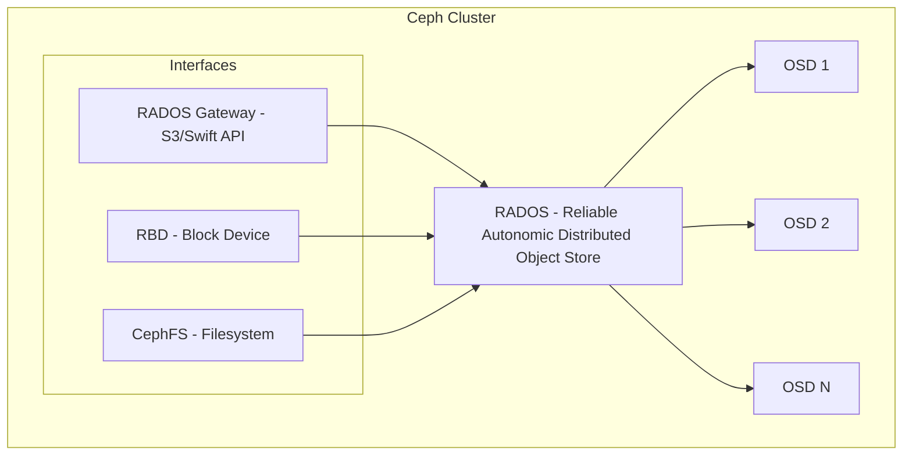
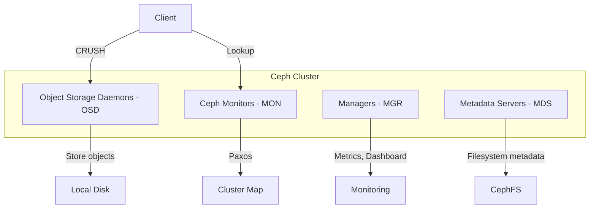
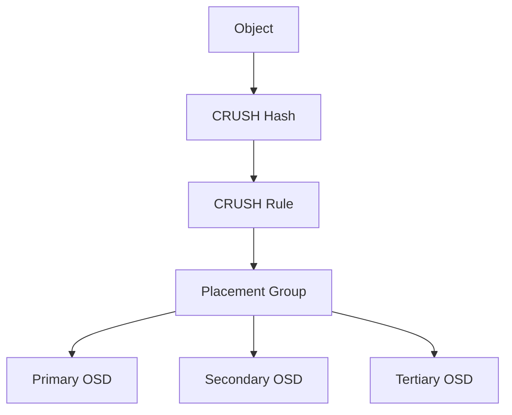
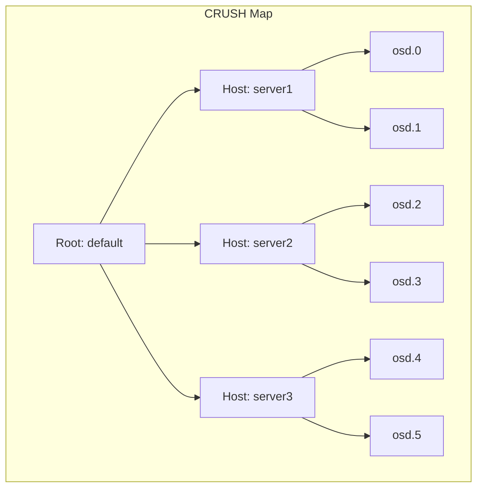
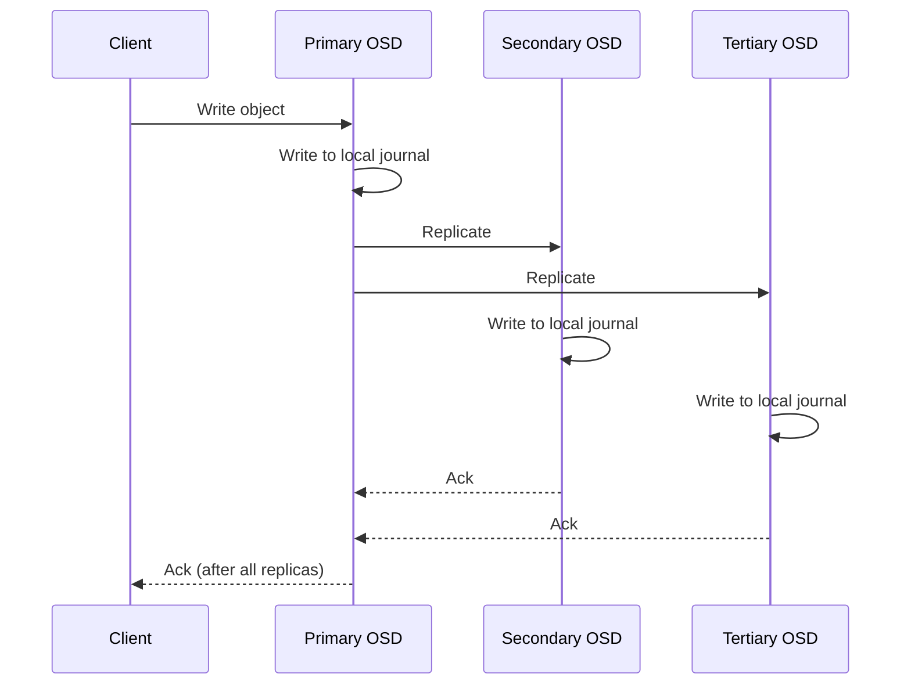
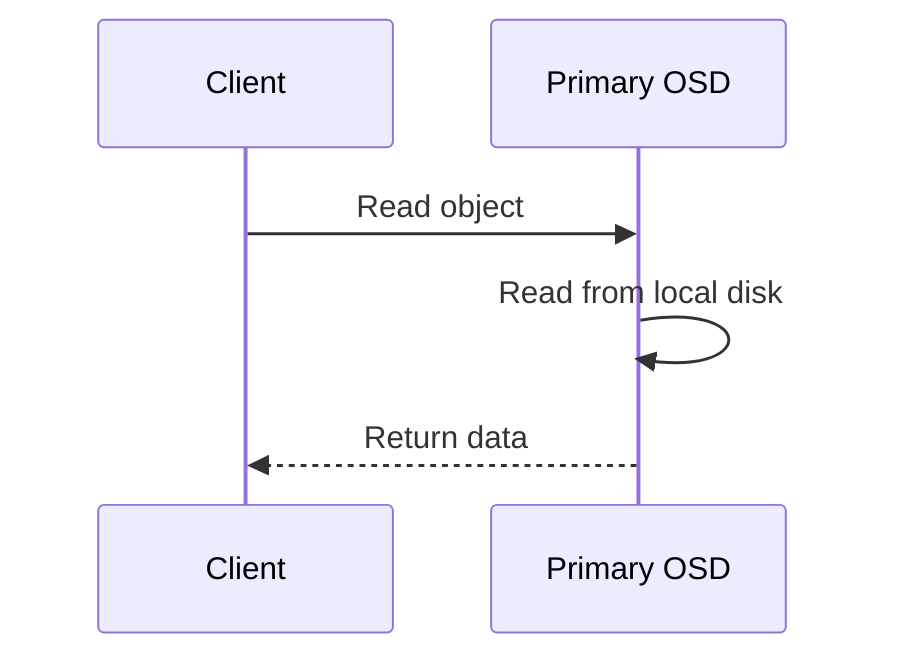
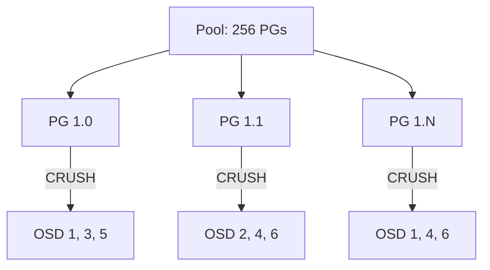
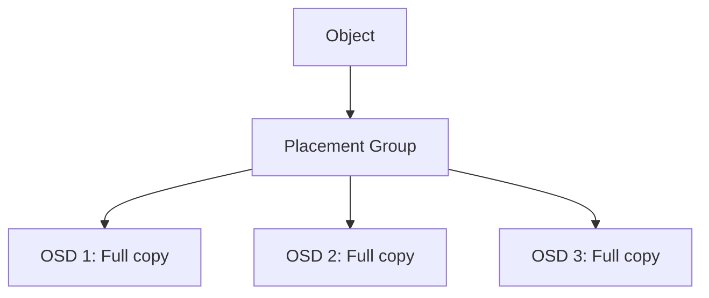
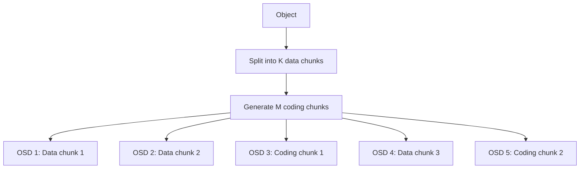
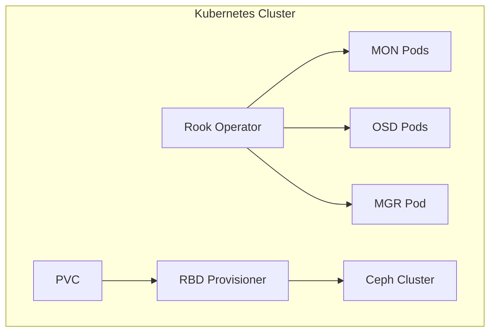

# Ceph Storage

## Overview

Ceph is an open-source, distributed storage platform that provides object, block, and file storage through a unified system. It's designed to scale to exabytes, self-heal, and run on commodity hardware. Ceph is widely deployed in private clouds (OpenStack, Kubernetes) and is the foundation of Red Hat OpenShift Data Foundation. Understanding Ceph's architecture is valuable for infrastructure and cloud engineering interviews.

## Architecture

### Unified Storage

- **RADOS Gateway (RGW)**: Object storage interface, S3 and Swift compatible.
- **RBD (RADOS Block Device)**: Block storage, used by OpenStack Nova, Kubernetes.
- **CephFS**: POSIX-compliant distributed filesystem.
- **RADOS**: The core object store that everything is built on.

### Core Components

- **MON (Monitor)**: Maintains cluster state map. Uses Paxos for consensus. Minimum 3 for quorum.
- **OSD (Object Storage Daemon)**: Manages a single disk. Handles replication, recovery, rebalancing. One OSD per disk.
- **MGR (Manager)**: Provides monitoring, dashboard, and orchestration. Active-standby pair.
- **MDS (Metadata Server)**: Only for CephFS. Manages file/directory metadata.

### CRUSH Algorithm

CRUSH (Controlled Replication Under Scalable Hashing) is Ceph's data placement algorithm:

1. Client computes object → Placement Group (PG) mapping (no lookup needed).
2. CRUSH computes PG → OSD mapping using the cluster map.
3. No central lookup table — clients can compute data locations independently.

CRUSH rules define failure domains (host, rack, datacenter) ensuring replicas don't share failure domains.

## Data Flow

### Write Path

### Read Path

Reads go to the primary OSD by default (ensures read-after-write consistency).

## Placement Groups (PGs)

- PGs are the unit of data management and replication.
- Each PG contains multiple objects.
- PGs are mapped to OSDs by CRUSH.
- **PG count**: Affects balance and overhead. Rule of thumb: ~100 PGs per OSD.

### PG States

| State | Meaning |
|-------|---------|
| active+clean | Normal, all replicas available |
| active+degraded | Some replicas missing, recovery in progress |
| active+undersized | Fewer replicas than configured |
| active+remapped | PG is being migrated to different OSDs |
| peering | PG is establishing consistency between replicas |

## Pools and Erasure Coding

### Replicated Pool

3× replication: 100 GB data → 300 GB storage used.

### Erasure Coded Pool

K+M erasure coding: 4+2 means 4 data chunks + 2 coding chunks. Can tolerate 2 OSD failures. 100 GB data → 150 GB storage (vs 300 GB with replication).

## Kubernetes Integration (Rook)

Rook is a Kubernetes operator that manages Ceph clusters as native K8s resources. It automates deployment, scaling, and management of Ceph on Kubernetes.

## Interview Questions

1. **Q: What is CRUSH and why is it important in Ceph?**
   A: CRUSH (Controlled Replication Under Scalable Hashing) is Ceph's data placement algorithm. It computes object → OSD mapping without a central lookup table, enabling clients to directly access OSDs. It respects failure domains (rack, host) to ensure replicas are on different failure domains. Adding/removing OSDs only moves a small fraction of data.

2. **Q: How does Ceph achieve high availability?**
   A: Data is replicated across multiple OSDs (default 3×). CRUSH ensures replicas are on different hosts/racks. Monitors use Paxos for cluster state consensus. If an OSD fails, Ceph automatically re-replicates data from remaining replicas to other OSDs. Recovery is automatic and ongoing.

3. **Q: What is the difference between Ceph's replicated and erasure-coded pools?**
   A: Replicated pools store full copies (3× storage overhead, fast reads from any replica). Erasure-coded pools split data into K chunks and compute M parity chunks (lower storage overhead, e.g., 4+2 = 1.5× overhead). EC is better for cold/archive data; replication is better for hot data due to lower read amplification.

4. **Q: How does Rook simplify Ceph on Kubernetes?**
   A: Rook is a Kubernetes operator that automates Ceph lifecycle management. It deploys MON, OSD, MGR pods, handles cluster scaling, monitors health, and provides CSI drivers for dynamic volume provisioning. It transforms Ceph into a cloud-native storage platform.

5. **Q: Explain the role of Placement Groups in Ceph.**
   A: PGs are the unit of data management. Objects are hashed to PGs, and PGs are mapped to OSDs by CRUSH. PGs simplify operations: instead of managing millions of objects, Ceph manages thousands of PGs. PG count affects data balance (too few = uneven, too many = overhead).

## Common Mistakes

- Wrong PG count — too few causes imbalance, too many wastes memory. Use the PG calculator.
- Not enough MONs — need odd number (3 or 5) for Paxos quorum.
- Mixing HDD and SSD OSDs without proper CRUSH rules — causes unpredictable performance.
- Not monitoring OSD disk space — Ceph stops accepting writes when OSDs are >85% full.
- Using EC pools for random I/O workloads — EC has higher read amplification (must read K chunks).

## Summary

Ceph provides unified object/block/file storage on top of RADOS. The CRUSH algorithm enables decentralized data placement respecting failure domains. Data is replicated or erasure-coded across OSDs for fault tolerance. Monitors maintain cluster state via Paxos. Rook enables Ceph on Kubernetes. For interviews, understand CRUSH, PGs, the write path (primary-backup replication), and the replication vs erasure coding trade-off.

## Cross-References

- [Erasure Coding](./erasure-coding.md) — Mathematical foundation
- [Distributed Storage](./distributed.md) — Underlying theory
- [Block Storage](./block-storage.md) — RBD provides block interface
- [Object Storage](./object-storage.md) — RGW provides S3 interface
- [Storage Overview](./overview.md) — Storage hierarchy
- [Cloud S3](../cloud/aws/s3.md)

