# Distributed Storage

## Overview

Distributed storage systems spread data across multiple machines to achieve scalability, fault tolerance, and performance beyond what a single machine can provide. Understanding distributed storage — replication, consistency, consensus, and partitioning — is essential for systems design interviews. This page covers the theoretical foundations and practical systems.

## Core Challenges

```mermaid
graph TD
    DS[Distributed Storage] --> C1[Data Partitioning]
    DS --> C2[Replication]
    DS --> C3[Consistency]
    DS --> C4[Failure Handling]
    DS --> C5[Consensus]

    C1 --> T1[How to split data across nodes?]
    C2 --> T2[How to keep copies in sync?]
    C3 --> T3[What does "up-to-date" mean?]
    C4 --> T4[What happens when nodes fail?]
    C5 --> T5[How do nodes agree on a value?]
```

## Data Partitioning

### Hash-Based Partitioning

```mermaid
graph TD
    KEY[Key: "user:1234"] --> HASH[hash("user:1234") % N]
    HASH --> N1[Node 0]
    HASH --> N2[Node 1]
    HASH --> N3[Node 2]
```

Simple but problematic when N changes — most keys remap.

### Consistent Hashing

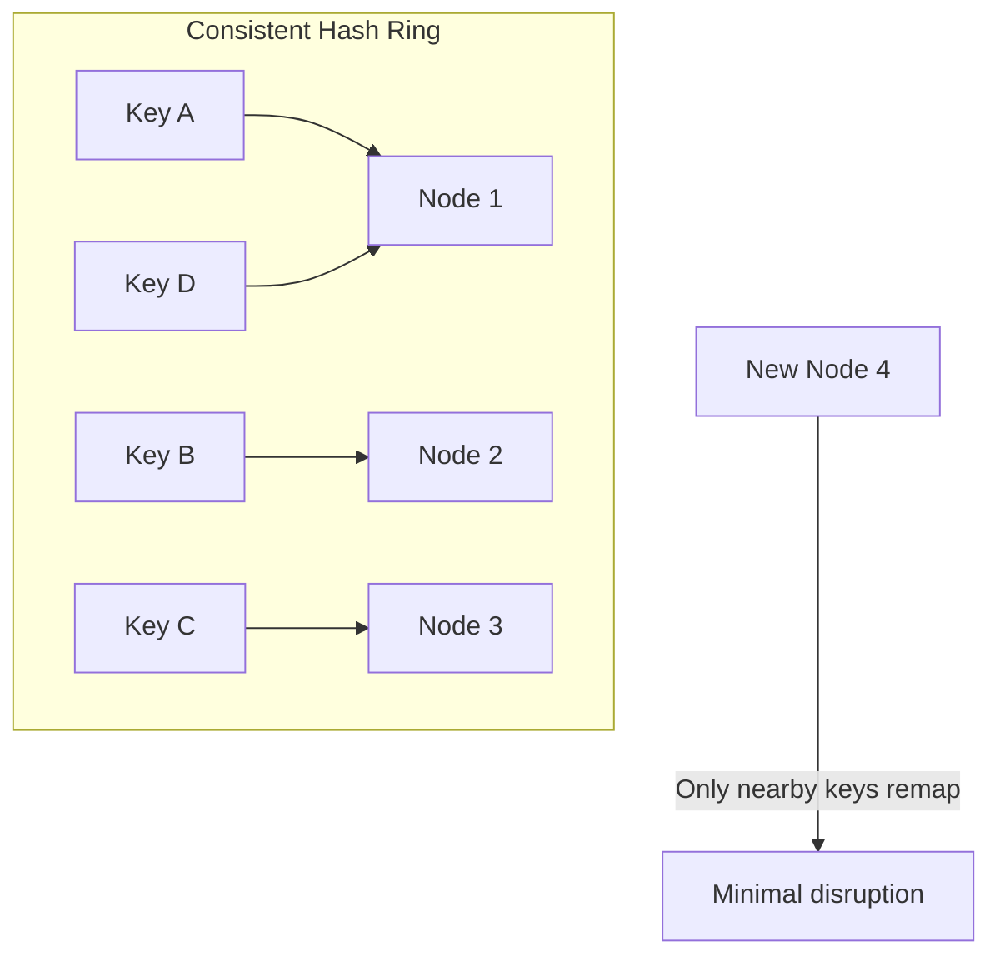

- Keys and nodes are hashed onto a ring (0 to 2^32 - 1).
- Each key is assigned to the next node clockwise.
- When a node is added/removed, only keys in that node's range move.
- **Virtual nodes**: Each physical node gets multiple positions on the ring for better balance.

### Range-Based Partitioning

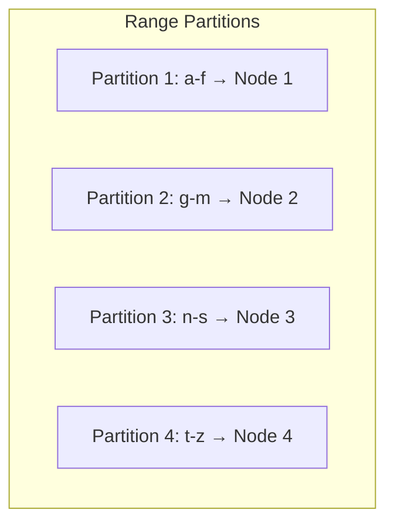

Keys are sorted and divided into ranges. Good for range queries but prone to hotspots.

## Replication Strategies

### Leader-Based Replication

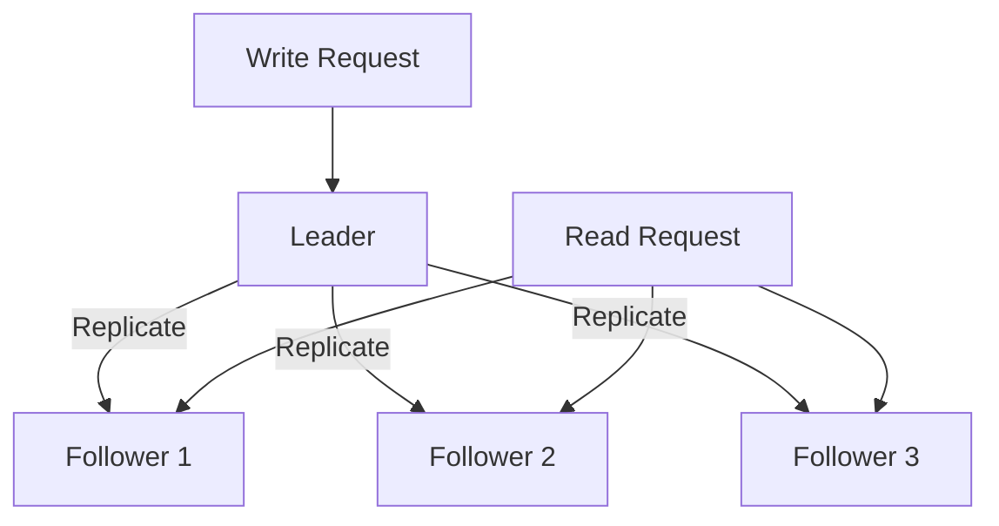

- All writes go to the leader.
- Leader replicates to followers (sync or async).
- Reads can go to followers (eventual consistency) or leader (strong consistency).

### Multi-Leader Replication

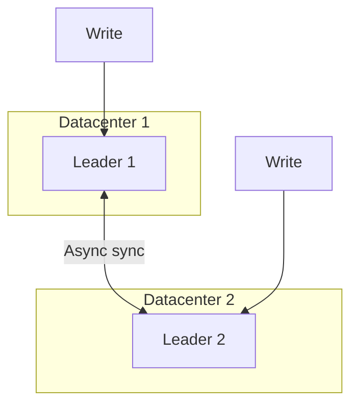

Each datacenter has a leader. Writes can happen at any leader. Conflicts must be resolved (last-write-wins, application-level merge).

### Leaderless Replication (Dynamo-style)

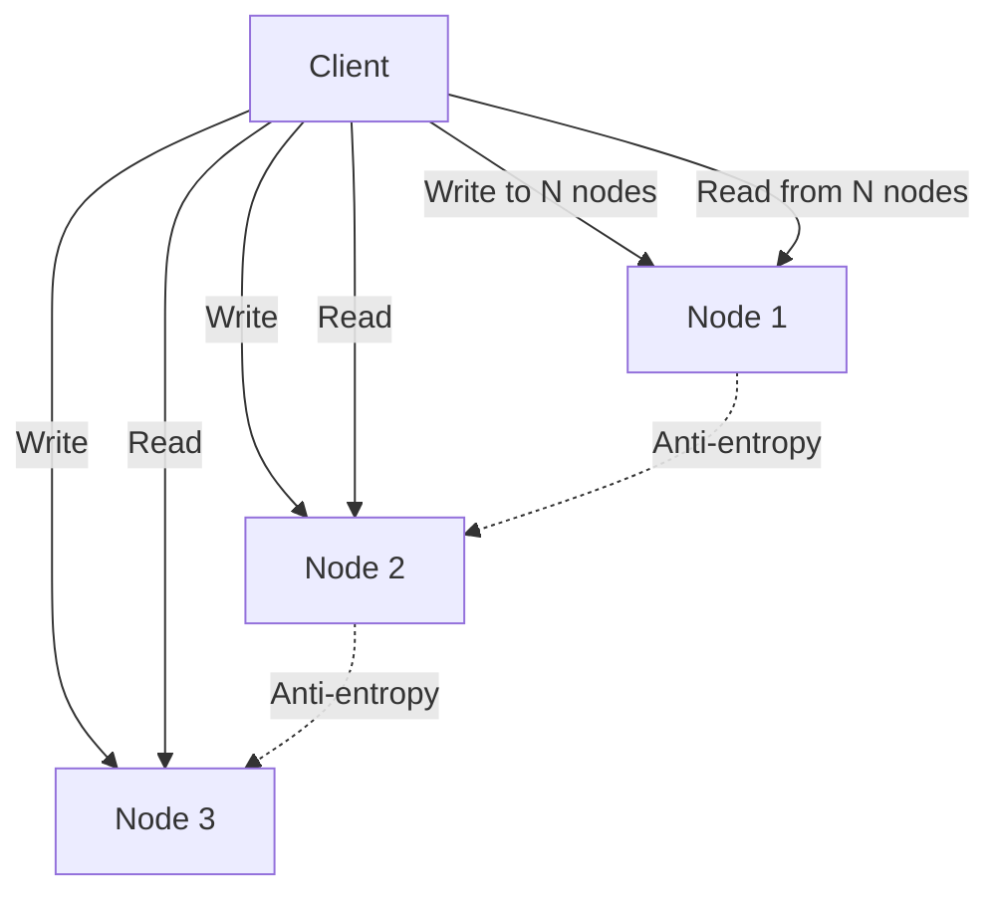

- **Quorum writes**: Write to W out of N nodes.
- **Quorum reads**: Read from R out of N nodes.
- **Quorum condition**: W + R > N ensures at least one node in the read set has the latest write.
- Typical: N=3, W=2, R=2.

## Consistency Models

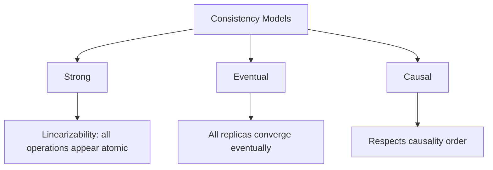

### Linearizability (Strongest)

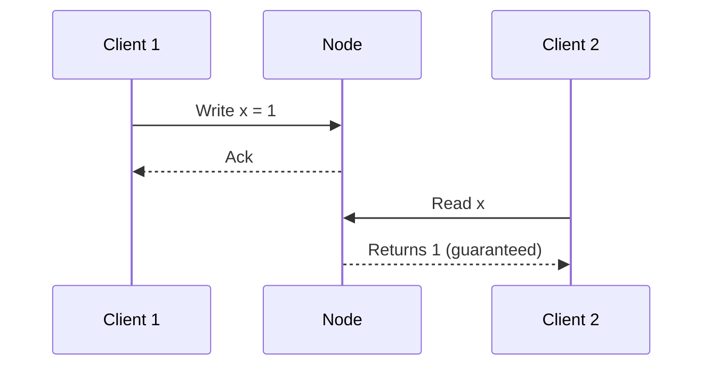

All operations appear to happen atomically at some point in time. Requires consensus (Paxos/Raft).

### Eventual Consistency

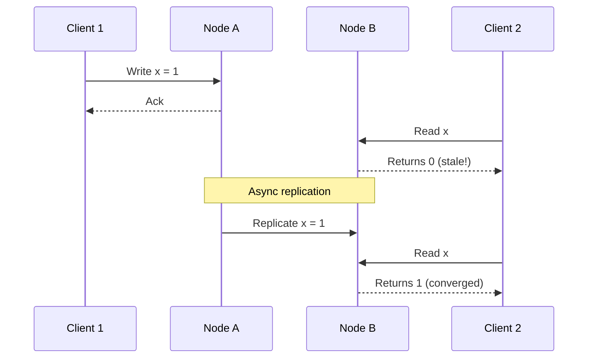

All replicas eventually converge. No guarantee when. Used by DynamoDB, Cassandra.

### Causal Consistency

Operations that are causally related are seen in the same order by all nodes. Concurrent operations may be seen in different orders.

## Consensus Algorithms

### Paxos

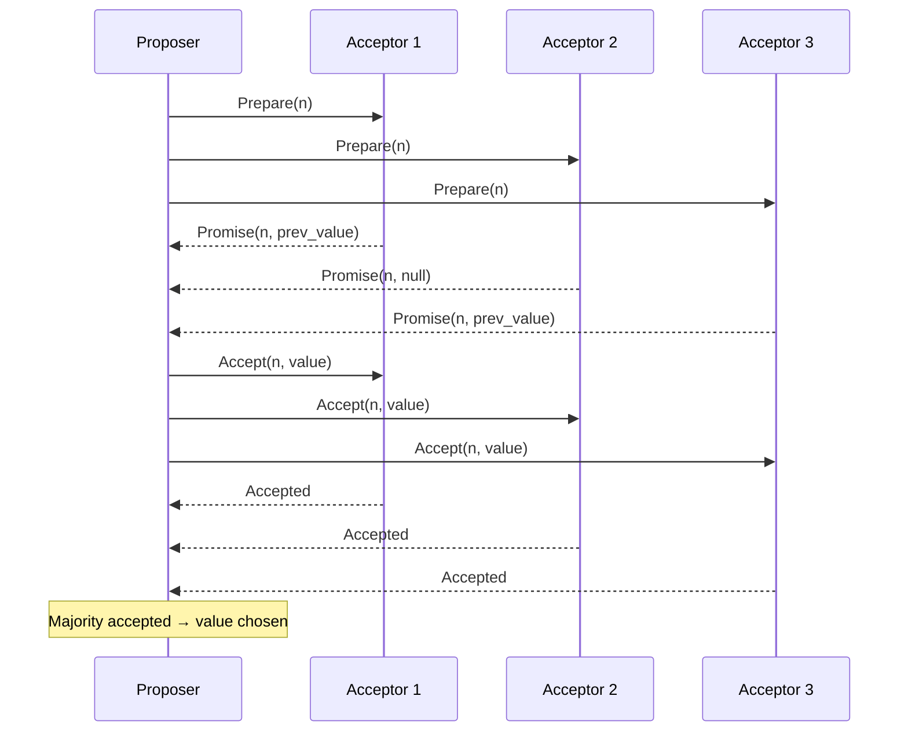

### Raft (Simplified Paxos)

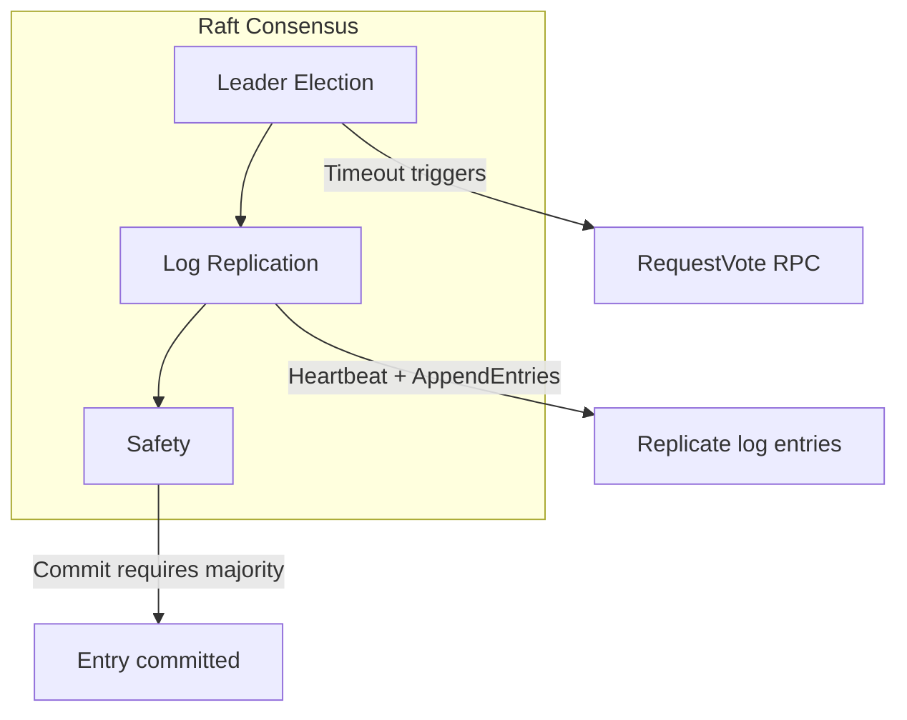

Raft decomposes consensus into:
1. **Leader Election**: One leader, others are followers. Leader sends heartbeats.
2. **Log Replication**: Leader appends entries to its log and replicates to followers.
3. **Safety**: A committed entry is guaranteed to be present in all future leaders' logs.

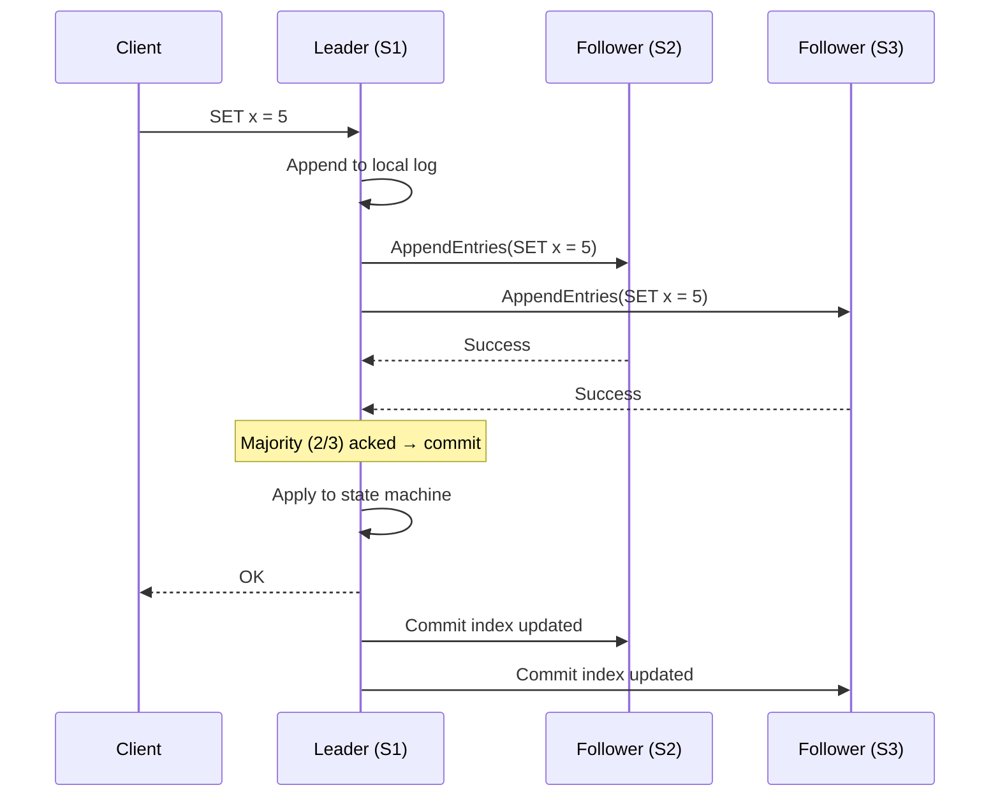

## Distributed Storage Systems

### Amazon DynamoDB

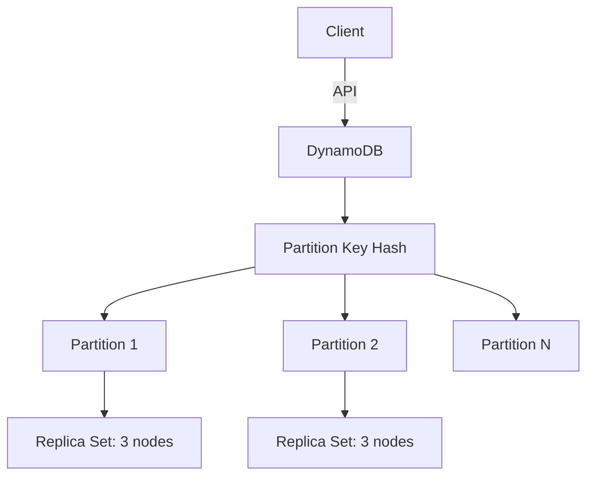

- Key-value and document store.
- Consistent hashing for partitioning.
- Leaderless replication (sloppy quorum + hinted handoff).
- Eventually consistent by default, strongly consistent reads available.

### Google Spanner

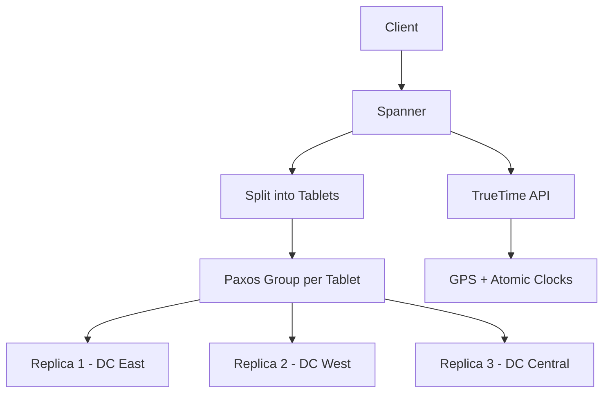

- Globally distributed, strongly consistent SQL database.
- Uses Paxos for replication within each tablet.
- **TrueTime API**: Provides bounded clock uncertainty (±7ms), enabling globally consistent transactions.

### CockroachDB

```mermaid
graph TD
    CLIENT[Client] --> CRDB[CockroachDB SQL]
    CRDB --> RANGE[Ranges (64MB chunks)]
    RANGE --> RAFT[Raft consensus per range]
    RAFT --> N1[Node 1]
    RAFT --> N2[Node 2]
    RAFT --> N3[Node 3]
```

- Distributed SQL database inspired by Spanner.
- Uses Raft for replication.
- Serializable isolation by default.
- No dependency on TrueTime; uses hybrid logical clocks.

## Failure Handling

### Failure Detectors

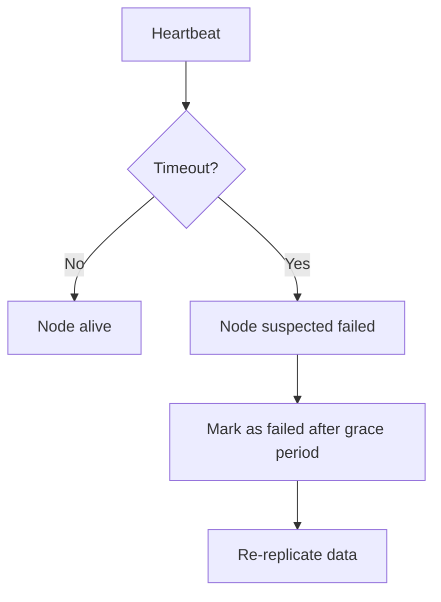

### Anti-Entropy and Merkle Trees

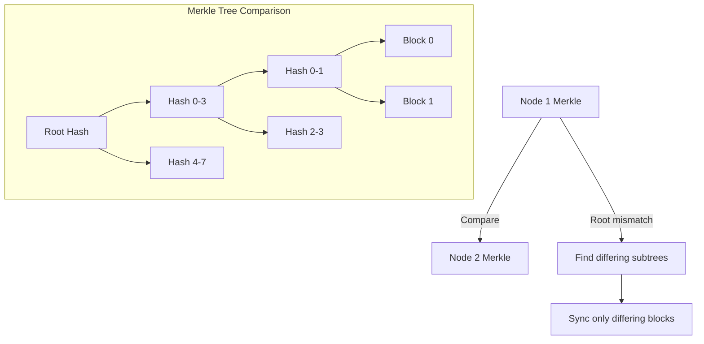

Merkle trees enable efficient detection of which blocks differ between replicas without transferring all data.

## Interview Questions

1. **Q: Explain the CAP theorem and its practical implications.**
   A: In a distributed system, you can only guarantee two of: Consistency (all nodes see the same data), Availability (every request gets a response), Partition tolerance (system works despite network failures). Since network partitions are unavoidable, the real choice is between CP (consistent but may reject requests) and AP (available but may return stale data).

2. **Q: How does consistent hashing work and why is it better than simple modulo hashing?**
   A: Consistent hashing maps both keys and nodes to a ring. Each key goes to the next node clockwise. When a node is added/removed, only keys in that node's range move (1/N of all keys). Simple modulo hashing remaps most keys when N changes. Virtual nodes improve balance.

3. **Q: What is a quorum in distributed storage?**
   A: A quorum is the minimum number of nodes that must agree for an operation to succeed. For N replicas, if you write to W nodes and read from R nodes, and W + R > N, you're guaranteed to read at least one node with the latest write. Typical: N=3, W=2, R=2.

4. **Q: Explain Raft consensus in simple terms.**
   A: Raft elects one leader. All client requests go through the leader. The leader appends entries to its log and replicates them to followers. An entry is committed when a majority of nodes have it. If the leader fails, a new election happens. Committed entries are never lost.

5. **Q: How does Spanner achieve global consistency?**
   A: Spanner uses Paxos for replication and TrueTime (GPS + atomic clocks) to bound clock uncertainty across datacenters. Transactions use a commit-wait protocol: after committing, wait until TrueTime guarantees the commit timestamp is in the past everywhere. This enables externally consistent global transactions.

## Common Mistakes

- Confusing **replication** with **backup** — replication protects against node failure, not accidental deletion or corruption.
- Assuming **eventual consistency** is always acceptable — financial transactions, inventory, and leaderboards need strong consistency.
- Not considering **network partitions** — in distributed systems, partitions WILL happen. Design for it.
- Ignoring **tail latency** — with quorum reads/writes, latency = slowest node in quorum. P99 matters.
- Treating **consensus as free** — Paxos/Raft add latency and complexity. Only use when you actually need strong consistency.

## Summary

Distributed storage systems use partitioning (consistent hashing, range-based) to split data and replication (leader-based, leaderless) for fault tolerance. Consistency models range from linearizable (strongest, requires consensus) to eventual (weakest, highest availability). Consensus algorithms (Paxos, Raft) enable strong consistency. For interviews, understand the CAP theorem, quorum systems, consistent hashing, and the trade-offs between consistency and availability.

## Cross-References

- [Erasure Coding](./erasure-coding.md) — Space-efficient alternative to replication
- [Ceph](./ceph.md) — Production distributed storage system
- [Object Storage](./object-storage.md) — Built on distributed storage
- [Storage Overview](./overview.md) — Storage hierarchy
