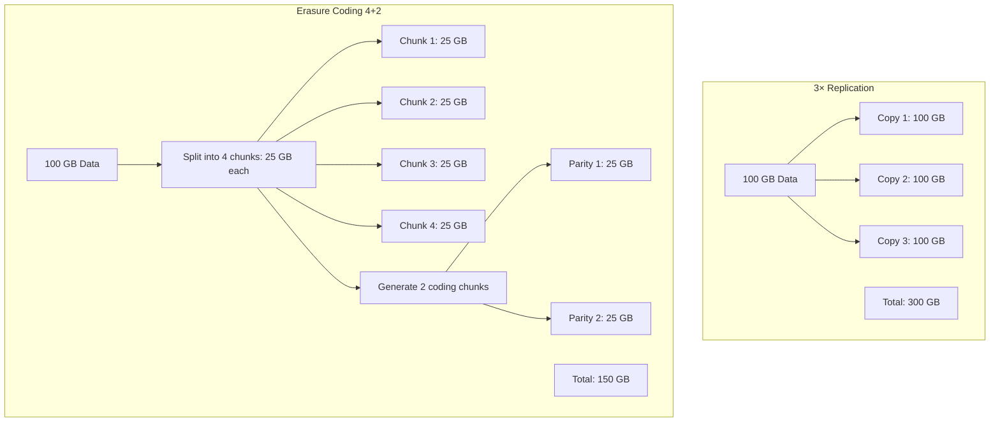
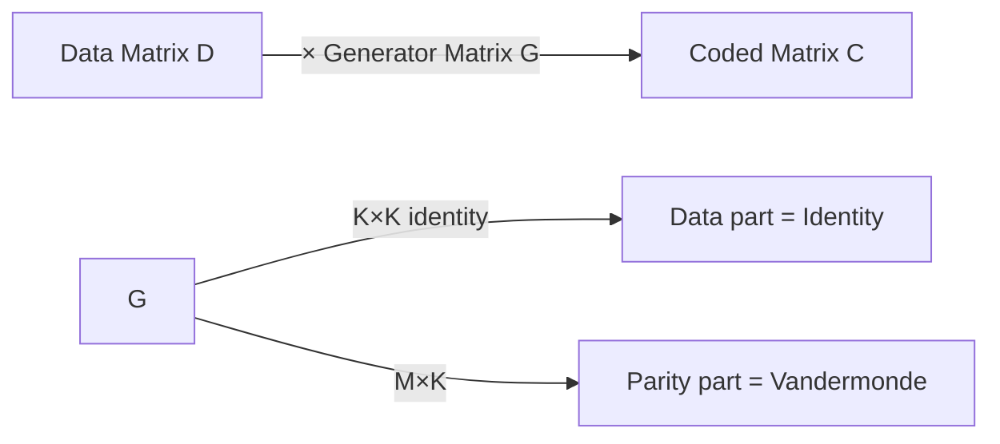
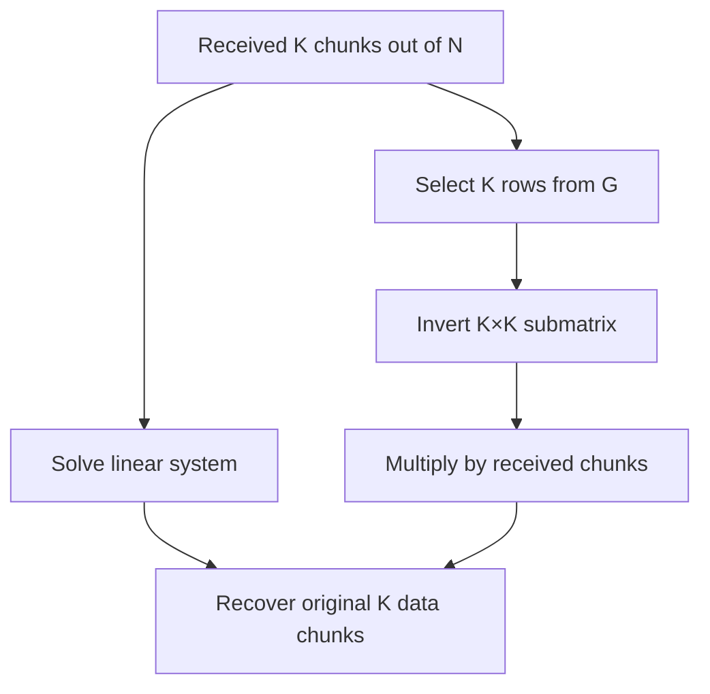
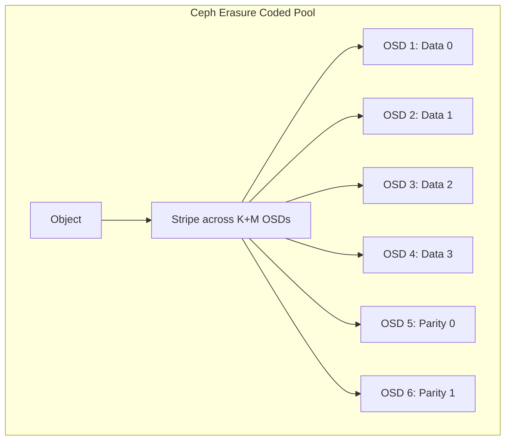
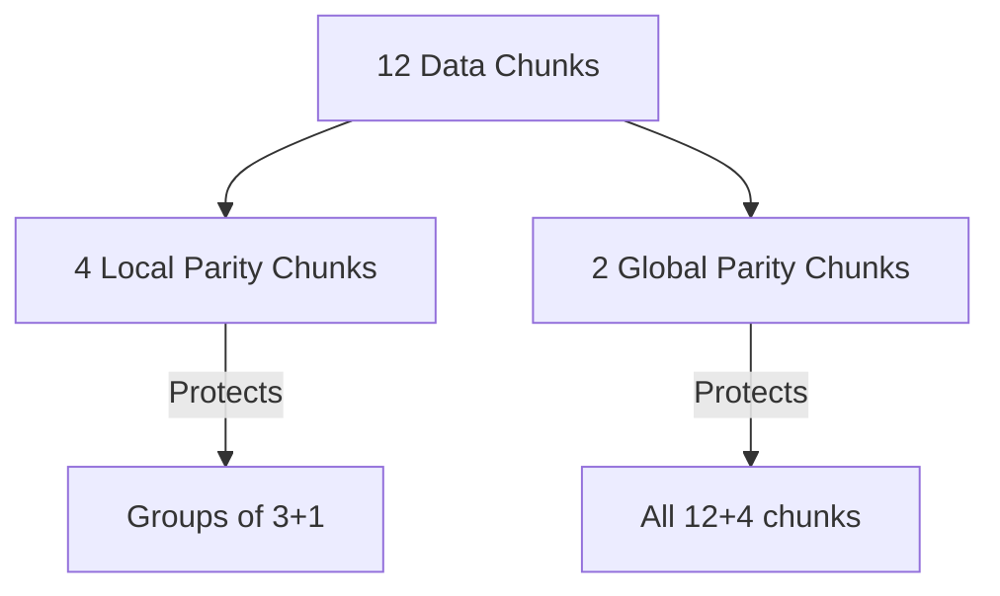
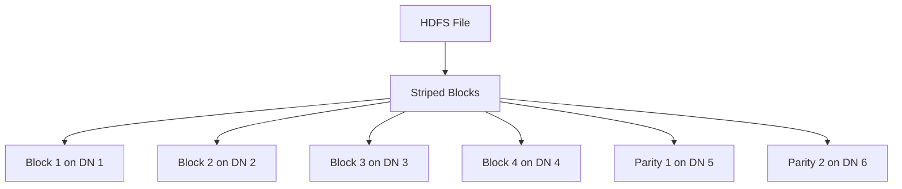
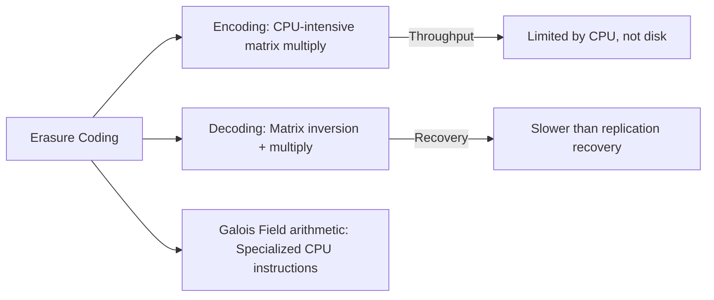
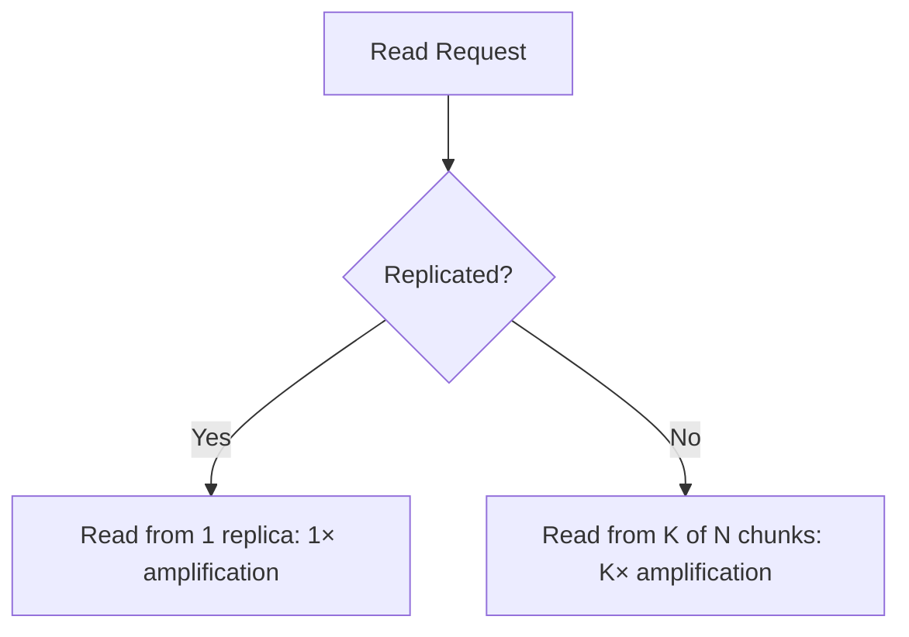
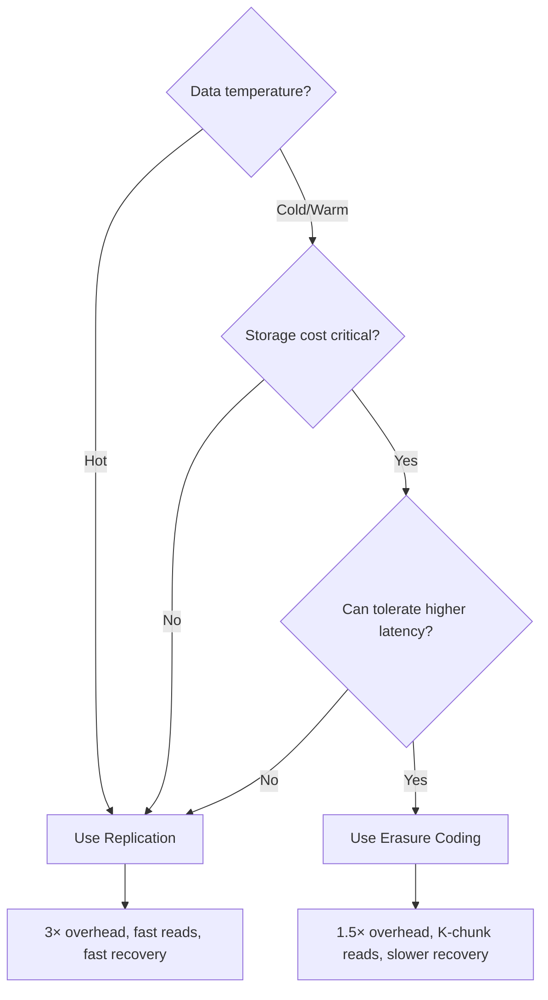

# Erasure Coding

## Overview

Erasure coding (EC) is a method of data protection that breaks data into fragments, expands and encodes them with redundant data pieces, and stores them across different locations. It can reconstruct the original data from a subset of the fragments. Compared to simple replication (3× storage), erasure coding achieves similar fault tolerance with significantly less storage overhead (e.g., 1.5× for a 4+2 scheme). It's widely used in distributed storage systems (Ceph, HDFS, Azure, S3) and archival systems.

## Core Concepts

### Replication vs Erasure Coding



| Scheme | Storage Overhead | Fault Tolerance | Space Efficiency |
|--------|-----------------|-----------------|------------------|
| 3× Replication | 3.0× | 2 failures | 33% |
| 4+2 EC | 1.5× | 2 failures | 67% |
| 6+3 EC | 1.5× | 3 failures | 67% |
| 8+4 EC | 1.5× | 4 failures | 67% |
| 10+4 EC | 1.4× | 4 failures | 71% |

## Mathematical Foundation

### Reed-Solomon Codes

Reed-Solomon (RS) is the most common erasure coding algorithm. It treats data as polynomials over a finite field (Galois Field GF(2^8)).

```mermaid
graph TD
    D[Data: d0, d1, d2, d3] --> POLY[Polynomial: p(x) = d0 + d1·x + d2·x² + d3·x³]
    POLY --> EVAL[Evaluate at N points]
    EVAL --> E0[p(0) = data chunk 0]
    EVAL --> E1[p(1) = data chunk 1]
    EVAL --> E2[p(2) = data chunk 2]
    EVAL --> E3[p(3) = data chunk 3]
    EVAL --> E4[p(4) = coding chunk 0]
    EVAL --> E5[p(5) = coding chunk 1]
```

**Key insight**: A polynomial of degree K-1 is uniquely determined by K points. So from any K out of N chunks, you can reconstruct the original polynomial (and thus the data).

### Encoding Process



```
C = G × D

Where:
- D is K×L (K data chunks, each L bytes)
- G is N×K (generator matrix)
- C is N×L (N coded chunks)
```

The generator matrix G has:
- Top K×K: Identity matrix (data chunks are unchanged)
- Bottom M×K: Parity rows (from Vandermonde or Cauchy matrix)

### Decoding Process



From any K chunks, select the corresponding K rows of G, invert the K×K matrix, and multiply by the received data to recover the original.

## Practical Implementation

### Encoding Example (4+2)

```python
# Simplified Reed-Solomon encoding
import numpy as np

# Galois Field arithmetic (GF(2^8))
# In practice, use libraries like zfec, pyfinite, or jerasure

K = 4  # data chunks
M = 2  # parity chunks
N = K + M  # total chunks

# Generator matrix (simplified)
# Identity for data rows, Vandermonde for parity rows
G = np.array([
    [1, 0, 0, 0],  # data chunk 0
    [0, 1, 0, 0],  # data chunk 1
    [0, 0, 1, 0],  # data chunk 2
    [0, 0, 0, 1],  # data chunk 3
    [1, 1, 1, 1],  # parity chunk 0 (sum)
    [1, 2, 3, 4],  # parity chunk 1 (weighted sum)
])

# Data (4 chunks)
data = np.array([10, 20, 30, 40])

# Encode: multiply G × data
coded = G @ data  # [10, 20, 30, 40, 100, ?]
```

### Reconstruction Example

```python
# If chunks 1 and 3 are lost (indices 1, 3)
# We have chunks 0, 2, 4, 5 (any 4 of 6)

# Select corresponding rows from G
G_recover = np.array([
    [1, 0, 0, 0],  # chunk 0
    [0, 0, 1, 0],  # chunk 2
    [1, 1, 1, 1],  # chunk 4 (parity 0)
    [1, 2, 3, 4],  # chunk 5 (parity 1)
])

# Invert and solve
G_inv = np.linalg.inv(G_recover)
data = G_inv @ received_chunks  # Recover original [10, 20, 30, 40]
```

## Erasure Coding in Storage Systems

### Ceph Erasure Coding



Ceph's EC pools stripe objects across OSDs. Reads from K chunks, can tolerate M failures.

### Azure LRC (Local Reconstruction Codes)



Standard RS codes require reading K chunks to recover one missing chunk, which is expensive. LRC adds local parity chunks:
- **Local parity**: Protects a subset (e.g., 3 data + 1 local parity). Recovery reads only 3 chunks.
- **Global parity**: Protects all data. Used when local parity isn't enough.

Trade-off: Slightly more storage overhead but much faster recovery.

### HDFS Erasure Coding



HDFS 3.0+ supports erasure coding as an alternative to 3× replication. Uses RS(6,3) or RS(3,2) policies. Reduces storage from 3× to 1.5× for cold data.

## Performance Considerations

### CPU Overhead



EC encoding/decoding is CPU-intensive. Modern CPUs with SIMD (AVX2/AVX-512) can achieve 1-10 GB/s per core. Hardware acceleration (Intel ISA-L) is common in production.

### Read Amplification



For a 4+2 scheme, reading 1 MB requires reading 4 × 256 KB = 1 MB from 4 different OSDs (network amplification even though total bytes are the same). This is why EC is better for cold/archive data.

### Recovery Cost

| Scheme | Recovery Read | Recovery Network | Recovery Time |
|--------|--------------|------------------|---------------|
| 3× Replication | 1× data size | 1× data size | Fast |
| 4+2 EC | 4× data size | 1× data size | Moderate |
| 10+4 EC | 10× data size | 1× data size | Slow |

## Choosing Between Replication and EC



## Interview Questions

1. **Q: How does erasure coding achieve fault tolerance with less storage than replication?**
   A: EC splits data into K chunks and generates M parity chunks using polynomial evaluation (Reed-Solomon). Any K of the K+M chunks can reconstruct the data. A 4+2 scheme uses 1.5× storage (vs 3× for replication) and tolerates 2 failures — same fault tolerance with half the storage.

2. **Q: Explain Reed-Solomon encoding at a high level.**
   A: Data is treated as coefficients of a polynomial. The polynomial is evaluated at K+M points. K evaluations are the data chunks, M are the parity chunks. Since a degree K-1 polynomial is uniquely determined by K points, any K evaluations suffice to reconstruct the polynomial (and thus the data).

3. **Q: What is the trade-off of erasure coding vs replication?**
   A: EC uses less storage (1.5× vs 3×) for the same fault tolerance. But: reads require K chunks instead of 1 (higher latency), recovery requires reading K chunks instead of 1 (slower), and encoding/decoding is CPU-intensive. EC is best for cold/warm data where storage cost matters more than latency.

4. **Q: What are Local Reconstruction Codes (LRC)?**
   A: LRC adds local parity chunks that protect subsets of data chunks. This reduces recovery cost: instead of reading K chunks from across the cluster, you read only the local group's chunks. Azure uses LRC for faster recovery. Trade-off: slightly more storage overhead (e.g., 1.6× instead of 1.5×).

5. **Q: Why is Galois Field (GF) arithmetic used in erasure coding?**
   A: GF(2^8) operates on bytes with modular arithmetic, ensuring that operations stay within 8 bits (no overflow). Addition is XOR, multiplication uses lookup tables or log/antilog tables. This is efficient for hardware/software implementation and guarantees that parity chunks are the same size as data chunks.

## Common Mistakes

- Using EC for hot data — read amplification (K chunks) and CPU overhead make it slow for latency-sensitive workloads.
- Not accounting for CPU cost — EC encoding/decoding can saturate CPU cores at high throughput.
- Choosing wrong K:M ratio — too few parity chunks (low M) increases data loss risk; too many (high M) increases overhead.
- Ignoring recovery time — with large K, recovery requires reading from many nodes, taking longer and putting more load on the cluster.
- Not using hardware acceleration — Intel ISA-L or similar libraries are essential for production EC performance.

## Summary

Erasure coding provides fault-tolerant storage with lower overhead than replication by using mathematical techniques (Reed-Solomon codes over Galois Fields). Data is split into K chunks, M parity chunks are generated, and any K of K+M chunks can reconstruct the data. Trade-offs: lower storage cost but higher read amplification, CPU overhead, and recovery time. EC is ideal for cold/warm data. LRC improves recovery speed at the cost of slightly more storage.

## Cross-References

- [Ceph](./ceph.md) — EC pools in production
- [Distributed Storage](./distributed.md) — Replication and consistency
- [HDD](./hdd.md) — Where EC data lives
- [Storage Overview](./overview.md) — Storage hierarchy
- [Cloud S3](../cloud/aws/s3.md)
