# File Storage

## Overview

File storage organizes data into a hierarchical structure of files and directories, accessed through standard file system interfaces (POSIX, SMB/CIFS, NFS). It's the most familiar storage model — what you interact with on your laptop every day. In enterprise and cloud environments, file storage enables shared access across multiple machines, making it essential for collaborative workloads, home directories, and legacy applications.

## How File Storage Works

### Filesystem Architecture

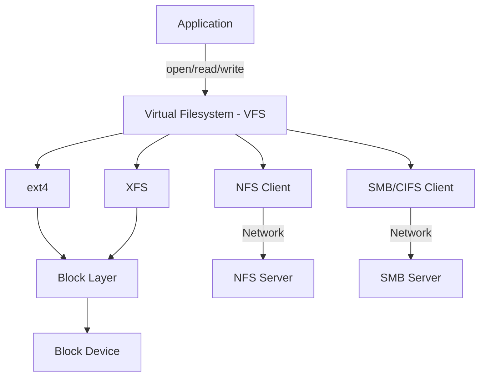

### Filesystem Components

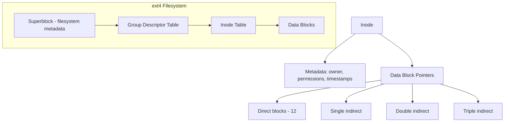

- **Inode**: Metadata structure for each file (permissions, timestamps, block pointers). Does NOT contain the filename.
- **Directory**: Special file mapping filenames to inode numbers.
- **Superblock**: Filesystem-wide metadata (size, state, mount count).
- **Data Blocks**: Actual file content, typically 4 KB each.

### File Read Path

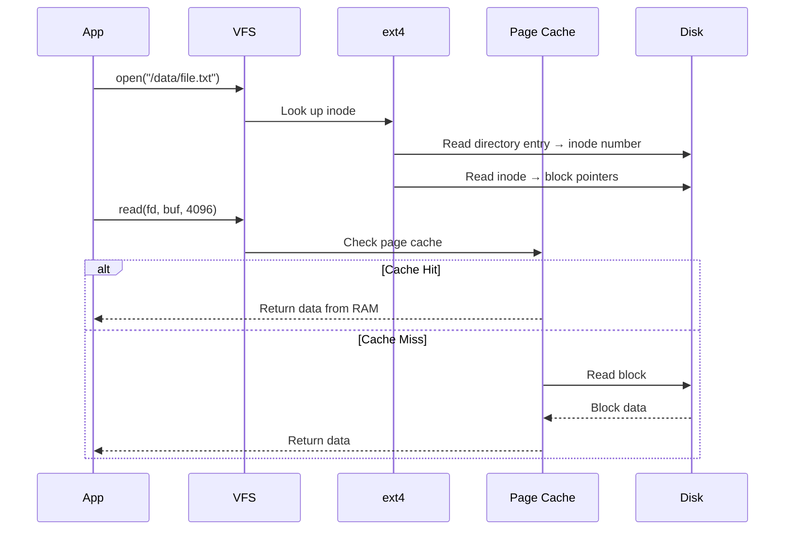

## Network File Systems

### NFS (Network File System)

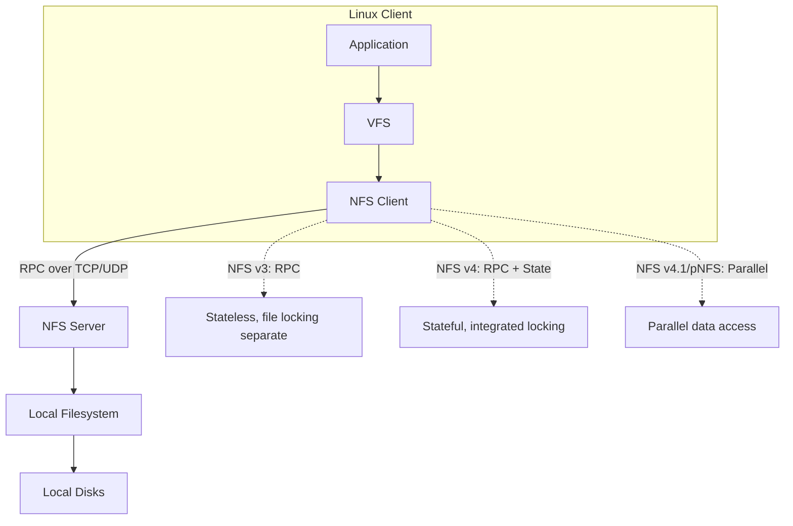

| NFS Version | Features | Limitations |
|-------------|----------|-------------|
| NFSv3 | Stateless, good recovery | No integrated locking, no ACLs |
| NFSv4 | Stateful, ACLs, locking, Kerberos | Single server bottleneck |
| NFSv4.1 (pNFS) | Parallel data access, striping | Complex implementation |

### NFS Performance Considerations

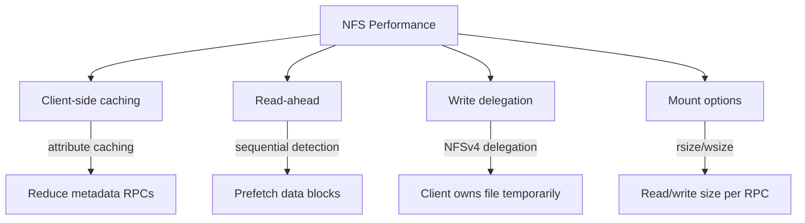

### SMB/CIFS (Server Message Block)

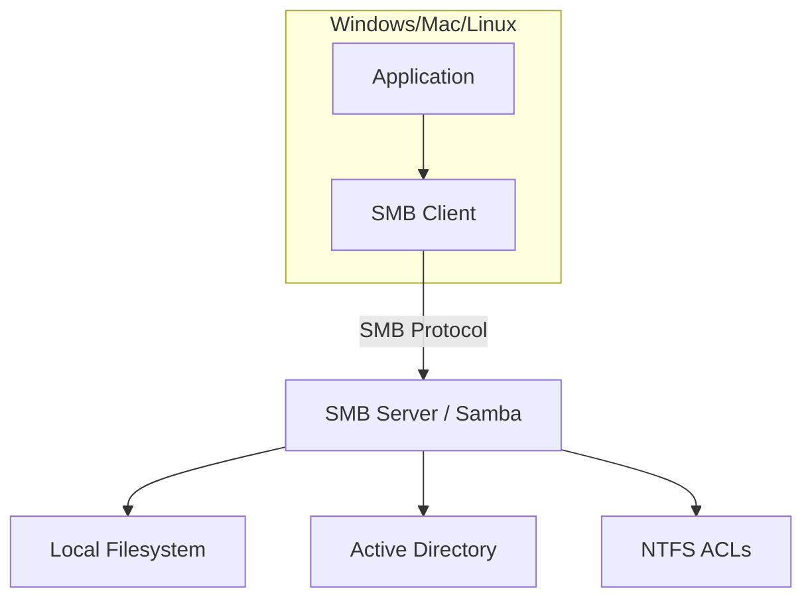

SMB is the standard protocol for Windows file sharing. Samba provides SMB on Linux. SMB3 includes encryption, multichannel, and persistent handles.

## Cloud File Storage Services

### AWS Elastic File System (EFS)

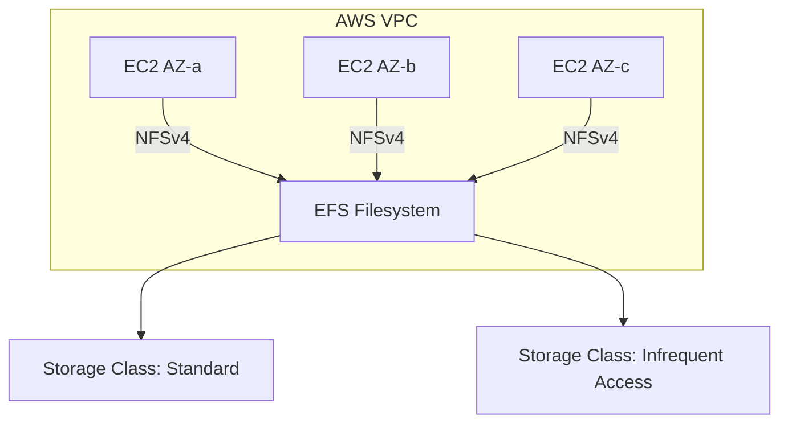

- Multi-AZ, elastic, NFSv4.1.
- Scales automatically from KB to petabytes.
- Pay per GB stored + throughput.
- Two storage classes: Standard (hot) and IA (cold, 92% cheaper).

### Azure Files

- SMB and NFS shares managed by Azure.
- Supports Azure Active Directory integration.
- Premium tier backed by SSD for low latency.

### Google Cloud Filestore

- NFS-based managed file storage.
- Tiers: Basic HDD, Basic SSD, Enterprise, Zonal.
- Used with GKE for shared persistent volumes.

## Distributed File Systems

### HDFS (Hadoop Distributed File System)

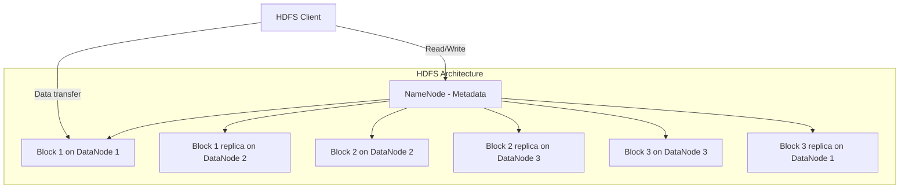

- **NameNode**: Stores metadata (file → block mapping, block locations). Single point of failure (HA with standby).
- **DataNode**: Stores actual data blocks (128 MB default). Reports block info to NameNode.
- **Replication**: Default 3× replication across different racks.
- **Write-once**: HDFS files are write-once, append-only (no random writes).

### GlusterFS

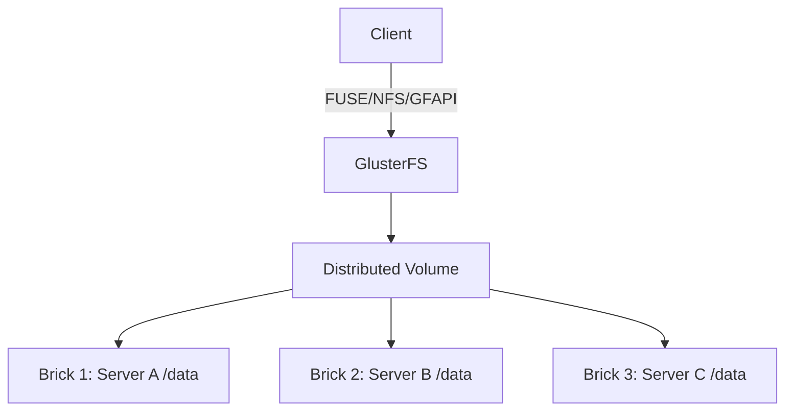

- Scale-out NAS. No central metadata server (distributed hash).
- Translators handle replication, striping, caching.
- POSIX-compatible.

## Filesystem Features

### Journaling

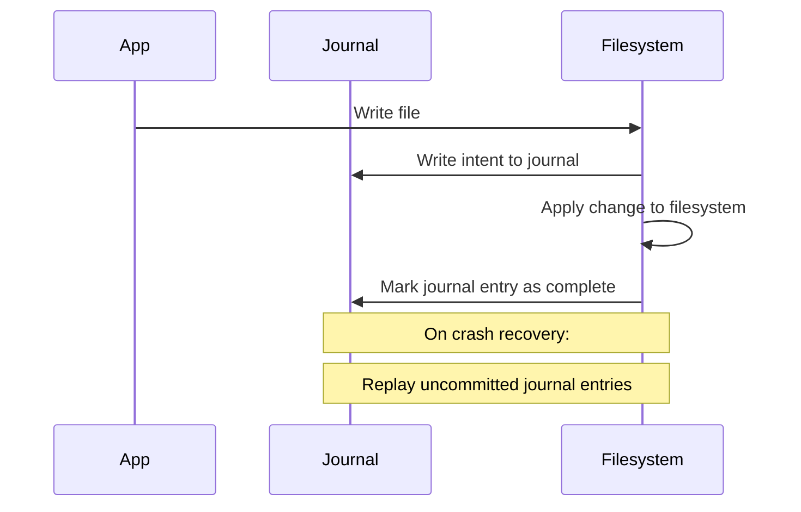

Journaling prevents filesystem corruption on crash by logging intended changes before applying them. ext4, XFS, NTFS all use journaling.

### Copy-on-Write (COW)

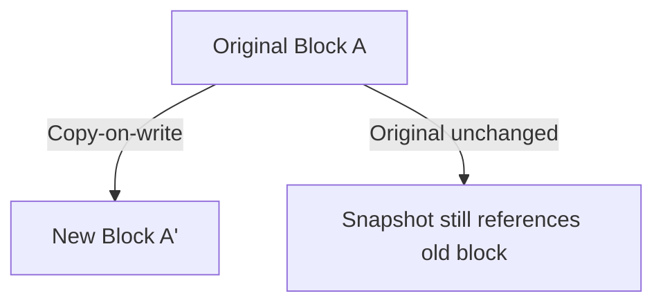

COW filesystems (ZFS, Btrfs) never overwrite data in place. Writes go to new blocks, and metadata is updated atomically. This enables instant snapshots and data integrity verification.

### Deduplication and Compression

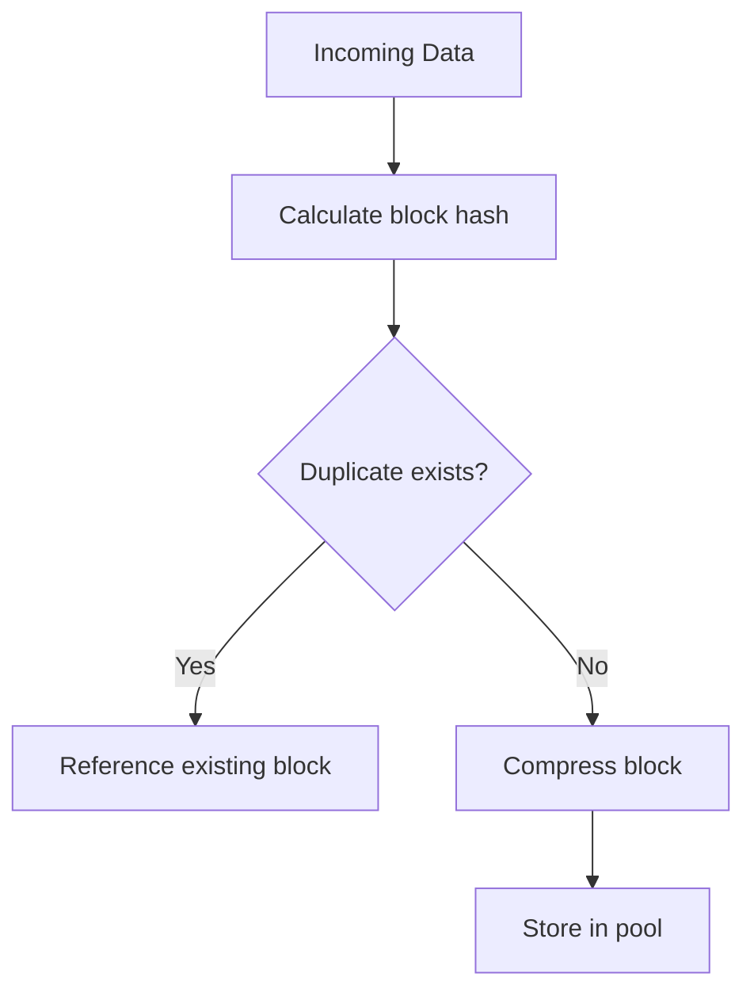

ZFS and some NAS systems deduplicate at the block level, storing only unique blocks and referencing duplicates. Compression (LZ4, ZSTD) reduces storage footprint.

## Interview Questions

1. **Q: What is the difference between NFS and SMB?**
   A: NFS is Unix/Linux native, stateless (v3) or stateful (v4), uses RPC. SMB is Windows native, stateful, supports file locking and ACLs natively. NFSv4 and SMB3 have converged in features (encryption, delegation). Choose based on client OS and existing infrastructure.

2. **Q: How does HDFS handle fault tolerance?**
   A: HDFS replicates each block (default 3×) across different DataNodes, ideally across different racks. The NameNode tracks block locations. If a DataNode fails, the NameNode detects missing heartbeats and triggers re-replication of under-replicated blocks to maintain the replication factor.

3. **Q: Explain the purpose of journaling in filesystems.**
   A: Journaling logs intended filesystem changes to a journal before applying them. On crash, the journal is replayed to complete interrupted operations, preventing filesystem corruption. Without journaling, a crash during a write could leave the filesystem in an inconsistent state requiring fsck (which is slow).

4. **Q: What is the difference between NFS and a distributed filesystem like HDFS?**
   A: NFS provides a shared filesystem view over a network but typically serves from a single server (bottleneck). HDFS distributes data across many nodes with replication, designed for large-scale batch processing (MapReduce). NFS is for general-purpose file sharing; HDFS is for big data analytics.

5. **Q: How does copy-on-write (COW) enable instant snapshots?**
   A: In COW filesystems (ZFS, Btrfs), data is never overwritten in place. A snapshot simply preserves the current metadata tree. New writes go to new blocks. The snapshot references the old blocks. No data copying is needed, so snapshots are instant regardless of data size.

## Common Mistakes

- Using NFS for high-throughput parallel I/O — single server becomes a bottleneck. Use pNFS or distributed filesystems.
- Not tuning NFS rsize/wsize — default 4 KB may be suboptimal for sequential workloads.
- Relying on NFS file locking for correctness — NFS locking is unreliable under network partitions. Use distributed locks instead.
- Using HDFS for small files — NameNode stores all metadata in memory. Millions of small files exhaust NameNode heap.
- Ignoring filesystem choice — ext4 is safe default, but XFS is better for large files, ZFS for data integrity.

## Summary

File storage provides hierarchical file/directory access through standard protocols (POSIX, NFS, SMB). Network file systems (NFS, SMB) enable shared access across machines. Distributed file systems (HDFS, GlusterFS) scale across many nodes. Cloud services (EFS, Azure Files, Filestore) provide managed file storage. Key concepts include journaling, COW, inode structure, and the trade-offs between local and network filesystems.

## Cross-References

- [Block Storage](./block-storage.md) — Underlying block devices
- [Distributed Storage](./distributed.md) — Distributed systems theory
- [Object Storage](./object-storage.md) — Flat namespace alternative
- [Storage Overview](./overview.md) — Storage hierarchy
- [OS Filesystems](../os/filesystems/ext4.md)

