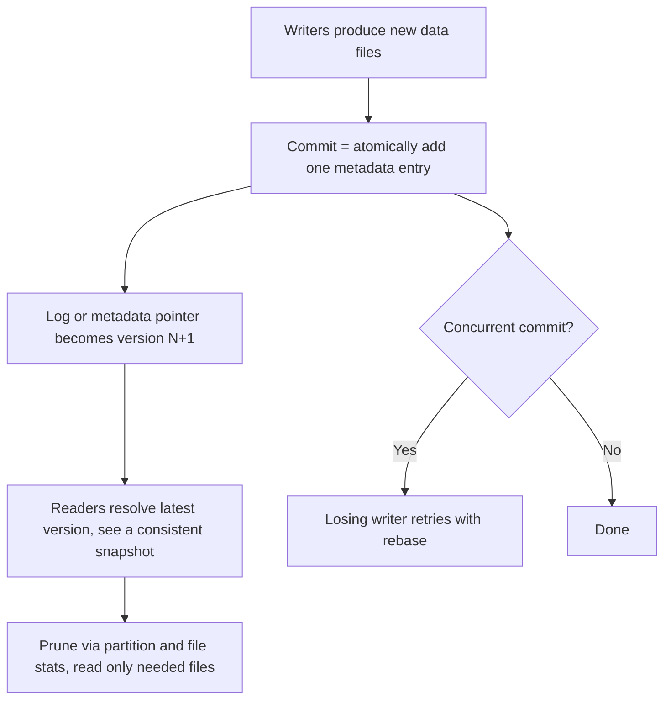

# Storage Formats & Lakehouse Algorithms

## Overview

This section covers the **open table formats** (Apache Iceberg, Delta Lake, Apache Hudi) that turned cheap object storage into transactional, versioned SQL tables, plus the storage-engine algorithms that surround them: the Parquet file format underneath, cache eviction policies (Caffeine, RocksDB block cache), CRUSH placement (Ceph), and deduplication (backup/storage systems). The unifying theme is *metadata-driven data layout on immutable files*: whether it is a table format committing a snapshot or Ceph computing an object placement, the answer is "replace a metadata lookup with a small, versioned data structure." This is a hot interview area for data-platform and storage roles: expect questions on snapshot isolation over object stores, optimistic concurrency, copy-on-write vs merge-on-read, and why hidden partitioning matters.

> Companion pages: [Lakehouses](../../data-engineering/lakehouses.md) for the workload-level overview, [Data Formats](../../data-engineering/data-formats.md) for row vs columnar basics, [Object Storage](../object-storage.md) for the S3 layer underneath.

## Why Table Formats Exist

Object stores (S3, GCS, ADLS) give you three primitives: PUT, GET, and LIST, with strong per-object consistency but no atomic multi-object rename, no locks, and no secondary structure. A "table" in a warehouse is the opposite: atomic multi-row transactions, schema, statistics, and fast pruning. Classic data lakes bridged the gap poorly:

| Layer | What the lake had | What was missing |
|---|---|---|
| Files | Parquet/ORC files in directories | No atomic visibility of a multi-file write |
| Hive metastore | Partition directories + stats | Partition-level locking only; stale stats; no row-level truth |
| Engines | Hive/Spark readers | Each engine saw a different "version" of the table |

The failure modes were notorious: a Spark job writing 10,000 files while a reader scans the prefix sees a partial table; a failed job leaves orphan files that look committed; two concurrent `INSERT OVERWRITE` jobs corrupt each other; changing `partition by day` to `by hour` requires rewriting every file and breaking every query. A **table format** fixes this by making the *list of files that constitute the table* an explicit, versioned metadata object, committed atomically. The files stay immutable Parquet on object storage; all mutability lives in metadata, which is small (kilobytes per commit vs terabytes of data).

The core trick is **serializing commits through a single ordered metadata location**:

Because object stores now offer strong read-after-write consistency per key (S3 closed that gap in December 2020), an atomic *pointer swap* on one key is enough to make a whole batch of data files appear atomically. That single fact is why table formats became viable on S3, and why the pre-table-format era (Hive) needed a metastore or HDFS renames for coordination. Iceberg, Delta, and Hudi differ mainly in how they shape that metadata tree and how aggressively they optimize specific workloads.

## The Three-Format War, Summarized

| | **Apache Iceberg** | **Delta Lake** | **Apache Hudi** |
|---|---|---|---|
| Origin | Netflix (Apache, 2018–2020) | Databricks (Linux Foundation, 2019) | Uber (Apache, 2018–2019) |
| Metadata shape | Tree: `metadata.json` → manifest list → manifests | Ordered JSON commits `_delta_log/NN.json` + Parquet checkpoints | Timeline of instants + record-level index |
| Design center | Engine neutrality, partition evolution, big-batch analytics | Deep Spark/Databricks integration, protocol simplicity | Streaming upserts, record index, fastest ingest |
| Row-level changes | COW + position/equality deletes, v2/v3 deletion vectors | Deletion vectors (2023+), previously COW | MoR log files + compaction (its signature) |
| Catalog needed | Yes — Hive/Glue/Nessie/JDBC/REST | Optional (the log *is* the table) | Hive/Glue or filesystem |

The politics matter for interviews as much as the tech. Iceberg was extracted from Netflix's internal tooling precisely to escape Hive's directory-as-table model; its spec deliberately supports any engine and any catalog. Delta ships the tightest Spark integration and Databricks' managed features (Photon, Liquid Clustering, UniForm). Hudi was built for Uber's near-real-time ingestion — minutes-fresh tables at petabyte scale — and remains strongest when *ingest latency* dominates. Since roughly 2023 the convergence is real: Delta and Iceberg both support deletion vectors and copy-on-write, Hudi added Iceberg-compatible metadata, and Snowflake, BigQuery, and Trino all read Iceberg natively — making "which format" increasingly a governance-and-catalog question rather than a feature question.

Detailed pages: [Apache Iceberg](./apache-iceberg.md), [Delta Lake](./delta-lake.md), [Apache Hudi](./apache-hudi.md), and the head-to-head [Table Format Comparison](./table-format-comparison.md).

## What a Table Format Actually Specifies

Every format defines the same four layers, which is a useful interview frame:

1. **Data files** — immutable Parquet (sometimes ORC/Avro) holding the rows. [Parquet internals](./parquet-internals.md) matter here: row groups, page indexes, and column statistics are what make file-level pruning work.
2. **Metadata tree** — the authoritative mapping of table → current snapshot → data files, with per-file min/max stats and partition values. Designs differ: Iceberg manifests carry per-column stats per file; Delta replays ~10 JSON commits into a Parquet checkpoint; Hudi adds a record-level index on top.
3. **Commit protocol** — how a writer publishes a new version atomically and detects conflicts with concurrent writers (optimistic concurrency + retry; compared in detail on the [comparison page](./table-format-comparison.md)).
4. **Expiration/GC semantics** — snapshots expire after N days, unreferenced files are removed by maintenance jobs. Get this wrong and you either leak petabytes or break time travel for a query that is still running.

## Choosing a Format — Decision Table

| If your workload is... | Pick | Why |
|---|---|---|
| Multi-engine (Trino + Spark + Flink + Snowflake) | **Iceberg** | Engine-neutral spec; REST catalog standardization |
| All-in on Databricks/Spark | **Delta** | Deepest integration, Liquid Clustering, managed optimization |
| Continuous ingest, minute-fresh updates, CDC upserts | **Hudi** | Record-level index + merge-on-read amortizes update cost |
| Batch, append-mostly, rare updates | Iceberg or Delta | Copy-on-write delete cost is irrelevant at low update rates |
| Many concurrent writers on one table | Any, but partition writes | All three serialize commits; wide partitions reduce conflict |
| Long-horizon time travel / audit | Iceberg | Snapshot tree + catalog branching (Nessie, branch/tag) |
| Vendor neutrality is a procurement requirement | **Iceberg** | Apache foundation, broadest third-party engine support |

None of these choices are as irreversible as file formats once were: conversion paths exist (Delta UniForm exposes Delta tables as Iceberg; Hudi can write Iceberg-compatible metadata), and migration tools do bulk metadata rewrites without touching data files. The expensive mistake is not picking the "wrong" format — it is skipping maintenance (compaction, snapshot expiry) or discovering late that your catalog cannot handle your access pattern.

## Storage-Engine Algorithms in This Section

The non-table-format pages cover algorithms interviewers borrow from adjacent systems, all following the same "small metadata, big immutable files" pattern:

- [Parquet internals](./parquet-internals.md) — the file format every table format stores: row groups (128 MB–1 GB), dictionary/RLE/delta/BYTE_STREAM_SPLIT encodings, page indexes for predicate pushdown, bloom filters, the Thrift footer.
- [Cache eviction algorithms](./cache-eviction-algorithms.md) — LRU → 2Q → ARC → LIRS → W-TinyLFU → LeCaR: why RocksDB's block cache and Caffeine chose what they chose, scan resistance, and count-min-sketch admission.
- [CRUSH](./ceph-crush.md) — the placement algorithm that computes "which OSDs hold this object" with no lookup server: PG math, `chooseleaf` failure domains, stable mapping under cluster changes, comparison with consistent hashing.
- [Deduplication internals](./deduplication-internals.md) — content-defined chunking (Gear/FastCDC), Data Domain's highlight index, inline vs post-process, dedup ratios by workload, the encryption-vs-dedup tension.

## Anatomy of a Commit — What Every Format Must Solve

Strip away branding and every table-format commit must solve the same four sub-problems. This decomposition is a reliable interview scaffold when asked to compare formats:

| Sub-problem | Iceberg | Delta | Hudi | Generic failure without it |
|---|---|---|---|---|
| Atomic publish | Catalog CAS on root pointer | Conditional put of `NN.json` | Instant completion on timeline | Readers see partial file batches |
| Conflict detection | File-overlap rules re-based on winner | Read/write predicate intersection | File-group + key overlap | Silent lost updates |
| Read consistency | Pin snapshot tree | Replay log to a version | Pin completed instant | Mixed versions mid-scan |
| Reclaim space | `expire_snapshots` + orphan sweep | `VACUUM` + log retention | `clean` + compaction | Petabytes of dead files |

The table also explains why maintenance jobs are unglamorous but load-bearing: formats replace in-place mutation with *accumulation* (old snapshots, delete files, log files), and only scheduled maintenance pays the debt. If you remember one line from this section, make it: **table formats trade in-place updates for append-only metadata plus GC** — the same trade LSM trees made, which is why [LSM concepts](../../dbms/internals/lsm-trees.md) keep resurfacing in lakehouse interviews.

## Common Interview Traps

- **"Iceberg doesn't need a catalog."** False — the catalog *is* the atomic pointer; without a CAS-capable catalog you have no atomicity. Delta is the one that works catalog-less.
- **"Deletion vectors make it merge-on-read."** Not exactly — DVs are position bitmaps applied at scan; MoR merges *records* from log files. Similar write economics, different read machinery.
- **"Hidden partitioning means no partitioning."** Wrong — partitioning still exists physically; it is derived from predicates automatically instead of being a user-visible column.
- **"Optimistic concurrency means no conflicts."** It means conflicts are *detected and retried*, not prevented; design partitioning to keep writers disjoint.
- **"Parquet stats and table-format stats are the same."** They are layered: file footer stats prune inside a file; manifest/checkpoint stats prune across files. Both matter.

## Suggested Reading Order

For interview prep, the dependency-safe order through this section is: this README → [Parquet Internals](./parquet-internals.md) (the substrate) → [Apache Iceberg](./apache-iceberg.md) (the canonical metadata tree) → [Delta Lake](./delta-lake.md) (the log-based alternative) → [Apache Hudi](./apache-hudi.md) (the indexed alternative) → [Table Format Comparison](./table-format-comparison.md) (the synthesis). The algorithm pages — [cache eviction](./cache-eviction-algorithms.md), [CRUSH](./ceph-crush.md), [deduplication](./deduplication-internals.md) — are independent and can slot in anywhere; they map to storage-engine and infrastructure roles more than data-platform roles.

## Interview Questions

1. **Why can't you just put a Hive-style table on S3 and call it a lakehouse?**
S3 has no atomic rename and no directory-level locking, so a multi-file write is either visible partially or needs an external coordinator. Hive-style tables also entangle the partition scheme with the physical directory layout, so changing granularity means rewriting every file. A table format instead commits a versioned metadata file that atomically defines the full file list, decoupling logical partitioning from physical layout. Readers resolve one pointer and always see a consistent snapshot.

2. **What do all three table formats agree on?**
All three keep data files immutable Parquet and move all mutability into a small metadata layer committed atomically. All three use optimistic concurrency: writers stage work against a snapshot and retry if someone else committed first. All three support time travel by retaining old metadata versions, and all three need scheduled maintenance to expire snapshots and remove orphan files. The disagreements are about metadata shape, indexing, and which workload gets first-class treatment.

3. **Where does the "small metadata" principle show up outside table formats?**
Everywhere in this section. CRUSH replaces a metadata lookup server with deterministic computation from a small cluster map. Cache eviction (W-TinyLFU) uses a count-min sketch — a few KB — to decide admission of multi-MB blocks. Deduplication replaces stored copies with a fingerprint index plus chunks, where the index is far smaller than the data. The interview pattern: when someone proposes a lookup service, ask whether a computed or sampled structure could replace it.

## Key Takeaways

- Table formats add ACID to object stores by committing an atomic, versioned *file list*; data files stay immutable Parquet.
- S3's per-key strong consistency (2020) is what made pointer-swap commits sufficient; before that, formats needed HDFS renames or metastore locks.
- Iceberg optimizes for engine and catalog neutrality plus partition evolution; Delta for Spark/Databricks depth and protocol simplicity; Hudi for indexed, near-real-time upserts.
- All three serialize commits with optimistic concurrency — partition your writes to avoid retry storms.
- Maintenance is part of the design: snapshot expiry, orphan-file cleanup, compaction, and statistics refresh are not optional.
- The underlying algorithms share one idea: replace central coordination or full copies with small, computed or versioned metadata.

## Cross-References

- [Data Lakehouses](../../data-engineering/lakehouses.md) — workload-level overview of the same three formats
- [Data Formats](../../data-engineering/data-formats.md) — CSV/JSON/Avro/Parquet comparison and schema evolution
- [SSTable](../sstable.md) — the storage-engine ancestor: immutable sorted files plus metadata layers
- [Object Storage](../object-storage.md) and [S3 Internals](../advanced/s3-internals.md) — the substrate these formats commit onto
- [Erasure Coding](../erasure-coding.md) — how object stores keep the data files durable
- [Spark Internals](../../data-engineering/spark-internals.md) — the engine most often on the other side of these tables

## References

- [Apache Iceberg spec](https://iceberg.apache.org/spec/) — snapshot model, manifests, partition specs
- [Apache Iceberg docs](https://iceberg.apache.org/docs/latest/) — configuration, maintenance, engines
- [Delta Lake protocol](https://github.com/delta-io/delta/blob/master/PROTOCOL.md) — the `_delta_log` transaction log, stated precisely
- [Delta Lake docs](https://docs.delta.io/latest/index.html) — best practices, checkpoints, optimization
- [Apache Hudi docs](https://hudi.apache.org/docs/overview) — COW/MoR tables, timeline, indexing
- [Apache Parquet format docs](https://parquet.apache.org/docs/file-format/) — encodings, layout, statistics
- [RocksDB wiki](https://github.com/facebook/rocksdb/wiki) — block cache, compaction
- [Ceph docs](https://docs.ceph.com/) — CRUSH maps, placement groups, RADOS
