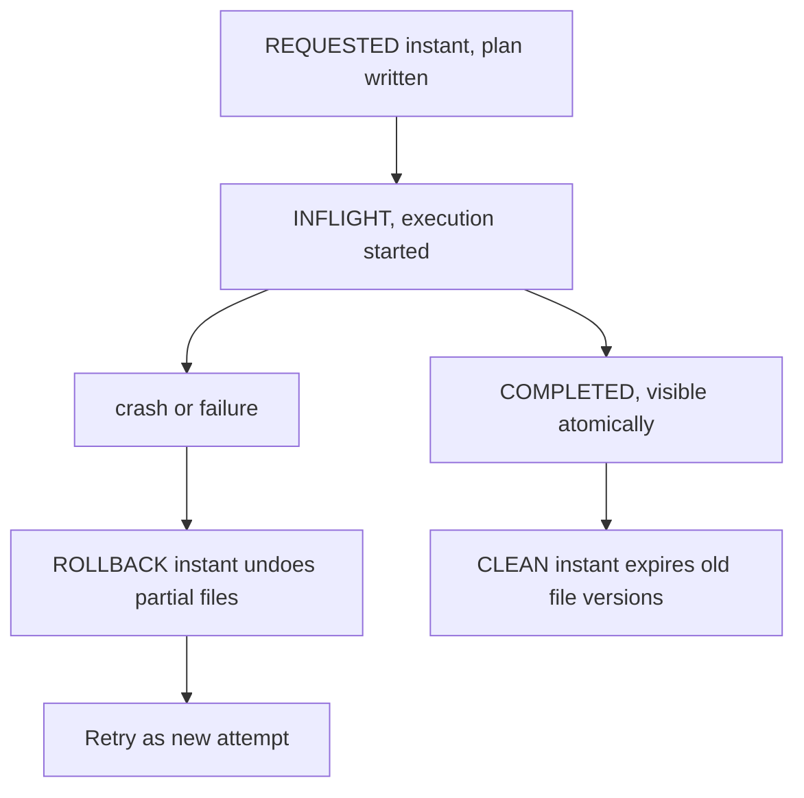
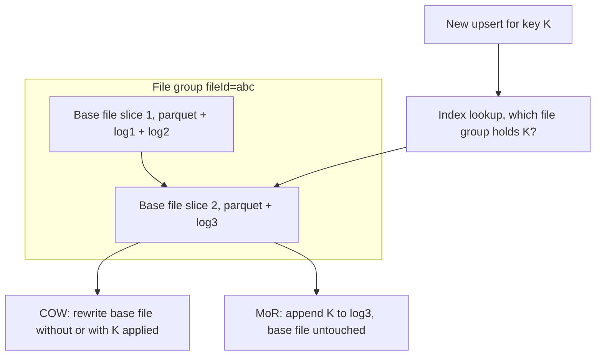

# Apache Hudi — Timeline, Copy-on-Write vs Merge-on-Read, and the Record Index

## Overview

Apache Hudi came out of Uber in 2016–2017 to solve a problem Iceberg and Delta were not designed for: **ingesting database changes into petabyte lakes within minutes**, including upserts and deletes against a key, not just appends. Its differentiators are a first-class **timeline** of atomic instants, **file slices** that pair columnar base files with append-only log files, and a **record-level index** that can locate the file holding a key before writing — historically giving it materially faster upserts than scan-stats-based approaches. Hudi's Merge-on-Read mode amortizes update cost across reads, which is the right trade for ingest-heavy pipelines. Interviewers test the timeline state machine, COW vs MoR, and why the index changes the economics of updates.

> For format selection context see [Lakehouses](../../data-engineering/lakehouses.md) and [Table Format Comparison](./table-format-comparison.md); for the two rivals see [Apache Iceberg](./apache-iceberg.md) and [Delta Lake](./delta-lake.md).

## The Timeline: Instants and Their States

Every action on a Hudi table is an **instant**: a timestamp plus an action type plus a lifecycle state. Instants are files under `.hoodie/`, and the state machine is explicit rather than implicit in "some files appeared":

| State | File | Meaning |
|---|---|---|
| `REQUESTED` | `.requested/<ts>.<action>.requested` | planned but not started (e.g. a compaction plan) |
| `INFLIGHT` | `.<ts>.<action>.inflight` | executing; writer crashed here → recoverable |
| `COMPLETED` | `.<ts>.<action>` | done; visible to readers |

Action types: `commit` (COW batch), `deltacommit` (MoR log append), `compaction`, `indexing`, `clean`, `rollback`, `savepoint`, `replacecommit` (used by clustering and `insert_overwrite`).



Two properties fall out of this design. First, **crash recovery is a metadata operation**: an INFLIGHT instant either completes or is rolled back by writing a rollback instant that logically negates its files — there is no ambiguous half-written state because data files are only referenced once the instant completes. Second, **readers and writers interleave safely**: snapshot queries pin a completed instant; a streaming reader can tail deltas between two completed instants (incremental pull), which is how Hudi pipelines propagate changes to downstream tables. Savepoints pin a snapshot against cleaning for audit, analogous to but independent of time travel.

## File Layout: File Groups, File Slices, Base + Log Files

A Hudi table is a set of **file groups** identified by a `fileId`; within a group, a **file slice** is one base Parquet file plus zero or more log files (`.log_1_0-...`) holding subsequent records for that group:



- **Copy-on-write (COW)**: every batch rewrites the affected base files with records merged in. The table is always pure Parquet; queries never merge logs. Write amplification is high; read performance equals a plain Parquet table.
- **Merge-on-read (MoR)**: updates append to the slice's log files; the base file is rewritten only when **compaction** runs. Writes are cheap appends; queries pay a merge (base + logs) until compacted. A *read-optimized* view reads only base files (stale); a *snapshot* view merges.

Hudi's query-type vocabulary (`snapshot`, `read_optimized`, `incremental`) maps directly onto this layout, and the default base-file size target (~120 MB) plus log file rolling (default 128 MB) are tuned so compaction work stays bounded.

## The Record-Level Index: Hudi's Historical Edge

To upsert key K you must find the file containing K. Iceberg and Delta discover this from per-file min/max stats and partition pruning — a *guessing* approach that degrades with skewed or random keys and requires rewriting any file that *might* contain the key. Hudi instead maintains a **key → file group** mapping, with several implementations:

| Index | Mechanism | Trade-off |
|---|---|---|
| **Bloom** (default) | per-file Bloom filters + key ranges in the base file footer; writer probes candidates | No external dependency; degrades on high-FPP keys; probe cost grows with file count |
| **Simple** | full join of incoming keys against table keys | Predictable; only viable for modest tables |
| **HBase (external)** | O(1) point lookups in HBase for key→location | Fastest for huge random-key upserts; runs a second system |
| **Bucket** | hash(key) pre-assigns keys to buckets/files | No lookup at all; requires known cardinality; pairs with bucket-based writing |
| **Record index** (2023+) | Hudi-internal KV table in metadata | O(1) without HBase; the modern default direction |

The consequence is architectural: with an index, an upsert touches exactly one file group, so MoR log appends are a single seek-and-append rather than a stats-driven hunt. This is why Hudi sustained CDC-style workloads (Debezium feeds, ride-event upserts at Uber) years before deletion vectors and equality deletes brought the other formats close. The cost is that the index itself is state that must stay consistent with the timeline — Hudi commits index updates within the same instant (or as `indexing` instants for the async record index), and a wrong index entry sends records to ghost file groups, so index choice is an operational commitment, not a tuning knob.

Bloom filters here are the same probabilistic structure as in storage engines — see [Bloom Filters](../bloom-filters.md) and [SSTable](../sstable.md) for the underlying math and false-positive rate tuning.

## Compaction and Clustering

MoR tables need two scheduled operations, both planned as timeline instants:

- **Compaction**: an `async compaction` plan (a `REQUESTED` instant listing which file slices will merge which logs) is scheduled by the writer or a separate job, then executed concurrently. Strategies choose victims by log-file size/count and slice age; the output is a new base file slice, and readers switch over atomically at the completed instant. `inline compaction` folds this into the write loop; most production setups run it out-of-band on a cadence.
- **Clustering**: reorganizes file groups for layout quality — merging small files, sorting by hot columns, or bucketing. `replacecommit` atomically swaps old groups for new ones. Inline clustering runs on ingest; asynchronous clustering runs as its own pipeline. This is Hudi's counterpart to `OPTIMIZE`/`rewrite_data_files`, with the same goal: per-file stats prune well only when files are coherent.

| Operation | Input | Output | Trigger |
|---|---|---|---|
| Compaction | file slice: base + logs | new base file | scheduled (async/inline) |
| Cleaning | old file slices | deleted unreferenced files | `clean` instant, retention-based |
| Clustering | small/unsorted groups | reorganized groups | inline or async |
| Rollback | inflight instant | negated partial files | on failure, automatic |

The operational footprint is heavier than Iceberg's (a compaction schedule is real state), but the payoff is that write latency stays flat as update volume grows — the work moves to a background job sized independently of the ingest path.

## When Merge-on-Read Wins

MoR is the right default when **ingest freshness dominates** and queries tolerate a small merge cost:

1. **CDC ingestion at high rate**: Debezium/Kafka change streams upserting millions of keys per hour. COW rewrites blow up; MoR appends and compacts in the background. Uber's original use case — trip tables updated as fares adjust — is the canonical example.
2. **Near-real-time analytics**: minute-level freshness for dashboards. A snapshot view that merges one or two small logs adds milliseconds over pure Parquet, while COW would add minutes of rewrite latency to every batch.
3. **Update-heavy fact tables with hot keys**: ride status, order status, ad counters — a skewed subset of keys is updated constantly, and file-group locality keeps the blast radius small.

Where COW (or Delta-with-DVs, or Iceberg with deletion vectors) wins: read-optimized marts, scan-heavy ad-hoc SQL, and anything where ops simplicity beats ingest latency. A pragmatic hybrid many teams run: **MoR ingest + frequent compaction + read-optimized views for cost-sensitive consumers**. The historical framing matters in interviews: Hudi earned its niche because in ~2018–2021 the alternatives forced COW economics on upsert-heavy workloads; since DVs (Delta 2023, Iceberg v3) the gap narrowed, but the record index still gives Hudi an edge for very high-rate random-key upserts where stat-guessing rewrites too many files.

## Query Types: Snapshot, Read-Optimized, Incremental

The file-slice design yields three query modes with distinct freshness/cost contracts — a Hudi-specific vocabulary that maps neatly onto interview questions about "how do consumers see fresh data":

| Query type | Reads | Freshness | Cost | Use for |
|---|---|---|---|---|
| Snapshot | base files + logs (latest completed instant) | exact current state | merge overhead until compaction | dashboards, point queries |
| Read-optimized | base files only | stale by compaction lag | pure Parquet speed | cost-sensitive bulk scans |
| Incremental | records changed between two instants | event-driven | proportional to change size | downstream sync, ETL fan-out |

Incremental pull deserves emphasis because it is the mechanism that made Hudi an ingestion *platform* rather than just a table format: a downstream table reads `changes between instant t1 and t2` (filtering by `commit` action type), applies them, and commits — so a chain of silver/gold tables updates in lockstep with ingest rather than via scheduled full recomputes. Delta's change data feed and Iceberg's change-feed proposals replicate this pattern, but Hudi's is native to the timeline and predates both. The cost model is the interview hook: incremental reads scale with *change volume*, not table size, which is why Uber's dependency chains (trips → city aggregates → ML features) could stay minutes-fresh at petabyte scale.

## Choosing an Index

Index selection is the highest-leverage config decision on a Hudi table, and it follows the key distribution:

| Key pattern | Index choice | Reasoning |
|---|---|---|
| Keys correlate with time (event IDs by hour) | **Bloom** (default) | Range pruning + bloom isolates few files; no extra infra |
| Random keys, billions of rows, sustained high-rate upserts | **Record index** or **HBase** | O(1) lookup beats stats-guessing; HBase adds an ops dependency |
| Known cardinality, no re-keying | **Bucket index** | hash(key) → bucket removes the lookup entirely; pairs with bucketed compaction |
| Small/medium tables, batch upserts | **Simple** | Join-based, predictable, zero tuning |

The failure mode to name: **index skew and ghost groups**. If the index maps a key to a file group that was later clustered away, upserts land on ghost groups until the index repairs itself — so clustering operations must be index-aware, and changing clustering keys on an indexed table is a migration, not a config flip. Historically, teams outgrew the Bloom index when their false-positive rate rose (many near-duplicate keys inflate bloom membership across files) and moved to HBase/record index; the modern default direction is the built-in record index precisely because it removes the external-system dependency while keeping O(1).

## A Worked Timeline

A `.hoodie/` directory tells the whole story — here is a MoR table mid-compaction:

```text
.hoodie/
├── 20250102030000.deltacommit              # COMPLETED: batch 1 ingested (base slice v1 + log)
├── 20250102031500.deltacommit              # COMPLETED: batch 2 (log grows)
├── 2025010203300001.compaction.requested   # plan: merge slices of file groups X,Y
├── 2025010203300001.compaction.inflight    # compaction running asynchronously
├── 20250102034000.deltacommit              # COMPLETED: batch 3 continues appending logs
├── 2025010203500001.compaction             # COMPLETED: new base slices visible atomically
└── 20250102040000.clean                    # expired log slices beyond retention
```

Read the sequence carefully and three properties fall out. Batch 3's `deltacommit` overlaps in wall-clock time with the compaction — writers and compaction are concurrent by design, coordinated only by the timeline. The compaction result (new base slices) becomes visible atomically at its completed instant, so no reader ever sees a half-merged slice. The trailing `clean` instant shows reclamation as a *timeline operation*, same as the deep dive's [PG state machine analogy](../ceph-crush.md) in Ceph: all lifecycle transitions are first-class, ordered, and auditable, rather than side effects of background threads.

## Configuration Quick Reference

| Property | Default | Effect |
|---|---|---|
| `hoodie.table.type` | COPY_ON_WRITE | The COW/MoR decision — hardest to change later |
| `hoodie.index.type` | BLOOM (SIMPLE for small) | The upsert-cost decision, per table above |
| `hoodie.parquet.max.file.size` | 120 MB | Base file target; keep within 2× of engine task sizing |
| `hoodie.logfile.max.size` | 128 MB | Log roll size before compaction is overdue |
| `hoodie.compact.inline` | false | Run compaction in the writer loop vs a separate job |
| `hoodie.cleaner.commits.retained` | 10 | How many instants of old slices survive cleaning |
| `hoodie.clustering.inline` | false | Layout optimization on ingest vs scheduled |

The first row is the one to get right up front: switching table type later is effectively a table rewrite, while index type, file sizes, and compaction cadence are tunable as workloads evolve. COW with `compact.inline=true` behaves like a simpler, always-Parquet system for teams that want fewer moving parts; MoR with async compaction is the ingest-optimized configuration that the rest of this page described. A reasonable default posture for new teams: start COW for simplicity, move ingest-heavy tables to MoR once write amplification shows up in commit latency graphs — the timeline makes the migration observable, if not painless.

## Interview Questions

1. **What is an instant in Hudi's timeline?**
It is a timestamped action with an explicit lifecycle: REQUESTED (plan written, e.g. a compaction plan), INFLIGHT (executing), COMPLETED (visible). Action types include commit, deltacommit, compaction, clean, rollback, savepoint, and replacecommit. Because visibility is defined by the timeline rather than by file presence, a crashed write is just an INFLIGHT instant that gets rolled back with a negating instant. Readers pin completed instants, so snapshot isolation and incremental pulls are both timeline operations.

2. **Explain file groups and file slices, and how COW differs from MoR.**
A file group is a logical bucket of rows identified by a fileId; a file slice is one base Parquet file plus the log files appended after it. COW rewrites the base file on every update, so tables stay pure Parquet and reads are fast, but write amplification is high. MoR appends updates to the slice's logs and leaves the base file alone, making writes cheap and pushing merge cost to queries until compaction produces a fresh base slice. Read-optimized views skip logs entirely, trading freshness for speed.

3. **How does Hudi's record index make upserts faster than Iceberg or Delta (historically)?**
The index maps each record key to its file group, so an upsert touches exactly the file that owns the key. Iceberg and Delta instead infer candidate files from min/max stats and partition pruning, then rewrite every file that might contain the key — fine for clustered keys, expensive for random ones. Implementations range from per-file Bloom filters (default, no external deps) to HBase or the built-in record index for O(1) lookups, plus bucket indexing that removes the lookup entirely. The price is that the index is extra state kept consistent with the timeline.

4. **Walk through what happens on a failed MoR write.**
The writer creates an INFLIGHT deltacommit instant and starts appending log files. If it dies, the next writer (or a recovery job) writes a ROLLBACK instant that logically deletes the partial files, returning the timeline to the last completed instant. Data files are only visible once the instant completes, so no reader can observe the partial state. The retry then proceeds as a fresh attempt, and idempotency comes from writer IDs and instant timestamps rather than from data-file tricks.

5. **When do you choose MoR over COW, and what do you give up?**
Choose MoR when ingest rate and update frequency dominate: CDC feeds, minute-fresh dashboards, hot-key fact tables. You give up some read performance (log merging until compaction), operational simplicity (compaction scheduling, cleaner, clustering are real state machines), and sometimes tooling compatibility, since not every engine handles log files well. With frequent compaction the read penalty approaches zero while write latency stays flat. For read-mostly marts, COW or Delta-style deletion vectors are simpler and just as fast.

6. **What do compaction and clustering each solve?**
Compaction folds a file slice's log files into a new base file, eliminating read-time merging and reclaiming the COW-equivalent state; it is scheduled as a timeline instant and can run asynchronously. Clustering fixes layout: it merges small files, re-sorts by hot columns, or re-buckets groups so that per-file stats prune effectively and file counts stay manageable. Compaction is about base-vs-log state; clustering is about physical organization. Both publish their results atomically via the timeline, so neither disturbs concurrent readers.

## Key Takeaways

- Hudi's timeline gives every operation an explicit REQUESTED → INFLIGHT → COMPLETED lifecycle; crash recovery and rollbacks are timeline ops.
- File groups hold file slices: one base Parquet + append-only log files; COW rewrites bases, MoR appends logs.
- The record-level index (Bloom/HBase/bucket/record index) maps keys to file groups, making upserts touch exactly one group — Hudi's historical upsert advantage.
- MoR wins for ingest-heavy, near-real-time CDC workloads; COW wins for read-optimized marts.
- Compaction (base+logs → new base) and clustering (layout quality) are first-class scheduled operations, not afterthoughts.
- Snapshot, read-optimized, and incremental query views fall directly out of the file-slice design.
- Deletion vectors narrowed the gap with Delta/Iceberg, but high-rate random-key upserts still favor Hudi's indexed approach.

## Cross-References

- [Table Format Comparison](./table-format-comparison.md) — COW/MoR vs deletion vectors side by side
- [Apache Iceberg](./apache-iceberg.md) — snapshot-tree design without a record index
- [Delta Lake](./delta-lake.md) — log-based design and deletion vectors
- [Lakehouses](../../data-engineering/lakehouses.md) — the overview page with a first comparison table
- [Bloom Filters](../bloom-filters.md) — the probabilistic structure behind Hudi's default index
- [SSTable](../sstable.md) — base-file-plus-log design echoes LSM memtable/flush structure
- [Stream Processing](../../data-engineering/stream-processing.md) — the Kafka/Flink ingest pipelines that feed Hudi tables

## References

- [Apache Hudi docs — overview](https://hudi.apache.org/docs/overview) — timeline, file layout, table types
- [Apache Hudi docs — quick start](https://hudi.apache.org/docs/quick-start-guide) — COW/MoR setup and query types
- [Apache Hudi GitHub](https://github.com/apache/hudi) — index implementations and compaction strategies
- [Delta Lake protocol](https://github.com/delta-io/delta/blob/master/PROTOCOL.md) — deletion-vector contrast
- [Iceberg spec](https://iceberg.apache.org/spec/) — delete-file semantics contrast
