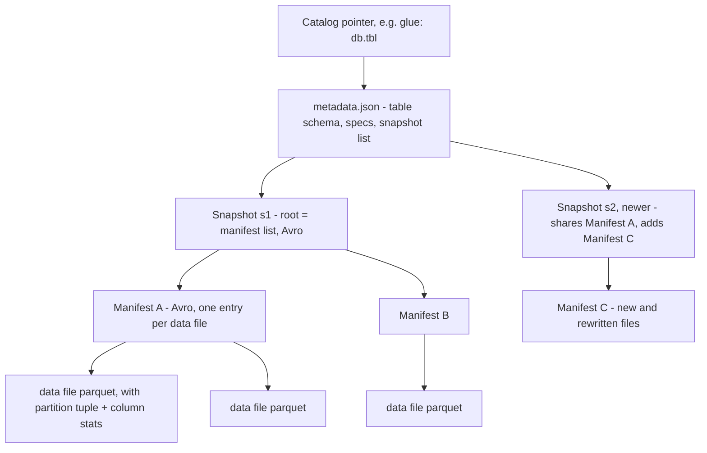
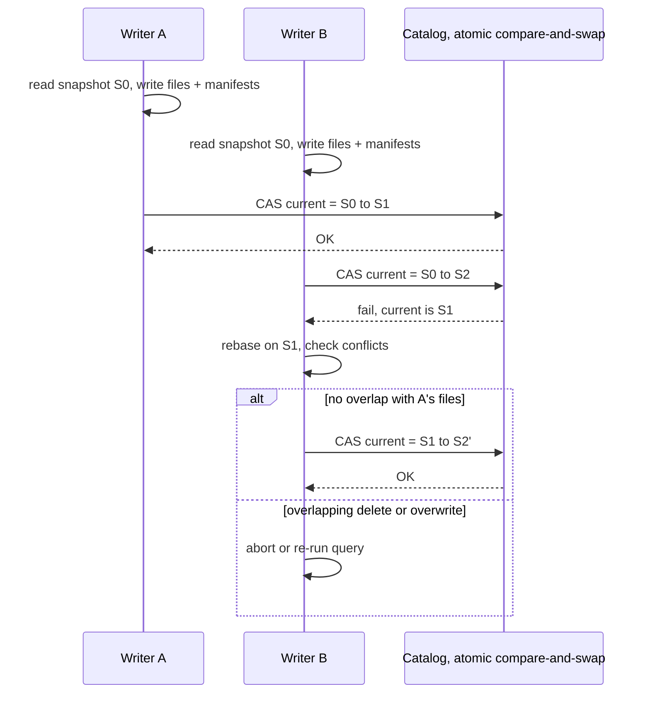

# Apache Iceberg — Snapshot Model, Hidden Partitioning, and Engine Neutrality

## Overview

Apache Iceberg is an open table format that turns a directory of immutable Parquet files into a versioned, transactional SQL table. It was built at Netflix because Hive tables on S3 had no atomic commits, no partition evolution, and stale statistics; Iceberg replaced "directory layout = table state" with a **tree of metadata files** whose root is one JSON document. Iceberg is now the de facto neutral table format: Trino, Spark, Flink, Snowflake, BigQuery, and DuckDB can all read the same table. Interviewers probe three things: the snapshot/manifest tree, hidden partitioning and partition evolution, and how optimistic concurrency works without a lock server.

> If you need the workload-level "which format should I pick" answer, see [Data Lakehouses](../../data-engineering/lakehouses.md) and the [Table Format Comparison](./table-format-comparison.md). This page is the Iceberg internals view.

## The Metadata Tree: metadata.json → Manifest List → Manifest → Data Files

An Iceberg table is identified by a catalog pointer to the current `metadata.json`. Every commit writes a **new** metadata JSON (or in newer implementations, an appended table-metadata file) and swaps the pointer; nothing in place is mutated. The tree has exactly four levels:



What each level stores:

| Level | Format | Contents | Typical size |
|---|---|---|---|
| `metadata.json` | JSON/Puffin | schemas, partition specs, sort orders, snapshot list, current snapshot ID | tens of KB |
| Manifest list | Avro | one row per manifest: path, partition ranges, added/deleted file counts | KBs |
| Manifest | Avro | one row per data file: path, partition tuple, record count, per-column min/max, null counts, size | target 8 MB |
| Data file | Parquet/ORC/Avro | the rows | 128 MB–1 GB (default target 512 MB) |

Three consequences interviewers like:

1. **Snapshot isolation is free.** A reader resolves the pointer once and then reads only files reachable from that snapshot; a concurrent commit produces a new tree and never mutates the old one. Long-running queries survive arbitrary commits.
2. **Planning is O(manifests), not O(files).** Because manifests carry per-file min/max and partition ranges, an engine can prune a billion-row table by reading a few Avro manifests — this is why Iceberg does not need a metastore listing of partitions. Hive needs to LIST thousands of S3 prefixes; Iceberg reads ~8 MB of manifests.
3. **Commits are cheap but not free.** Every commit rewrites the metadata JSON and at least one manifest list; with many small commits per second the metadata tree itself becomes the bottleneck, which is the usual argument for landing micro-batches rather than per-record commits.

A real `metadata.json` (trimmed) shows the moving parts:

```json
{
  "format-version": 2,
  "table-uuid": "9c12d441-...",
  "current-schema-id": 0,
  "schemas": [{ "schema-id": 0, "fields": [
      {"id": 1, "name": "event_time", "type": "timestamptz"},
      {"id": 2, "name": "user_id", "type": "long"} ]}],
  "partition-specs": [{ "spec-id": 1, "fields": [
      {"name": "event_day", "transform": "day", "source-id": 1, "field-id": 1000} ]}],
  "current-snapshot-id": 3912...,
  "snapshots": [{ "snapshot-id": 3912..., "manifest-list": "s3912.avro",
                   "schema-id": 0, "summary": {"operation": "append", "added-files": "42"} }]
}
```

Note that column IDs (`source-id`) are assigned at creation and never reused; that is the foundation of schema evolution (below).

## Hidden Partitioning and Partition Evolution

In Hive, `PARTITIONED BY (event_date DATE)` creates a *column* whose values are duplicated into the directory path, and every query author must remember to filter on it. Iceberg replaces this with a **partition spec**: a list of derived fields computed from source columns via transforms (`identity`, `year`, `month`, `day`, `hour`, `bucket[N]`, `truncate[W]`). The spec lives in metadata, not in the data, and the engine derives partition filters automatically from user predicates.

- **Hidden** because the user never writes a partition column: `WHERE event_time >= '2025-01-01'` prunes partitions even though the physical field is `days(event_time)`. Writing a predicate that doesn't align with the spec is impossible — there is no way to "forget" to partition-filter and no way to corrupt values with timezone arithmetic, the two classic Hive bugs.
- **Derived, not stored**: partition values in manifests are *tuples* per spec, e.g. `(event_day=20454)`, computed on write. Bucket transforms hash the source column with Murmur3: `bucket(N, col) = murmur3_x86_32(value) mod N`, which spreads keys without HotSpot prefix skew.

**Partition evolution** is the payoff: change the spec with `ALTER TABLE ... SET PARTITION SPEC` and new writes use the new spec while old data keeps its old tuples. Each manifest stores the `spec-id` it was written with, so one table can contain hourly partitions for recent data and daily partitions for 2022 archives — no rewrite, no downtime, no broken downstream queries. Hive cannot express this at all: changing granularity is a full `INSERT OVERWRITE ... SELECT` of the table.

```sql
-- worked example: evolve daily to hourly as volume grows 100x
ALTER TABLE events SET PARTITION SPEC (hours(event_time));
-- old manifests keep spec-id 1 (day), new files get spec-id 2 (hour)
-- planning unions both: each manifest is read with its own spec
```

## Optimistic Concurrency: Commit, Conflict, Retry

Iceberg assumes no lock server. A writer:

1. Resolves the current snapshot `S0`, reads its manifests.
2. Writes new data files and new manifests (no other writer can see them).
3. Attempts a **catalog-level atomic swap** from `S0` to the new snapshot `S1`.
4. If the swap fails because someone else moved the pointer, it **rebases**: re-reads the new current snapshot, checks its changes for conflicts, and retries.



The conflict rules are what make this safe, and they are a favorite interview question:

| Operation A | Concurrent operation B | Conflict? |
|---|---|---|
| Append files | Append files | Never — appends commute |
| Append | Delete rows (files touched by B's appends) | Only under `serializable` isolation |
| Delete/rewrite file F | Delete/rewrite file F | Always — same file replaced twice |
| Overwrite partition P | Anything touching P | Always |
| Schema update | Any commit | Depends on change; drops conflict |

Defaults: `commit.retry.num-retries = 4`, exponential backoff 100 ms → 60 s. Two isolation levels exist: `serializable` (conflict if sequences can't serialize) and `snapshot` (only physical file overlap conflicts, the default). Because the CAS point is a single key in the catalog (Glue conditional put, Nessie merge, HMS with a table lock, REST catalog), correctness reduces to that store's atomicity — which is why the catalog choice below matters.

## Time Travel, Rollback, and Snapshot Expiry

Every snapshot is retained until `expire_snapshots` removes it, so readers can query any point within the retention window:

```sql
SELECT * FROM events TIMESTAMP AS OF '2025-06-01 00:00:00';
SELECT * FROM events VERSION AS OF 48212;
CALL catalog.system.rollback_to_snapshot('db.events', 48212);
```

Implementation is trivial given the tree: time travel is just "resolve an older snapshot ID and read its manifest list," and rollback is "point the catalog at the old snapshot." Defaults: snapshots older than 5 days are expired, and the metadata file retains the last 100 entries (`write.metadata.previous-versions-max`). Two operational traps: expiring snapshots does **not** delete the unreferenced data files (that is `remove_orphan_files`, run carefully — a slow reader on the wrong snapshot plus an aggressive orphan sweep causes silent data loss), and audit requirements of "keep 90 days of history" translate directly into object-store storage cost for files that are logically deleted but still referenced. Nessie-style catalogs add branch/tag on top, making time travel a first-class, unlimited-horizon feature rather than a GC window.

## Schema Evolution and Row-Level Changes

Because manifests reference columns by **field ID** rather than position or name, Iceberg supports add, drop, rename, retype (promotable: int→long, float→double), reorder, and nested-struct evolution with no data rewrite: readers interpret old files through the current schema mapping. A dropped column is simply not projected; a renamed column is an alias in the mapping. Compare with Parquet's name-based or index-based mapping limitations — this ID mapping is precisely why Iceberg can evolve schemas safely.

Row-level changes (format v2, and v3's deletion vectors):

| Mechanism | How it works | Read cost | Best for |
|---|---|---|---|
| Copy-on-write | Rewrite affected data files entirely | None — reads stay pure Parquet | Frequent-read, rare-update tables |
| Position deletes | Delete file records `(file_path, row_pos)` | Reader skips listed positions | Streaming CDC, frequent deletes |
| Equality deletes | Delete file records `(col values)`; applies to *any* file with matching key | Reader applies as anti-join across all files in scope | Merge/upsert without knowing target files |
| Deletion vectors (v3) | Per-file bitmap/Puffin, referenced from manifest | Cheap per-file skip | Databricks-style DV semantics, frequent updates |

The v2 sequence number matters: each delete file is tagged with the sequence of the commit that produced it, and it applies only to data files with a lower sequence — that is how a positional delete can arrive concurrently with an insert without ambiguity. Equality deletes are the slowest read path (they must be applied against every older file in the scan), which is why `DELETE`/`MERGE`-heavy tables need scheduled compaction to fold deletes back into rewritten data files.

## Compaction: Bin-Packing, Sort Orders, and Maintenance

Small-file problems are self-inflicted by streaming writers, and Iceberg's answer is the `rewrite_data_files` procedure:

| Strategy | Algorithm | Use when |
|---|---|---|
| `binpack` | Greedy pack files into ~`target-file-size-bytes` (default 512 MB) groups per partition | Default; fixes small-file skew |
| `sort` | Sort rows by `sort-order` then binpack | Pruning on a hot column; better compression |
| `zorder` | Interleave multiple columns' bits (Z-curve), then binpack | Multi-column pruning with no single "hot" column |

Sort orders are table metadata (`ALTER TABLE ... WRITE ORDERED BY`), so *every* writer (Spark, Flink, Trino) produces consistently sorted files, and manifests record the order for planning. Compaction also rewrites away delete files (folding positional/equality deletes into the remaining rows), which restores fast reads on upsert-heavy tables. Full maintenance hygiene: `expire_snapshots` (history window), `remove_orphan_files` (leaks, older than N days), `rewrite_manifests` (fragmented manifests after many small commits), plus `ANALYZE`-style statistics in newer engines. A common production cadence: compact hourly, expire snapshots daily, orphan-sweep weekly with a conservative age threshold (3 days default in most runbooks).

## Engine Integration and the Catalog Abstraction

Iceberg's design center is that *no engine owns the table*. Spark has the deepest procedural support (`CALL` procedures, structured streaming sinks), Trino and Presto offer full DML, Flink provides streaming ingest with exactly-once commits checkpointed to the snapshot boundary, and Snowflake/BigQuery/Redshift read (increasingly write) Iceberg natively. The engine only needs to implement: read manifests, project files, apply deletes, and perform the commit CAS.

The catalog is the pluggable root pointer, and its capabilities differ — a classic interview trap is assuming "the catalog is just a name service":

| Catalog | Atomic mechanism | Extras / caveats |
|---|---|---|
| Hive Metastore | HMS lock + update (not a true CAS) | Ubiquitous; weakest commit semantics |
| AWS Glue | Conditional put with version check | Native S3/Glue/Athena integration |
| Nessie | Content-addressed merge of table refs | Git-like branches/tags; multi-table transactions |
| JDBC | Row-level CAS on a version column | Simple self-hosted option |
| REST (spec) | Server-side commit endpoint | Unity/Polaris/Gravitino; vendor-neutral protocol; server can stage tasks |

Because every writer must funnel through the catalog's atomic swap, the catalog is both the throughput ceiling (commits/second) and the consistency anchor. High-ingest tables mitigate by landing fewer, larger commits (Flink checkpoint interval is the usual knob) or by using a catalog designed for high CAS rates.

## Partition Transforms Reference

Because partition fields are *transforms over source columns*, the transform vocabulary is worth knowing cold — it comes up whenever someone asks "how would you partition events?" and it doubles as the bucketing design language:

| Transform | Input → output | Use for | Notes |
|---|---|---|---|
| `identity` | value → value | direct filters | One partition per distinct value — avoid on high-cardinality |
| `year` / `month` / `day` / `hour` | timestamp → int | time-series | Timezone-safe (uses UTC semantics of timestamptz) |
| `bucket[N]` | murmur3(value) mod N | join/lookup keys | No range pruning, only equality pruning |
| `truncate[W]` | value → floor(value/W)·W | skewed numerics, strings | Keeps range pruning on coarse bins |

Two rules govern choosing between them. First, partition for *write fan-in and read pruning simultaneously*: `days(ts)` gives daily commit granularity and day-level pruning; `bucket(64, user_id)` gives write parallelism and point-lookup pruning but destroys range scans. Second, because of partition evolution, the choice is revisable per time window — start coarse (`month`), evolve to `day`/`hour` as volume grows, and let old manifests keep the old spec. Engines handle the union during planning; no migration job is ever required, which is the property that makes the feature real rather than cosmetic.

## Format Versions: v1 vs v2 vs v3

| Capability | v1 (2020) | v2 (2021) | v3 (2024+) |
|---|---|---|---|
| Delete mechanisms | none (COW only) | position + equality delete files | + deletion vectors |
| Sequence numbers | absent | per-snapshot, orders deletes vs inserts | retained |
| Types | core set | — | nanosecond timestamps, `unknown` (write-only) columns |
| Multi-line/row-level spec | row groups only | delete files in manifests | DV bitmaps referenced from manifests |

The version negotiation mirrors Delta's `protocol` action: writers stamp `format-version` in `metadata.json`, and engines refuse tables beyond their supported reader version rather than misinterpreting them. In interviews, the honest summary is "v2 made row-level changes first-class; v3 converges on deletion vectors and richer types" — and if asked which you'd pick: v2 tables are the safe default everywhere; v3 where the ecosystem (Spark 4.x-era runtimes) supports it. Format version is per-table and not retroactively upgraded silently, because every reader pinned to a snapshot must be able to parse every file that snapshot references.

## Worked Example: Planning Cost Math

Interviewers love back-of-envelope questions; here is the canonical one with real numbers. Table: 1 PB, 512 MB data files → ~2M files, partitioned by day, query = one day, one column (10 columns total).

1. **Hive-style planning**: LIST the day's prefixes (1 day of files, ~5.5K files → ~2 LIST pages), then open each file's footer for stats — 5.5K GETs minimum before reading data. At ~20 ms/request with concurrency, that is tens of seconds of planning, and S3 request charges for every query.
2. **Iceberg planning**: manifests hold all 2M entries total; at ~250 B/entry (path, partition tuple, stats) that is ~500 MB of manifests — but the manifest list carries per-manifest partition ranges, so the day filter touches only ~275 manifests × 8 MB ≈ 2 GB of manifest reads... unless the *partition upper/lower bounds in the manifest list* prune further (they do — day-level queries read only the manifests whose ranges intersect the day: tens of manifests).
3. **Effective planning**: ~10-50 manifest reads (each a single GET of ≤8 MB) → sub-second planning, then read ~550 data files for the day, pruning to fewer via per-file min/max on the second filter column.

The punchline is the ratio: planning metadata touched drops from thousands of requests to dozens, which is precisely why Iceberg tables scale to millions of files where Hive listing collapses — and why every commit's cost (rewriting manifests) is bounded by keeping file counts and manifest fragmentation under control. Ask the same question for a *point lookup on `bucket(64, user_id)`* and the answer changes shape: bucketing prunes to 1/64th of manifests immediately, then per-file stats finish the job.

## Configuration Quick Reference

| Property | Default | Effect |
|---|---|---|
| `write.target-file-size-bytes` | 512 MB | Compaction/rewrite output size; match to scan patterns |
| `commit.retry.num-retries` | 4 | OCC retry budget; raise for hot tables |
| `commit.retry.min-wait-ms` / `max-wait-ms` | 100 / 60000 | Exponential backoff bounds |
| `history.expire.max-snapshot-age-ms` | 5 days | Default time-travel window |
| `write.metadata.previous-versions-max` | 100 | Old metadata.json files retained |
| `write.distribution-mode` | engine-dependent | `hash`/`range`/`none` — shuffle before write for target sizes |
| `write.spark.fanout.enabled` | false | Avoids driver-side partition gather on skewed writes |

Two of these deserve interviews-level depth. `write.distribution-mode` decides whether writes shuffle by partition before writing (`hash`) — required to hit target file sizes when streaming sources produce many small tasks per partition — versus `none`, which produces small files that compaction must later fix. And the retry/backoff pair is your only lever when commit conflicts spike: raising retries masks the symptom, but the durable fix is widening the partition scheme or lowering commit frequency (bigger Flink checkpoint intervals), exactly as discussed on the [comparison page](./table-format-comparison.md).

## Interview Questions

1. **Walk me through what happens on `INSERT INTO` a partitioned Iceberg table.**
The engine resolves the catalog pointer to the current `metadata.json`, reads the manifest list and relevant manifests to plan existing files, then writes new Parquet files with partition tuples per the current spec. It writes new manifests containing stats for the new files and a new manifest list, serializes a new `metadata.json` referencing a new snapshot whose summary says `append`, and does a compare-and-swap on the catalog pointer. If the CAS fails, it rebases against the winner's snapshot and retries up to `commit.retry.num-retries`. Readers never see intermediate state because they resolve the pointer once.

2. **What is hidden partitioning and why does it beat Hive partitioning?**
The partition spec is metadata — transforms like `days(ts)` or `bucket(16, id)` applied to source columns — and the engine derives partition pruning from ordinary `WHERE` predicates. Users cannot write queries that "forget" the partition column, and timezone bugs that plagued Hive date strings disappear because values are derived, not stored as strings. It also enables partition evolution: changing the spec only affects new writes, because each manifest records which spec produced it. Hive couples logical partitioning to directory names, which makes evolution a full table rewrite.

3. **How do two concurrent writers avoid clobbering each other without a lock?**
They use optimistic concurrency: both read snapshot S0, stage files, and race a catalog-level atomic swap. The loser rebases — re-reads the new snapshot and applies its changes on top — and retries. Appends always commute, so append-only workloads never conflict; deletes, overwrites, and schema changes conflict by well-defined rules (file overlap under snapshot isolation, sequence overlap under serializable). Correctness rests entirely on the catalog swap being atomic, which is why Glue/Nessie/REST catalogs specify conditional commit semantics while raw HMS is the weak spot.

4. **Position deletes vs equality deletes vs copy-on-write — when would you use each?**
Copy-on-write rewrites affected files, so reads stay pure Parquet and fast, but update latency and write amplification are high; it suits read-mostly tables with rare updates. Position deletes record `(file, row_pos)` pairs and are cheap to apply, ideal for streaming CDC where the engine knows which files changed. Equality deletes store key values and apply as an anti-join across every older file in the scan, so they are the most flexible on write but the slowest on read until compaction folds them in. In practice you pick per table via the `MERGE`/write mode and let scheduled compaction clean up.

5. **Why do Iceberg manifests make planning faster than a Hive table with the same data?**
A Hive planner must LIST the table's partition directories — thousands of S3 requests that each add latency and rate-limit pressure — and then open each file's footer for statistics. Iceberg's manifests already contain per-file record counts, file size, partition tuple, and per-column min/max/null-count, so planning reads a handful of ~8 MB Avro manifests. That is also why Iceberg handles tens of millions of files where Hive's listing cost becomes prohibitive. The trade-off is that every commit must rewrite metadata, so commit rate, not file count, becomes the scaling limit.

6. **What breaks if you never run maintenance?**
Unbounded snapshot retention means logically deleted data never leaves storage, delete files accumulate and degrade reads, and streaming writers produce millions of small files that blow past manifest and list-request budgets. Queries slow down gradually, then storage cost spikes, then planning itself becomes the bottleneck. `expire_snapshots`, `rewrite_data_files`, `remove_orphan_files`, and manifest compaction are the four knobs, and cadence should follow ingest rate. Interviewers want to hear that maintenance is part of the format's design, not an optional garnish.

## Key Takeaways

- One table = one atomic pointer to a `metadata.json`; the tree under it is manifest list → manifests (per-file stats) → data files.
- Readers get snapshot isolation by resolving the pointer once; concurrent commits create new trees and never mutate old ones.
- Hidden partitioning: specs are transforms on source columns; pruning is automatic; partition evolution needs no rewrite because manifests carry `spec-id`.
- Commits are optimistic CAS with defined conflict rules; appends commute, deletes/overwrites conflict on file overlap.
- Schema evolution works because columns are referenced by immutable field IDs, not names or positions.
- Row-level changes: COW, position deletes, equality deletes, v3 deletion vectors — pick by update frequency and read cost.
- Compaction (binpack/sort/zorder), snapshot expiry, and orphan cleanup are mandatory maintenance, not optional tuning.
- The catalog is the consistency anchor and the throughput ceiling: HMS, Glue, Nessie, JDBC, or REST — each with different atomicity guarantees.

## Cross-References

- [Table Format Comparison](./table-format-comparison.md) — Iceberg vs Delta vs Hudi, commit protocols side by side
- [Delta Lake](./delta-lake.md) — the log-centric alternative design
- [Apache Hudi](./apache-hudi.md) — the index-first alternative for upsert-heavy ingest
- [Parquet Internals](./parquet-internals.md) — the data file format Iceberg stores and prunes
- [Data Lakehouses](../../data-engineering/lakehouses.md) — workload-level overview and use-case mapping
- [S3 Internals](../advanced/s3-internals.md) — why atomic single-key writes are the whole trick on object storage
- [Trino](../../data-engineering/trino.md) — a major Iceberg engine beyond Spark

## References

- [Iceberg table spec](https://iceberg.apache.org/spec/) — snapshot model, manifest schema, conflict semantics, v2/v3 formats
- [Iceberg docs](https://iceberg.apache.org/docs/latest/) — configuration, maintenance procedures, engine integration
- [Apache Iceberg GitHub](https://github.com/apache/iceberg) — source for catalog implementations and commit retry logic
- [Parquet format docs](https://parquet.apache.org/docs/file-format/) — underlying data file format
- [Delta Lake protocol](https://github.com/delta-io/delta/blob/master/PROTOCOL.md) — for contrast with log-based commit design
