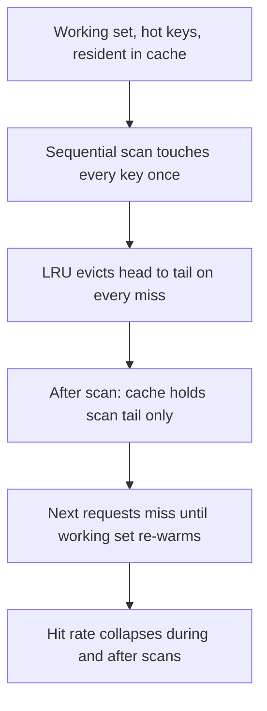
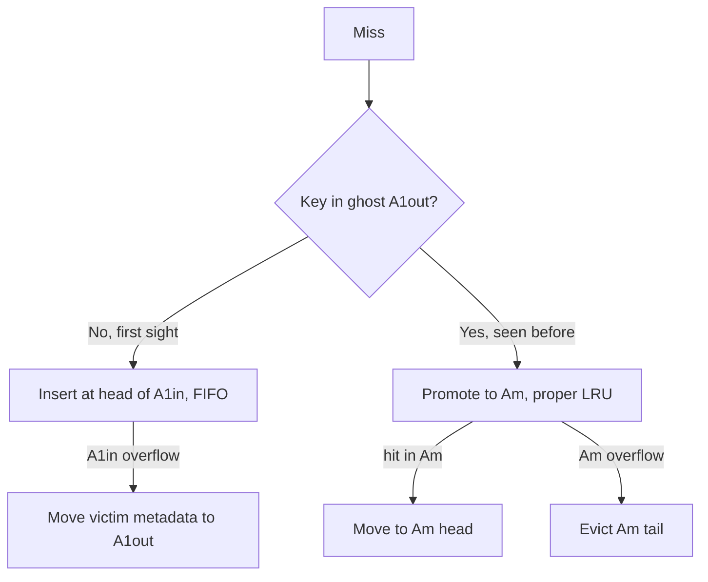
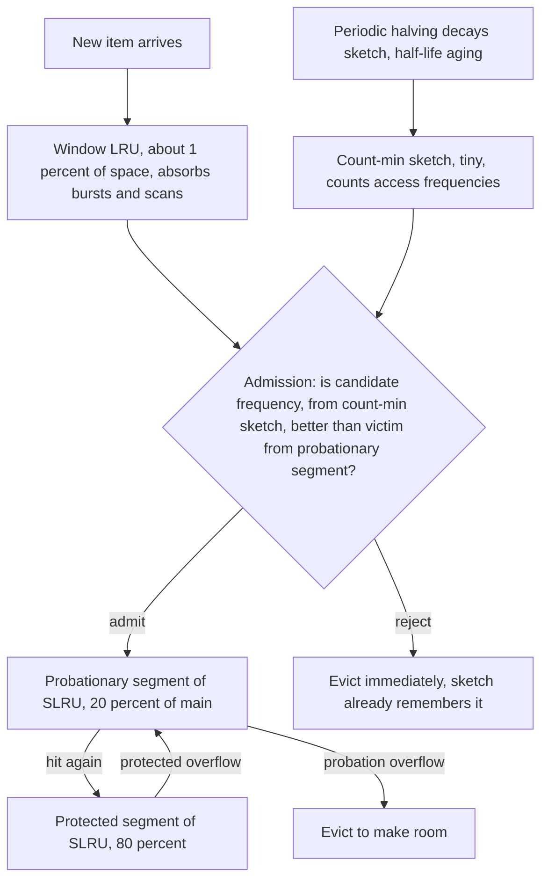

# Cache Eviction Algorithms — LRU to W-TinyLFU

## Overview

Every serious storage system eventually writes its own cache: RocksDB's block cache, Caffeine's JVM object cache, CDN edge caches, page caches. The naive answer is LRU, and the interesting interview question is *why almost nobody ships plain LRU anymore*: one sequential scan evicts the entire working set, and LRU cannot distinguish "hot every second" from "hot twice an hour." This page walks the escalation ladder — LRU → 2Q → ARC → LIRS → W-TinyLFU → LeCaR/CacheLib — with the hit-rate/memory/CPU trade-offs, scan resistance, TTL handling, and where each algorithm actually runs in production. The linked algorithms (count-min sketch, bloom filters) are interview favorites in their own right.

## The Baseline: LRU and Its Two Failure Modes

LRU evicts the least-recently-used entry, implemented as a hashmap + doubly linked list for O(1) get/put. It exploits temporal locality well but has two structural failures:

1. **Scan pollution (thrashing)**: a full-table scan or backup job touches every block once, cycling the entire cache. After the scan, the real working set is gone and hit rates crater until it warms again. This is the classic RocksDB/olap-scan complaint.
2. **One-hit-wonder blindness**: LRU keeps objects that were accessed once recently but will never be accessed again, evicting objects accessed less recently but twice per hour. Frequency information is discarded entirely.

Every algorithm below is a different answer to one question: *how do we keep the hot set when traffic contains floods of cold keys?* The answers differ in how much extra memory they spend on history ("ghost" metadata) and how much CPU they burn per request.

## 2Q: Two Queues and a Ghost List

2Q (Johnson & Shasha, VLDB 1994) adds the missing structure: new objects go into queue **A1in** (FIFO); on a second access they are promoted to **Am** (proper LRU); when A1in overflows, its victims are remembered in **A1out** (metadata-only ghost list). An access hitting A1out means "this was evicted once and came back — it is not a one-hit wonder," so it re-enters as hot. Tuning: `Kin` (A1in size fraction, ~25%) and `Kout` (ghost size, ~50% of cache) absorb most workloads without per-workload tuning.

2Q's contribution is conceptual more than commercial: *ghost lists convert one bit of future-relevant history (was it here before?) into scan resistance*, at metadata-only cost. Linux's page cache active/inactive lists and InnoDB's midpoint insertion are both pragmatic cousins of this idea.

## ARC: Adaptive Split with Two Ghost Lists

ARC (Megiddo & Modha, FAST '03) keeps four lists: **T1** (pages seen once), **T2** (pages seen ≥ twice), **B1**/**B2** (ghosts of each). The insight is that the *optimal split of cache space between "once" and "twice" pages is workload-dependent and learnable*: a hit in B1 (a once-page came back) means T1 is too small; a hit in B2 means T2 is too small. One adaptive parameter `p` moves target capacity between T1 and T2 by ±1 per ghost hit, which makes ARC self-tuning between recency (LRU) and frequency (LFU) behavior with no tuning knobs.

| Property | LRU | 2Q | ARC |
|---|---|---|---|
| Lists | 1 | 3 (+ghost) | 4 (2 resident + 2 ghost) |
| Adapts split once/frequency | No | Fixed `Kin` | Yes, per request via `p` |
| Extra memory | none | ghost metadata | ghost metadata |
| Scan resistance | none | yes | yes |
| CPU per request | O(1) | O(1) | O(1) |

ARC was patented, which historically pushed open-source systems toward LIRS and W-TinyLFU instead; it nonetheless ships inside ZFS's ARC (the name is literal) and remains the reference design for "adaptive recency/frequency split." Interview framing: 2Q answers "is it new?", ARC answers "which *class* is currently under-served, and adapts automatically."

## LIRS: Inter-Reference Recency

LIRS (Jiang & Zhang, SIGMETRICS '02) replaces recency with **Inter-Reference Recency (IRR)** — the number of distinct other pages accessed between two references to the same page. Pages with small IRR (LIR pages) form the core hot set and live in stack **S**; pages with large IRR (HIR) get residual space in a FIFO queue **Q** with ghost metadata in S. A repeated reference that proves an HIR page actually has small IRR promotes it by exchanging it with the stack bottom. The payoff is high hit rates under skewed access and strong scan immunity, because scans inflate IRR rather than evicting LIR pages directly. LIRS is O(1) with modest bookkeeping and influenced virtually every successor, including W-TinyLFU's SLRU main cache.

## W-TinyLFU: Window + SLRU + Sketch Admission

W-TinyLFU (Einziger, Friedman, Manes — TinyLFU, 2015; windowed variant popularized by the Caffeine library) is the current JVM-standard answer and the default policy in CacheLib. Architecture:

Three ideas to articulate:

1. **Frequency via count-min sketch, not real metadata.** Frequencies of *all* keys (even uncacheable ones) live in a tiny fixed-size sketch (~bytes per key, 4 hashes, add-on-access) instead of per-entry bookkeeping. See [Bloom Filters](../bloom-filters.md) for why the sketch's false positives are harmless here.
2. **Admission as a decision, not just eviction.** A new item must beat the *victim's* frequency to enter the main cache; one-hit wonders are rejected but remembered in the sketch, so a genuinely recurring item wins on its next visit.
3. **Aging via halving.** All sketch counters are periodically halved, so yesterday's hot key fades — this is how the policy adapts to shifting working sets despite "LFU never forgets."

The small **window** (W-LRU, ~1% of capacity) absorbs bursts and recency spikes that a pure frequency policy would miss. Net effect: W-TinyLFU matches or beats ARC/LIRS on Zipf-like workloads and *dominates* under scan-heavy mixed traffic, at O(1) CPU and near-zero metadata memory — the reason Caffeine made it the default for JVM services.

## LeCaR and CacheLib: Learning and Industrialization

- **LeCaR** (Vietri et al., HotStorage '18) reframes eviction as a **regret-minimization** problem between two experts — LRU and LFU — each with a weight; the cache replays "what would the other policy have done" using ghost metadata and shifts capacity (γ) toward whichever expert is producing fewer misses. It is a clean interview answer for "can a cache learn online?" and competitive with ARC/W-TinyLFU at similar overheads.
- **CacheLib** (Meta, OSDI '20) is the productionization: a C++ library unifying DRAM + SSD (NVM) caching behind one HybridPageCache API, with W-TinyLFU-family admission/eviction as the flagship policy. It powers Meta's CDN and SQL-layer caches, where the interesting questions become *tiering* (DRAM vs flash, cost-per-hit) and *restart resilience* rather than raw policy choice.

## The Comparison Table

| Algorithm | Year | Extra memory | CPU/req | Scan resistance | Adapts | Where it ships |
|---|---|---|---|---|---|---|
| LRU | — | none | O(1) | none | no | everywhere as baseline; RocksDB block cache default |
| 2Q | 1994 | ghost metadata | O(1) | yes | fixed split | conceptually: Linux page cache, InnoDB midpoint |
| ARC | 2003 | 2 ghost lists | O(1) | yes | adaptive `p` | ZFS ARC |
| LIRS | 2002 | stack + queue | O(1) | strong | implicit via IRR | influenced MySQL/InnoDB variants, W-TinyLFU |
| W-TinyLFU | 2015–17 | tiny sketch | O(1) + sketch ops | strongest (window + admission) | sketch halving | **Caffeine** (JVM), **CacheLib** default |
| LeCaR | 2018 | ghost metadata | O(1) | yes | regret weights | research / hybrid engines |

Typical hit-rate ordering on skewed, scan-contaminated traces: LRU ≪ 2Q ≈ LIRS < ARC ≲ W-TinyLFU. On a purely Zipfian working set with no scans the gap narrows sharply — the "which is best" answer is always workload-conditional, which is the point the interviewer is really probing.

## TTL Handling and Other Practical Wrinkles

- **Expiry ≠ eviction.** TTL-expired entries must be proactively expired or they occupy space while never being hits: lazy expiry on access plus periodic sweeps (Caffeine uses a hierarchical timer wheel for variable TTLs at scale).
- **Variable-size entries** break "capacity = count": caches become byte-budgeted (RocksDB block cache charges bytes; CDN caches weigh by object size — the GreedyDual-Size family, Cao & Irani 1997, evicts by cost/size value rather than recency).
- **Sharding** for CPU scalability: RocksDB shards its cache 2^k ways (default 64) to reduce lock contention; Caffeine uses striped buffers so the O(1) fast path is wait-free for reads.
- **Persistence across restarts**: CacheLib's flash tier and RocksDB's secondary/persistent cache exist because a cold cache after restart is an incident generator for hot services.

## Where Each Lives Today

| System | Eviction stack | Notes |
|---|---|---|
| RocksDB block cache | LRU (with high/low-pri pools for index/filter blocks) + optional ClockCache, secondary cache | Byte-charged, sharded; index/filter pinned to high-pri pool — see [SSTable](../sstable.md) |
| Caffeine | W-TinyLFU | JVM default choice (Spring, Guava successor); O(1), wait-free reads |
| CacheLib | W-TinyLFU-family + NVM tiering | Meta CDN/SQL caches; DRAM+flash HybridPageCache |
| ZFS ARC | ARC | Adaptive recency/frequency split for page-level caching |
| Linux page cache | active/inactive LRU variant (2Q-like, with refault detection) | Kernel-side, anonymous/file split |
| CDN edge caches | cost-aware LRU variants (GreedyDual-Size lineage), segmented/TinyLFU admission at scale | Value = object size × latency saved |

The RocksDB choice is instructive: its *block* cache is plain LRU, because scan resistance is partially outsourced — index/filter blocks get priority pinning, and the real scan-protection for point lookups lives in bloom filters ([Partitioned Index/Filters](https://github.com/facebook/rocksdb/wiki/Partitioned-Index-Filters)), not eviction policy. Algorithm choice is always co-designed with the rest of the read path.

## Interview Questions

1. **Why is plain LRU considered inadequate for storage engines?**
Two failure modes. A single sequential scan touches every block once and cycles the whole cache, destroying the hot set precisely when a batch job runs. And LRU keeps one-hit wonders — recently-touched, never-again keys — over genuinely hot keys accessed less recently but repeatedly. Production caches therefore add frequency information, ghost history, or admission control. The cost of those additions (memory, CPU) is the design axis the rest of the algorithms occupy.

2. **Explain ARC's four lists and what the ghost lists are for.**
T1 holds pages seen once, T2 pages seen at least twice; B1 and B2 hold metadata-only ghosts of each. When a ghost is hit, it proves that list's class was under-provisioned, so the adaptive parameter p shifts capacity toward T1 (B1 hit) or T2 (B2 hit). ARC thus self-tunes between recency and frequency with no configuration, which 2Q cannot do with its fixed Kin. Memory overhead is modest because ghosts store keys, not values.

3. **How does W-TinyLFU achieve scan resistance?**
Scans fail admission twice over. First, a scanned key's sketch frequency is ~1 while the probationary victim's frequency is higher, so the scan key is rejected from the main cache. Second, the tiny window absorbs whatever must be kept, so scan data churns through 1% of the cache instead of 100%. Because the sketch remembers rejected keys, a scan key that genuinely recurs will accumulate frequency and be admitted on a later visit. Halving decays stale frequency so the policy tracks working-set shifts.

4. **What does the count-min sketch buy over storing per-key frequency?**
Fixed, tiny memory independent of how many distinct keys flow through — often a few MB for billions of distinct keys — versus O(cache entries) metadata, and no per-entry locks. It can overcount (collision) but never undercount, which is safe for admission: a false positive just admits a marginal item occasionally. Combined with periodic halving for aging, it gives LFU-like behavior with O(1) operations and near-zero memory. This is the same trick as bloom filters: bounded-memory summaries of unbounded streams.

5. **Where does each algorithm actually run in production?**
Caffeine uses W-TinyLFU and is the default JVM object cache; CacheLib uses a W-TinyLFU-family policy across DRAM+SSD for Meta's CDN and SQL caches. ZFS ships ARC; Linux page cache is an active/inactive LRU variant with refault tracking; InnoDB uses midpoint insertion LRU. RocksDB's block cache is deliberately plain LRU with priority pools because scan protection is delegated to bloom filters and partitioned index/filter pinning rather than eviction. The lesson: the policy is co-designed with the surrounding read path, not chosen in isolation.

6. **How do caches handle TTLs and variable-size entries?**
Expiry is a correctness obligation separate from eviction: expired entries are removed lazily on access and proactively by periodic sweeps or timer wheels (Caffeine's hierarchical timer wheel handles millions of variable TTLs). Variable-size entries convert the cache to a byte budget — RocksDB charges each block's size, and CDN caches weigh by object size and bandwidth cost, historically via GreedyDual-Size policies that evict by value-per-byte rather than recency. Ignoring either leads to caches that are full of dead weight precisely when they matter most.

## Key Takeaways

- LRU's flaws are structural: scan pollution and one-hit-wonder blindness; everything else is a fix for those.
- Ghost lists (2Q, ARC, LeCaR) convert evicted-key history into scan resistance at metadata-only cost.
- ARC adaptively splits capacity between "once" and "twice" pages; 2Q uses a fixed split; LIRS replaces recency with inter-reference recency.
- W-TinyLFU = small window + SLRU + count-min-sketch admission + halving aging: strongest scan resistance at O(1) CPU and tiny memory.
- LeCaR formalizes eviction as online regret minimization between LRU and LFU experts; CacheLib industrializes W-TinyLFU with DRAM+flash tiering.
- Hit-rate ordering is workload-conditional; the stable claim is "LRU ≪ everything else under scans."
- TTL expiry is separate from eviction; byte-budgeting and sharding are what make policies production-grade.

## Cross-References

- [SSTable](../sstable.md) — the block cache consumer: blocks, filter, and index blocks being cached
- [Bloom Filters](../bloom-filters.md) — the math behind count-min sketches and admission decisions
- [LSM Compaction](../lsm-compaction.md) — where RocksDB's scan-heavy reads come from
- [LSM Tree Deep Dive](../advanced/lsm-tree-deep.md) — block cache in the full read path
- [Cache LLD (LRU implementation)](../../interview/system-design/lld/cache-lld.md) — the low-level-design interview version of this topic
- [CDN: How It Works](../../networks/cdn/how-it-works.md) — edge caching, where cost-aware eviction matters
- [Parquet Internals](./parquet-internals.md) — page caches and read paths that these algorithms serve

## References

- Einziger, Friedman, Manes, "TinyLFU: A Highly Efficient Cache Admission Policy," 2015 — [arXiv:1511.04026](https://arxiv.org/abs/1511.04026)
- Megiddo & Modha, "ARC: A Self-Tuning, Low Overhead Replacement Cache," USENIX FAST 2003 (title + venue cited; no URL relied upon)
- Jiang & Zhang, "LIRS: An Efficient Low Inter-reference Recency Set Replacement Policy," SIGMETRICS 2002 (title + venue cited)
- Johnson & Shasha, "2Q: A Low Overhead High Performance Buffer Management Replacement Algorithm," VLDB 1994 (title + venue cited)
- Vietri et al., "LeCaR: An Efficient High Performance Cache Replacement Policy for Storage Workloads," USENIX HotStorage 2018 (title + venue cited)
- [Caffeine wiki](https://github.com/ben-manes/caffeine/wiki) — W-TinyLFU design notes and benchmarks
- [RocksDB wiki](https://github.com/facebook/rocksdb/wiki) — block cache, sharding, priority pools
- [facebook/cachelib](https://github.com/facebook/cachelib) — CacheLib hybrid DRAM/NVM engine
