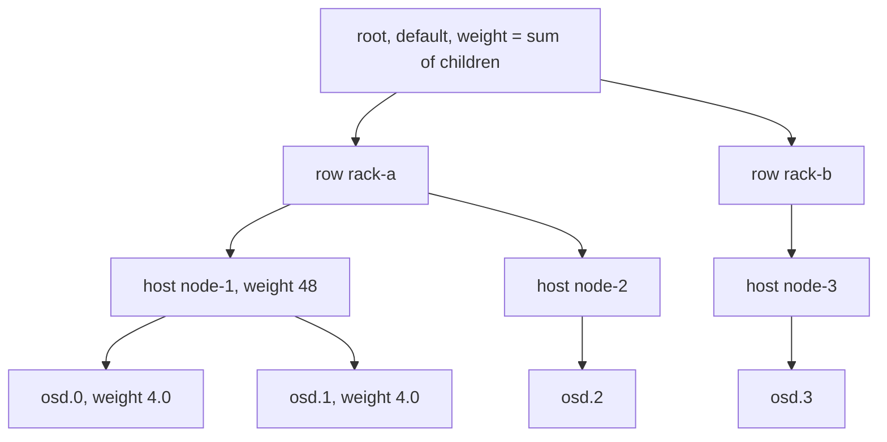
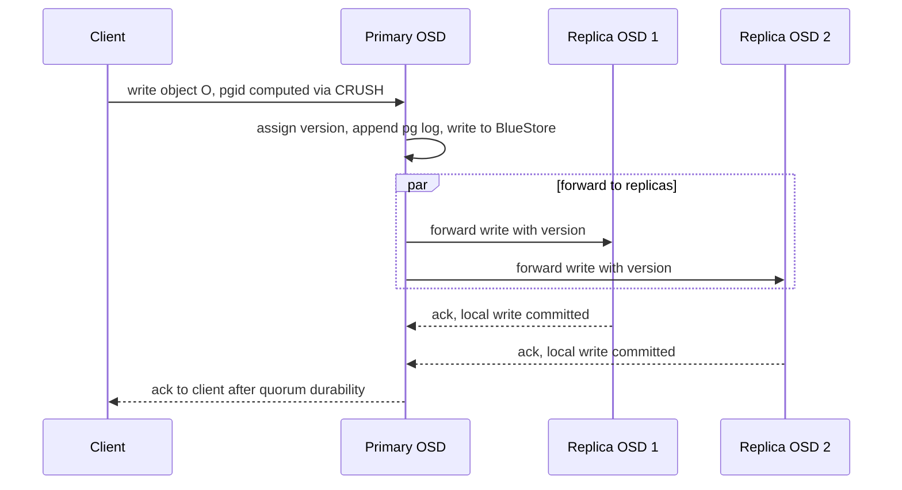

# Ceph CRUSH — The Placement Algorithm, Pseudocode, and PG Math

## Overview

CRUSH (Controlled Replication Under Scalable Hashing) is the algorithm that answers, for every object, *"which OSDs store this?"* — computed deterministically from a small cluster map instead of looked up in a metadata server. This page is the **algorithm view**: map hierarchy, PG count math with the Jenkins hash, `choose`/`chooseleaf` pseudocode, mapping stability under cluster changes, tunables, PG splitting, and the RADOS write/peering path. For RADOS architecture, Straw2 internals, PG state machines, and operations, read the existing deep dive [Ceph CRUSH & RADOS Deep Dive](../ceph-crush.md); this page deliberately avoids repeating it and cross-links throughout.

## The Cluster Map: A Weighted Hierarchy

The CRUSH map is a tree of buckets: `root → row → rack → host → osd`. Every device has a **weight** (its capacity in TiB), every bucket a type and an algorithm (straw2 in modern clusters), and the root aggregates child weights. The map is tiny (KBs per thousand OSDs), versioned, and gossiped to every OSD and client — there is no placement service to query because there is nothing to look up.



Two design choices distinguish this from Dynamo-style rings. First, the hierarchy *encodes failure domains*: a rule can say "replicas must be on distinct hosts" or "distinct racks" by descending the tree to that level. Second, weights are explicit, so heterogeneous clusters (4 TB NVMe next to 16 TB SMR) place data proportionally without virtual-node gymnastics. The map also carries pool-independent inputs only; placement rules (per pool) say how to walk the tree, and the OSDMap binds pools to rules and epochs.

## Placement Groups: The Sharding Layer

CRUSH never places individual objects — that would make remapping too granular. Objects are grouped into **placement groups (PGs)**, and CRUSH maps `(pool_id, pgid) → [OSDs]`. Object → PG is pure hashing:

```text
placement_seed = crush_hash32_rjenkins1(pool_id, object_name)   # Jenkins hash
pgid           = placement_seed mod pg_num                       # pg_num = power of 2
osd_set        = crush(pgid, pool_rule, osdmap_epoch)            # the only CRUSH call
```

Why the intermediate layer earns its complexity:

1. **Metadata locality**: a PG's log, peering state, and scrub schedules are per-PG, so state scales with PG count, not object count (billions of objects → thousands of PGs).
2. **Mapping stability**: remapping happens at PG granularity; an OSD joining moves ~`1/(pg_total)` of its new peers' data, not per-object churn.
3. **Recovery unit**: replication, scrubbing, and deep scrub all operate on a PG as a unit with a designated primary.

**PG count math.** The classic sizing rule targets ~100–200 PGs per OSD (pre-autoscaler guidance; Nautilus+ targets up to ~300 with `pg-autoscaler`):

```text
total_pgs = (osd_count * target_pgs_per_osd) / pool_replication_size
pg_num    = next_power_of_two(total_pgs)        # CRUSH distributes evenly only for powers of 2
```

Example: 120 OSDs, target 150, replica size 3 → `120×150/3 = 6000` → `pg_num = 8192` total across pools. `pgp_num` (the number of PGs actually used for placement) is raised to equal `pg_num` after splitting; keeping them separate is what makes PG *increases* cheap. The Jenkins hash (`rjenkins1`, Bob Jenkins' 1997 lookup3-style function) is the specific PRNG: fast, well-distributed, stable across Ceph versions — a change of hash function would reshuffle the entire cluster.

## Placement Rules and the choose/chooseleaf Pseudocode

A CRUSH rule is a small program run per (PG, epoch). A typical replicated rule:

```text
rule replicated_ruleset {
    type replicated
    min_size 1  max_size 10
    step take default                     # start at root
    step chooseleaf firstn 3 type host    # 3 distinct hosts, 1 OSD each
    step emit
}
```

The algorithm at the core (simplified from `crush_do_rule` in the Ceph source):

```text
function crush_chooseleaf(x, root, r_targets, failure_domain_type):
    # x = pgid (the CRUSH input), results must be deterministic in x
    selected = []
    r = 0                                  # round/attempt counter, varies input per replica
    while length(selected) < r_targets:
        node = root
        while type(node) != failure_domain_type:
            node = pick_child(node, x, r)  # straw2 draw: argmax over children of
                                           #   crush_hash(x, r, child_id) weighted by child weight
        leaf = descend_to_leaf(node, x, r) # same draw inside the failure domain: pick 1 OSD
        if leaf in selected or leaf is out (noout/down per OSDMap):
            r = r + 1                      # re-roll with varied r; bounded by choose_total_tries
        else:
            selected.append(leaf)
            r = r + 1
    return selected                        # acting set, order = primary first
```

`pick_child` for **straw2** (modern default) draws a score per child: `score = crush_hash(x, r, child_id) × f(weight)` where `f` normalizes by weight (a child's chance is proportional to its weight, independent of siblings); the highest score wins. The crucial property of straw2 over the older `straw`: **changing one child's weight never perturbs the relative order of the others**, so adding an OSD steals data only from the new winner's siblings, not cluster-wide. The older bucket algorithms — uniform (perfectly identical devices), list (append-optimized, never rescale), tree (O(log n), legacy) — survive for compatibility; new clusters use straw2 everywhere. EC pools use the same machinery in `indep` mode: each shard k gets a fixed-rank target so a lost shard maps deterministically to one OSD — see [Erasure Coding](../erasure-coding.md) for the coding layer and [Erasure Coding Deep Dive](../advanced/erasure-coding-deep.md) for the math.

## Stable Mapping Under Map Changes

CRUSH's defining guarantee is **minimal remapping**: when the map changes (OSD added, weight changed, rack inserted), only the PGs whose placement decision *actually changed* move. Formally, mapping is a pure function of `(pgid, rule, map_epoch)`; an epoch bump recomputes every PG's mapping, but because straw2 scores are drawn per (x, r, id), the winner changes only for PGs where a new/changed candidate draws a higher score or a previous winner disappeared. In practice adding one OSD of N moves ~`pg_num×(pgs_per_osd)/N` worth of PGs total, spread over days by throttled backfill.

Two subtleties interviewers probe:

1. **Weight 0 vs out**: `reweight`/`noout` interact with mapping — a weight-0 OSD stops *winning* new PGs but existing PGs stay until backfilled away; `noout` keeps it in the acting set despite being down (deliberate, to survive maintenance without mass re-replication).
2. **Determinism vs the OSDMap**: CRUSH output is a *candidate* set; the OSDMap (epoch, up/down, `noout` flags) filters it to the acting set. That is why a down OSD does not change CRUSH itself — the *map* layers handle failure, and the algorithm stays pure.

## CRUSH Tunables and PG Splitting/Autoscale

The first decade of Ceph shipped legacy behaviors guarded by **tunables** — named profiles (`argonaut` → `jewel` → `optimal`/`default`) that flip specific behaviors while old clients stay interoperable:

| Tunable | Effect |
|---|---|
| `choose_local_tries` / `choose_local_fallback_tries` | retry counts for legacy local-descent fallbacks |
| `choose_total_tries` | global retry budget for collision/overload re-rolls |
| `chooseleaf_descend_once` | descend into a failure domain once (optimal), or retry legacy-style |
| `chooseleaf_vary_r` | vary the `r` counter at each depth — fixes correlated choices in old maps |
| `chooseleaf_stable` | stable inner descent for EC in `indep` mode (fewer shard reshuffles) |
| `straw_calc_version` | fixes the straw weight normalization math |

**PG splitting**: raising `pg_num` from 2^k to 2^(k+1) splits each PG into two children — because `pgid = hash mod pg_num`, old PG `p` becomes children `p` and `p + 2^k`, each inheriting half the objects. No data moves immediately (children colocate on the old acting set) and backfill gradually splits the data; `pgp_num` is raised deliberately after splitting to start that migration. **Autoscaling** (Nautilus+): the `pg-autoscaler` monitors bytes-per-PG per pool, targets a configured PG count per OSD, and performs splitting/merging automatically — with `bulk` pools for huge-capacity volumes and a warning mode when a pool is dramatically undersized. The pre-autoscaler failure mode — thousands of PGs per OSD, each with its own peering/scrub memory — was one of the most common Ceph incidents; today the answer is "let the autoscaler own pg_num."

## The RADOS Write Path and Recovery

Placement tells you *who*; the write path defines *how*. A client with the OSDMap hashes the object to a PG, finds the PG's acting set, and sends the write to the **primary OSD**:



The primary orders operations via per-PG logs, and every OSD persists the log entry before ack — write visibility is quorum-durable (size 3 tolerates 1 failure with no data loss on acked writes). BlueStore details are in [Bluestore Internals](../advanced/bluestore-internals.md); the WAL/Fsync reasoning parallels [WAL](../wal.md).

After an OSD dies, the PG's acting set changes (CRUSH + OSDMap), and **peering** runs: the new primary collects pg logs from survivors, computes the **missing set**, and recovers:

| | Recovery (log replay) | Backfill |
|---|---|---|
| When log covers all missing objects | Yes | No (log truncated, new OSD, weight change) |
| Mechanism | replicate recent objects from log | full scan + copy of PG contents |
| Cost | proportional to recent writes | proportional to PG size |
| Throttling | `osd_recovery_*` options | `osd_backfill_*` options, lower priority |
| Trigger examples | OSD reboot, transient down | OSD added, PG split, rebalancing |

Peering is the PG state machine (the deep dive's [PG states section](../ceph-crush.md) covers `activating → active → clean → degraded → recovering → backfilling`); the key interview line is that peering is metadata reconciliation (logs), while recovery/backfill are data movement, deliberately separated so a rebooted cluster starts serving in seconds and copies data for hours afterwards.

## CRUSH vs Consistent Hashing

| | CRUSH | Consistent hashing ring (Dynamo/Cassandra) |
|---|---|---|
| Placement input | explicit tree + weights + rules per pool | ring positions + vnodes |
| Failure domains | first-class (type-based descent) | not expressible; needs vnode heuristics |
| Remap minimality | per-PG, minimal by construction | vnode redistribution, more churn |
| Data granularity | PG shards (fixed count) | per-key mapping |
| EC support | native (`indep` rank mapping) | bolted on via row placement |
| Lookup cost | compute from map (no negotiation) | gossip the ring, walk successors |
| Weight heterogeneity | native weights | vnode count proportional to capacity |

The deep difference: consistent hashing *derives* placement from key order on a ring, CRUSH *encodes* operational intent (failure domains, weights, per-pool rules) into an explicit structure. That is why Ceph can express "3 replicas, distinct racks, but keep the fourth replica on SSD" as a rule, while a ring cannot. The cost is that CRUSH needs a coherent, versioned map pushed to every participant — acceptable for a storage cluster of thousands of OSDs, which is exactly the regime it targets.

## Interview Questions

1. **Why does Ceph insert placement groups between objects and CRUSH?**
Per-object placement would make metadata and remapping scale with object count, which is billions. PGs shard the keyspace to a fixed count (power of 2), so peering state, logs, scrubbing, and recovery all scale with PG count instead. Object→PG is a cheap hash (`rjenkins1(pool, name) mod pg_num`), and only PG→OSD needs CRUSH. Remapping then moves whole PGs — coarse, throttleable units — rather than individual objects.

2. **What does `chooseleaf type host` guarantee, and how?**
It guarantees each of the N replicas lands on a distinct failure domain of type host, with one OSD picked inside each. The algorithm descends the map choosing host-level buckets first (via straw2 draws seeded by the PG id), rejecting duplicates by re-rolling the attempt counter `r`, then descends inside each chosen host to a leaf OSD. Because draws are deterministic functions of `(pgid, r, id)`, the result is reproducible by every client and OSD from the same map epoch. `rack`/`row` types generalize this to larger domains.

3. **Why is straw2 an improvement over straw?**
In straw, each item's draw is multiplied by a length term that depends on the *total* weight and ordering of siblings, so changing one weight perturbs other items' draws and causes unnecessary data movement. Straw2 normalizes draws by the child's own weight only, so a weight change affects only the changed child: an OSD added with weight w steals objects from its siblings' existing winners and nothing else. Minimal remapping is CRUSH's core contract, and straw2 is what makes it hold under heterogeneous, evolving clusters.

4. **What happens to data placement when you add an OSD?**
The map epoch bumps; every PG's mapping is recomputed, but straw2 determinism means only PGs where the new OSD draws a higher score remap — roughly one Nth of the cluster's PGs for N OSDs. Remapped PGs backfill (full copy to the new OSD) at throttled priority while staying active on the old acting set, so clients keep reading and writing during migration. Weight 0/reweight interactions let operators drain devices gradually. No per-object metadata is updated anywhere — it is all recomputation.

5. **Recovery versus backfill — when does each happen?**
Peering first reconciles pg logs across the new acting set and produces a missing set. If the surviving logs cover all missing objects (short outage, reboot), recovery replays/replicates just the recent objects — cost proportional to recent writes. If logs cannot cover it (OSD gone long enough for log truncation, brand-new OSD, PG split), backfill scans and copies the PG's full contents — cost proportional to PG size, run at lower throttled priority. Separating the two keeps restarts fast and large migrations deliberate.

6. **How does CRUSH compare to consistent hashing for a new distributed store?**
Consistent hashing gives you minimal disruption with a simple ring and virtual nodes, but cannot express failure-domain constraints, EC rank mapping, or heterogeneous weights except by vnode hacks. CRUSH expresses all operational intent as rules over an explicit weighted hierarchy and remaps minimally at PG granularity, at the cost of distributing a versioned map to everyone and running a deterministic algorithm. Dynamo/Cassandra-style rings fit key-value fleets with uniform servers; CRUSH fits block/object/filesystem storage where failure-domain-aware placement is a product requirement.

## Key Takeaways

- CRUSH replaces a placement lookup service with pure computation: `(pgid, rule, epoch) → OSD set`, reproducible by every node from a small map.
- PGs shard the keyspace (power-of-2 count, ~100–300 per OSD) so state and recovery scale with PGs, not objects.
- `chooseleaf` descends the map to the configured failure domain, then to leaves; re-rolling `r` resolves collisions; straw2 makes draws weight-proportional and locally stable.
- Minimal remapping under map changes is the core contract; straw2 (not straw) is what preserves it on weight changes.
- Tunables/epochs and `pgp_num` exist to make map evolution and PG splitting safe; the autoscaler now owns pg_num sizing.
- The RADOS write path is primary-led, quorum-durable, and log-ordered; peering reconciles logs, recovery replays them, backfill copies when logs can't.
- Versus consistent hashing: CRUSH encodes failure domains, weights, and EC into placement — the ring family does not.

## Cross-References

- [Ceph CRUSH & RADOS Deep Dive](../ceph-crush.md) — the complementary page: Straw2 internals, PG state machine, operations
- [Ceph](../ceph.md) — cluster services (MON/MGR), RBD/CephFS/RGW layers
- [Erasure Coding](../erasure-coding.md) — the coding layer behind EC pools that CRUSH maps shards for
- [Erasure Coding Deep Dive](../advanced/erasure-coding-deep.md) — Reed–Solomon and regenerating codes
- [Bluestore Internals](../advanced/bluestore-internals.md) — what the OSD actually does on write
- [Distributed Filesystems](../advanced/distributed-fs.md) — placement in HDFS/GFS-style systems for contrast
- [README — Storage Formats](./README.md) — section overview and decision tables

## References

- [Ceph documentation](https://docs.ceph.com/) — CRUSH maps, placement groups, autoscaler
- [Ceph — Placement Groups](https://docs.ceph.com/en/latest/rados/operations/placement-groups/) — PG math, splitting, states
- [Ceph — CRUSH maps](https://docs.ceph.com/en/latest/rados/operations/crush-map/) — rules, types, tunables
- Weil, "CRUSH: Controlled, Scalable, Decentralized Placement of Replicated Data," OSDI 2006 (title + venue cited; no URL relied upon)
- [Ceph source: src/crush](https://github.com/ceph/ceph) — `crush.c`/`builder.c` for `crush_do_rule` and straw2
- [BlueStore configuration reference](https://docs.ceph.com/en/latest/rados/configuration/bluestore-config-ref/) — OSD storage backend overview
