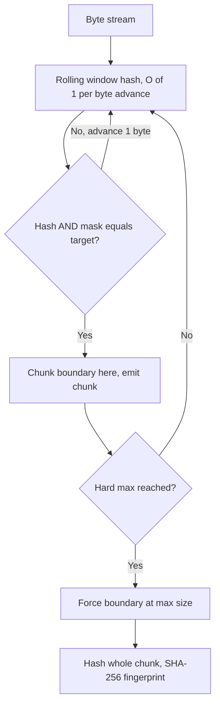
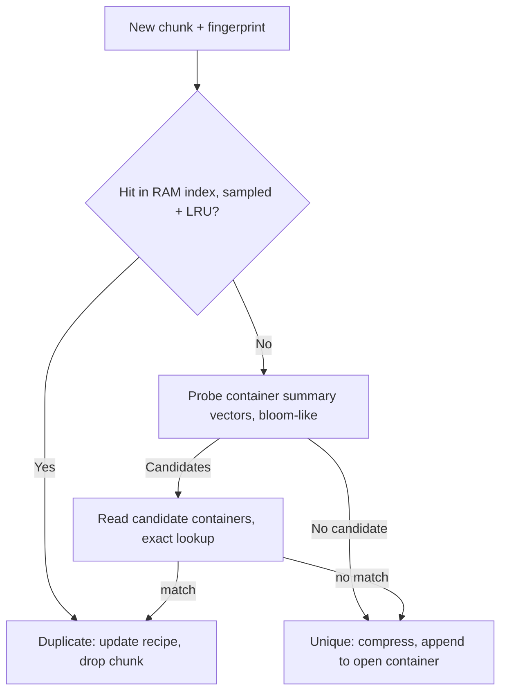

# Deduplication Internals — Chunking, Fingerprint Indexes, and Garbage Collection

## Overview

Deduplication stores each unique chunk of data once and replaces later copies with a reference, trading a large fingerprint index for 3–30× capacity savings. The engineering problems that interviews care about are concrete: how to cut chunks so a single inserted byte doesn't shift every boundary (**content-defined chunking**), how to find "have I seen this chunk?" across petabytes with RAM that is 1000× smaller than the index (**Data Domain-style hinting**), and how to garbage-collect chunks without corrupting live data. This page is the algorithm internals view; the storage-model view (CAS, Git's object model, WORM/immutability) lives in [Deduplication and Content-Addressable Storage](../advanced/dedup-cas.md) — read both, they are complements.

## Fixed vs Content-Defined Chunking

**Fixed-size chunking** (e.g., 4 KB blocks) is trivially fast and index-friendly, but fragile: insert one byte at offset 0 and every boundary shifts, so *every* chunk's fingerprint changes and the dedup ratio collapses to ~0 on that file. It survives in systems with aligned-writer workloads (VM disks, block layers) where edits are typically in-place, not inserted.

**Content-defined chunking (CDC)** derives boundaries from the data itself: slide a window over the stream, compute a rolling hash, and declare a boundary when the hash matches a pattern (e.g., low bits are zero). An insertion shifts content only until the next boundary, so most chunks before and after the edit remain identical:



Two rolling hashes to know by name:

- **Rabin fingerprint**: treats the window as a polynomial over GF(2) modulo an irreducible polynomial; supports O(1) slide (subtract the outgoing byte's term, multiply, add the incoming). Classic (rsync-inspired systems, LBFS — the paper that introduced CDC, SOSP 2001), but involves modular arithmetic per byte.
- **Gear hash**: `h = ((h << 1) + GearTable[b]) & mask` — one shift, one table lookup, one AND per byte; no multiply, no mod. Popularized by FastCDC and used in restic (Rollsum variant from bup), modern backup tools, and content-defined storage layers.

**FastCDC's normalized chunking** (Xia et al., USENIX ATC '16) fixes CDC's remaining sin: pure CDC produces exponentially distributed chunk sizes, so half the chunks are far below target (wasted index entries) and a tail is far above (poor dedup granularity). Normalization: define `MIN = avg/2`, `AVG`, `MAX = 2×avg`; skip ahead to `MIN` before judging boundaries, then use a *harder* mask (more bits) below `AVG` and an *easier* mask above it — pushing the size distribution toward the average at negligible CPU cost. Pseudocode:

```text
function fastcdc(buf, MIN, AVG, MAX):
    if remaining <= MIN: return whole buffer
    i = MIN; maskL, maskA, maskS = masks(len_bits(AVG))
    h = gear(buf[0..window])
    while i < min(MAX, len):
        if i < AVG  and (h & maskS) == 0: cut at i   # stricter below target
        if i >= AVG and (h & maskL) == 0: cut at i   # looser above target
        i += 1; h = (h << 1 + Gear[buf[i]]) & 0xffffffff
    return chunk[0..i]
```

Typical parameters: 8–64 KB average chunks for backup targets (index-size vs dedup-ratio trade), 1–4 KB for sync/transfer tools. Halving average chunk size roughly doubles the index and CPU but recovers dedup lost to fragmentation.

## Fingerprinting and the Hash Index Problem

Every chunk gets a **fingerprint** (SHA-256 today; SHA-1 in legacy systems) stored in a **recipe** that records, per file/backup image, the ordered fingerprint list — so restoring is "fetch chunks by fingerprint, in recipe order." The hard problem is the index: at 16 KB average chunks, 1 PB of *unique* data is ~2^36 fingerprints × 32 B ≈ 2 TB of index that must answer billions of random lookups per hour from RAM that is orders of magnitude smaller.

Data Domain's multi-hint design (Zhu et al., FAST '08) is the canonical answer and the interview gold standard:

1. **In-RAM "SELECT" index**: fingerprints of recent chunks, *sparsely sampled* (1 in 64 or so), plus a small LRU of full fingerprint entries. New chunks most often dedup against recently written chunks (locality), so the sparse index catches most duplicates.
2. **Container summary vectors**: chunks are packed into multi-MB **containers** (data + compressed chunks + metadata); each container has a compact summary — a bloom-filter-like vector of the fingerprints it holds, ~1 KB per container. Lookups miss in RAM → probe summaries (fast, sequential-ish) → shortlist candidate containers.
3. **Two-phase lookup**: shortlisted containers are read from disk, and their full fingerprint lists resolve the query. One disk read amortizes across all chunks in the container.



The deeper lesson (worth saying in an interview): dedup indexes are the extreme case of "metadata bigger than RAM," solved the same way as [Bloom Filters](../bloom-filters.md) and LSM tiered indexes — sampled in-RAM summaries + accurate on-disk structures + exploitation of *locality* (duplicates cluster in time and space). Modern systems add SSD for the fingerprint index and SIMD/AVX512 vectorized hashing (e.g., endpoint CDC libraries) to push inline throughput to GB/s.

## Inline vs Post-Process, Source vs Target

| Axis | Inline | Post-process |
|---|---|---|
| Where dedup runs | in the ingest path, before write | after data lands, in background |
| Ingest latency | higher (hash + index in path) | lowest (write-then-dedup) |
| Staging cost | none | needs full transient copy |
| Dedup visibility | immediate (capacity saved day one) | delayed (hours) |
| Failure mode | ingest stalls if index slow | dedup backlog grows |
| Typical use | backup appliances (Data Domain, VTL), storage arrays | first-gen disk-target dedup, cloud tiering |

Source vs target is the other axis: source-side dedup (Avamar-style client agents) hashes on the client and never ships duplicate bytes — huge for WAN backups; target-side (Data Domain) receives everything and dedups centrally — simpler clients, better global view. Inline dedup became dominant in appliances once the hint-index problem was solved, because "no staging copy" also means "half the disk IOPS." Post-process survives where ingest rate is sacred (e.g., primary storage dedup often runs post-allocation with per-block fingerprints, more like KSM-style opportunistic sharing — see [KSM Page Merging](../../os/advanced/ksm-page-merging.md) for the OS-page analog).

## Compression Interplay

Dedup and compression compose but the order is fixed: **chunk → fingerprint → dedup → compress → store**. Compressing before dedup destroys the fingerprints (two identical chunks with different compression contexts rarely produce identical bytes), so dedup must run on raw chunk bytes. After dedup, each stored chunk is compressed individually (zstd/LZ4), and because CDC chunks are similar-content groups, ratios improve further. Two wrinkles:

- **Global vs local compression**: compressing chunks individually is "local" — slightly worse ratios than stream compression but enables random access and per-container layout. Systems wanting both use container-level recompression.
- **Already-compressed data** (JPEG, video, ZIP): dedup still works (identical files share chunks) but compression adds nothing — a good system detects incompressible chunks (sampled entropy test) and stores them raw, saving CPU. Encrypted data, covered below, defeats *cross-user* dedup entirely.

## Dedup Ratios by Workload

Ratios are multiplicative across stages (e.g., 2× from delta-ingest × 2.5× from chunk dedup × 1.8× compression = ~9×), which is why vendor numbers must always be unpacked into their components:

| Workload | Typical dedup ratio | Why |
|---|---|---|
| Nightly full backups + daily incrementals | 10–30× | 95% of each full matches the previous one |
| Virtual machine images / VDI | 5–15× | identical OS files across VMs |
| File servers, home directories | 2–5× | copies, attachments, thumbnails |
| Databases (cold copies) | 1.5–3× | block-level redundancy, dev/test copies |
| Email stores | 3–6× | attachments repeated across mailboxes |
| Media, already-compressed, encrypted | ~1× (dedup only) | no redundancy left to remove |

The honest interview framing: "dedup ratio" without workload and stage breakdown is a marketing number, and the *marginal* ratio on an incremental job matters more than the cumulative one.

## Garbage Collection of Chunk References

Deleted backups leave chunks with zero referencers, but you cannot just delete on last-reference-close: recipes are written across many containers, retention policies overlap, and a crash mid-update must not orphan or resurrect data. Two families:

- **Reference counting**: recipes increment/decrement per-chunk refcounts. Exact and simple, but refcount updates make containers mutable (read-modify-write churn), and distributed systems hate maintaining exact counts across nodes — see [Deduplication and CAS](../advanced/dedup-cas.md)'s section on reference counting vs mark-and-sweep, including the lock-free variant.
- **Mark-and-sweep**: periodically scan live recipes (source of truth), mark reachable fingerprints, sweep unmarked containers. Read-only on recipes, parallelizable, naturally correct across failures — the standard for backup appliances and modern CAS; the cost is a full recipe scan, mitigated by partitioning GC by time window (expire oldest generation first).

Subtleties that separate senior answers: chunks shared between generations need partial-container rewriting (pack surviving chunks of a dying container into a new one — "rehydration"); GC must respect **leases/pinning** for running restores; and dedup makes deletion *asynchronous by design*, so "delete backup X" only rewrites X's recipe, and space returns days later after GC — capacity planning must model this lag.

## Security: Collisions, Encryption, and the Tension

- **Hash collisions**: with SHA-256 and 2^36+ stored chunks, birthday-collision probability is negligible but nonzero, and a silent collision is silent corruption. Defenses: verify full chunk bytes on match (cheap for hot path since candidate chunks are read anyway in two-phase lookup), or store a second truncated hash as an independent check. Legacy SHA-1 index entries are a migration flag precisely for this reason.
- **Encryption vs dedup tension**: standard encryption is probabilistic — the same plaintext encrypts to different ciphertexts under different keys/IVs, so cross-user dedup finds nothing. Convergence encryption (key = H(plaintext)) restores dedup but leaks *equality* (an attacker who guesses a low-entropy file — a password file, a known binary — learns it exists on the server: the confirmation-of-file attack) and enables offline brute force. Message-locked encryption with a server-aided secret (S-PSP, Bellare et al., CCS 2013) is the academic fix; operational reality is per-tenant keys with dedup *inside* a tenant, or accepting 1× ratios for end-to-end-encrypted stores (restic, Tarsnap accept this trade explicitly).
- **Side channels**: even inside a tenant, dedup timing (write of known content is fast) can leak information; "duplicate fencing" (per-user namespaces) trades ratio for privacy — a compliance-driven choice, not just a crypto one.

## Interview Questions

1. **Why does fixed-size chunking fail for backup dedup, and what fixes it?**
Fixed boundaries are position-dependent: inserting one byte at the start shifts every subsequent boundary, changing every chunk's fingerprint, so two versions of a slightly-edited file share almost nothing. Content-defined chunking derives boundaries from content via a rolling hash, so boundaries move only locally around the edit. Gear and Rabin are the standard rolling hashes — O(1) per byte advance. FastCDC adds normalized chunking to pull the size distribution toward the target average, fixing CDC's exponential-size tail.

2. **How did Data Domain answer "index too big for RAM"?**
Three layers exploiting locality. A sampled in-RAM index of recent fingerprints catches most duplicates because new data mostly dedups against recent data. Container summary vectors — compact bloom-like summaries per multi-MB container — shortlist candidate containers on a miss. A disk read of shortlisted containers performs exact fingerprint lookup, amortizing one read over all chunks in the container. The result is near-line-rate inline dedup with a tiny RAM footprint, and the pattern (sampled summary + exact on-disk index) generalizes far beyond dedup.

3. **Inline vs post-process dedup — what decides?**
Inline hashes and dedups in the ingest path: no staging copy (halving disk IOPS), immediate capacity savings, but ingest latency depends on the index. Post-process writes first and dedups in the background: fastest possible ingest but transient 1× storage and a backlog that must be monitored. Backup appliances converged on inline once the hint-index problem was solved; primary storage and systems where ingest rate is sacred often stay post-process. Source-side dedup moves the decision to the client, saving WAN bandwidth at the cost of client complexity.

4. **How does garbage collection work in a dedup store, and why is refcounting hard?**
Refcounting is exact but makes containers mutable — every recipe change updates chunk refcounts, causing read-modify-write churn, and exact counts across distributed nodes need coordination. Mark-and-sweep instead scans live recipes as the source of truth, marks reachable fingerprints, and sweeps unmarked containers: read-only on recipes, parallelizable, crash-consistent. Costs are the full recipe scan (mitigated by generation-partitioned GC) and partial-container rewrites when surviving chunks share containers with dead ones. Deletes also become asynchronous — space returns only after GC, which capacity planning must model.

5. **What is the security tension between encryption and dedup?**
Standard probabilistic encryption destroys cross-user dedup: identical plaintexts yield different ciphertexts, so nothing matches. Convergence encryption (derive the key from the plaintext hash) restores dedup but leaks file equality — an attacker who can guess a file's content learns whether it exists on the server, and low-entropy files are brute-forceable offline. Server-aided message-locked encryption mitigates the brute-force problem; practical systems usually dedup within a tenant under tenant keys and accept 1× ratios for end-to-end-encrypted products. Also relevant: verifying full bytes on fingerprint match to make hash collisions fail safe.

6. **Why is the order dedup-then-compression mandatory?**
Compression is context-dependent: two byte-identical chunks compressed under different stream positions or dictionaries generally produce different bytes, so fingerprints taken after compression would not match. Deduplication must therefore run on raw chunk bytes, and compression applies only to chunks that survived dedup (unique ones). The composite pipeline — chunk, fingerprint, dedup, compress, pack into containers — is why dedup appliances report ratio as a product of stages. Sampled entropy tests skip compression on incompressible chunks to save CPU.

## Key Takeaways

- CDC (Gear/Rabin rolling hash) makes chunk boundaries content-dependent; FastCDC's normalization tames the size distribution.
- The fingerprint index is the scaling bottleneck: Data Domain's sampled RAM index + container summary vectors + two-phase lookup is the canonical fix.
- Dedup exploits locality — duplicates cluster in time and space — which is what makes sparse summaries viable.
- Pipeline order is fixed: chunk → fingerprint → dedup → compress → containerize; compressing first destroys dedup.
- Ratios decompose multiplicatively (ingest delta × chunk dedup × compression); always ask which stages compose a quoted number.
- GC: refcounting is exact but mutation-heavy; mark-and-sweep over recipes is the distributed standard, with generation partitioning and leases.
- Security: verify bytes on fingerprint match; encryption vs dedup is a real trade (per-tenant dedup vs 1× for E2E encryption).
- Analogies everywhere: KSM merges identical pages with the same fingerprint idea; CAS storage models (Git) are the same structure at file granularity.

## Cross-References

- [Deduplication and Content-Addressable Storage](../advanced/dedup-cas.md) — the storage-model companion: CAS, Git object model, WORM, GC trade-offs
- [Bloom Filters](../bloom-filters.md) — the probabilistic structures behind container summary vectors
- [KSM Page Merging](../../os/advanced/ksm-page-merging.md) — the same idea at memory-page granularity
- [Object Storage](../object-storage.md) — content-addressing at object granularity in modern stores
- [Cache Eviction Algorithms](./cache-eviction-algorithms.md) — the RAM index evictions that fingerprint caches reuse
- [README — Storage Formats](./README.md) — section overview

## References

- Xia et al., "FastCDC: a Content-Defined Chunking Algorithm for Fast Chunking," USENIX ATC 2016 — [usenix.org/conference/atc16](https://www.usenix.org/conference/atc16/technical-sessions/presentation/xia)
- Zhu, Li, Patterson, "Avoiding the Disk Bottleneck in the Data Domain Deduplication File System," USENIX FAST 2008 (title + venue cited; no URL relied upon)
- Muthitacharoen, Chen, Mazières, "A Low-bandwidth Network File System (LBFS)," SOSP 2001 — introduced content-defined chunking (title + venue cited)
- Bellare, Keelveedhi, Ristenpart, "Dupless: Server-Aided Encryption for Deduplicated Storage," USENIX Security 2013 (title + venue cited)
- [bup/Rollsum and restic chunkers](https://github.com/restic/restic) — production Gear/Rollsum implementations
- [OS virtual memory: LFU and page replacement](../../os/virtual-memory/lfu.md) — related replacement-policy internals
