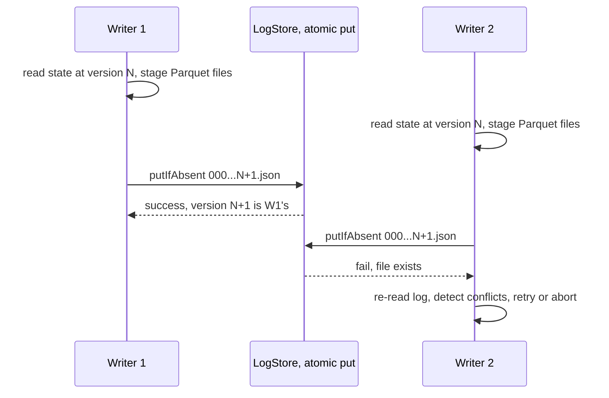

# Delta Lake — The Transaction Log, Checkpoints, and Deletion Vectors

## Overview

Delta Lake is a table format that layers a **write-ahead transaction log** over Parquet files. Its design bet is simplicity: instead of Iceberg's tree of manifests or Hudi's timeline-plus-index, a Delta table *is* an ordered directory of small JSON commit files under `_delta_log/`, each atomically appended. That log encodes every add/remove of a data file, so "the table" is the replayed state of the log. Delta ships the deepest Spark/Databricks integration and pioneered deletion vectors and Liquid Clustering. Interviews focus on the log format, how commits stay atomic on object stores, the conflict matrix, and why checkpoints exist.

> For the format-vs-format decision see [Table Format Comparison](./table-format-comparison.md); for the Iceberg contrast see [Apache Iceberg](./apache-iceberg.md). The Databricks runtime context is in [Databricks Architecture](../../dbms/advanced/databricks.md).

## The `_delta_log`: Ordered JSON Commits Define the Table

A Delta table lives in a directory:

```
table/
├── _delta_log/
│   ├── 00000000000000000000.json      # version 0: protocol, metaData, add...
│   ├── 00000000000000000001.json      # version 1
│   ├── ...
│   ├── 00000000000000000010.checkpoint.parquet   # state snapshot every N commits
│   ├── 00000000000000000010.json
│   └── _last_checkpoint               # pointer to newest checkpoint
└── part-0000-....snappy.parquet       # data files (immutable once committed)
```

Each commit file contains **actions** — one JSON object per line:

| Action | Meaning |
|---|---|
| `add` | a data file joins the table (path, partitionValues, size, stats: min/max/nullCount per column) |
| `remove` | a data file leaves the table (logical delete; the Parquet file may linger until `VACUUM`) |
| `metaData` | schema, partition columns, table ID (GUID), configuration |
| `protocol` | reader/writer min versions — feature negotiation |
| `txn` | idempotent-write marker: `(appId, version)` so a streaming writer can retry safely |
| `commitInfo` | timestamp, operation, user, isolation level, read/write predicates |
| `cdc` | pointer to change-data-capture output for the operation |

The table's current state is `checkpoint at version V` + replay of JSON files `V+1..current`. A table's identity is the `metaData.id` GUID — copying the directory copies the identity, and two directories with different GUIDs are different tables even if the data matches. The protocol action deserves attention: features like deletion vectors or type widening are gated by `(readerVersion, writerVersion)` pairs, which is how the format evolves without breaking old readers — they refuse tables they cannot parse rather than misreading them.

## Atomic Commits on Object Stores

The table version is simply the JSON file's sequence number. Publishing version N+1 must be atomic, and how that happens depends on the store:



On HDFS-style filesystems the primitive is `rename`, which is atomic there. On S3 (no atomic rename), Delta uses a LogStore that does **conditional put** — originally DynamoDB-backed compare-and-swap, now S3 conditional writes (the `If-None-Match: *` put, 2024) — so only one writer's `000...N.json` key can exist. This is the single most load-bearing detail of the protocol: correctness = one atomic operation on one key, exactly like Iceberg's catalog swap but with the *log directory itself* as the catalog. A consequence: a Delta table needs no metastore entry to be a table (engines can discover it by listing `_delta_log/`), which simplifies ad-hoc and multi-tenant setups.

## Checkpoints: Parquet State Every N Commits

Replaying thousands of JSON commits is O(commits) on every read, so every `delta.checkpointInterval` commits (default **10**) a writer produces `_delta_log/<V>.checkpoint.parquet`: a **Parquet snapshot of the entire log state** — every live `add` with its stats, every active `remove`, the metadata, and transaction markers. Large tables get up to 100 checkpoint parts plus a `_last_checkpoint` file that tells readers where to start. With the checkpoint, read setup is: load checkpoint (columnar, fast) + replay the last ≤10 JSON files.

| Property | JSON commit | Checkpoint |
|---|---|---|
| Contents | one transaction's actions | full table state at V |
| Format | newline JSON | Parquet, ~100 action columns |
| Written | every commit | every 10 commits (configurable) |
| Read by | all readers replaying tail | all readers as the base state |
| Cost | ~KBs | MBs (row count × ~200 B/action) |

Because the checkpoint *is* Parquet, engines already know how to read it — an elegant reuse of the underlying format. Delta Lake 3.x adds checkpoint v2 with separate sidecar files for fine-grained stats and DV info, keeping checkpoints lean for wide tables. If you tune `checkpointInterval`, remember the trade: larger intervals mean faster commits but slower cold reads; the checkpoint write itself scales with the number of live files, so trillion-file tables make checkpointing a real engineering cost.

## Optimistic Concurrency and the Conflict Matrix

Delta uses snapshot isolation with predicate-based conflict detection. A writer records, in `commitInfo`, the **read and write predicates** of its operation. On a lost race it re-reads the winning commit and decides: do the two operations' read/write sets intersect semantically?

| Concurrent ops | Conflict? | Rule |
|---|---|---|
| Append vs append | Never | "blind" appends touch disjoint state |
| Insert vs delete on same files/partition | Yes | delete's read set overlaps the insert's write set |
| Insert vs delete, disjoint partitions | No | predicates don't intersect |
| `MERGE`/`UPDATE` vs anything overlapping | Yes | both read and write the same files |
| `REPLACE`/overwrite vs anything | Yes | overwrite conflicts with all concurrent changes |
| Metadata-only (schema) vs data op | Usually no | depends on operation |

Isolation levels: **write serializable** (default — only write-write conflicts are checked, reads may be non-repeatable) and **serializable** (both read-write and write-write). Append-heavy pipelines basically never conflict; but a long `MERGE` racing frequent micro-batch appends into the same partitions produces retries, which is why streaming-merge tables are partitioned so that writers and merges land on different slices. The commit protocol itself has no per-record or per-file locks — like Iceberg, the entire concurrency story reduces to "one atomic key write + deterministic rebase check."

## Z-Ordering and Liquid Clustering

Delta inherits Hive-style partition columns (`PARTITIONED BY`), which are user-visible directories — the exact design Iceberg's hidden partitioning replaced. For data pruning *within* partitions, Delta offers two layouts:

- **Z-Ordering** (`OPTIMIZE table ZORDER BY (col_a, col_b)`): interleaves the bits of multiple columns' value ranges (Z-curve) so that one file's values are close in *all* ordered dimensions. A query filtering on any prefix of those columns can prune files via per-file min/max stats. Costs: it's an all-at-once rewrite (not incremental), and repeated z-orders lose effectiveness because new unclustered files mix with old.
- **Liquid Clustering** (`CLUSTER BY`, 2023+): incremental, data-driven clustering. New writes are routed to clusters based on the existing layout; re-clustering touches only affected clusters. No partition columns to choose up front, and the layout evolves as data skews — Delta's answer to Iceberg's sort orders + partition evolution.

| | Z-Ordering | Liquid Clustering |
|---|---|---|
| Scope | whole-table rewrite per `OPTIMIZE` | incremental per cluster |
| Key choice | fixed at each command | changeable without rewrite |
| Incremental ingest | degrades (mixed clusters) | designed for it |
| Replaces partitioning? | no | mostly yes |

The interview sound bite: Z-order is a batch compaction trick; liquid clustering is a *layout management system*. Both exist because per-file min/max stats in the `add` actions are Delta's only pruning mechanism — layout quality maps directly to files skipped per query.

## Deletion Vectors: Row-Level Changes Without Rewrites

Before 2023, a Delta `DELETE`/`UPDATE`/`MERGE` was copy-on-write: every touched file was rewritten without the offending rows — expensive on wide files. **Deletion vectors (DVs)** change this: a commit adds a bitmap of deleted row positions attached to a data file (inline in the commit for small DVs, or as a separate DV file), and readers apply the bitmap while scanning — the file itself is untouched. DVs are Roaring-style position bitmaps, compressed and referenced by path+offset; subsequent `UPDATE`s merge into the same DV until compaction rewrites the file and clears it.

Consequences worth stating precisely:

1. `DELETE 10 rows` in a 1 GB file goes from "rewrite 1 GB" to "write a few KB bitmap" — the Databricks default flipped to DVs on for this reason.
2. Reads pay a small filter-application cost, so scan-heavy tables with *permanent* heavy deletions still benefit from periodic compaction that materializes the surviving rows.
3. DVs are position-based, so they require knowing the target files — Delta resolves them via file stats/partition pruning before writing; there is no equality-delete analog (Hudi's specialty) or record index.

This puts the three formats on converging ground: Delta DVs ≈ Iceberg v3 deletion vectors ≈ Hudi's log-file + compaction, each choosing a different point on the write-cost/read-cost curve. The bitmap details cross over with [Roaring Bitmaps](../../dbms/advanced/roaring-bitmaps.md).

## Time Travel and `VACUUM`

Time travel is log-native: `SELECT * FROM t VERSION AS OF 42` or `TIMESTAMP AS OF`, implemented by replaying the log to version 42 instead of HEAD; `RESTORE TABLE t TO VERSION AS OF` writes a *new* commit that logically removes files added after 42. Old versions remain readable until `VACUUM` physically deletes Parquet files that are no longer referenced by any commit newer than the retention window — **168 hours (7 days) default**, deliberately conservative because a long-running reader on an old snapshot plus an early VACUUM is a classic production outage. `VACUUM` is independent of log retention (`delta.logRetentionDuration`, default 30 days), so the metadata history and the physical files age out on different clocks. Interview trap: RESTORE is not rollback-in-place — it appends a commit, which means concurrent readers are never broken, and the "undone" data is still time-travel-able.

## Uniform and the Multi-Engine Story

Delta's historical weakness was engine support outside Spark. That is changing from two directions: native readers (delta-rs in Rust/Python — the engine behind DuckDB/polars integrations, Trino's delta connector, Flink's connector) and **Delta UniForm**, which makes Databricks emit Iceberg-compatible metadata (`metadata.json` + manifests) alongside the `_delta_log` on the fly, so Iceberg-only engines read the Delta table without copying data. The strategic read: the log-vs-tree distinction is becoming an implementation detail, with DVs and liquid clustering as the differentiating features. For self-hosted stacks, delta-rs + Trino is the common non-Spark combination, though procedural maintenance (`OPTIMIZE`, `VACUUM`) remains most polished on Spark/Databricks.

## Anatomy of a Commit File

Reading a real commit file demystifies the protocol faster than any diagram. A `MERGE` that added one file and removed two (via DV-free copy-on-write) produces a `000...N.json` roughly like:

```json
{"commitInfo": {"timestamp": 1735689600000, "operation": "MERGE",
                "operationParameters": {"predicate": "[\"(t.id = s.id)\"]"},
                "readVersion": 41, "isolationLevel": "WriteSerializable",
                "readPredicates": [{"jsonPredicate": "...", "partitionedBy": "[]"}],
                "engineInfo": "delta-rs/0.18", "txnId": "a1f3..."}}
{"remove": {"path": "part-0002-....snappy.parquet", "deletionTimestamp": 1735689600000,
            "dataChange": true, "extendedFileMetadata": true,
            "partitionValues": {"date": "2025-01-01"}, "size": 104857600}}
{"add": {"path": "part-9999-....snappy.parquet", "partitionValues": {"date": "2025-01-01"},
         "size": 104857600, "modificationTime": 1735689600000, "dataChange": true,
         "stats": "{\"numRecords\": 987654, \"minValues\": {\"id\": 1, \"ts\": \"...\"},
                    \"maxValues\": {\"id\": 987654, \"ts\": \"...\"}, \"nullCount\": {\"id\": 0}}"}}
```

Three fields carry interview weight. `dataChange: true/false` distinguishes data mutations from pure layout operations (`OPTIMIZE` sets false, so change-data-feed consumers ignore it). `stats` is the JSON-encoded per-file min/max/nullCount that powers pruning — the direct analog of Iceberg's manifest entry fields. `txnId` in `commitInfo` plus the `txn` action give idempotency: a streaming writer retrying version N+1 with the same `(appId, txnVersion)` is recognized as a duplicate and succeeds idempotently rather than double-applying.

## Protocol Versions and Feature Gating

| Reader/Writer | Gated features (examples) |
|---|---|
| Reader 1 / Writer 1 | base: append-only Parquet + log |
| Reader 2 / Writer 2 | idempotent `txn` writes, COW semantics formalized |
| Reader 3 / Writer 5 | deletion vectors, checkpoint v2, vacuum-hint files |
| Writer 6+ | liquid clustering, type widening, variant type |

The table is illustrative, not exhaustive — the point is the mechanism: features negotiate through `(readerVersion, writerVersion)` minimums stamped in the `protocol` action, and raising them is a one-way door a commit enforces. Multi-engine shops pin versions deliberately: an old Trino or OSS Spark reader that predates DV support simply cannot open a DV-enabled table, which is why Databricks ships "clustering + DV" behind writer-version gates rather than table properties. When asked "how do formats evolve safely," Delta's answer is protocol gating, Iceberg's is format-version + column IDs, Hudi's is timeline records + payload versions — all variations on "explicit negotiation, never silent reinterpretation."

## Change Data Feed and Downstream Propagation

Beyond time travel, Delta added a **change data feed (CDF)**: when enabled (`delta.enableChangeDataFeed`), each commit additionally records row-level changes (pre/post images) readable as `table_changes('t', 41, 45)` or via structured streaming. CDF rows carry `_change_type` (insert/update_preimage/update_postimage/delete), `_commit_version`, and `_commit_timestamp`. This is Delta's answer to Hudi's incremental pull: downstream tables, search indexes, and cache invalidators subscribe to changes without diffing snapshots. Costs and caveats worth naming: CDF doubles write output for updates (pre-image plus post-image rows), it interacts with DVs (readers merge DV state to emit correct changes), and schema changes mid-stream require `schemaChangeOptions` handling on consumers. The interview framing: CDF turns the log's file-level actions into row-level events — the lakehouse's equivalent of a database's logical replication stream.

## Tuning Reference

| Property | Default | Effect |
|---|---|---|
| `delta.checkpointInterval` | 10 | Larger: faster commits, slower cold reads |
| `delta.targetFileSize` | ~1 GB | Output of OPTIMIZE/liquid clustering; match scan pattern |
| `delta.logRetentionDuration` | 30 days | How long old versions stay queryable |
| `delta.deletedFileRetentionDuration` | 1 week | VACUUM safety window (must exceed longest reader) |
| `delta.enableDeletionVectors` | on (DBR 12+) | Row-level deletes as bitmaps |
| `delta.autoOptimize.optimizeWrite` | per-tenant | Shuffle-partitioned writes to target sizes |
| `delta.enableChangeDataFeed` | off | Row-level change records per commit |

The retention pair is the one that bites in production. `deletedFileRetentionDuration` must always exceed your longest-running reader's snapshot age, or VACUUM deletes files under an active read — the Delta twin of Iceberg's orphan-sweep trap and Hudi's cleaner-vs-reader race. `checkpointInterval` interacts with commit rate: a Flink/structured-streaming job committing every 30 s rewrites a checkpoint every ~5 minutes at the default, and for multi-terabyte tables that checkpoint write itself becomes the dominant cost, which is the usual reason to raise the interval or the batch duration rather than to shard the table.

## Interview Questions

1. **What exactly is a Delta table, physically?**
A directory of immutable Parquet data files plus an ordered `_delta_log/` of JSON commit files. Each commit is a set of actions (add, remove, metaData, protocol, txn, commitInfo), and the table state is the checkpoint plus tail replay of the log. The version number is the commit file's index, and version N+1 is published by one atomic write — rename on HDFS-style stores, conditional put on S3. There is no external catalog requirement; the log directory is self-describing.

2. **Why checkpoints, and what do they contain?**
Replaying thousands of JSON commits makes cold reads O(commit count), so every 10 commits (default) Delta writes a Parquet file containing the full logical state: every live `add` with stats, active `remove`s, metadata, and txn markers. Readers load the checkpoint columnar-fast, then replay at most `checkpointInterval` JSON files. Checkpoints grow with the number of live files, which is why checkpoint v2 splits stats and DV info into sidecars for large tables. Tuning the interval trades commit latency against cold-read latency.

3. **How does Delta detect and resolve concurrent-write conflicts?**
Writers record read and write predicates per operation; on losing a commit race, the loser re-reads the winner's commit and checks whether the two operations' predicates intersect. Blind appends never conflict; deletes, updates, and merges conflict when they touch the same files or partitions; overwrites conflict with everything. The default isolation is write-serializable, with full serializable available. Resolution is retry-with-rebase or abort — there are no locks, only one atomic publish operation per version.

4. **What changed with deletion vectors?**
Before DVs, every `DELETE`/`UPDATE` rewrote each touched file — copy-on-write economics that punished wide files and frequent updates. A DV is a compressed position bitmap attached to a data file, written as part of a commit, and applied by readers during scans; the data file is untouched. This turns small row-level changes into kilobyte commits instead of gigabyte rewrites. The residual cost moves to reads and to compaction, which eventually materializes surviving rows and drops the DVs.

5. **Z-Ordering vs Liquid Clustering — compare.**
Z-Ordering is an `OPTIMIZE`-time, whole-table rewrite that interleaves multiple columns' bits so per-file min/max ranges prune on any of those dimensions; it degrades under incremental ingest because new files are unclustered. Liquid clustering is incremental: writes are routed to clusters derived from the existing layout, and re-clustering is local, so the layout evolves with the data and the clustering keys can change without a rewrite. Z-order is a batch trick; liquid is a layout-management subsystem that mostly replaces manual partitioning. Both exploit the same fact: Delta prunes only via per-file stats.

6. **What is the operational difference between log retention and VACUUM?**
They run on independent clocks. `delta.logRetentionDuration` (default 30 days) controls how long old versions remain in the log and thus how far back time travel works logically. `VACUUM` (default retention 168 hours) physically deletes Parquet files unreferenced by the recent log; run it earlier than a still-running reader's snapshot and you get missing-file errors. RESTORE also matters here: it appends a new commit rather than rewinding, so nothing is destroyed and the pre-restore state remains time-travel-able.

## Key Takeaways

- A Delta table is an ordered JSON commit log + immutable Parquet; the log *is* the table, no catalog required.
- Atomicity comes from one conditional write per version (S3 conditional put / DynamoDB CAS / HDFS rename).
- Checkpoints snapshot the log state into Parquet every N commits (default 10) so reads are O(checkpoint + tail).
- Concurrency is optimistic with predicate-based conflict detection; blind appends never conflict, overwrites always do.
- Deletion vectors make row-level deletes/updates kilobyte-scale commits instead of file rewrites.
- Z-Ordering is a batch multi-column clustering rewrite; Liquid Clustering is its incremental, evolvable successor.
- Time travel replays the log; VACUUM (168 h default) and log retention (30 days) age metadata and files on separate clocks.
- UniForm emits Iceberg metadata so non-Delta engines read the table natively — format wars are converging on interop.

## Cross-References

- [Table Format Comparison](./table-format-comparison.md) — commit protocol, deletes, and catalogs side by side
- [Apache Iceberg](./apache-iceberg.md) — the tree-based metadata alternative
- [Apache Hudi](./apache-hudi.md) — the index-first alternative for upsert-heavy ingest
- [Databricks Architecture](../../dbms/advanced/databricks.md) — Photon, Z-Ordering/Liquid Clustering in context
- [Roaring Bitmaps](../../dbms/advanced/roaring-bitmaps.md) — the bitmap structure behind deletion vectors
- [Parquet Internals](./parquet-internals.md) — the data files and the checkpoint format underneath
- [Lakehouses](../../data-engineering/lakehouses.md) — the workload-level overview

## References

- [Delta Lake protocol](https://github.com/delta-io/delta/blob/master/PROTOCOL.md) — commit log actions, checkpoint format, conflict rules, DV encoding
- [Delta Lake docs](https://docs.delta.io/latest/index.html) — best practices, `OPTIMIZE`/`VACUUM`, concurrency guide
- [delta-io/delta GitHub](https://github.com/delta-io/delta) — LogStore implementations (S3 conditional put, HDFS rename)
- [Iceberg spec](https://iceberg.apache.org/spec/) — for the metadata-tree contrast and UniForm target format
- [Apache Hudi docs](https://hudi.apache.org/docs/overview) — for the merge-on-read contrast
