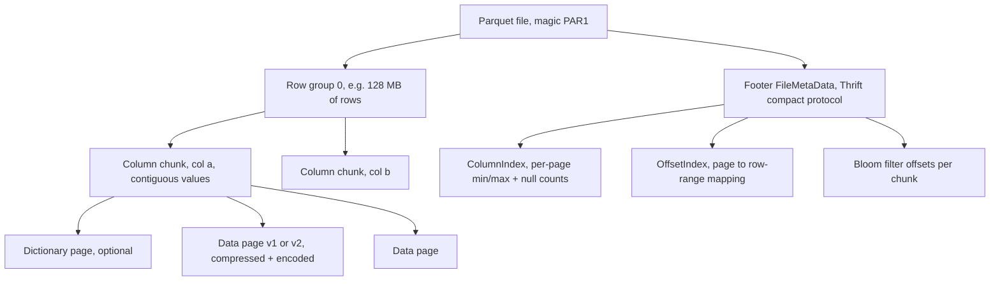
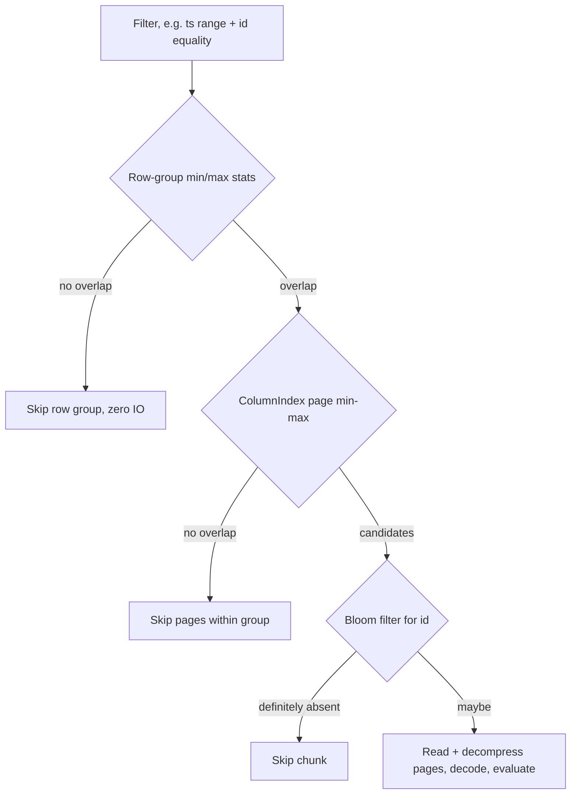

# Parquet Internals — Row Groups, Encodings, Page Indexes, and the Footer

## Overview

Parquet is the columnar file format underneath every lakehouse table format and most analytical pipelines: a file is a hierarchy of **row groups → column chunks → pages**, with rich per-page and per-chunk statistics, a Thrift-encoded footer schema, and encodings tuned for low-entropy columnar data. Reading Parquet well is a performance-interview skill: predicate pushdown, dictionary encoding, row-group sizing, and compression choices routinely swing scan performance by 5–10×. This page is the internals companion to the format overview in [Data Formats](../../data-engineering/data-formats.md); it focuses on the on-disk structure and the read path, not on "why columnar."

## File Layout: Row Groups → Column Chunks → Pages

```
+--------------------------------------------------+
|  4-byte magic "PAR1"                             |
+--------------------------------------------------+
|  Row Group 0                                     |
|    Column Chunk (a): DictPage, DataPage, ...     |
|    Column Chunk (b): DictPage, DataPage, ...     |
|    ...one column chunk per column                |
+--------------------------------------------------+
|  Row Group 1 ... Row Group N                     |
+--------------------------------------------------+
|  Bloom filter data (optional, per column chunk)  |
+--------------------------------------------------+
|  FileMetaData (Thrift): schema, row groups,      |
|    column chunk metadata, stats, offsets,        |
|    encoding stats, key-value metadata            |
|  4-byte footer length  +  "PAR1"                 |
+--------------------------------------------------+
```

- **Row group**: the horizontal unit of parallelism and atomicity of stats — typically 128 MB (Spark default) up to 1 GB. Every column of every row group is stored contiguously in its own column chunk.
- **Column chunk**: all values for one column within a row group, contiguous, with its own metadata block (offsets, encodings, statistics, dictionary reference).
- **Pages**: the unit of encoding and compression inside a chunk (default ~1 MB). A **dictionary page** optionally precedes the data pages; **data pages** hold the values; page **v2** additionally separates repetition/definition levels and supports per-page checksums.



The **footer is the table of contents**: a reader reads the last 8 bytes (footer length + magic), seeks back, and parses the Thrift `FileMetaData`. Because column chunks are contiguous, scanning one column of 10 TB costs sequential reads of just that column's chunks — the property every table format's "read only needed files/columns" pruning builds on.

## Nested Data: Repetition and Definition Levels

Parquet generalizes flat columns to nested records using the **Dremel record-shredding model**. Each atomic value is stored with two small integers:

- **definition level**: how many optional/repeated fields in the path were defined;
- **repetition level**: at which enclosing repeated field this value starts a new occurrence.

A null inside `address.city` when `address` exists has a different definition level than a null because `address` itself was null — the pair of levels is enough to reconstruct arbitrary nesting losslessly on read (record assembly). This is why Parquet can store deeply nested JSON-like structures columnarly, and why engines push filters into nested fields: a predicate on a nested column still prunes pages via its stats. Interview tip: "definition vs repetition level" is a classic differentiator question for data-engineering roles; the one-line answer is "def levels encode presence, rep levels encode repetition boundaries."

## Encodings

Encodings are per-column-chunk choices recorded in the footer. The ones you must know:

| Encoding | ID | Used for | Idea |
|---|---|---|---|
| `PLAIN` | 0 | everything (baseline) | Fixed/native layout, no compression |
| `RLE` / bit-packed | 3 | levels, booleans, low-cardinality ints | Run-length encode zeros; bit-pack small ints |
| `PLAIN_DICTIONARY` / `RLE_DICTIONARY` | 2 / 8 | low-cardinality columns | Dictionary page of distinct values; data pages store indices RLE'd |
| `DELTA_BINARY_PACKED` | 4 | integers, timestamps | Delta-encode then bit-pack residual blocks (mini-blocks of 32 values) |
| `DELTA_LENGTH_BYTE_ARRAY` | 5 | variable-length strings | Lengths delta-packed, then concatenated bytes |
| `DELTA_BYTE_ARRAY` | 6 | sorted strings (e.g. UUID, timestamps as text) | Prefix-compress consecutive strings (common prefix + suffix) |
| `BYTE_STREAM_SPLIT` | 9 | floats/doubles | Split the 4/8 bytes of each value into 8 separate streams, each compressed separately |

Two rules of thumb worth memorizing:

1. **Dictionary/RLE dominates low-cardinality data.** A country column with 200 distinct values stores ~2-byte indices instead of 8–20-byte strings, frequently shrinking 10–50× before compression even runs. Dictionaries cap out (`fallback to PLAIN`) when the dictionary page grows past `delta.memory.pool`-ish limits — in Spark, `parquet.enable.dictionary` and chunk size control this.
2. **DELTA_BYTE_ARRAY on sorted string columns is the sleeper win.** Sorted IDs/timestamps-as-strings share long prefixes, so storage collapses; this pairs with table-format sort orders ([Iceberg sort orders](./apache-iceberg.md)) that make the input sorted in the first place. `BYTE_STREAM_SPLIT` helps because the high bytes of doubles are low-entropy — splitting streams raises each stream's compressibility.

## Compression

Each page (v1) or each page's value stream (v2) is compressed **independently** with a codec recorded in the footer:

| Codec | Typical ratio | Speed (decompress) | When |
|---|---|---|---|
| `UNCOMPRESSED` | 1× | — | debugging, encrypted-at-rest exotic setups |
| `SNAPPY` (default) | ~2–4× (after encodings) | very fast | default everywhere |
| `GZIP` | ~3–6× | slow | legacy |
| `ZSTD` | ~3–6×, level-tunable 1–22 | fast | modern default recommendation (level 3 typical) |
| `LZ4_RAW` | ~2–4× | fastest | latency-sensitive scans |

Because pages are small (~1 MB) and columnar, similar values adjoin and compression ratios are much better than row-wise formats. The composition matters: encoding (semantic, lossless structure) runs first, compression (byte-level) second — that's why dictionary-encoded columns compress again. Zstd's level knob trades CPU for ratio (level 1 ≈ snappy-ish speed, level 9+ clearly better ratio at visible CPU cost); most engines settle at zstd level 3 for scans and higher for archival rewrites. Per-page compression also bounds decompression cost: a pushed-down filter that lands on 3 pages decompresses only those 3 pages.

## Statistics, Page Indexes, Offset Index, Bloom Filters

This layer is what turns "columnar" into "prunable," and every table format's predicate pushdown rides on it:

- **Chunk-level statistics**: min/max, null count, distinct count (optional) per column chunk, stored in the footer. The first pruning step: if `ts > 2025-01-01`, skip whole row groups whose max `ts` is below it.
- **ColumnIndex (page-level stats)**: per-page min/max/null counts. Prunes *within* a row group down to individual pages — with 128 MB row groups and 1 MB pages this is a further ~100× skip.
- **OffsetIndex**: maps each page to its row range within the row group, letting engines resume mid-row-group after a page hit (needed for correct slot-based page pruning and for parallel decoding).
- **Bloom filters**: optional per-chunk split-block bloom filters (256-bit blocks) for equality lookups — `WHERE id = X` can skip a chunk even when `X` is inside the chunk's min/max range. Size/FPP is configurable (`bloom_filter_ndv`/FPP per column). See [Bloom Filters](../bloom-filters.md) for the math.



The ordering is deliberate: cheapest metadata first, most selective check last, I/O only at the end. A well-clustered table (sorted on the hot predicate columns — see the table-format pages) makes these layers skip >99% of bytes, which is where the "5–10×" interview number comes from.

## The Spark and Arrow Read Paths

- **Spark**: the vectorized reader (`parquet.VectorizedReader`) reads column chunks into off-heap `ColumnarBatch`es (default 4096 rows), applying dictionary decoding, RLE, and filter pushdown (`spark.sql.parquet.filterPushdown`, stats and bloom filters both on by default in recent versions). Row-group boundaries feed task splitting — a 128 MB row group is roughly a task, which is why tiny row groups kill parallelism and huge ones skew memory.
- **Arrow / pyarrow**: `pyarrow.parquet` parses the Thrift footer in C++, exposes row-group/page-level filtering (`filters=`), memory-maps footers, and produces zero-copy Arrow record batches — the lingua franca for DuckDB/pandas/polars interop. Arrow's `ParquetReader` also exposes the page index, so hand-tuned readers can do the full prune ladder above.
- **Thrift schema**: the footer's schema is Thrift `SchemaElement` trees — one line per node with repetition (`REQUIRED/OPTIONAL/REPEATED`) and converted logical types (UTF8, TIMESTAMP(NANOS), DECIMAL(precision, scale), LIST, MAP). Logical types evolve independently of physical storage: a `DATE` is stored as int32 days; a timestamp-nanos as int64. This split is how Parquet files remain readable across schema additions that only affect interpretation.

## Tuning: Row Groups, Pages, Dictionaries

| Knob | Typical value | Trade-off |
|---|---|---|
| Row group size | 128 MB (Spark default) – 1 GB | Bigger: better sequential I/O + fewer chunks in footer, worse task granularity & more memory. Smaller (≤64 MB): more parallelism, more metadata, weaker stats pruning |
| Page size | 256 KB – 1 MB (default ~1 MB) | Smaller: finer page-index pruning, more per-page overhead. Larger: less metadata, coarser skips |
| Compression | Snappy → ZSTD(3) | ~10–30% smaller at modest CPU cost; zstd >6 for cold archival data |
| Dictionary | on (default) | Huge wins on low-cardinality; memory during write; fallback on high-cardinality |
| Bloom filters | per-column, FPP 1% | Point-lookup pruning; costs footer space + write CPU; useless for range scans |
| `DELTA_BYTE_ARRAY` / sort | sort strings before write | Prefix compression only works on sorted input |

Practical guidance for the numbers in the table: row groups below ~64 MB waste the stats layer (a row group is the unit of skipping), above ~1 GB tasks get lopsided and writers buffer heavily. The page index pays for itself only when pages ≪ row group (so there is something to prune within a group). And because table formats read *files* as units, aligning file size with row group count (1–3 row groups per file, i.e. 128 MB–1 GB files) is the settings that match Parquet to [Iceberg](./apache-iceberg.md)/[Delta](./delta-lake.md) compaction targets.

## Interview Questions

1. **Walk me through the physical structure of a Parquet file.**
Magic bytes `PAR1`, then row groups; each row group contains one column chunk per column, each chunk a dictionary page plus RLE/compressed data pages. The file ends with a Thrift-encoded footer holding the schema, per-chunk metadata, statistics, page indexes, and bloom-filter offsets, then the footer length and magic again. The reader parses the footer first and can then issue precise reads for only the chunks/pages it needs. Row groups are the unit of stats and task parallelism; pages are the unit of encoding/compression.

2. **How does predicate pushdown actually avoid I/O?**
The engine reads the footer and evaluates filters against metadata in a fixed order: row-group min/max stats first (skip groups), then the ColumnIndex's per-page min/max (skip pages), then per-chunk bloom filters for equality predicates (skip chunks whose ranges overlap but don't contain the value). Only surviving pages are read and decompressed. With sorted or clustered data these layers routinely skip >99% of bytes. Without clustering the stats rarely overlap favorably — layout, not the format, decides how well pushdown works.

3. **Why is dictionary encoding so effective, and when does it fail?**
Columnar layout guarantees similar values are adjacent, so low-cardinality columns can store one dictionary page plus tiny RLE-compressed indices — a country or status column shrinks 10–50×. It fails as cardinality approaches row count: the dictionary itself becomes large, the indices stop repeating, and the writer falls back to PLAIN or delta encodings. Timestamps and IDs therefore use `DELTA_BINARY_PACKED` or `DELTA_BYTE_ARRAY` instead. Encoding choice is per column chunk and recorded in the footer, so readers adapt automatically.

4. **What are definition and repetition levels for?**
They encode nested record structure columnarly (the Dremel model): definition levels record how many optional fields in a path were present, repetition levels mark where a new repetition of an enclosing repeated field begins. Together they let any nested document be shredded into per-column streams and reassembled losslessly, including nulls at different nesting depths. This is why Parquet handles JSON-like structs and lists without denormalizing. It's also why nested-column stats still enable pushdown.

5. **What's the trade-off in choosing row group size?**
Larger row groups (up to ~1 GB) mean better sequential I/O, higher compression from longer runs, and smaller footers, but coarser task splitting and more writer memory. Smaller groups (64 MB and below) give more parallelism and finer stats granularity, but multiply metadata and list requests. The dominant deployment choice is 128 MB (Spark default), matching one row group ≈ one task and one to three row groups per file for table formats. If you see slow scans with huge files, check whether row-group alignment matches your engine's task sizing.

6. **Why do table formats choose Parquet as the data file format?**
Three reasons. First, columnar layout plus rich encodings minimizes bytes scanned for analytical queries. Second, the footer's statistics, page indexes, and bloom filters give table formats their pruning machinery — Iceberg manifests and Delta add-actions duplicate and extend these stats to the file level. Third, immutable self-contained files with checksums fit object storage and snapshot semantics. The costs — no row-level mutation, small-file overhead, writer-side buffering — are exactly what table formats design around with deletes/compaction.

## Key Takeaways

- Parquet = row groups (stats/parallelism) → column chunks (per column, contiguous) → pages (encoding/compression), all indexed by a Thrift footer.
- Predicate pushdown is a metadata ladder: row-group stats → page-level ColumnIndex → bloom filters → only then I/O.
- Dictionary/RLE crushes low-cardinality columns; delta encodings serve IDs/timestamps; `DELTA_BYTE_ARRAY` rewards sorted strings; `BYTE_STREAM_SPLIT` helps floats.
- Compression is per page: zstd level ~3 is today's default recommendation; encoding runs before compression.
- Definition/repetition levels make nested data losslessly columnar (Dremel model).
- Row group size (128 MB–1 GB) is the central tuning knob; align it with task size and table-format compaction targets.
- Layout quality (sorting/clustering upstream) determines whether the stats layers actually skip anything.

## Cross-References

- [Data Formats](../../data-engineering/data-formats.md) — where Parquet sits among CSV/JSON/Avro, and schema evolution basics
- [Apache Iceberg](./apache-iceberg.md) — manifests extend Parquet's per-file stats into the metadata tree
- [Delta Lake](./delta-lake.md) — `add` action stats and Parquet checkpoints reuse this format
- [Table Format Comparison](./table-format-comparison.md) — how each format exploits Parquet pruning
- [Bloom Filters](../bloom-filters.md) — the probabilistic structure behind Parquet's per-chunk filters
- [SSTable](../sstable.md) — the storage-engine cousin: blocks + index + filter + footer
- [Spark Internals](../../data-engineering/spark-internals.md) — the vectorized reader and task splitting in context

## References

- [Parquet format docs](https://parquet.apache.org/docs/) — overview of the format and its modules
- [Parquet file format specification](https://parquet.apache.org/docs/file-format/) — layout, encodings, page indexes, bloom filters
- [apache/parquet-format GitHub](https://github.com/apache/parquet-format) — Thrift definitions (`parquet.thrift`), encoding specs
- Melnik et al., "Dremel: Interactive Analysis of Web-Scale Datasets," VLDB 2010 — repetition/definition level model (no URL relied upon)
- [RocksDB wiki](https://github.com/facebook/rocksdb/wiki) — contrast: block-based table layout in storage engines
