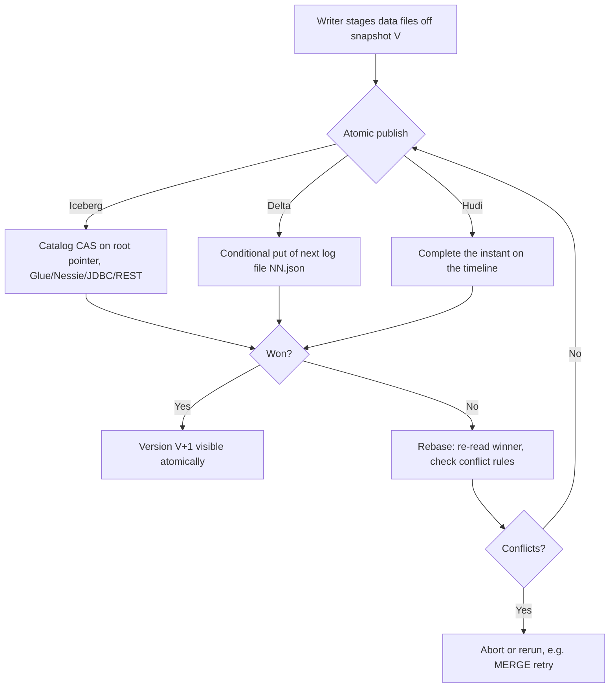
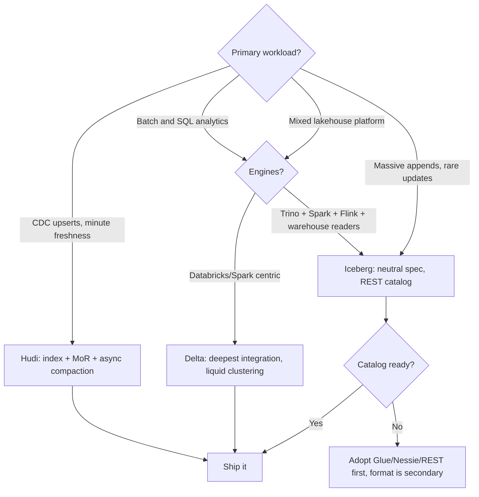

# Table Format Comparison — Iceberg vs Delta vs Hudi, Head to Head

## Overview

Once you know each format's internals, the interview question becomes comparative: *given this workload, which format, and why — and what exactly differs under the hood?* This page aligns the three on the same axes: commit protocol, partition evolution, row-level deletes, concurrency semantics, ecosystem, and catalog requirements. The honest headline is convergence — deletion vectors, COW/MoR options, and cross-format readership have closed most gaps since 2023 — but the remaining differences (index, catalog coupling, clustering model) are exactly what decision-makers ask about. Every claim here is justified on the per-format pages: [Apache Iceberg](./apache-iceberg.md), [Delta Lake](./delta-lake.md), [Apache Hudi](./apache-hudi.md).

## The Big Table

| Axis | **Iceberg** | **Delta Lake** | **Hudi** |
|---|---|---|---|
| Metadata shape | JSON root → manifest list → manifests (tree) | Ordered JSON log + Parquet checkpoints | Timeline instants + `.hoodie/` metadata |
| Atomic commit point | Catalog CAS on the metadata pointer | Conditional put of `NN.json` (log *is* the catalog) | Timeline instant completion |
| Partitioning | Hidden partition specs + evolution | Hive-style partition columns (user-visible) | Partition path fields (user-visible) |
| Clustering/layout | Sort orders in metadata; zorder via rewrite | Z-Ordering (batch) → Liquid Clustering (incremental) | Clustering (inline/async), bucketing |
| Row-level delete | Position/equality deletes (v2), deletion vectors (v3) | Deletion vectors (position bitmaps) | Log files merged at read (MoR) — the original |
| Record index | None (stats-based pruning) | None (stats-based pruning) | Bloom/HBase/bucket/record index |
| Multi-table txn | Via Nessie-style catalogs | No (single-table log) | No (single-table timeline) |
| Self-describing? | Needs catalog to find root | Yes — list `_delta_log/` | Mostly (`.hoodie/` + metadata) |
| License / governance | Apache | Linux Foundation (delta.io) | Apache |
| Best fit | Multi-engine neutrality, evolution | Databricks/Spark depth, simplicity | Ingest-heavy upserts, freshness |

## Commit Protocols in Detail

All three are optimistic concurrency, but the atomic point and the rebase logic differ:

| Property | Iceberg | Delta | Hudi |
|---|---|---|---|
| Fail detection | CAS failure in catalog | `putIfAbsent` failure / duplicate key | Instant already completed |
| Conflict granularity | File-level overlap (snapshot isolation) or sequence overlap (serializable) | Read/write predicate intersection, per operation | File-group overlap; CDC-oriented rules |
| Append vs append | Never conflicts | Never conflicts ("blind appends") | Never conflicts |
| Throughput ceiling | Catalog write rate (one pointer swap/commit) | One log-file append per version; checkpoint cost grows with live files | Timeline ops + index maintenance |
| Multi-table atomicity | Possible via catalog (Nessie branches) | No | No |

Two subtle points that separate senior answers from junior ones. First, **Delta's atomic point needs no catalog at all** — on S3 it is a conditional put on the next log key — which is why Delta tables "work" in a bare directory, while Iceberg requires a catalog with real compare-and-swap semantics (raw Hive Metastore is the known weak spot: HMS locking is coarser than a true CAS). Second, **Hudi's conflict check happens against the timeline and the index**, so concurrent upserts of the *same key* are detected at the file-group level — a stronger guarantee than pure file-list overlap for record-level work.

## Partition Evolution and Layout Management

| Capability | Iceberg | Delta | Hudi |
|---|---|---|---|
| Change partition scheme without rewrite | Yes — new spec-id, old manifests keep old spec | No — partitioning is directory structure | Partial — re-key via `insert_overwrite`/clustering, effectively a rewrite |
| User-visible partition columns | No (hidden, derived transforms) | Yes | Yes |
| Incremental layout optimization | Sort orders + `rewrite_data_files` | Liquid Clustering (incremental) | Inline/async clustering |
| Bucketing as first-class | `bucket[N]` transform in spec | Via liquid/bucket hints, Databricks | Bucket index + bucketed writing |

Hidden partitioning remains Iceberg's clearest differentiator: predicates on source columns prune automatically, there is no way to write a "forgotten partition filter" query, and granularity can change per new data. Delta's Liquid Clustering has effectively absorbed much of that value on the Databricks side by abandoning manual partition columns, and Hudi's bucket index doubles as layout. If an interviewer asks "can I change partitions on a Delta table," the correct answer is "not like Iceberg — you re-cluster (liquid) or rewrite; the directory scheme is static."

## Row-Level Deletes: Three Different Philosophies

| Mechanism | Format | Write cost | Read cost | Notes |
|---|---|---|---|---|
| Copy-on-write rewrite | All (Iceberg mode, Delta pre-DV, Hudi COW) | High — rewrite touched files | Zero — pure Parquet | Best when reads vastly outnumber updates |
| Position deletes | Iceberg v2 | Low — `(file, pos)` delete file | Low — skip listed positions | Sequence numbers order vs concurrent inserts |
| Equality deletes | Iceberg v2, Hudi log records | Lowest — store key values | Highest — anti-join across older files | Need compaction to fold in |
| Deletion vectors | Delta (default on), Iceberg v3 | Lowest — position bitmap | Low — bitmap applied at scan | Per-file DV file or inline |
| MoR log merge | Hudi | Low — append to log | Medium — merge base+logs until compaction | Plus record index for exact targeting |

The trade is a single curve: *where do you pay — at write, at read, or at compaction?* COW pays at write; position deletes and DVs pay a little at read; equality deletes and MoR logs pay the most at read and rely on scheduled compaction. What made Hudi distinctive was not MoR itself but the **index** that makes MoR appends hit one file group; what made Delta's DVs impactful was making them the default so `UPDATE` stopped meaning "rewrite the file."

## Concurrency Semantics

| Question | Iceberg | Delta | Hudi |
|---|---|---|---|
| Isolation level | `snapshot` (default) or `serializable` | `writeSerializable` (default) or `serializable` | Snapshot isolation per instant; OCC with file-group conflicts |
| Reader/writer interference | None — readers pin snapshot trees | None — readers replay log to a version | None — readers pin completed instants |
| Long-running reads vs compaction | Safe — old files remain until snapshot expiry | Safe until `VACUUM` retention (168 h default) | Safe until cleaner expires slices (savepoints pin them) |
| Streaming writer idempotency | Flink checkpoint-aligned commits | `txn` action `(appId, version)` | Instant timestamps + writer IDs |
| Hot table, many writers | Partition writes; catalog CAS is the choke point | Partition writes; retries on predicate overlap | File-group targeting minimizes overlap |

The failure mode to name in interviews is the **retention-vs-reader race**: every format has a GC (`expire_snapshots`/`VACUUM`/`clean`) that can delete files a still-running reader needs if retention is set below the longest query. All three decouple metadata retention from physical file deletion precisely so this can be tuned.

## Ecosystem, Vendor Neutrality, and Catalogs

- **Iceberg** is the neutrality winner by design: the spec defines readers/writers for any engine, the REST catalog spec lets vendors (Unity Catalog, Snowflake Polaris, Gravitino) interoperate, and Snowflake/BigQuery/Trino/Flink/DuckDB all read it natively. Costs: you must operate a catalog, and maintenance has more moving parts.
- **Delta** is the integration winner: Databricks runtime features (Photon, Liquid Clustering, managed VACUUM/OPTIMIZE), the cleanest Spark semantics, and now UniForm emitting Iceberg metadata for Iceberg-only engines. Costs: best features cluster around Databricks/Spark; self-hosted non-Spark stacks lean on delta-rs.
- **Hudi** is the ingest winner: record index + MoR + async compaction/clustering as a coherent pipeline for CDC at scale. Costs: more operational state (index, compaction plans), and engine coverage historically narrower (Spark/Flink strongest; Trino reads well, writes less so).

Catalog requirements compared:

| Format | Minimum to be a table | Common catalogs |
|---|---|---|
| Iceberg | A pointer store with CAS | Glue, HMS, Nessie, JDBC, REST (Polaris/Unity/Gravitino) |
| Delta | A directory with `_delta_log/` | None required; Unity/Glue for governance |
| Hudi | Directory + `.hoodie/` timeline | HMS/Glue for discovery; timeline is authoritative |

## What Benchmarks Actually Show

Public head-to-heads (Tabulario's Iceberg benchmark series, Databricks' 2021–2022 Delta-vs-Iceberg studies and the Iceberg community's rebuttals, Fivetran's ingestion comparisons) agree on one meta-finding: **results are dominated by configuration, not format**. The knobs that swing benchmarks by 2–10×:

1. Whether MoR tables get compaction (uncompacted MoR loses; compacted MoR is competitive or faster on ingest).
2. Target file sizes and write fan-out (a 128 MB vs 512 MB file setting changes pruning and metadata costs).
3. Whether DVs/deletes are compacted before the read benchmark runs.
4. Caching layers of the *engine* (Databricks' disk cache vs OSS Spark) masquerading as format differences.

The defensible conclusions: append-heavy batch tables are a wash; **upsert-heavy with random keys favors Hudi** (index) unless Delta/Iceberg DVs are enabled and compacted; **concurrent multi-writer and partition evolution favor Iceberg**; **Databricks-centric shops get the most out of Delta**. If asked for numbers, give the mechanism ("uncompacted MoR merges logs at read time, so a scan reads base+logs, roughly doubling I/O") rather than a percentage you cannot defend.

## Decision Flowchart

The flow encodes the practical ordering of concerns: workload first, then engine estate, then governance/catalog. Teams that invert this — picking a format before confirming catalog capability — end up with the classic failure: Iceberg tables no catalog can atomically commit, or Hudi tables nobody operates compaction for.

## Maintenance Cadence Compared

Same jobs, different names and mechanisms — a table that doubles as an ops checklist:

| Job | Iceberg | Delta | Hudi | Skipped-job symptom |
|---|---|---|---|---|
| Fold deletes/compact | `rewrite_data_files` (binpack/sort/zorder) | `OPTIMIZE` (+ `ZORDER BY`) | compaction instants (async plan) | Slowing scans, delete-file pileup |
| Expire history | `expire_snapshots` | log retention + `VACUUM` | `clean` instants | Storage creep, slow planning |
| Fix metadata | `rewrite_manifests` | checkpoint interval tuning | index maintenance | Manifest fragmentation, cold-read latency |
| Orphan cleanup | `remove_orphan_files` | VACUUM (with retention) | `clean` + repair tooling | Unreferenced object-store cost |
| Stats refresh | engine `ANALYZE`-class jobs | checkpoint stats | index + metadata sync | Poor join planning, wrong pruning |

The cadence decision is uniform across formats even when the commands differ: compact on a multiple of ingest interval (hourly for streaming, nightly for batch), expire history on the retention your audit requirement dictates, orphan-sweep weekly with an age threshold comfortably above your longest query. What differs is *who runs it*: Databricks automates much of Delta's list; Iceberg and OSS Hudi expect you to schedule the procedures yourself (or adopt a managed catalog/pipeline that does). Interviewers hiring data-platform engineers are probing for exactly this awareness — formats do not self-maintain.

## Migration Paths Between Formats

| Path | Mechanism | Fidelity |
|---|---|---|
| Delta → Iceberg read-only | Delta UniForm emits Iceberg metadata live | Full reads, Iceberg-side writes no |
| Any → Any (bulk) | XTable/OneTable-style metadata translation | Table properties and some features may not translate |
| Hudi → Iceberg-compatible writes | Hudi's metadata adapter mode | Version-dependent support |
| Schema-only re-registration | Keep Parquet files, rebuild metadata tree | Fast; loses deletes/history not materialized in files |

The strategic point (and a fair interview answer to "are we locked in?"): **data files are portable, metadata is the moat**. Conversion tools rewrite metadata trees without touching Parquet, so a migration is an I/O-light metadata rebuild plus a validation pass — hours for hundreds of terabytes, not weeks. What does *not* migrate cleanly is behavioral state: deletion vectors, ongoing compaction state, indexes, and table properties. Treat feature parity as the migration checklist (DVs on? liquid clustering? bucket index?), not just row counts.

## Governance and Security Features

| Feature | Iceberg | Delta | Hudi |
|---|---|---|---|
| Row/column access control | via catalog (policy at REST/catalog layer) | Databricks row filters/column masks | engine/EMR-side (weakest native story) |
| Audit of table history | snapshot summaries + catalog logs | commitInfo per version | timeline instants + rollback history |
| Multi-table transactions | via Nessie-style catalogs | no | no |
| Branch/tag semantics | catalog-level (Nessie, REST refs) | no (RESTORE only) | savepoints (pin, not branch) |
| Encryption | at-rest via object store/KMS | same + Delta-specific options | same |

Governance is increasingly the *real* differentiator as core file/metadata features converge. Iceberg's catalog-centric design pushes policy (row filters, credential vending, table properties) into the catalog layer, which is why vendors raced to build REST catalogs; Delta's answer lives inside the Databricks platform (Unity Catalog); Hudi leans on the deployment environment. If an interviewer frames the question as "we need lakehouse governance without a warehouse," the vendor-neutral answer is Iceberg + a REST-catalog implementation — and the honest caveat is that this stack is younger than warehouse-native governance.

## Failure Modes Checklist

| Symptom | Likely cause | First fix |
|---|---|---|
| Commit retries spiking | Concurrent writers overlapping partitions | Widen partitions; batch commits; check predicate overlap |
| Scans slower week over week | Delete files/logs accumulating; small files | Compact; check delete-file count per data file |
| Cold reads slow, warm fine | Checkpoint/manifest fragmentation | Raise checkpointInterval; `rewrite_manifests` |
| Storage grows after DELETE | History retained / deletes not compacted | Expected — tune retention windows; compact |
| Reader fails: file not found | Orphan sweep/VACUUM beat a long reader | Raise retention; snapshot-pin long jobs |
| Planning takes minutes on S3 | Listing-driven legacy path or fragmented manifests | Use catalog/manifest planning; rewrite manifests |

Print this table mentally before a "troubleshoot our lakehouse" interview round: each row is a real production incident class, and each fix is a one-liner that demonstrates operational depth. The last row is the quiet killer — teams migrate from Hive-style tables, keep tools that LIST directories instead of using metadata, and blame the format for latency that is actually their planner bypassing the metadata tree entirely.

## Interview Questions

1. **What is the single biggest architectural difference between Iceberg and Delta?**
Iceberg commits by swapping one catalog pointer to a new metadata.json tree, so it needs a catalog with true compare-and-swap but gains engine neutrality and cheap planning via manifests. Delta commits by conditionally appending the next numbered JSON file to `_delta_log`, so the log directory is self-describing and no catalog is strictly required. Everything downstream differs from that choice: Iceberg's manifests carry per-file stats for planning, Delta replays a log plus checkpoints; Iceberg gets hidden partitioning and evolution, Delta gets simplicity and tight Spark integration. Both remain optimistic-concurrency systems built on immutable Parquet.

2. **Compare how each format handles `DELETE FROM t WHERE user_id = 42`.**
Delta writes a deletion-vector bitmap for the touched file's row positions and appends a tiny commit — the file itself is untouched until compaction. Iceberg writes either position delete files (if it resolved target files via stats) or equality deletes keyed on `user_id`, which apply as an anti-join against all older files in scope. Hudi with MoR appends a delete record to the file group's log located via its record index, applying it during reads until compaction. Write cost is lowest for the bitmap/log approaches; read cost is lowest for COW and highest for equality deletes; all three need periodic compaction to restore pure-file scans.

3. **Why does Hudi historically beat the others on high-rate upserts?**
Its record index maps keys to file groups, so an upsert touches exactly one file group with no stats-guessing. Iceberg and Delta must infer candidate files from per-file min/max and partition stats, then rewrite or delete-mark every file that might contain each key — expensive for random keys that spread across all files. Hudi's MoR mode then converts the upsert into a log append, with compaction running asynchronously. Since deletion vectors landed in Delta and Iceberg v3, the raw delete cost has converged, but indexed targeting of random keys remains Hudi's edge.

4. **Which format supports changing partition granularity without a rewrite, and how?**
Iceberg: `SET PARTITION SPEC` starts writing new data under a new spec-id while old manifests keep the old tuples, so a table can hold daily partitions for 2022 and hourly for 2025 with no rewrite and no broken queries. Delta's partition columns are directory structure, so a change is a rewrite — Liquid Clustering sidesteps this by replacing manual partitioning with incremental clustering. Hudi re-keys through clustering or `insert_overwrite`, which is also effectively a rewrite. If partition evolution is a requirement, it is the strongest single argument for Iceberg.

5. **How would you design for 50 concurrent streaming writers on one table?**
All three formats serialize commits, so the design goal is minimizing conflict probability, not finding a lock-free format. Partition the stream so writers land on disjoint partitions or file groups (by key hash), and batch commits (checkpoint interval, micro-batch duration) so commit rate stays under the catalog/log ceiling. Expect appends to never conflict but merges/deletes to retry; monitor retry rates and back off. If the table truly needs multi-table or cross-table transactions, that pushes toward Iceberg with a Nessie-style catalog, since Delta and Hudi commits are single-table.

6. **A vendor benchmark says their format is 4x faster. What do you ask?**
First: what was compacted and when — uncompacted MoR or unmerged deletion vectors penalize reads enormously, and benchmarks rarely run the maintenance job the vendor's managed platform runs automatically. Second: file sizes, sort order, and partition alignment, because pruning is stats-driven in every format. Third: which engine and caches were used, since Databricks' disk cache or vendor-side metadata caching dominates cold-vs-warm scans. The general result across public comparisons is that configuration dominates the format; the format choice should be argued on governance, engines, and workload shape instead.

## Key Takeaways

- All three formats: immutable Parquet + atomic metadata commit + optimistic concurrency; the metadata shape (tree vs log vs timeline) is the real difference.
- Delta needs no catalog (the log is self-describing); Iceberg requires a real CAS catalog; Hudi's timeline is authoritative with a metastore for discovery only.
- Hidden partitioning and no-rewrite partition evolution remain Iceberg's clearest differentiators.
- Row-level deletes converge on "bitmap or log now, compaction later"; Hudi's record index still targets random-key upserts best.
- Concurrency differences are about conflict granularity (file overlap vs predicates vs file groups), not locking.
- Benchmarks are config-dominated: compaction cadence, file sizes, and engine caches swing results more than format choice.
- Decide by workload (CDC vs analytics), engine estate (Databricks vs multi-engine), and catalog readiness — in that order.

## Cross-References

- [Apache Iceberg](./apache-iceberg.md) — snapshot tree, hidden partitioning, catalogs
- [Delta Lake](./delta-lake.md) — `_delta_log`, checkpoints, deletion vectors, liquid clustering
- [Apache Hudi](./apache-hudi.md) — timeline, COW/MoR, record index
- [Lakehouses](../../data-engineering/lakehouses.md) — the workload overview this page deepens
- [Parquet Internals](./parquet-internals.md) — the shared data file format and its stats
- [Object Storage](../object-storage.md) — why conditional single-key writes anchor every commit
- [Trino](../../data-engineering/trino.md) — the multi-engine story that favors Iceberg

## References

- [Iceberg table spec](https://iceberg.apache.org/spec/) — snapshot isolation, delete files, conflict semantics
- [Delta Lake protocol](https://github.com/delta-io/delta/blob/master/PROTOCOL.md) — commit log, concurrency, deletion vectors
- [Delta Lake docs](https://docs.delta.io/latest/index.html) — concurrency control and best-practice guides
- [Apache Hudi docs](https://hudi.apache.org/docs/overview) — table types, timeline, indexing
- [Apache Iceberg docs](https://iceberg.apache.org/docs/latest/) — maintenance procedures and engine matrix
- Vendor benchmark series (Tabulario Iceberg benchmarks; Databricks Delta-vs-Iceberg studies, 2021–2022) — no stable URL relied upon; treat as configuration-sensitive evidence
