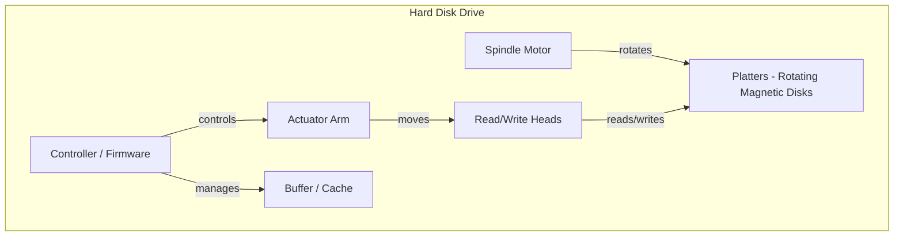
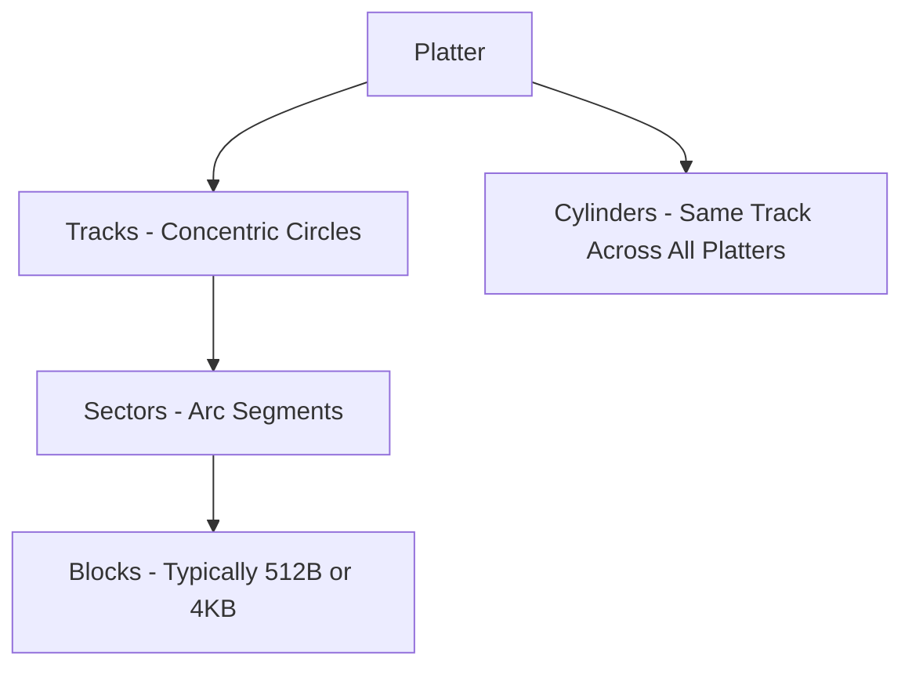
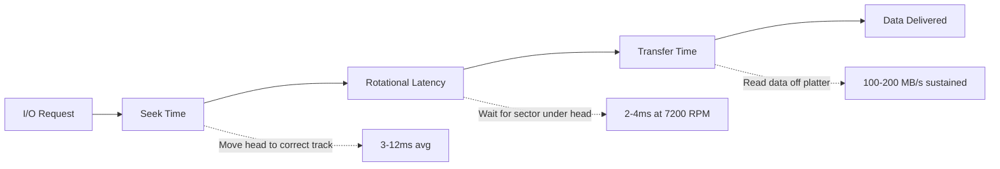
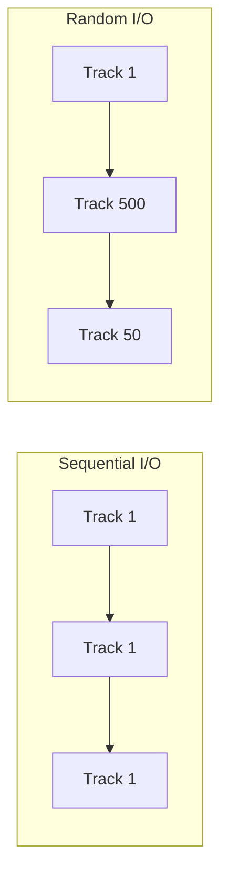
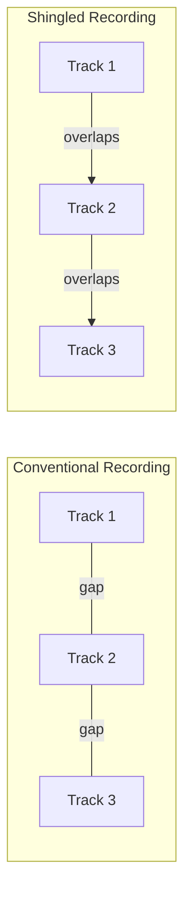
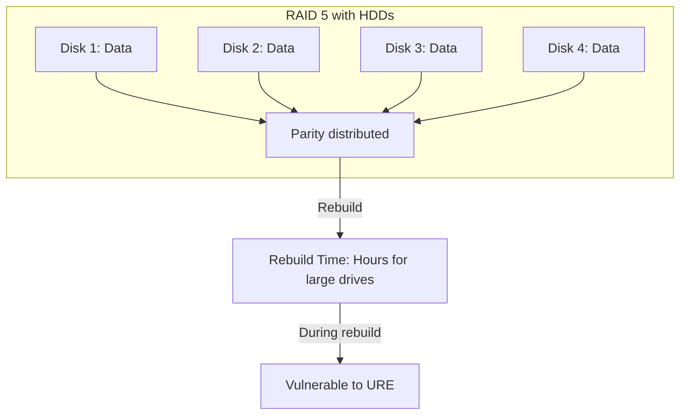
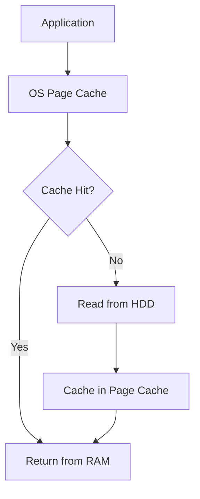

# Hard Disk Drives (HDD)

## Overview

Hard Disk Drives (HDDs) are electromechanical storage devices that store data on rotating magnetic platters. Despite the rise of SSDs, HDDs remain the dominant technology for bulk storage due to their low cost per gigabyte. Understanding HDD internals is essential for systems design interviews, especially when optimizing I/O-heavy applications.

## How HDDs Work

### Physical Components



- **Platters**: Aluminum or glass disks coated with magnetic material. Data is stored as magnetic orientations (0s and 1s). Multiple platters are stacked on a single spindle.
- **Read/Write Heads**: Float nanometers above the platter surface on an air bearing. Each platter has two heads (one per side).
- **Actuator Arm**: Positions the heads over the correct track. Moves radially in and out.
- **Spindle Motor**: Rotates platters at constant speed (5400, 7200, 10000, or 15000 RPM).
- **Controller**: Firmware that translates logical block addresses to physical locations, handles error correction, and manages the buffer cache.
- **Buffer (Cache)**: Small DRAM (8–256 MB) used for read-ahead and write buffering.

### Data Organization



- **Track**: Concentric circle on a single platter surface. Outer tracks are longer and can store more data (zoned bit recording).
- **Sector**: The smallest addressable unit. Traditionally 512 bytes, modern drives use 4 KB sectors (Advanced Format).
- **Cylinder**: All tracks at the same radial position across all platters. Accessing data within the same cylinder avoids seek time.

### Seek, Rotational, and Transfer Latency

The total time to read a block is:

```
Access Time = Seek Time + Rotational Latency + Transfer Time
```



| Parameter | 5400 RPM | 7200 RPM | 10000 RPM | 15000 RPM |
|-----------|----------|----------|-----------|-----------|
| Avg Seek Time | ~12 ms | ~8.5 ms | ~5 ms | ~3 ms |
| Avg Rotational Latency | ~5.6 ms | ~4.2 ms | ~3 ms | ~2 ms |
| Max Sustained Throughput | ~150 MB/s | ~200 MB/s | ~250 MB/s | ~300 MB/s |
| Typical IOPS (random 4K) | ~75 | ~100 | ~150 | ~200 |

**Key insight**: HDDs are fundamentally limited by mechanical movement. Random IOPS are extremely low compared to SSDs.

### Sequential vs Random I/O



- **Sequential**: Data on consecutive sectors/tracks. No seek between operations. 100-200 MB/s.
- **Random**: Data scattered across platter. Each access requires seek + rotation. ~75-200 IOPS (4 KB).

This is why HDDs are great for log files, video, and backups, but terrible for databases with random access patterns.

## Advanced HDD Technologies

### Shingled Magnetic Recording (SMR)

Tracks overlap like shingles on a roof, increasing areal density by 25-100%. However, writes to one track may require rewriting overlapping tracks, making random writes very slow. Used in archival/sequential workloads.



### Helium-Filled Drives

Replacing air with helium reduces turbulence, allowing more platters in the same form factor and lower power consumption. Enables 18+ TB drives.

### Heat-Assisted Magnetic Recording (HAMR)

Uses laser heating to enable writing on media with higher coercivity, dramatically increasing areal density. ExMo technology driving 30+ TB drives.

## RAID with HDDs

HDDs fail at higher rates than SSDs (MTBF: 300,000–1,200,000 hours). RAID is critical:



**Interview trap**: With large HDDs (8+ TB), RAID 5 rebuild can take 12-24 hours during which the array is degraded. Unrecoverable Read Error (URE) rate of 1 in 10^14 bits means a rebuild may fail on a second read error. RAID 6 or erasure coding is preferred.

## Caching and Optimization

### OS-Level Caching



- **Read-ahead**: OS detects sequential access and prefetches upcoming blocks.
- **Write-back**: Writes go to cache first, flushed to disk later (risk of data loss on crash).
- **Write-through**: Writes go to cache and disk simultaneously (slower but safer).

### Application-Level Optimization

1. **Batch I/O**: Combine many small reads into one large sequential read.
2. **Sort by disk location**: For random access patterns, sort I/O requests by LBA to convert random to sequential.
3. **Use O_DIRECT**: Bypass OS cache when application manages its own cache (databases).
4. **Align partitions**: Ensure partition alignment to sector boundaries (especially with 4K sectors).

## HDD vs SSD Decision Matrix

| Factor | HDD | SSD |
|--------|-----|-----|
| Cost/GB | $0.02-0.05 | $0.05-0.15 |
| Random IOPS | 75-200 | 10,000-500,000 |
| Sequential Read | 100-250 MB/s | 500-3,500 MB/s |
| Latency | 3-15 ms | 0.025-0.1 ms |
| Durability | Mechanical wear | Write endurance (TBW) |
| Power | 6-10W | 2-5W |
| Best For | Archival, bulk, sequential | OS, databases, random I/O |

## Interview Questions

1. **Q: Why are HDDs so slow for random I/O?**
   A: Each random read requires mechanical head movement (seek: 3-12ms) and waiting for the platter to rotate to the correct position (rotational latency: 2-6ms). This physical movement limits random IOPS to ~75-200, compared to SSDs which have no moving parts and can do 100K+ IOPS.

2. **Q: What is the difference between sequential and random I/O on HDDs?**
   A: Sequential I/O reads consecutive sectors, requiring minimal seeks. Achieves 100-250 MB/s. Random I/O jumps between locations, requiring constant seeks. Achieves only 75-200 IOPS (0.3-0.8 MB/s at 4KB blocks). The ratio can be 100-1000×.

3. **Q: What happens during a RAID 5 rebuild with large HDDs?**
   A: Rebuild reads all data from remaining disks to reconstruct the failed disk. With 8+ TB drives, this takes 12-24 hours. During this time, the array is degraded and a second failure means total data loss. URE (Unrecoverable Read Error) risk increases with drive size.

4. **Q: Explain SMR (Shingled Magnetic Recording).**
   A: SMR overlaps tracks like roof shingles to increase density. Reads work fine since heads are narrower than written tracks. But writes must update overlapping tracks in sequence, making random writes extremely slow. Best for write-once/read-many workloads.

5. **Q: How does the OS page cache interact with HDDs?**
   A: The OS caches frequently accessed disk blocks in RAM. For read-heavy workloads with good locality, most reads hit the cache (RAM speed). Write-back caching batches writes, converting random writes to sequential flushes. This dramatically improves perceived HDD performance.

## Common Mistakes

- Ignoring **seek time dominance**: For small random I/O, seek time is 90%+ of total latency. Optimizing throughput won't help.
- Assuming **HDD failure is graceful**: Disks often develop bad sectors before complete failure. SMART monitoring is essential.
- Not accounting for **filesystem overhead**: ext4, NTFS, etc. add journaling and metadata overhead that reduces effective capacity and performance.
- Confusing **buffer size with performance**: A larger drive buffer (256 MB vs 64 MB) helps with bursty sequential reads but doesn't improve sustained random I/O.
- Ignoring **vibration in multi-disk systems**: Adjacent disks can cause resonance, increasing seek errors and reducing performance.

## Summary

HDDs are electromechanical devices limited by physical movement. Their strengths are low cost per TB and high sequential throughput. They are weak at random I/O due to seek and rotational latency. Modern technologies like SMR, helium, and HAMR continue to push capacity limits. For interviews, understand the latency breakdown (seek + rotational + transfer), the sequential vs random gap, and RAID implications for large drives.

## Cross-References

- [SSD Deep Dive](./ssd.md) — Flash-based alternative
- [NVMe](./nvme.md) — High-performance storage interface
- [RAID and Erasure Coding](./erasure-coding.md) — Redundancy strategies
- [Distributed Storage](./distributed.md) — Scaling beyond single drives
- [Storage Overview](./overview.md) — Storage hierarchy
- [OS Disk Scheduling](../os/io/disk-scheduling.md)

