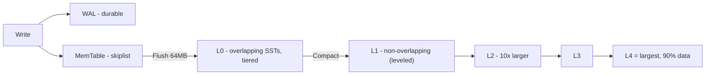
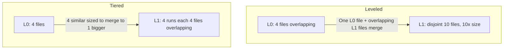

# LSM Compaction — Leveled, Tiered, Hybrid

## Overview

LSM (Log-Structured Merge Tree) turns random writes into sequential: writes go to WAL + MemTable (in RAM), flush to immutable SSTable at L0, then background **compaction** merges SSTables down levels. Compaction decides **write amplification (WA), read amplification (RA), space amplification (SA)** — the trilemma. Understanding compaction is essential for RocksDB, Cassandra, ScyllaDB tuning and for placement interviews on storage engines.

> For LSM basics, see [LSM Trees](../dbms/internals/lsm-trees.md) and [WAL](./wal.md). For read path Bloom, see [Probabilistic Data Structures](../interview/system-design/probabilistic-data-structures.md).

## LSM Structure Recap

- L0 is special: flushed SSTs overlap (since flushed from unsorted MemTables at different times), so reads must check all L0 files.
- L1+ can be leveled: files within a level have disjoint key ranges → at most one file per level needed for point lookup (plus Bloom).

## Amplifications

| Amplification | Definition | Impact |
|---------------|------------|--------|
| **Write Amplification (WA)** | Bytes written to storage / bytes written by client | SSD wear, throughput |
| **Read Amplification (RA)** | SST files/tables checked per point lookup | Latency, CPU |
| **Space Amplification (SA)** | Actual disk used / logical data size | Cost, GC needed |
| **Cache** | Bloom + block cache reduce RA | |

Goal: cannot optimize all three — choose based on workload.

## Classic Strategies

### Leveled Compaction (LevelDB, RocksDB default)

Each level except L0 is **one sorted run**, range-partitioned into files with **non-overlapping keys** within level. Size ratio `T` between levels ~10.

Compaction: pick one SST from `Ln`, merge with overlapping SSTs from `Ln+1` (all-to-some), rewrite into `Ln+1`.

- **RA**: low — at most 1 file per level (plus L0). With Bloom, ~1 I/O.
- **SA**: low — ~10% waste (since 90% data in deepest level, no overlapping duplicates within level)
- **WA**: high — data rewritten ~10-30× as it moves through levels (each key rewritten per level). RocksDB docs: leveled can be 10-30× unless tuned.

Good for: read-heavy, point lookup latency sensitive, low space waste (e.g., user DB).

### Size-Tiered / Tiered / Universal (Cassandra STCS, RocksDB Universal)

Each level can have **multiple sorted runs** (overlapping). When `N` similar-sized SSTs accumulate in a tier, merge them into one SST in next tier.

- **RA**: high — many overlapping files per level, need to check all, higher bloom false positives.
- **SA**: high — up to 2× peak space (need space for both input and output during compaction), plus old duplicates not quickly reclaimed.
- **WA**: low — `O(log_T N)` rewrite passes, asymptotically optimal ~2-4× for bulk load.

Good for: write-heavy, bulk ingest, append-only, time-series where reads scan many files anyway.

### Comparison Table

| Strategy | WA typical | RA point | SA | Reclaim speed | Best for | Impl |
|----------|------------|----------|----|---------------|----------|------|
| Leveled | High 10-30× | Low (bounded files) | Fast (regular merges remove tombstones) | Read-heavy low fanout | RocksDB level, Cassandra LCS |
| Size-tiered / Universal | Lower (fewer rewrites) | Higher (many overlapping) | Slower, major compactions heavy | Bulk ingest, write-heavy | Cassandra STCS, RocksDB Universal |
| Hybrid (Tiered+Leveled) | Middle | Middle | Tunable | Mixed | RocksDB tiered+leveled, Cassandra UCS |

Sources: beefed.ai LSM compaction trade-offs, RocksDB Compaction wiki (classic leveled description), Cassandra docs.

## Hybrid / Adaptive

Real workloads mixed — RocksDB and Cassandra introduced hybrids:

- **Tiered+Leveled**: Use tiered at top levels (L0-L1) where ingest frequent, leveled at deeper levels where reads matter. Reduces WA relative to pure leveled, RA relative to pure tiered, but control space grows (where to switch). RocksDB wiki describes as flexible switch point.
- **Cassandra Unified Compaction Strategy (UCS)**: Tunable spectrum via scaling parameters `L` or `T` bias toward leveled-like reads or tiered-like writes. Let's operators tune without changing strategy.
- **Lazy Leveling**: Only last level is leveled (one run), other levels allow `T-1` runs (tiered). Compromise: limits SA (since last level 90% no duplicates) but keeps WA lower.

Decision: if p99 reads latency-sensitive → bias leveled. If sustained write throughput or SSD endurance matters → bias tiered/universal. Test hybrid.

## RocksDB Tuning Knobs (from Paper and Wiki)

| Parameter | Default | Impact |
|-----------|---------|--------|
| `level0_file_num_compaction_trigger` | 4 | # L0 files to trigger compact to L1. Higher delays compaction but raises RA |
| `level0_slowdown_writes_trigger` | 20 | Slowdown when L0 growth high |
| `level0_stop_writes_trigger` | 36 | Stop writes until compaction catches up |
| `max_bytes_for_level_base` | 256 MB | Base size for L1. Larger reduces levels but raises per-compaction cost |
| `max_bytes_for_level_multiplier` | 10 | Size ratio between levels |
| `target_file_size_base` | 64 MB | SST target size L1. Larger fewer files, less metadata |
| `max_background_compactions` | 1 | More compactions faster but CPU/I/O contention |
| `compaction_style` | level | level/universal/fifo |
| `compaction_pri` | kByCompensatedSize | Which files pick: minimize WA vs space |

Quick wins: increase `target_file_size_base` + `max_bytes_for_level_multiplier` → fewer levels → lower WA but higher RA per compaction; enable `level_compaction_dynamic_level_bytes` to reduce wasted compaction; tune tombstone threshold to reclaim deletes faster.

## Operational Techniques

- **Align file boundaries + dynamic level bytes**: RocksDB optimization reduces wasted compaction, lowers WA.
- **Tombstone TTL compaction**: For workloads with many deletes, accelerate reclaim by triggering compaction when tombstone ratio high — saves space.
- **Write stall avoidance**: Monitor `L0 files`, `pending compaction bytes`, `compaction queue`. If `L0 -> 20`, writes slowdown, latency spikes.
- **Space Amplification Goal (SAG)**: Slideshare compaction principles show leveled and tiered cover different RA-WA-SA regions; hybrid reaches middle regions unreachable by pure strategies.

## Interview Questions

**Q: Why does LSM need compaction?**
Without compaction, L0 files accumulate, RA explodes (check 100s files per read), and deleted/tombstoned keys waste space. Compaction merges, discards obsolete versions, enforces sorted order for efficient range scans.

**Q: Leveled vs tiered for time-series?**
Time-series often append-only with time-window deletes (TTL). Tiered better for ingest (lower WA), plus Time-Window Compaction Strategy (TWCS) groups SSTs by time, drops whole SST when expired — avoids per-key tombstone.

**Q: How to reduce write amplification in leveled?**
Increase level multiplier, increase target file size, use tiered for L0-L1, use key-order inserts (RocksDB detects sequential load and avoids rewriting), use `compaction_pri=kMinOverlappingRatio`.

**Q: What is write stall?**
When L0 files pile up (ingest faster than compaction), DB slows or stops writes to allow compaction to catch up, causing latency spikes. Solution: more background compaction threads, larger L1, faster storage.

**Q: When to choose universal compaction?**
Universal is RocksDB's tiered implementation. Best for write amplification sensitive, space amplification acceptable (2×), and read amplification not critical (e.g., bulk load, analytics). Not for low P99 point lookup.

## Cross-References

- [LSM Trees](../dbms/internals/lsm-trees.md) — overall structure
- [WAL](./wal.md) — durability before MemTable
- [SSTable Format](../dbms/storage/file-organization.md) / [Block Storage](./block-storage.md) — file layout
- [Bloom Filters](../interview/system-design/probabilistic-data-structures.md) — reduces RA
- [RocksDB Compaction Wiki](https://github.com/facebook/rocksdb/wiki/Compaction) — classic leveled vs tiered+leveled

## References

- Beefed.ai — LSM-Tree Compaction: Leveled vs Size-Tiered: WA 10-30× leveled vs lower tiered, RA trade-offs, hybrid [beefed.ai]
- RockDB Wiki — Compaction: Overview of Classic Leveled, Tiered+Leveled [GitHub RocksDB Wiki]
- Slideshare — Balancing Compaction Principles and Practices: read/write/space amplification analysis for STCS/LCS/ICS/TWCS [Slideshare]
- Araujo et al. — Rethinking Compaction Policies in LSM-trees (SIGMOD 25) — leveling vs tiering balance, lazy leveling [Tsinghua]
- Characterize LSM-tree Compaction Performance via On-Device LLM — configurable params table [arXiv]
