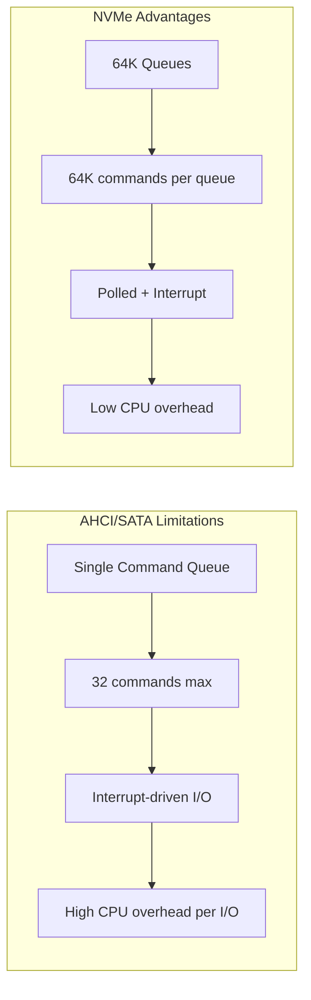
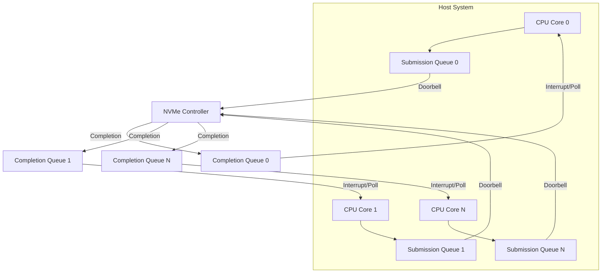
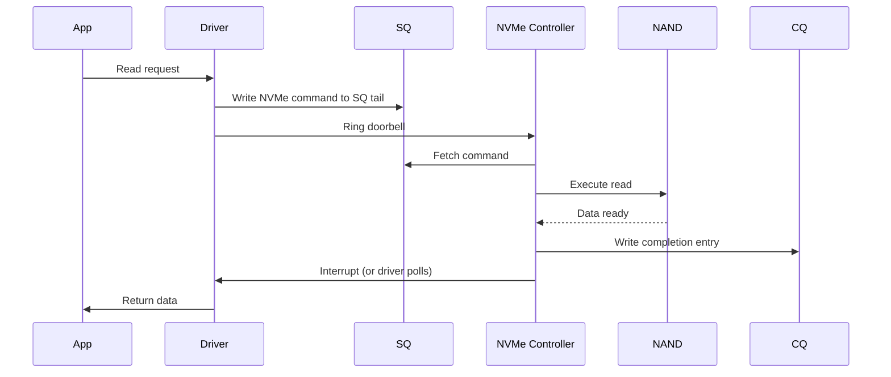
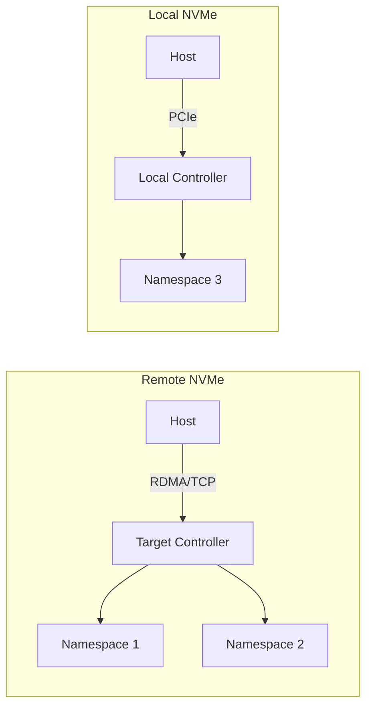
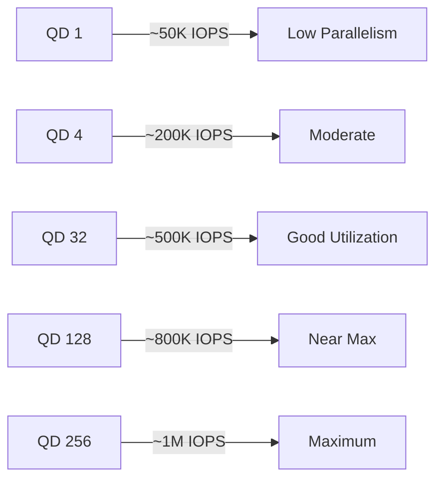

# NVMe (Non-Volatile Memory Express)

## Overview

NVMe (Non-Volatile Memory Express) is a storage interface protocol designed specifically for flash-based storage. It replaces the legacy AHCI/SATA protocol with a streamlined, high-performance interface that fully exploits the parallelism of SSDs. NVMe is the standard for modern high-performance storage and a frequent topic in systems design interviews.

## Why NVMe Was Needed

### The SATA/AHCI Bottleneck



| Feature | AHCI/SATA | NVMe |
|---------|-----------|------|
| Max Queue Depth | 32 commands (1 queue) | 64,536 commands (64K queues) |
| Interface | SATA (6 Gbps) | PCIe (16-64 Gbps per lane) |
| Protocol Overhead | High (designed for HDDs) | Minimal (designed for flash) |
| Latency | ~6 µs | ~2.8 µs |
| Max IOPS | ~100,000 | ~1,000,000+ |
| Max Throughput | 600 MB/s | 7,000+ MB/s (PCIe 4.0 x4) |

### The Key Insight

SATA/AHCI was designed when storage was slow (HDDs). The protocol overhead was negligible compared to mechanical latency. With SSDs, the storage device became faster than the protocol. NVMe eliminates this bottleneck.

## NVMe Architecture

### Queue Structure



- **Submission Queue (SQ)**: Host writes commands to SQ. Each queue can hold up to 64K commands.
- **Completion Queue (CQ)**: Controller writes completions to CQ. Multiple SQs can share one CQ.
- **Doorbell Registers**: Host writes to doorbell to notify controller of new commands. Controller writes to doorbell to notify host of completions.
- **Per-CPU Queues**: Each CPU core can have its own SQ/CQ pair, eliminating lock contention.

### NVMe Command Flow



Key advantage: The driver writes a command and rings the doorbell. The controller fetches commands directly from host memory via DMA — no need to copy commands through the controller's own memory.

### NVMe over Fabrics (NVMe-oF)



NVMe-oF extends NVMe over network fabrics:
- **NVMe/RoCE**: Uses RDMA over Converged Ethernet. Lowest latency (~15 µs).
- **NVMe/TCP**: Uses standard TCP/IP. Higher latency but works on existing networks.
- **NVMe/FC**: Uses Fibre Channel. Enterprise SAN environments.

This enables **disaggregated storage** — compute and storage scale independently.

## NVMe Form Factors

```mermaid
graph TD
    FF[Form Factors] --> M2[M.2 - Desktop/Laptop]
    FF --> U2[U.2 / SFF-8639 - Enterprise 2.5"]
    FF --> E1[E1.S - Enterprise Short]
    FF --> E3[E3.S - Enterprise Dense]
    FF --> AIC[Add-in Card (AIC) - PCIe Slot]

    M2 -->|Sizes| M2S[2230, 2242, 2260, 2280, 22110]
    U2 -->|Features| U2F[Hot-swap, dual-port]
    E1 -->|Features| E1F[Dense, hot-swap]
    AIC -->|Features| AICF[Full PCIe slot, best cooling]
```

## NVMe Command Set

### Key Commands

| Opcode | Command | Description |
|--------|---------|-------------|
| 0x01 | Flush | Persist volatile write cache |
| 0x02 | Write | Write data to namespace |
| 0x06 | Read | Read data from namespace |
| 0x09 | Write Uncorrectable | Mark LBA range as uncorrectable |
| 0x0D | Write Zeroes | Write zeros without data transfer |
| 0x04 | Dataset Management | TRIM/deallocate hints |

### NVMe Features

- **Multi-Stream Write**: Application hints about data lifetime, allowing FTL to group data by expected retention time, improving GC efficiency.
- **Zoned Namespaces (ZNS)**: Exposes zone-based interface, letting the host manage data placement, reducing write amplification.
- **Persistent Memory**: Support for byte-addressable persistent memory (Intel Optane).
- **Predictable Latency Mode**: Guarantees latency bounds for specific I/O classes.

## Performance Analysis

### Queue Depth and IOPS



NVMe shines at high queue depths. Applications must issue concurrent I/O to fully utilize the device.

### PCIe Bandwidth

| PCIe Version | Per-Lane | x4 (typical NVMe) | x16 |
|--------------|----------|-------------------|-----|
| PCIe 3.0 | 1 GB/s | 4 GB/s | 16 GB/s |
| PCIe 4.0 | 2 GB/s | 8 GB/s | 32 GB/s |
| PCIe 5.0 | 4 GB/s | 16 GB/s | 64 GB/s |
| PCIe 6.0 | 8 GB/s | 32 GB/s | 128 GB/s |

Modern NVMe SSDs use PCIe 4.0 x4 (8 GB/s) or PCIe 5.0 x4 (16 GB/s).

## Programming NVMe

### Linux NVMe CLI

```bash
# List NVMe devices
nvme list

# Get device info
nvme id-ctrl /dev/nvme0

# Get SMART health info
nvme smart-log /dev/nvme0

# Format with specific block size
nvme format /dev/nvme0n1 --lbaf=1  # 4K sectors

# Secure erase
nvme format /dev/nvme0n1 --ses=1
```

### io_uring with NVMe

```c
// Modern Linux I/O interface for NVMe
struct io_uring ring;
io_uring_queue_init(256, &ring, 0);  // 256-entry ring

struct io_uring_sqe *sqe = io_uring_get_sqe(&ring);
io_uring_prep_read(sqe, fd, buf, len, offset);
io_uring_submit(&ring);

struct io_uring_cqe *cqe;
io_uring_wait_cqe(&ring, &cqe);
// Process completion
io_uring_cqe_seen(&ring, cqe);
```

`io_uring` is the Linux interface that best matches NVMe's queue model — shared memory rings between kernel and user space, minimal syscall overhead.

## Interview Questions

1. **Q: Why is NVMe faster than SATA SSDs?**
   A: NVMe uses PCIe directly (up to 8 GB/s vs 600 MB/s for SATA), supports 64K command queues (vs 1 queue of 32 for SATA), has lower protocol overhead (designed for flash, not HDDs), and allows per-CPU queue parallelism eliminating lock contention.

2. **Q: Explain NVMe's queue architecture and why it matters.**
   A: NVMe has multiple submission/completion queue pairs, typically one per CPU core. This eliminates cross-core locking for I/O submission. Each queue can hold 64K commands, enabling massive parallelism. The doorbell mechanism uses MMIO writes to notify the controller without expensive interrupts.

3. **Q: What is NVMe-oF and when would you use it?**
   A: NVMe over Fabrics extends NVMe commands over networks (RDMA, TCP, FC). It enables disaggregated storage where compute and storage scale independently. Used in data centers for shared NVMe storage pools with near-local latency (15-50 µs vs 10 µs local).

4. **Q: How does NVMe compare to SATA for queue depth scaling?**
   A: SATA has one queue with 32 entries. Performance plateaus at QD4-8. NVMe has 64K queues with 64K entries each. Performance scales with queue depth up to QD128-256, enabling 1M+ IOPS. Applications must use async I/O (io_uring, libaio) to generate sufficient queue depth.

5. **Q: What is ZNS (Zoned Namespaces) in NVMe?**
   A: ZNS exposes the NAND erase-block structure to the host. The host writes data sequentially within zones and manages zone resets (erases). This eliminates GC on the device, reduces write amplification, and gives the host control over data placement for better performance predictability.

## Common Mistakes

- Using NVMe with AHCI drivers — NVMe requires dedicated NVMe drivers (nvme kernel module).
- Not enabling multi-queue — default configs may use a single queue.
- Ignoring PCIe lane allocation — sharing lanes with GPU reduces bandwidth.
- Assuming NVMe always performs better — at low queue depths, the difference is minimal.
- Not considering NVMe-oF for scale-out — local NVMe doesn't scale; NVMe-oF enables disaggregated architectures.

## Summary

NVMe is a storage protocol designed for flash, eliminating the SATA/AHCI bottleneck through PCIe connectivity, massive queue parallelity (64K queues × 64K commands), and minimal protocol overhead. NVMe-oF extends this over networks for disaggregated storage. For interviews, understand the queue architecture, performance scaling with queue depth, and the difference between NVMe and SATA at the protocol level.

## Cross-References

- [SSD](./ssd.md) — NAND flash fundamentals
- [HDD](./hdd.md) — Legacy storage interface
- [Distributed Storage](./distributed.md) — Scaling storage
- [Storage Overview](./overview.md) — Storage hierarchy
