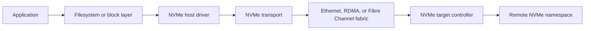
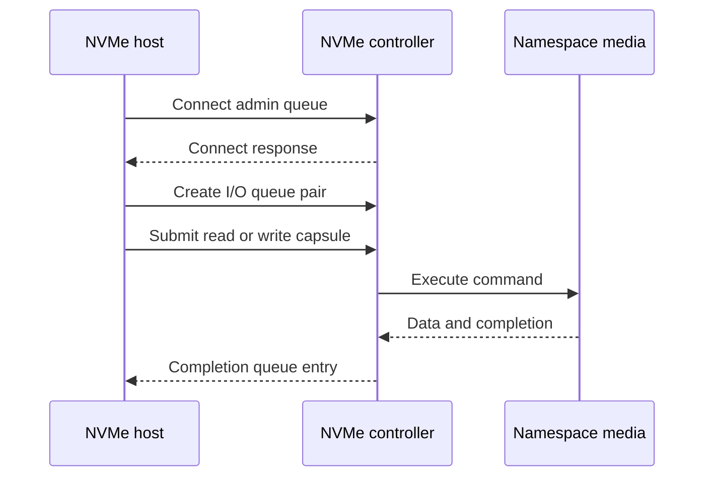

# NVMe over Fabrics

**NVMe over Fabrics, or NVMe-oF, extends the NVMe command and queue model over
a network fabric.** A host can access remote NVMe namespaces using a storage
protocol designed around parallel queues and low software overhead instead of
wrapping SCSI semantics around a remote disk.

This chapter connects [NVMe](./nvme.md), [block storage](./block-storage.md),
[networking](../networks/tcp-ip/README.md), Linux `nvme-cli`, multipathing,
RDMA, TCP, and distributed-storage design.

## Architecture



The important separation is:

- **NVMe command set:** read, write, flush, identify, reservation, and other
  storage operations.
- **Transport binding:** how capsules, queue entries, data, and completions
  cross the fabric.
- **Discovery:** how a host learns which controllers and namespaces exist.
- **Target implementation:** software or hardware that exposes namespaces.

NVMe-oF does not make a remote device behave like local PCIe at every layer.
Network latency, congestion, path failures, authentication, and multipathing
remain part of the system design.

## Transport choices

| Transport | Network requirement | Data movement | Main trade-off |
|---|---|---|---|
| NVMe/PCIe | Local PCIe fabric | Memory-mapped queues and DMA | Lowest latency, limited reach |
| NVMe/TCP | Ordinary IP Ethernet | TCP capsules and data PDUs | Broad compatibility, CPU/network overhead |
| NVMe/RDMA | InfiniBand, RoCE, or iWARP | RDMA send/read/write | Low latency and direct placement, specialized operations |
| NVMe/FC | Fibre Channel fabric | FC-NVMe frames | Enterprise SAN integration, dedicated fabric |

Use NVMe/TCP when operational reach and standard Ethernet matter more than the
last microsecond. Use RDMA when the team already operates a correctly tuned,
lossless or well-managed RDMA fabric and the latency/CPU benefit justifies it.

## Queue model

NVMe keeps submission and completion queues central to the design. A host
submits commands to an I/O submission queue; the target processes them and
posts completions to the corresponding completion queue. Multiple queue pairs
allow parallelism across CPUs and paths.



A queue pair is not a generic shared queue that can be arbitrarily multiplexed.
Transport specifications define queue identifiers, capsule formats, queue
creation, keep-alive, error handling, and data-transfer rules.

## Discovery and connection

A production host normally performs these steps:

1. Reach a discovery controller at a configured address and transport service.
2. Send a discovery request and receive discovery log page entries.
3. Select an eligible subsystem and controller path.
4. Connect the admin queue.
5. Identify controllers and namespaces.
6. Create I/O queue pairs, apply multipath policy, and expose a block device.
7. Monitor keep-alives, path state, latency, errors, and namespace changes.

Linux examples are illustrative; use the distribution's `nvme-cli` version and
validate addresses before connecting:

```bash
# Discover controllers advertised by a discovery service
sudo nvme discover -t tcp -a 192.0.2.10 -s 8009

# Connect to one subsystem; 4420 is the common NVMe/TCP I/O service
sudo nvme connect -t tcp -n nqn.2026-01.example:subsystem1 \
  -a 192.0.2.20 -s 4420

# Inspect controllers, namespaces, and paths
nvme list-subsys
nvme list
nvme show-regs /dev/nvme0
```

Do not confuse the discovery service port with the I/O controller port. The
transport specification and discovery log determine the service identifier.

## NVMe/TCP data path

NVMe/TCP carries capsules and data inside TCP protocol data units. The host and
controller maintain a reliable ordered byte stream, while the NVMe/TCP layer
maps command capsules, data transfer, responses, digests, alignment, and error
handling onto that stream.

### Performance considerations

- Keep queue count and queue depth aligned with CPU and target capacity.
- Avoid queue depths that only create outstanding latency and congestion.
- Measure application latency, device latency, TCP retransmissions, CPU usage,
  and target queueing separately.
- Use multiple paths for availability, not merely to multiply load without
  understanding target and network limits.
- Treat TCP congestion and packet loss as storage latency events; a fast SSD
  cannot hide a congested fabric.

### Security

NVMe/TCP deployments may use TLS and NVMe authentication mechanisms such as
DH-HMAC-CHAP, depending on the transport and implementation. Protect discovery
and connection credentials, restrict allowed initiators, and treat an exposed
storage target as a data-plane security boundary.

## NVMe/RDMA data placement

NVMe/RDMA uses RDMA operations to exchange capsules and place data into a host
or controller memory buffer described by the command. This can reduce copies,
but it introduces memory registration, queue-pair, completion, and fabric
operational requirements.

- **RDMA_SEND:** transfers command or response capsules.
- **RDMA_READ / RDMA_WRITE:** transfer data directly between registered buffers.
- **Queue pair:** transport endpoint associated with a submission/completion
  queue pair.
- **Memory key and invalidation:** ensure a remote peer cannot continue using a
  buffer after its lifetime or authorization ends.

RDMA does not eliminate flow control, failure handling, or memory-ordering
concerns. It changes where the work is performed and how data moves.

## Availability and multipathing

A remote namespace can have multiple paths to one subsystem. A host-side
multipath layer may load-balance or fail over paths based on ANA state,
controller availability, latency, and policy.

Failure scenarios to test:

- Discovery controller unavailable while existing I/O paths remain healthy.
- One target network interface fails.
- A path times out during an outstanding command.
- A controller restarts and namespaces reappear.
- A fabric partition isolates only some hosts.
- A replication slot, target process, or storage backend becomes overloaded.

Recovery must distinguish a transient path failure from a namespace or data
integrity failure. Retrying every timeout blindly can amplify load and turn a
partial outage into a storage storm.

## Observability checklist

| Layer | Signals |
|---|---|
| Application | Read/write latency, queueing, timeout rate, tail percentiles |
| Host block layer | Queue depth, request latency, resets, I/O errors |
| NVMe transport | Connect failures, keep-alive failures, capsule errors |
| TCP | Retransmits, RTT, congestion, receive/send queue pressure |
| RDMA | Completion errors, QP state, memory registration failures |
| Target | Namespace latency, controller queue depth, CPU, media errors |
| Fabric | Link errors, drops, congestion marks, path asymmetry |

Correlate timestamps across host, transport, target, and fabric. A high
application p99 with normal media latency often points to network or queueing,
not the SSD itself.

## Interview questions

**Why use NVMe-oF instead of iSCSI?**

NVMe-oF preserves NVMe's parallel queue and command model and can reduce
translation overhead for NVMe-backed storage. iSCSI is mature and widely
interoperable, but carries SCSI semantics and has different queueing and
operational trade-offs.

**When is NVMe/TCP preferable to NVMe/RDMA?**

When standard Ethernet, simpler operations, and broad host support dominate.
RDMA can reduce latency and CPU cost, but it requires correct RDMA operations,
configuration, monitoring, and failure handling.

**What does discovery do?**

It returns transport-specific entries describing subsystems/controllers so a
host can select a path and connect. Discovery is control-plane information; it
is not the data path for normal I/O.

**Does more queue depth always improve performance?**

No. It can hide service time behind queueing, increase tail latency, exhaust
target resources, and amplify overload. Sweep queue depth while measuring
throughput, p50/p99 latency, CPU, and error rates.

**What is the most important production mistake?**

Treating storage networking as a transparent cable. It is a distributed
system: paths fail, state changes, retries interact with congestion, and
observability must cover both the storage and network layers.

## Cross-references

- [NVMe](./nvme.md) — local NVMe command and device model
- [Block Storage](./block-storage.md) — abstraction and durability trade-offs
- [Distributed Storage](./distributed.md) — replication and placement
- [Linux networking](../linux/networking/fundamentals.md) — IP, routing, and diagnostics
- [Linux RDMA](../linux/networking/rdma.md) — RDMA concepts and tooling
- [Linux storage tools](../linux/tools.md) — `ss`, `ip`, `tcpdump`, `lsof`, and incident workflows
- [Ceph CRUSH and RADOS](./ceph-crush.md) — distributed storage placement

## References

- [NVM Express NVMe over TCP Transport Specification, Revision 1.2](https://nvmexpress.org/wp-content/uploads/NVM-Express-NVMe-over-TCP-Transport-Specification-Revision-1.2-2025.08.01-Ratified.pdf)
- [NVM Express NVMe over RDMA Transport Specification, Revision 1.2](https://nvmexpress.org/wp-content/uploads/NVM-Express-NVMe-over-RDMA-Transport-Specification-Revision-1.2-2025.08.01-Ratified.pdf)
- [NVM Express overview of refactored transport specifications](https://nvmexpress.org/wp-content/uploads/An-Overview-of-the-Refactored-NVMe-Transport-Specifications-%E2%80%93-PCIe%C2%AE-RDMA-and-TCP.pdf)
- [Linux NVMe feature and quirk policy](https://docs.kernel.org/nvme/feature-and-quirk-policy.html)
- [Linux NVMe subsystem documentation](https://docs.kernel.org/nvme/index.html)
- [nvme-cli documentation](https://github.com/linux-nvme/nvme-cli)
