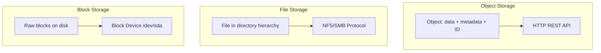
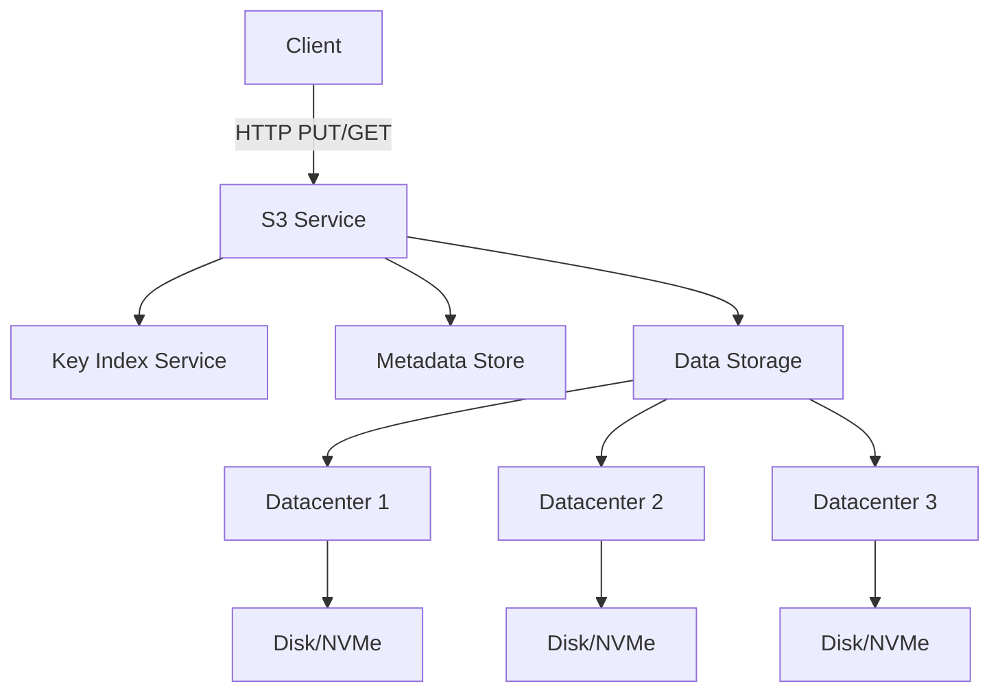
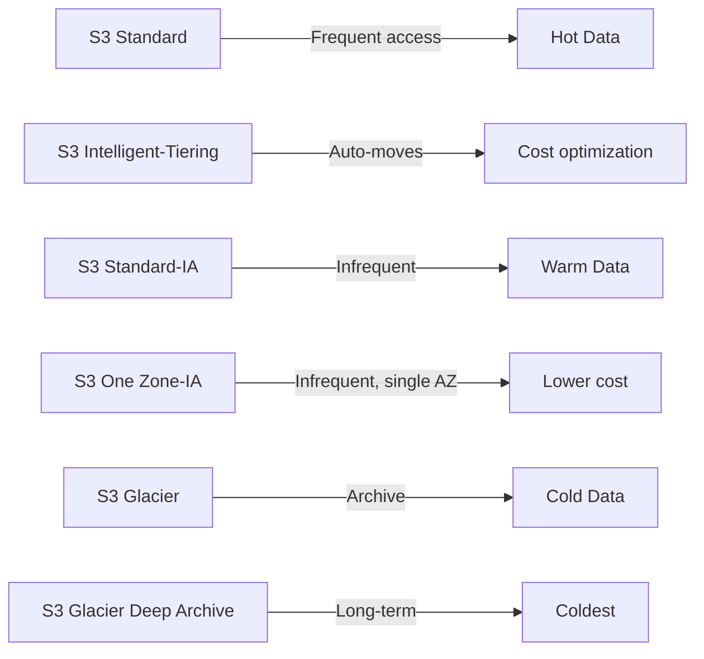
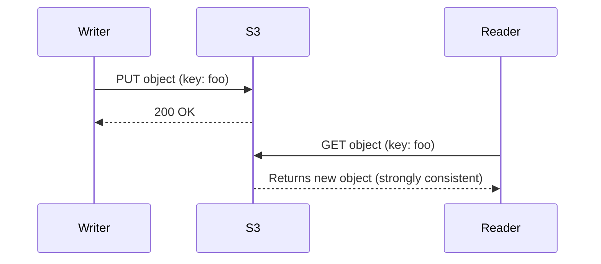
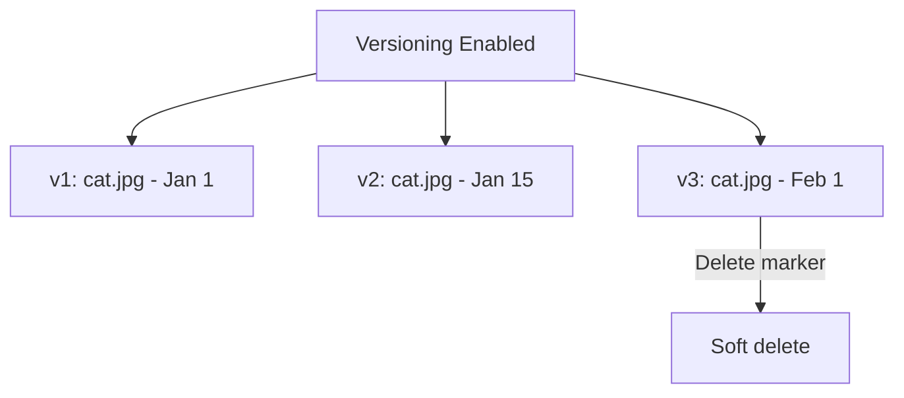
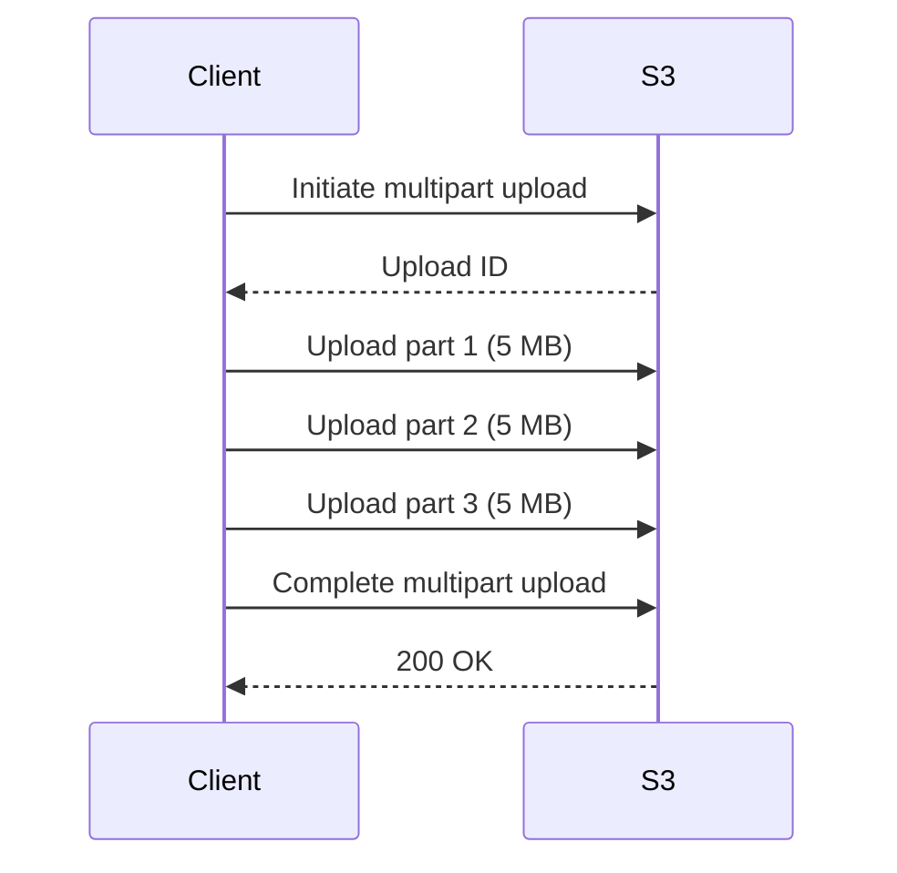
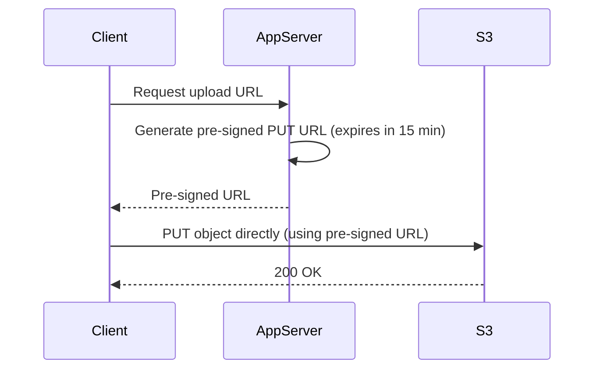
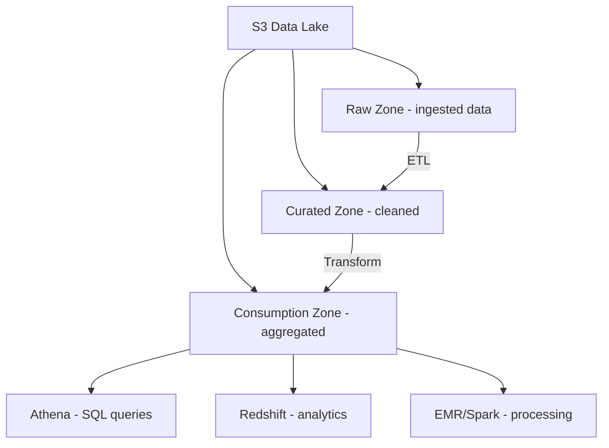
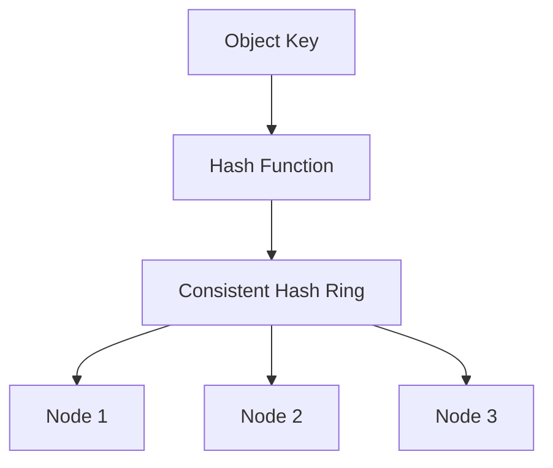

# Object Storage

## Overview

Object storage is a data storage architecture that manages data as objects rather than files (file storage) or blocks (block storage). Each object contains the data, metadata, and a unique identifier. Object storage is the foundation of cloud storage services like Amazon S3, Google Cloud Storage, and Azure Blob Storage. It's designed for massive scale, durability, and cost-effectiveness.

## Core Concepts

### Object vs File vs Block Storage



| Feature | Object Storage | File Storage | Block Storage |
|---------|---------------|--------------|---------------|
| Interface | HTTP REST API (GET/PUT/DELETE) | POSIX file I/O (open/read/write) | Block device read/write |
| Namespace | Flat (bucket + key) | Hierarchical (directories) | Linear (LBA) |
| Metadata | Rich, custom per object | Limited (inode) | None |
| Scalability | Virtually unlimited | Millions of files | Limited by volume size |
| Consistency | Eventual (or strong in S3) | Strong | Strong |
| Best For | Static assets, backups, data lakes | Shared files, home directories | Databases, VMs |

### Anatomy of an Object

```mermaid
graph TD
    OBJ[Object] --> ID[Unique Key - e.g., photos/cat.jpg]
    OBJ --> DATA[Raw Data - binary blob]
    OBJ --> META[Metadata - custom key-value pairs]
    OBJ --> VER[Version ID - if versioning enabled]
    OBJ --> ACL[Access Control - permissions]

    META --> M1[Content-Type: image/jpeg]
    META --> M2[Content-Length: 2.4 MB]
    META --> M3[Custom: {"department": "marketing"}]
```

## Amazon S3 Deep Dive

### S3 Architecture



S3 stores data across at least 3 availability zones for 99.999999999% (11 nines) durability.

### S3 Storage Classes



| Storage Class | Availability | Retrieval Time | Cost (per GB/mo) | Use Case |
|---------------|-------------|----------------|------------------|----------|
| Standard | 99.99% | Instant | $0.023 | Active data |
| Intelligent-Tiering | 99.9% | Instant | $0.023 + monitoring | Unknown patterns |
| Standard-IA | 99.9% | Instant | $0.0125 | Backups, older logs |
| One Zone-IA | 99.5% | Instant | $0.01 | Reproducible data |
| Glacier Instant | 99.9% | Instant | $0.004 | Rare access, fast retrieval |
| Glacier Flexible | 99.99% | 1-5 min | $0.0036 | Archive |
| Glacier Deep Archive | 99.99% | 12-48 hours | $0.00099 | Compliance, long-term |

### S3 Consistency Model

Since December 2020, S3 provides **strong consistency** for all operations:



Previously, S3 was eventually consistent for overwrites and deletes.

### S3 Key Features

**Versioning**:


**Multipart Upload**:


For files > 100 MB, multipart upload enables parallel uploads and resume on failure.

**Lifecycle Policies**:
```json
{
  "Rules": [
    {
      "Status": "Enabled",
      "Filter": { "Prefix": "logs/" },
      "Transitions": [
        { "Days": 30, "StorageClass": "STANDARD_IA" },
        { "Days": 90, "StorageClass": "GLACIER" }
      ],
      "Expiration": { "Days": 365 }
    }
  ]
}
```

## Object Storage Patterns

### Pre-Signed URLs



Pre-signed URLs allow clients to upload/download directly to S3 without the app server proxying the data.

### S3 as Data Lake



### Consistency Hashing for Object Distribution



Objects are distributed across storage nodes using consistent hashing, ensuring even distribution and minimal redistribution when nodes are added/removed.

## Comparison with Other Cloud Object Stores

| Feature | AWS S3 | GCS | Azure Blob | MinIO |
|---------|--------|-----|------------|-------|
| Durability | 99.999999999% | 99.999999999% | 99.999999999% | Configurable |
| Strong Consistency | Yes (since 2020) | Yes | Yes | Yes |
| Max Object Size | 5 TB | 5 TB | 4.75 TB | 5 TB |
| Versioning | Yes | Yes | Yes | Yes |
| S3-Compatible API | Native | Translation | Translation | Native |
| Pricing (per GB/mo) | $0.023 | $0.020 | $0.018 | Self-hosted |

## Interview Questions

1. **Q: When would you choose object storage over file or block storage?**
   A: Object storage is ideal for: static assets (images, videos), backups and archives, data lakes, content distribution, and any data accessed via HTTP that doesn't need POSIX file semantics. It's NOT suitable for: databases (use block storage), shared file systems (use file storage), or frequently modified small files.

2. **Q: How does S3 achieve 11 nines of durability?**
   A: S3 replicates data across at least 3 availability zones (separate data centers in a region). Each object is checksummed and verified. Automatic repair detects and fixes bit rot. The probability of losing an object is 0.00000000001% per year.

3. **Q: Explain S3's multipart upload and when to use it.**
   A: Multipart upload splits large files into parts (5 MB–5 GB each), uploads them in parallel, then combines them. Benefits: parallel upload for speed, resume on failure (only re-upload failed parts), no single-part size limit. Use for files > 100 MB.

4. **Q: What is eventual consistency and does S3 still have it?**
   A: Eventual consistency means reads may return stale data temporarily after a write. S3 used to have this for overwrites/deletes. Since December 2020, S3 provides strong consistency for all operations — a PUT is immediately visible to subsequent GETs.

5. **Q: How would you design a cost-effective storage strategy for logs?**
   A: Ingest logs to S3 Standard. After 30 days, transition to S3 Standard-IA (cheaper, instant retrieval). After 90 days, transition to Glacier Flexible (cheaper, 1-5 min retrieval). After 1 year, expire. Use S3 Lifecycle policies to automate this.

## Common Mistakes

- Using S3 for database storage — S3 has high latency (50-200ms) and eventual consistency for some operations (now strong). Use RDS/EBS.
- Not using multipart upload for large files — single PUT has a 5 GB limit and no resume capability.
- Storing sensitive data without encryption — always enable SSE-S3 or SSE-KMS.
- Ignoring lifecycle policies — data accumulates and costs grow. Automate transitions and expiration.
- Using S3 Standard for all data — infrequently accessed data should use IA or Glacier to save 50-90%.

## Summary

Object storage provides a flat namespace with HTTP APIs, rich metadata, and virtually unlimited scalability. S3 is the canonical example with 11 nines durability, strong consistency, and multiple storage classes. Key patterns include pre-signed URLs for direct client access, multipart upload for large files, lifecycle policies for cost optimization, and data lake architectures. For interviews, understand the object/file/block distinction, S3 consistency model, and storage class trade-offs.

## Cross-References

- [Block Storage](./block-storage.md) — Raw block-level storage
- [File Storage](./file-storage.md) — Hierarchical file systems
- [Distributed Storage](./distributed.md) — Underlying distributed systems
- [Erasure Coding](./erasure-coding.md) — Space-efficient redundancy
- [Storage Overview](./overview.md) — Storage hierarchy
- [Cloud S3](../cloud/aws/s3.md)
- [Interview DFS](../interview/system-design/dfs.md)
- [Interview Pastebin](../interview/system-design/pastebin.md)
