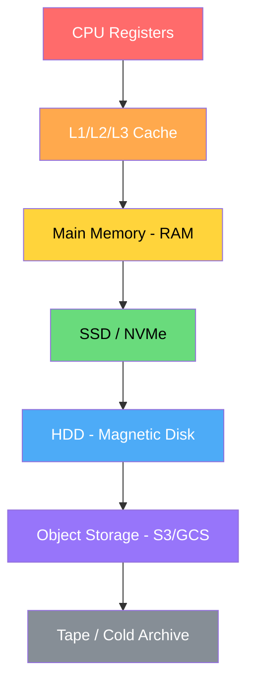
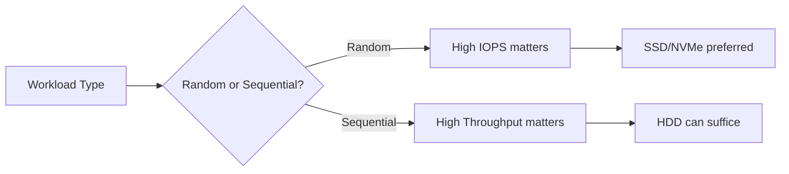
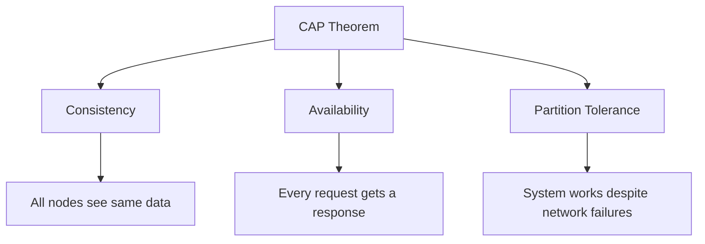
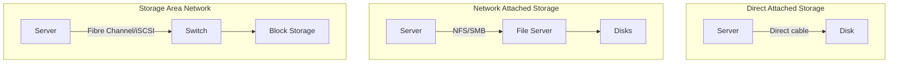

# Storage Systems Overview

## Introduction

Storage systems are fundamental to computer science and systems design. Understanding storage technologies, trade-offs, and architectures is critical for placement interviews, especially for roles in systems engineering, cloud infrastructure, and backend development.

## The Storage Hierarchy

| Layer | Latency | Capacity | Cost/GB | Persistence |
|-------|---------|----------|---------|-------------|
| Registers | <1 ns | Bytes | Extremely high | Volatile |
| L1 Cache | ~1 ns | 64 KB | Very high | Volatile |
| L2 Cache | ~4 ns | 256 KB–1 MB | High | Volatile |
| L3 Cache | ~10 ns | 8–64 MB | High | Volatile |
| RAM | ~100 ns | 16–512 GB | Moderate | Volatile |
| NVMe SSD | ~25 µs | 256 GB–8 TB | Low | Persistent |
| SATA SSD | ~100 µs | 256 GB–4 TB | Low | Persistent |
| HDD | ~5–10 ms | 1–20 TB | Very low | Persistent |
| Object Storage | ~50–200 ms | Petabytes | Lowest | Persistent |

## Key Concepts for Interviews

### 1. IOPS vs Throughput vs Latency

- **IOPS** (Input/Output Operations Per Second): How many read/write operations per second. Critical for transactional workloads (databases).
- **Throughput** (MB/s or GB/s): Data transfer rate. Critical for sequential workloads (video streaming, big data).
- **Latency**: Time for a single I/O operation. Critical for interactive applications.

### 2. Read/Write Patterns

- **Sequential**: Data accessed in order (log files, video). HDDs perform well.
- **Random**: Data accessed at arbitrary positions (databases, metadata). SSDs dominate.
- **Write-Once-Read-Many (WORM)**: Ideal for logs, compliance data.
- **Read-Heavy vs Write-Heavy**: Impacts wear leveling (SSD) and caching strategies.

### 3. Durability vs Availability

- **Durability**: Data won't be lost (measured in nines: 99.999999999% for S3).
- **Availability**: Data is accessible when needed (measured as uptime percentage).
- They are independent: You can have highly available but not durable storage (RAM cache), or highly durable but not always available (tape backup).

### 4. CAP Theorem in Storage

Distributed storage systems must choose between **CP** (consistent but may be unavailable) and **AP** (available but may return stale data).

### 5. RAID (Redundant Array of Independent Disks)

| RAID Level | Min Disks | Redundancy | Read Perf | Write Perf | Capacity |
|------------|-----------|------------|-----------|------------|----------|
| RAID 0 | 2 | None | N× | N× | N× disk |
| RAID 1 | 2 | Mirror | N× | 1× | 1× disk |
| RAID 5 | 3 | 1 parity | (N-1)× | Parity overhead | (N-1)× disk |
| RAID 6 | 4 | 2 parity | (N-2)× | Higher overhead | (N-2)× disk |
| RAID 10 | 4 | Mirror+Stripe | N× | N/2× | N/2× disk |

## Storage Architecture Patterns

### DAS vs NAS vs SAN

- **DAS**: Simplest. Direct connection. Limited scalability.
- **NAS**: File-level access over network. Good for shared file systems.
- **SAN**: Block-level access over dedicated network. High performance, complex.

## Interview Questions

1. **Q: When would you choose HDD over SSD?**
   A: For archival storage, sequential-heavy workloads (streaming), or when cost per TB is the primary concern. HDDs offer 3-5× lower cost per TB.

2. **Q: Explain the difference between block storage, file storage, and object storage.**
   A: Block storage provides raw disk blocks (like a virtual hard drive). File storage provides a hierarchical file system (NFS, SMB). Object storage provides a flat namespace with HTTP APIs and metadata (S3). Each suits different access patterns.

3. **Q: What is write amplification in SSDs?**
   A: Due to erase-before-write semantics, SSDs may need to write more data than requested. A 4 KB write might trigger a 256 KB erase+write cycle, reducing SSD lifespan and performance.

4. **Q: How does RAID 5 differ from RAID 6?**
   A: RAID 5 uses single distributed parity (tolerates 1 disk failure). RAID 6 uses double parity (tolerates 2 disk failures). RAID 6 has higher write overhead but better fault tolerance.

5. **Q: What is eventual consistency in distributed storage?**
   A: After a write, reads may return stale data temporarily, but eventually all replicas converge to the same value. Used by DynamoDB, Cassandra for high availability.

## Common Mistakes

- Confusing **throughput** with **IOPS** — a system can have high throughput but low IOPS (sequential HDD) or vice versa (random SSD).
- Ignoring **write amplification** in SSD-heavy systems.
- Assuming **RAID replaces backups** — RAID protects against disk failure, not accidental deletion, corruption, or disasters.
- Overlooking **tail latency** (P99) — averages hide worst-case behavior that affects user experience.
- Not considering **data locality** in distributed systems — moving computation to data is cheaper than moving data to computation.

## Summary

Storage systems span a wide spectrum from nanosecond-level registers to petabyte-scale object stores. The key is matching storage technology to workload characteristics: random vs sequential, read vs write, latency vs throughput, hot vs cold data. For interviews, understand the trade-offs between HDD/SSD/NVMe, the three storage types (block/file/object), RAID levels, and distributed storage consistency models.

## Cross-References

- [HDD Deep Dive](./hdd.md) — Magnetic disk internals
- [SSD Deep Dive](./ssd.md) — Flash memory and wear leveling
- [NVMe](./nvme.md) — Modern high-performance storage
- [Object Storage](./object-storage.md) — S3, GCS, and blob storage
- [Block Storage](./block-storage.md) — EBS, Cinder, raw volumes
- [File Storage](./file-storage.md) — NFS, HDFS, distributed file systems
- [Distributed Storage](./distributed.md) — Consensus and replication
- [Ceph](./ceph.md) — Unified distributed storage
- [Erasure Coding](./erasure-coding.md) — Space-efficient redundancy
