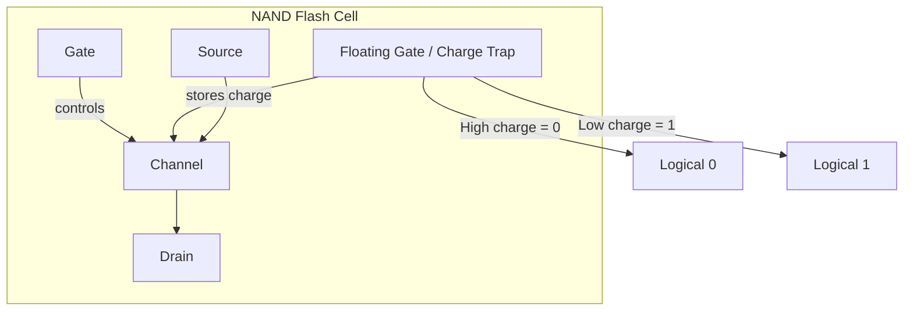
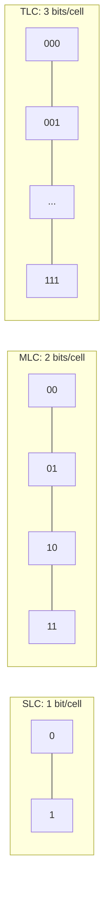
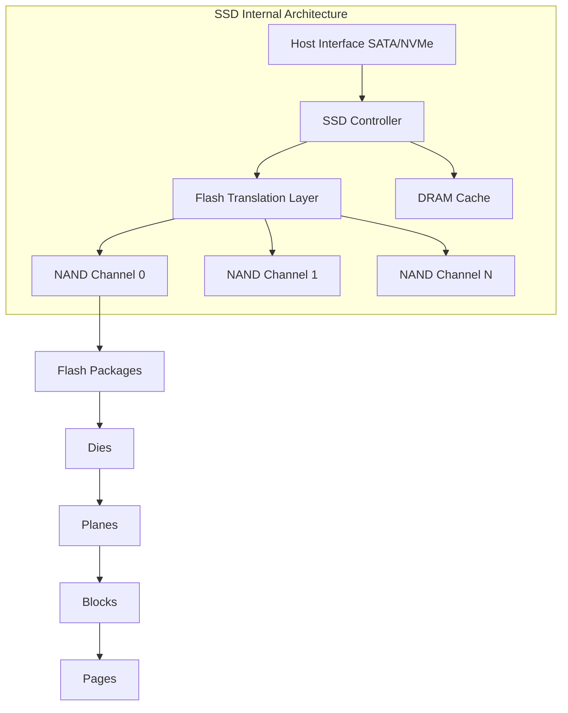
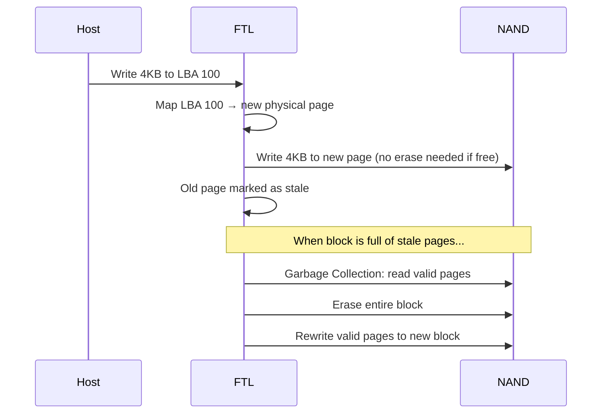
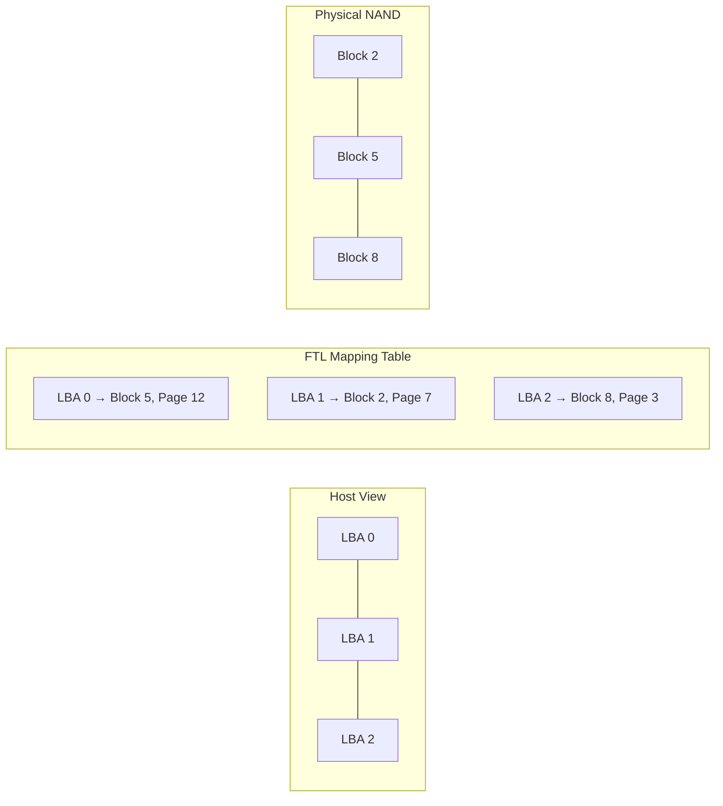
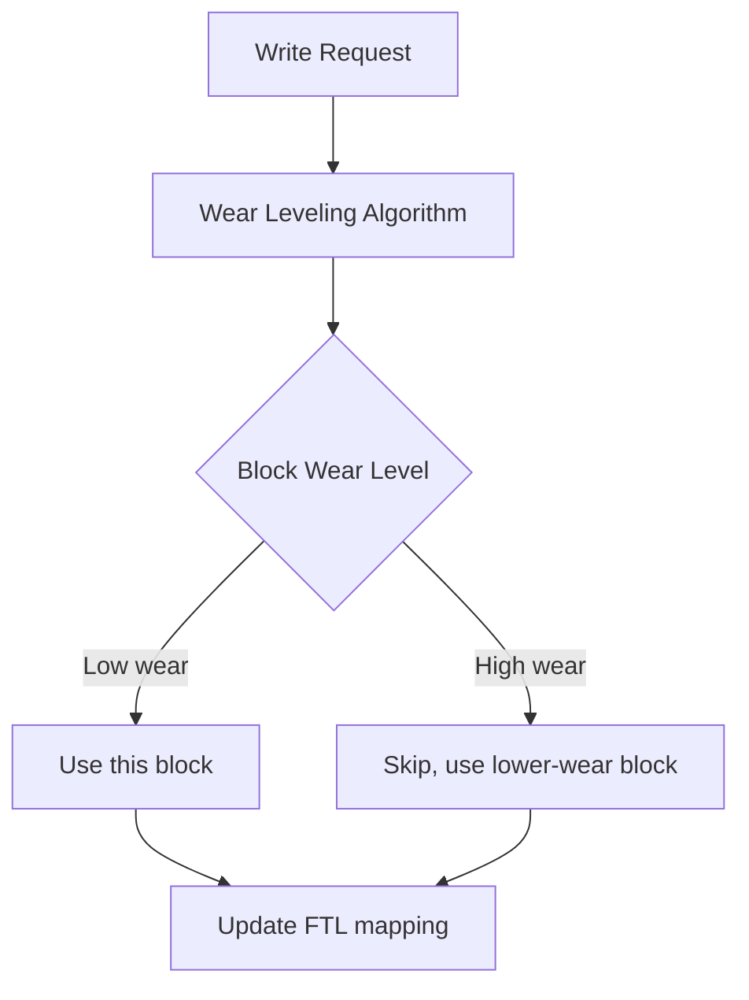
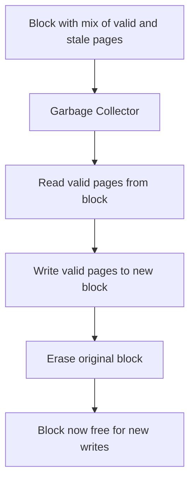
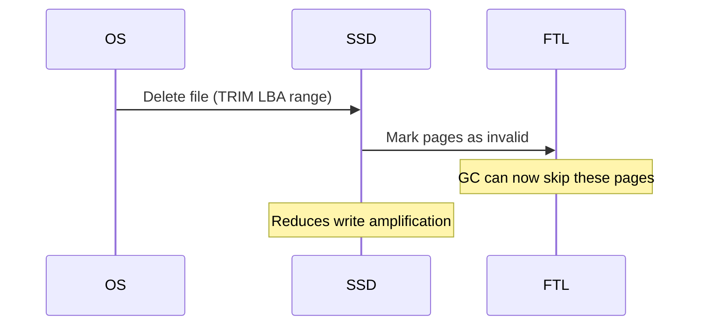
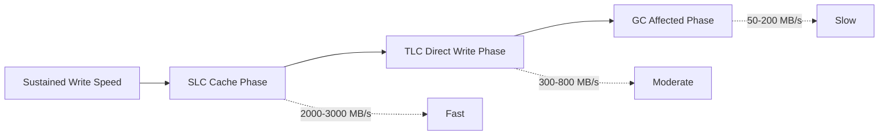
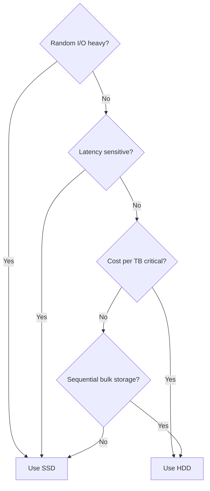

# Solid State Drives (SSD)

## Overview

Solid State Drives (SSDs) use NAND flash memory to store data persistently without moving parts. They revolutionized storage by eliminating mechanical latency, enabling random I/O operations that are 100-1000× faster than HDDs. Understanding SSD internals — NAND cells, FTL, wear leveling, and TRIM — is critical for systems design interviews.

## How SSDs Work

### NAND Flash Fundamentals

Data is stored as electrical charge in floating gate transistors. The amount of charge determines the bit value.

### NAND Cell Types

| Type | Bits/Cell | Endurance (P/E Cycles) | Cost | Speed | Use Case |
|------|-----------|------------------------|------|-------|----------|
| SLC (Single-Level) | 1 | 50,000–100,000 | Highest | Fastest | Enterprise, cache |
| MLC (Multi-Level) | 2 | 3,000–10,000 | High | Fast | Enterprise |
| TLC (Triple-Level) | 3 | 1,000–3,000 | Moderate | Moderate | Consumer |
| QLC (Quad-Level) | 4 | 500–1,000 | Lowest | Slowest | Read-heavy, archival |

More bits per cell = more capacity = slower writes = lower endurance (more charge levels to distinguish).

### SSD Architecture

**Hierarchy**: SSD → Channels → Packages → Dies → Planes → Blocks → Pages

- **Page**: Smallest read/write unit (4 KB, 8 KB, or 16 KB).
- **Block**: Smallest erase unit (256 KB–4 MB, containing 64–512 pages). You must erase an entire block before rewriting.
- **Plane**: Contains multiple blocks. Planes can operate in parallel.

### The Write Problem: Erase Before Write

This is **write amplification** — the SSD writes more data than the host requested.

## Flash Translation Layer (FTL)

The FTL is the SSD's "operating system." It translates logical block addresses (LBAs) from the host to physical NAND locations.

### Address Mapping

- **Page-level mapping**: One entry per page. Flexible but requires large mapping table (1 GB DRAM per 1 TB SSD).
- **Block-level mapping**: One entry per block. Smaller table but requires reading entire block for small writes.
- **Hybrid mapping**: Uses both. Hot data uses page-level, cold data uses block-level.

### Wear Leveling

NAND cells degrade with each Program/Erase (P/E) cycle. Wear leveling distributes writes evenly:

- **Dynamic wear leveling**: Only moves data between blocks with different wear levels.
- **Static wear leveling**: Also moves cold data from low-wear blocks to high-wear blocks, freeing low-wear blocks for writes.

### Garbage Collection (GC)

GC is triggered when free blocks are low. It causes:
- **Write amplification**: Extra reads and writes.
- **Performance degradation**: GC competes with host I/O.
- **Over-provisioning**: SSDs reserve 7-28% extra capacity for GC workspace.

### TRIM Command

Without TRIM, the SSD doesn't know which pages are no longer needed by the OS, leading to unnecessary garbage collection.

## SSD Performance Characteristics

### Latency Breakdown

| Operation | HDD | SATA SSD | NVMe SSD |
|-----------|-----|----------|----------|
| Random Read (4K) | 5-15 ms | 0.05-0.1 ms | 0.02-0.05 ms |
| Random Write (4K) | 5-15 ms | 0.02-0.1 ms | 0.01-0.03 ms |
| Sequential Read | 100-250 MB/s | 500-560 MB/s | 3,000-7,000 MB/s |
| Sequential Write | 100-250 MB/s | 400-530 MB/s | 2,000-5,000 MB/s |
| Random Read IOPS | 75-200 | 90,000-100,000 | 500,000-1,000,000 |

### Performance Degradation Factors

1. **Write Amplification**: GC causes extra writes. Typical ratio: 2-5×.
2. **GC Pauses**: Periodic stalls when GC runs. Can cause latency spikes.
3. **Full Drive**: Performance drops as free blocks decrease. Keep 10-20% free.
4. **Sustained Writes**: After SLC cache fills, TLC/QLC write speed drops dramatically.

## SSD vs HDD Decision Framework

## Interview Questions

1. **Q: Why can't you overwrite data in place on an SSD?**
   A: NAND flash requires erasing before writing, and erase operations work on entire blocks (256 KB–4 MB), not individual pages (4–16 KB). The FTL handles this by writing new data to a different page and updating the mapping, then erasing blocks during garbage collection.

2. **Q: What is write amplification and how do SSDs mitigate it?**
   A: Write amplification is the ratio of actual NAND writes to host writes. It occurs because GC must copy valid pages before erasing blocks. Mitigations include over-provisioning (extra free space), TRIM (OS tells SSD which pages are unused), and improved GC algorithms.

3. **Q: Explain the SSD performance cliff during sustained writes.**
   A: Consumer SSDs use a portion of NAND in SLC mode as a write cache. When this fills (typically 5-50 GB), writes go directly to TLC/QLC NAND, which is 3-10× slower. Some drives also trigger aggressive GC, further reducing speed.

4. **Q: Why does SSD performance degrade as the drive fills up?**
   A: Fewer free blocks mean GC must run more frequently and copy more valid data per erase cycle. This increases write amplification and GC pauses. Keeping 10-20% of the drive free maintains performance.

5. **Q: What is wear leveling and why is it necessary?**
   A: NAND cells have limited P/E cycles (500-100K depending on type). Without wear leveling, frequently written blocks would fail quickly while others remain fresh. Wear leveling distributes writes evenly across all blocks, maximizing drive lifespan.

## Common Mistakes

- Assuming SSDs never wear out — NAND has limited write endurance (TBW rating).
- Ignoring TRIM support — without it, SSDs can't efficiently reclaim deleted space.
- Not accounting for write amplification in capacity planning.
- Using consumer SSDs for write-heavy enterprise workloads.
- Assuming all SSDs have similar performance — controller, NAND type, and over-provisioning vary dramatically.

## Summary

SSDs store data in NAND flash cells using trapped charge. The FTL translates logical addresses to physical locations and handles wear leveling and garbage collection. Key trade-offs: more bits per cell = higher density but lower endurance and speed. Performance is affected by write amplification, GC, and drive fullness. For interviews, understand the erase-before-write constraint, the FTL's role, and why SSDs are 100-1000× faster than HDDs for random I/O.

## Cross-References

- [HDD](./hdd.md) — Mechanical alternative
- [NVMe](./nvme.md) — High-performance SSD interface
- [Erasure Coding](./erasure-coding.md) — Redundancy for SSD arrays
- [Storage Overview](./overview.md) — Storage hierarchy
- [Latency Numbers](../interview/system-design/latency-numbers.md)

