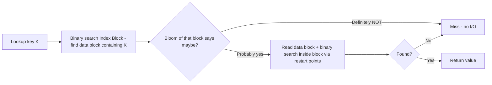
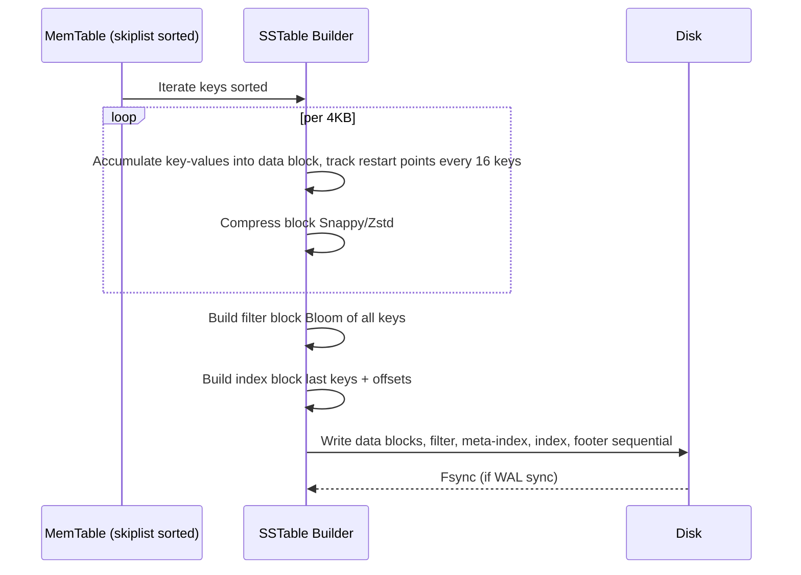

# SSTable — Sorted String Table Format

## Overview

**SSTable** is the immutable on-disk sorted file that is the building block of LSM trees (LevelDB, RocksDB, Cassandra, BigTable, ScyllaDB). Writes are buffered in MemTable (skiplist), flushed as sorted SSTable at L0, then compacted. Understanding SSTable layout explains read amplification, bloom filter effectiveness, compression, and why LSM is efficient for writes.

> Related: [LSM Trees](../dbms/internals/lsm-trees.md), [WAL](./wal.md), [LSM Compaction](./lsm-compaction.md), [Bloom Filters](../interview/system-design/probabilistic-data-structures.md), [Block Storage](./block-storage.md)

## Why Sorted & Immutable?

- **Sorted**: binary search within file + range scans efficient (no need to sort during read)
- **Immutable**: once flushed, never modified → no locks needed for readers, easy to cache, easy to delete whole file after compaction
- **Sequential write**: flush is sequential I/O, fast on SSD/HDD

## RocksDB BlockBasedTable Format (Production Standard)

RocksDB groups records into fixed-size **Data Blocks** (typically 4KB-32KB) rather than flat file — allows compression per block and reduces index size.

```
+-------------------+
|   Data Block 0    |  <-- 4KB, sorted keys, Snappy/Zstd compressed
+-------------------+
|   Data Block 1    |
+-------------------+
|       ...         |
+-------------------+
|   Data Block N    |
+-------------------+
|   Filter Block    |  (optional) Bloom per data block, queried before binary search
+-------------------+
|   Meta Index Block|  Points to filter block, stats
+-------------------+
|   Index Block     |  Last key in each data block + byte offset
+-------------------+
|   Footer          |  Fixed 48 bytes, magic + offsets of index & meta-index
+-------------------+
```

- **Data Blocks**: keys sorted, values (can be compressed). Within block, binary search via restart points (every 16 keys, store full key, others delta).
- **Index Block**: array of `last_key in data_block -> offset`. Binary search index to find which data block contains key, then binary search inside block. Reduces I/O: instead of scanning all data blocks, only one data block read.
- **Filter Block**: Bloom filter per data block (or per file). Before reading data block, query Bloom — if says definitely not present, skip I/O entirely. Dramatic for point lookups across many SSTs (e.g., 100 L0 files each checked → 100 blooms, only few I/Os).
- **Footer**: fixed size at end, contains offsets of Index and Meta-Index. Loading SST needs single seek to end, read footer, then read index.
- **Partitioned Index/Filter**: For large SST (256MB), index/filter blocks can be 0.5/5MB — too large to fit in cache. RocksDB partitions them into smaller blocks with top-level index, loading on demand via block cache. Reduces memory footprint.

LevelDB's format is similar but simpler: Data Blocks → Filter Block → Meta-Index → Index → Footer (same diagram as in LevelDB Explained article [selfboot.cn]).



## Building SSTable (Flush)



In code (simplified):

```go
builder := NewTableBuilder(file, options{blockSize: 4096, compression: Snappy})
for it := memtable.Iterator(); it.Valid(); it.Next(){
    builder.Add(it.Key(), it.Value())
}
builder.Finish() // writes index, filter, footer
```

## Read Path — How Bloom + Index Reduce Amplification

For point lookup `Get(key)`:

1. Check MemTable (contains freshest)
2. Check L0 files newest → oldest (all overlapping), each: Bloom → Index → Data Block
3. Check L1, L2... at most 1 file per level due to non-overlapping (leveled)

Worst-case with 100 SSTs: 100 blooms (RAM), maybe 5 index reads, 1 data block read if key exists. Without bloom, 100 data block reads → 100× I/O amplification. Hence bloom crucial.

For range scan `Scan(l,r)`:

- Open iterator per SST, merge via heap (k-way merge), respecting sequence numbers.

## Compression

- **Per-block compression**: Snappy (fast, low ratio), Zstd (balanced), LZ4, Gzip (high ratio slow)
- Individual key-values compress poorly (small), but 4KB block with similar keys compresses well.
- Dictionary compression: RocksDB can use prefix dictionary for better ratio.

## Levels, Partitioning, and Optimizations

- **File size**: target 64MB base, multiplier per level. Larger files fewer metadata but more expensive compaction.
- **Partitioned Index/Filter** (RocksDB wiki): index/filter partitioned into small blocks + top-level index. On demand load into block cache, top-level index stays in heap. For 256MB SST, index 0.5MB, filter 5MB → partitioning reduces cache pressure.
- **Checksum**: CRC32 per data block to detect corruption.
- **Footer magic**: `0xdb4775248b80fb57` to identify SSTable.

## Tuning

| Option | Default | Effect |
|--------|---------|--------|
| `block_size` | 4KB | Smaller → finer index, more index entries, better compression ratio trade-off, higher metadata |
| `bloom_bits_per_key` | 10 | 10 bits → 1% FP, 6 bits → 5% FP, 15 bits → 0.1% FP |
| `compression` | Snappy | Speed vs ratio |
| `index_type` | binary search | `kBinarySearch` vs `kHashSearch` vs `kTwoLevelIndexSearch` for partitioned |
| `partition_filters` | false | Enable partitioned filter for large files |
| `pin_l0_filter_and_index_blocks_in_cache` | true | Keep L0 index/filter in cache for read-heavy L0 |

## Interview Questions

**Q: Why sorted?**
Allows binary search, range scans, merge during compaction via k-way merge of sorted runs (like merge sort). Unsorted would require hash or full scan.

**Q: How does Bloom help?**
Before reading data block (I/O), check bloom in RAM. If bloom says definitely not present, skip I/O. With 100 SSTs, bloom prevents 95+ I/Os at 1% FP.

**Q: Index block vs data block?**
Index contains last key per data block + offset. Binary search index (few KB) to find one data block (4KB) to read. Without index, need to scan all data blocks.

**Q: Why footer at end?**
Fixed size at end allows loading SST by single seek to end to get offsets of index/meta. If at beginning, need to know file size to find it.

**Q: What is partitioned filter?**
For large SST, filter block large (5MB). Partitioned filter splits into small blocks (e.g., 4KB) plus top-level index. Only needed partitions loaded on demand into block cache, reducing memory usage.

## Cross-References

- [LSM Trees](../dbms/internals/lsm-trees.md) — overall LSM
- [WAL](./wal.md) — durability before SST flush
- [LSM Compaction](./lsm-compaction.md) — merges SSTs, removes tombstones
- [Block Storage](./block-storage.md) — underlying device
- [Bloom Filters](../interview/system-design/probabilistic-data-structures.md) — filter implementation
- [RocksDB Wiki — Partitioned Index Filters](https://github.com/facebook/rocksdb/wiki/Partitioned-Index-Filters) — index/filter partitioning

## References

- Building a Database Pt 4 SSTable: RocksDB Block-Based Table format — Data Blocks 4KB sorted + compressed, Index Block last key + offset, Filter Block Bloom per block, Footer fixed size magic + offsets [Adam Comer blog]
- LevelDB Explained — SSTable Build: Footer 48 bytes fixed, Meta-Index for extensibility, diagram Data Block → Filter → Meta-Index → Index → Footer [selfboot.cn]
- RocksDB Wiki — Partitioned Index Filters: how large are index/filter blocks (0.5/5MB for 256MB SST), partitioning + top-level index on demand load into block cache [RocksDB Wiki]
- RocksDB BlockBasedTable format docs
