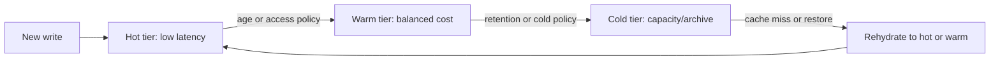

# Tiered Storage and Data Temperature

**Tiered storage** places data on media or services with different latency,
capacity, durability, and cost. A typical policy keeps hot data on NVMe or SSD,
warm data on lower-cost disks, and cold data on object or archive storage.

Tiering is not just moving files by age. A production policy must define access
signals, write/read amplification, recall latency, metadata placement, failure
handling, and the cost of moving data back to a fast tier.

## The lifecycle

A temperature label is a policy hint, not a guarantee that every future read
will be fast. Recent data is often hot, but skewed workloads can repeatedly
read old keys. Access-based movement requires measurement and can cost more
than it saves if data oscillates between tiers.

## Tier dimensions

| Dimension | Hot | Warm | Cold/archive |
|---|---|---|---|
| Latency | Lowest | Moderate | Highest or restore-dependent |
| Cost per capacity | Highest | Medium | Lowest |
| Update frequency | High | Low/moderate | Usually immutable or append-only |
| Media | NVMe/SSD | HDD/object standard | Object infrequent/archive |
| Metadata | Local and frequently indexed | Cached/indexed | Must remain discoverable |
| Failure recovery | Fast replica/failover | Longer rebuild | Restore and integrity checks |

Do not compare tiers only by dollars per GB. Include request charges, retrieval
fees, network egress, minimum retention, replication, encryption, compaction,
cache warming, and recovery time objectives.

## LSM and time-aware tiering

RocksDB can associate a temperature with SST files and use compaction to place
last-level data on a colder medium. Time-aware tiering is appropriate when recent
writes are more likely to be read. It is not a general oracle for popularity:

- A skewed key distribution can make old data hot.
- A major or universal compaction can move recent and old data together.
- Snapshots and sequence numbers affect which records can be safely separated.
- Changing the hot-data window can require data movement and conflict checks.
- A large cold tier can increase read amplification when queries miss the hot
  files or filters.

Measure hot/warm/cold read bytes and counts, compaction work, cache hit rate,
write amplification, space amplification, and p99 read latency.

## Object storage lifecycle

Object storage can implement policy transitions by prefix, tag, object age,
access pattern, or retention rule. This is useful for logs, backups, immutable
events, and historical datasets, but it changes access semantics:

- Archive objects may require an asynchronous restore before reading.
- Lifecycle transitions are not instantaneous transaction boundaries.
- Object versioning and delete markers can retain more data than expected.
- A metadata/index service must know the object's tier and restore state.
- Compliance retention can prevent deletion even when the application asks for
  cleanup.

A data catalog should expose state such as `HOT`, `WARM`, `COLD`, `RESTORING`,
`AVAILABLE`, and `EXPIRED` rather than making clients infer it from latency.

## Cache and index design

A tiered system usually keeps metadata hotter than payload data. A query path may
be:

1. Check the hot index/cache.
2. Check warm metadata or a lower-tier index.
3. Locate the object/block/SST in cold storage.
4. Fetch or restore the data.
5. Validate checksum, version, and authorization.
6. Place a bounded copy in a warm/hot cache with admission and eviction policy.

Avoid cache stampedes when many requests miss the same cold object. Use request
coalescing, bounded restores, backpressure, and negative caching for known
missing objects.

## Failure modes

- Tier metadata is stale after an out-of-band move.
- A cold restore is slow and exhausts request workers.
- Hot-tier eviction creates a read storm against object storage.
- Compaction moves data into a tier that lacks capacity.
- Retention deletes an index before its data or leaves orphaned payloads.
- A retry repeats a costly restore or transition.
- Encryption keys or credentials are unavailable during cold recovery.
- A cold tier is durable but not immediately available, violating an assumed
  latency SLO.

Treat tier transitions as observable jobs with idempotent state changes, not as
best-effort filesystem renames.

## Interview questions

**Why does hot/warm/cold improve cost?**

It reserves high-performance media for active data while moving less frequently
used data to cheaper capacity. The saving is only real when transition, retrieval,
metadata, and recovery costs fit the workload.

**Why is age-based tiering imperfect?**

Access popularity is not identical to insertion time. A rarely accessed recent
record may be cold, while an old hot key may be queried constantly.

**What does tiering do to tail latency?**

A cold miss introduces a second latency distribution—fetch or restore time.
SLOs should separate hot-hit, warm-hit, cold-hit, and restore paths rather than
hide them in one average.

**How does tiered storage interact with LSM compaction?**

Compaction rewrites SSTs and can move data between levels and media. Temperature
policy must account for sequence time, snapshots, tombstones, key conflicts,
compaction style, and the cost of rewriting cold data.

**How do you prevent a cold-tier outage from taking down the service?**

Bound restore concurrency, serve stale/cacheable data where acceptable, isolate
cold workers, apply circuit breakers, preserve metadata locally, and make the
availability trade-off explicit.

## Cross-references

- [Storage Overview](./overview.md)
- [NVMe over Fabrics](./nvmeof.md)
- [SSTable Format](./sstable.md)
- [LSM Compaction](./lsm-compaction.md)
- [BlobDB](./blobdb.md)
- [Object Storage](./object-storage.md)
- [Distributed Storage](./distributed.md)
- [Capacity Planning](../interview/system-design/hld/capacity-planning.md)

## References

- [RocksDB: Time-aware tiered storage](https://rocksdb.org/blog/2022/11/09/time-aware-tiered-storage.html)
- [RocksDB: Tiered Storage experimental documentation](https://github.com/facebook/rocksdb/wiki/Tiered-Storage-(Experimental))
- [AWS S3 storage classes](https://aws.amazon.com/s3/storage-classes/)
- [AWS S3 Lifecycle configuration](https://docs.aws.amazon.com/AmazonS3/latest/userguide/object-lifecycle-mgmt.html)
- [Azure Blob access tiers](https://learn.microsoft.com/en-us/azure/storage/blobs/access-tiers-overview)
- [Google Cloud Storage classes](https://cloud.google.com/storage/docs/storage-classes)
- [OpenTelemetry storage observability](https://opentelemetry.io/docs/)
