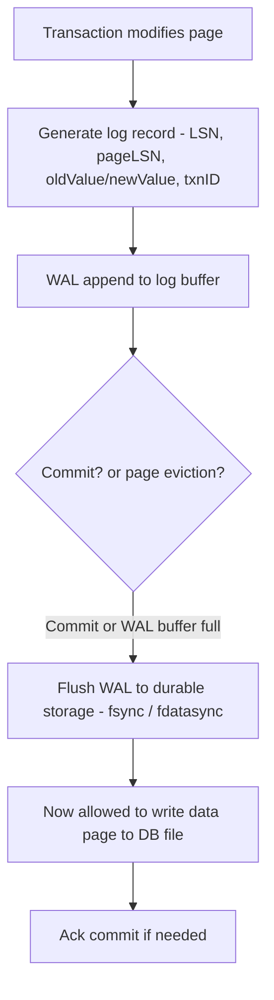
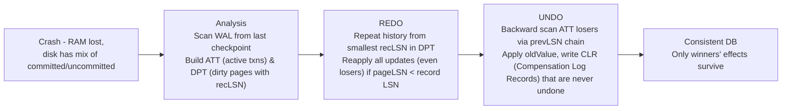
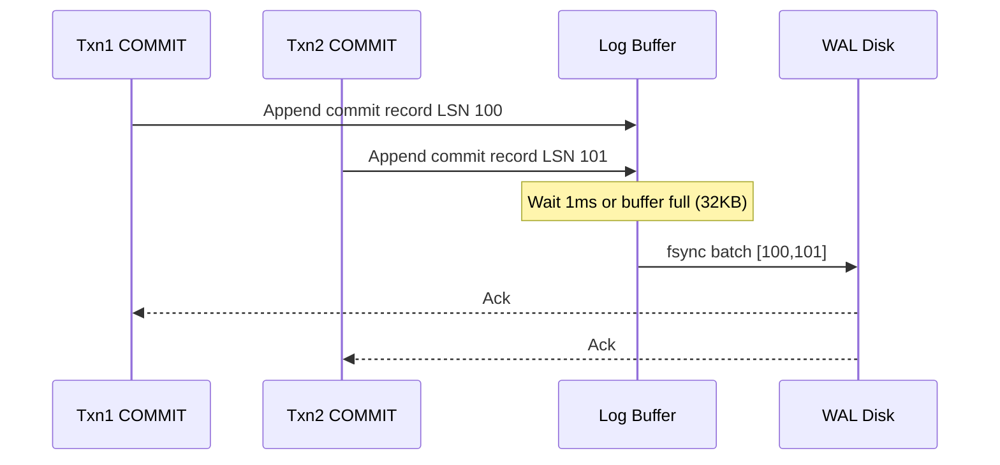

# Write-Ahead Log (WAL) — Foundation of Durability

## Overview

**WAL** is the single rule that makes crash recovery possible: **log record must reach durable storage before the data page it describes**. All major systems use it — PostgreSQL, MySQL InnoDB, RocksDB, Kafka, etcd Raft log, even SQLite WAL mode — because it turns random page writes into sequential log writes, guaranteeing atomicity and durability even with `STEAL + NO-FORCE` buffer management (unflushed dirty pages and unforced commit pages).

> For ARIES phases and checkpoints, see [ARIES](../dbms/transactions/aries.md) and [Log-based Recovery](../dbms/transactions/log-recovery.md). For LSM context, see [LSM Trees](../dbms/internals/lsm-trees.md) and [LSM Compaction](./lsm-compaction.md).

## The WAL Rule



**Invariants**:

- `pageLSN` in page header = LSN of last log record that modified this page. Used to skip REDO.
- LSN monotonically increasing, globally unique.
- If crash after WAL flush but before data page flush → REDO will replay.
- If crash before WAL flush → nothing durable, transaction abort, no UNDO needed for not-yet-logged changes (since page not written per rule).

| Policy | Meaning | WAL implication |
|--------|---------|-----------------|
| STEAL | Buffer pool can write uncommitted dirty page to disk (stolen) | Need UNDO (steal causes uncommitted data on disk) |
| NO-FORCE | Commit does not force all modified pages to disk | Need REDO (committed data may only be in log) |
| Most prod DBs | STEAL + NO-FORCE (flexible) | Need both UNDO + REDO → WAL + ARIES |

## Log Record Format

```
LSN: 8 bytes monotonic
prevLSN: previous record for same txn (for UNDO chaining)
txnID, type: UPDATE, INSERT, DELETE, COMMIT, ABORT, CLR, CHECKPOINT
pageID, offset, oldValue, newValue (physical or logical)
```

Physical vs logical vs physiological: physical = after images of bytes; logical = operation (e.g., `INSERT row`); physiological = physical within page but logical across pages (RocksDB uses). Trade-off: logical smaller but requires redo to re-traverse structure.

## ARIES — How WAL Enables Recovery

ARIES 1992 (IBM Almaden) is the textbook algorithm, 3 phases:



- **CLR**: log record for UNDO action itself, containing `undoNextLSN` to skip already undone work if crash during recovery (idempotent).
- **Idempotence via pageLSN**: REDO checks `if page.pageLSN >= log.LSN then skip` → safe to replay twice.

CMU 15-445 notes [cmu.edu] summarize: Analysis builds ATT + DPT, fuzzy checkpoint avoids stopping transactions, master record stores last checkpoint LSN.

## WAL vs Shadow Paging

| Aspect | WAL (ARIES) | Shadow Paging |
|--------|-------------|---------------|
| How commit | Append log + flush, async data pages | Write new pages + atomic pointer swap |
| Random writes | Sequential log fast (HDD/SSD) | Many random page writes |
| Concurrency | Good, in-place updates | Poor, copy-on-write fragments |
| Recovery time | REDO/UNDO scan from checkpoint | Instant (no log) but fragmented |
| Used in | Postgres, MySQL, RocksDB, SQLite WAL mode | SQLite default rollback, CouchDB |

WAL wins for high concurrency + SSD.

## Implementation Patterns

### Group Commit

Batch multiple commit WAL flushes into one `fsync` to amortize cost:



Postgres `commit_delay`, MySQL `innodb_flush_log_at_trx_commit=2` relaxes to 1s.

### WAL Segment Recycling

WAL files (16MB in Postgres, 1MB in RocksDB) rotated. Old segments needed for PITR (Point-In-Time Recovery) archived to S3, then recycled. Checkpoint truncates.

### Checkpoints — Bounding Recovery

- **Sharp checkpoint**: stop all, flush all dirty pages, write `BEGIN_CHECKPOINT` + `END_CHECKPOINT` with ATT/DPT. Long pause.
- **Fuzzy checkpoint** (ARIES): background flush, don't block txns, write checkpoint record with current ATT/DPT snapshot. Recovery scans from smallest recLSN in that checkpoint's DPT, not from beginning of time.

Postgres: `CHECKPOINT` writes, `bgwriter` flushes lazily. LSN for checkpoint stored in `pg_control` / master record.

## RocksDB / LSM-Specific WAL

RocksDB WAL is **logical** — key-level puts/deletes, not page images. After crash, replays into MemTable.

- `WAL_ttl_seconds`, `WAL_size_limit_MB` controls retention.
- `write()`: `WAL enabled?` → append to WAL + insert MemTable. If `sync=true` → fsync.
- `flush()` → SST file.

Kafka's log is essentially a WAL for event streaming — partitioned, replicated via ISR.

etcd Raft WAL: each Raft entry fsynced before ack to ensure linearizability.

## Pitfalls

- **WAL on same device as data**: if device fails, both lost. Separate devices: WAL on low-latency SSD, data on capacity.
- **fsync not durable on some FS**: `ext4` `data=ordered` safe, but Need `fsync` + directory fsync after rename. SQLite has white-paper on fsync failures.
- **WAL growing unbounded**: if checkpoint / archiving stalls, disk fills. Monitor `pg_wal` size, RocksDB `log files`.
- **Logical vs physical**: logical REDO requires structure to exist (e.g., B-Tree page split log needs tree navigation). Physiological balances.

## Interview Questions

**Q: Why WAL rule?**
If you wrote data page before log, crash loses log but data page has uncommitted change with no way to UNDO (since no oldValue). WAL ensures log on stable storage first, so UNDO possible.

**Q: What is LSN and pageLSN?**
LSN unique monotonic for each log record. pageLSN stored in page header = last LSN that modified it. During REDO, if `pageLSN >= log LSN`, skip because page already contains that update (idempotence).

**Q: ARIES 3 phases?**
Analysis (find ATT active txns, DPT dirty pages from last checkpoint), REDO (repeat history from smallest recLSN, reapply all), UNDO (rollback losers via prevLSN chain, writing CLRs that are never undone).

**Q: What is CLR and why never undone?**
Compensation Log Record written for each UNDO action. Contains `undoNextLSN` to avoid looping. If crash during UNDO, recovery will REDO the CLR (already applied) and skip its original.

**Q: Group commit?**
Batch multiple txns' WAL flush into single fsync to amortize IOPS. Improves throughput at cost of adding artificial delay (e.g., 1ms). Used in Postgres, MySQL.

## Cross-References

- [ARIES](../dbms/transactions/aries.md) — full 3 phases
- [Log Recovery](../dbms/transactions/log-recovery.md) — REDO/UNDO details
- [Checkpointing](../dbms/transactions/checkpointing.md) — sharp vs fuzzy
- [LSM Trees](../dbms/internals/lsm-trees.md) / [LSM Compaction](./lsm-compaction.md) — WAL in LSM, MemTable replay
- [WAL in Internals](../dbms/internals/wal.md) — duplicate page covering similar ground

## References

- CMU 15-445 Fall 2025 Lecture 22 Recovery — WAL, ARIES, fuzzy checkpoints, LSN, pageLSN [cmu.edu]
- CMU 15-445 Spring 2024 Lecture 21 Recovery — WAL Records, LSN chaining, checkpoint tables [cmu.edu]
- Perfect Notes — Database Crash Recovery: ARIES, WAL & Shadow Paging (2026) — REDO/UNDO, CLR, fuzzy checkpoints [Perfect Notes]
- Mohan et al. — ARIES: A Transaction Recovery Method Supporting Fine-Granularity Locking and Partial Rollbacks Using Write-Ahead Logging (IBM, 1992)
