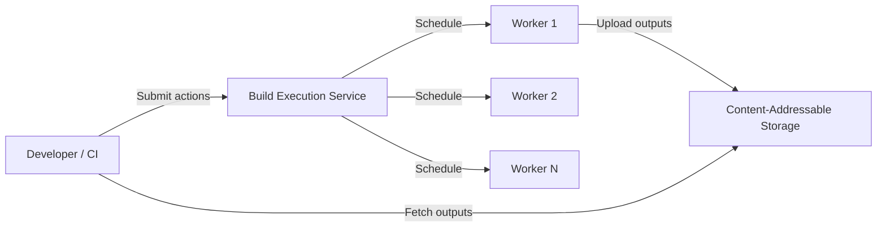

# Build Systems

## Overview

Build systems transform source code into executable artifacts. Modern build systems must handle massive monorepos, multi-language projects, distributed execution, and strict reproducibility requirements. This chapter covers the principles and tools of advanced build systems.

## Reproducible Builds

A build is **reproducible** if building the same source code always produces bit-for-bit identical output. This requires eliminating all sources of non-determinism:

### Sources of Non-Determinism

| Source | Example | Mitigation |
|--------|---------|------------|
| Timestamps | Embedded build timestamps | Use SOURCE_DATE_EPOCH (RFC 8781) or fixed timestamps |
| File ordering | Filesystem iteration order varies | Sort inputs deterministically |
| Randomness | Hash randomization, UUIDs | Seed RNG deterministically |
| Environment | PATH differences, locale | Hermetic builds with controlled environment |
| Parallelism | Non-deterministic output ordering | Use deterministic merge/ordering |
| Toolchain versions | Different compiler/ linker versions | Pin exact toolchain versions |

### Why Reproducibility Matters

- **Supply chain verification**: if a build is reproducible, anyone can independently verify that a binary matches its claimed source code
- **Debugging**: deterministic builds enable binary bisection—find the exact commit that introduced a change
- **Caching**: identical inputs must produce identical outputs for build caching to be correct
- **Compliance**: regulatory requirements (e.g., FDA, automotive) mandate verifiable builds

Google achieves reproducible builds for most of its software; the `reproducible-builds.org` project tracks adoption across the ecosystem.

## Hermetic Builds

A **hermetic build** is completely isolated from the host system—it cannot access files, environment variables, or network resources not explicitly declared as inputs. This is a stronger requirement than reproducibility.

### Benefits

- **Determinism by construction**: if the build cannot see the host, host-specific differences cannot affect the output
- **Correct caching**: hermeticity guarantees that declared inputs fully determine outputs
- **Security**: build steps cannot exfiltrate secrets or access unintended resources
- **Portability**: hermetic builds produce the same results on any machine

### Implementation Strategies

- **Containerized builds**: Docker/Podman containers with pinned OS, packages, and toolchain
- **Sandboxing**: Bazel's sandbox runs each action in an isolated filesystem namespace
- **Language-specific**: Go modules, Rust's `cargo vendor`, Node.js `pnpm --frozen-lockfile`

## Modern Build Systems

### Bazel

**Bazel** (originally Google's internal build system, Blaze) is designed for massive codebases with strict correctness guarantees:

```
Workspace (bazel_root/)
├── WORKSPACE.bazel     # External dependencies
├── BUILD.bazel        # Build targets (BUILD files in each directory)
├── .bazelrc           # Build configuration
├── src/
│   ├── BUILD.bazel
│   └── app.go
└── tools/
    └── BUILD.bazel
```

Key properties:

- **Correct by default**: hermetic sandbox, explicit dependency declaration, no implicit inputs
- **Incremental**: fine-grained invalidation—only rebuild targets whose inputs changed
- **Scalable**: handles 100K+ targets, multi-language (Starlark rules for C++, Java, Go, Python, Rust)
- **Remote execution**: delegate build actions to a remote cluster (buildfarm/Buildbarn/BES)
- **Remote caching**: share build cache across developers and CI (HTTP cache, gRPC remote cache)

Bazel's evaluation model: **loading → analysis → execution**. During analysis, Bazel constructs the build graph (DAG of targets) and computes the set of actions to execute. Execution runs actions in topological order, respecting declared dependencies.

### Buck2

**Buck2** (Meta's build system, successor to Buck) shares Bazel's philosophy with a different implementation:

- Written in Rust (Bazel is Java + Starlark) → faster evaluation, better concurrency
- **Dice** engine: concurrent evaluation with memoization and cancellation
- Starlark-compatible for rules, but can implement core rules in Rust for performance
- Designed for Meta's scale: thousands of developers, millions of build actions per day

### Pants

**Pants** (Pantsbuild) is a successor to Python's build system, now supporting Rust, Go, Java, Scala, and more:

- **Language-aware**: understands import/module systems; auto-discovers dependencies (no manual BUILD file maintenance for most targets)
- **No global WORKSPACE**: each directory is independently buildable (supports multiple repos, vendoring)
- **Fine-grained caching**: caches at the process level (not just the target level)

### Nix & Guix

**Nix** takes a fundamentally different approach—builds are **pure functions** from inputs to outputs:

```nix
# Nix expression: a build is a pure function
{ stdenv, fetchurl, openssl }:
stdenv.mkDerivation {
  name = "my-app";
  src = fetchurl { url = "https://example.com/app.tar.gz"; sha256 = "..."; };
  buildInputs = [ openssl ];
}
```

- **Pure evaluation**: builds run in an isolated environment with only declared inputs
- **Content-addressed store**: /nix/store/hash-inputs-output/ — identical inputs always produce the same store path
- **Atomic upgrades**: new versions are built before old versions are replaced; rollback is trivial
- **NixOS**: an entire Linux distribution built from Nix expressions—every system configuration is reproducible

**Guix** (GNU Guix) is the FSF's answer to Nix—similar concepts with a focus on free software and a Scheme-based DSL.

## Build Caching

### Local Caching

Each build action is identified by a **digest** of its inputs (source files, command, toolchain, flags). The digest is used as a cache key. If the digest matches a previous build, the output is reused.

```
Cache key = hash(
    action_command,
    input_file_digests,
    toolchain_digest,
    environment_digest,
    output_paths
)
```

Bazel's **action cache** is local by default; remote caching (gRPC) shares cache across machines.

### Remote Execution & Distributed Builds

Remote execution (RE) offloads build actions to a distributed build cluster:



- **Remote Build Execution (RBE)** API: gRPC protocol (googleapis.dev)
- **Buildbarn**: open-source RBE implementation in Go
- **Buildfarm**: Google's open-source RBE reference implementation
- Benefits: CI builds that take 30 minutes locally can complete in 2–5 minutes with 100+ workers

## Build Graphs & Dependency Analysis

Build systems construct a **directed acyclic graph (DAG)** of targets:

```
:app → :lib_core → :lib_utils
:app → :lib_network → :lib_core
:app → :lib_test → :lib_app

DAG structure enables:
- Topological ordering for execution order
- Parallelism: independent targets build concurrently
- Incremental builds: rebuild only targets reachable from changed inputs
```

### Critical Path

The **critical path** through the build graph determines minimum build time. Optimizing build speed means:

1. **Reduce the critical path**: break large targets into smaller, parallelizable ones
2. **Cache critical path actions**: ensure remote caching covers the longest chains
3. **Reduce action count**: merge actions, avoid redundant compilation

## Incremental Compilation

Incremental compilation recompiles only the code units affected by a change. Languages differ in their granularity:

| Language | Incremental Unit | Overhead |
|----------|-----------------|----------|
| C/C++ | Translation unit (.o file) | Low (recompile changed files + relink) |
| Java/Kotlin | Class file (dependency-aware) | Moderate (changed classes + dependents) |
| Rust | Crate (dependency-aware) | Low per crate, high per project (fewer, larger crates) |
| Go | Package | Low (fast compilation, but rebuilds transitive dependents) |
| TypeScript | File (project references) | High (type checking is whole-program) |

## Pinning & Lockfiles

**Pinning** records the exact versions of all dependencies, ensuring reproducible builds:

| Tool | Lockfile Format | Granularity |
|------|----------------|-------------|
| npm/pnpm/yarn | package-lock.json / pnpm-lock.yaml | Exact versions + integrity hashes |
| Cargo | Cargo.lock | Exact versions + checksums |
| Pip (with pip-tools) | requirements.txt (pinned hashes) | Exact versions + hashes |
| Go | go.sum | Module versions + content hashes |
| Nix | flake.lock | Content-addressed |

**Lockfile discipline**: commit lockfiles to version control; update them explicitly (not implicitly on every build). Use `--frozen-lockfile` flags in CI to reject unexpected changes.

## Interview Angle

> **"How does Bazel ensure build correctness?"**

Bazel requires explicit declaration of all inputs and outputs for every build action. Actions run in a sandboxed environment that prevents access to undeclared files or environment variables. The build graph (DAG) ensures correct ordering—no target can use another's output unless declared as a dependency. Combined with hermetic toolchains and content-addressed caching, this guarantees that the same source always produces the same artifact, regardless of the machine or environment.

> **"You're migrating a 10-year-old monorepo from Make to Bazel. What are the key challenges?"**

Migration challenges: (1) encoding implicit dependencies in Make into explicit BUILD file declarations, (2) handling generated code (protoc, codegen) with proper graph edges, (3) toolchain bootstrapping—build tools must themselves be built with Bazel, (4) gradual migration—Bazel can't build targets that depend on non-Bazel targets, so you need a hybrid strategy. Start with leaf targets (no downstream dependents) and migrate upward, maintaining a Make-to-Bazel compatibility layer during transition.

## Key References

- Bazel documentation (bazel.build)
- Buck2 repository (github.com/facebook/buck2)
- Nix manual (nixos.org/manual/nix/stable)
- "Reproducible Builds" project (reproducible-builds.org)
- Holthe, "Bazel: Scalable and Correct Builds" (GopherCon 2022)
