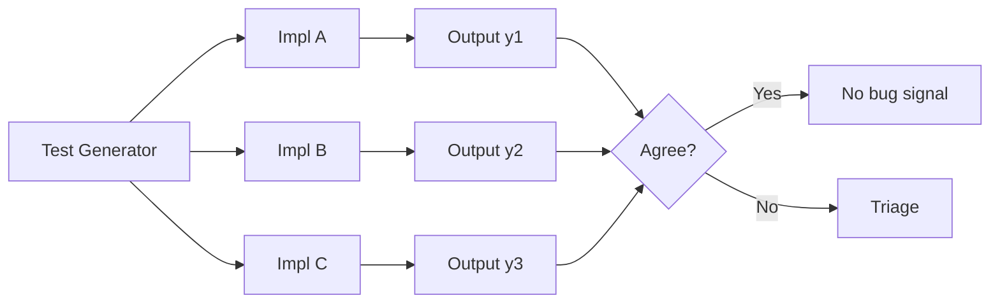
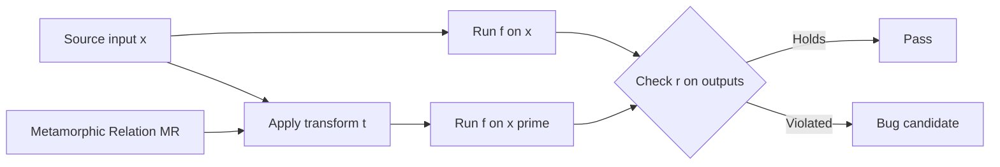

# Differential and Metamorphic Testing

## Overview

Two advanced testing techniques address the **oracle problem** — the difficulty of knowing the correct output for an arbitrary input. Both are widely used in domains where example-based tests are insufficient: compilers, database engines, numerical software, machine-learning pipelines, and large language models. Conventional unit tests require an engineer to predict the expected output for each input. When the input space is huge, when the computation is so complex that no human can compute the right answer by hand, or when the specification itself is informal, an explicit oracle is unavailable. These two techniques sidestep the problem in different but complementary ways.

**Differential testing** runs multiple implementations on the same inputs and flags disagreements. **Metamorphic testing** checks relations *between* outputs of related inputs — metamorphic relations (MRs) — rather than individual outputs. Neither technique needs a ground-truth oracle, which is the central reason they apply where conventional unit testing cannot. They are complementary: differential testing needs at least two implementations but little domain insight, while metamorphic testing needs only one implementation but requires the engineer to identify relations. This page covers definitions, workflows, use cases, generation strategies, the oracle problem, false positives, and how these techniques compare with property-based and mutation testing.

## Differential Testing

### Definition and Workflow

Differential testing, introduced by McKeeman (1998) in *Differential Testing for Software*, feeds the same inputs to multiple implementations of a specification and flags any input on which they disagree. Lerner et al. (2010) applied it to certified compilers in *Differential Testing for Certified Compilers*, and Yang et al. (2011) used CSmith to find hundreds of bugs in gcc, clang, and other C compilers in *Finding and Understanding Bugs in C Compilers*. Rigger and Su (2020) extended the technique to database engines with SQLancer.

Formally, given implementations \\( f_1, f_2, \ldots, f_n \\) and an input \\( x \\), differential testing computes \\( y_i = f_i(x) \\) for each implementation and signals a discrepancy when the \\( y_i \\) are not all equivalent modulo a defined tolerance. The implementations can be alternative libraries, compiler back-ends, database engines, or different versions of the same program. A disagreement is the bug signal — the engineer then triages which implementation is wrong, often by checking against a reference specification or a third implementation. The technique is most powerful when at least one implementation is widely trusted as a reference, but it works even without one, in which case triage requires deeper analysis.



### Use Cases

Differential testing shines when at least two independent implementations of the same specification exist. The classic domain is compilers: CSmith generated random, well-defined C programs, compiled them with gcc, clang, and other compilers, then compared the resulting binaries' behavior. Disagreements surfaced more than 300 previously unknown bugs across the tested compilers. SQLancer does the same for SQL databases — it generates random SQL queries, runs them against MySQL, PostgreSQL, and SQLite, and flags queries whose result sets diverge.

The technique extends naturally to other settings. Cryptographic libraries (OpenSSL, BoringSSL, LibreSSL) are tested against each other using known-answer test vectors and random inputs. JavaScript engines (V8, SpiderMonkey, JavaScriptCore) are tested by running the same fuzz-generated script and comparing exceptions and return values. For large language models, differential testing compares responses from model A and model B — or from two decoding configurations, or from a quantized model versus the full-precision original — to surface regressions, biases, or quantization artifacts. A subtle but powerful variant compares a *specification* against its *implementation*: a Coq, TLA+, or reference-interpreter model against production code, turning formal specification work into a runnable oracle.

| Domain | Implementations Compared | Notable Tool / Study |
|--------|--------------------------|----------------------|
| C compilers | gcc, clang, MSVC, ICC | CSmith (Yang et al. 2011) |
| Certified compilers | CompCert vs reference semantics | Lerner et al. 2010 |
| SQL databases | MySQL, PostgreSQL, SQLite | SQLancer (Rigger & Su 2020) |
| JavaScript engines | V8, SpiderMonkey, JavaScriptCore | Fuzzilli, jsfunfuzz |
| Cryptographic libraries | OpenSSL, BoringSSL, LibreSSL | Project Wycheproof |
| LLM inference | Model A vs Model B, or quantized vs full precision | OpenAI eval harness, lm-eval |
| Spec vs implementation | Formal spec output vs program output | Refinement testing |

### Test Generation Strategies and the Oracle Problem

The hard part of differential testing is generating inputs that are *valid* (all implementations accept them) and *diverse* (they exercise interesting behavior). Three strategies dominate. **Random generation** (McKeeman's original approach) samples from the input grammar; simple but inefficient because most random programs are rejected by the parser. **Grammar-based generation** (CSmith) uses a context-free grammar augmented with semantic predicates to generate only well-typed, well-formed, well-defined programs. **Coverage-guided fuzzing** (LibFuzzer, AFL, Fuzzilli) mutates seeds and keeps inputs that discover new code paths, combining grammar-aware structure with coverage feedback.

The **oracle problem** is solved *structurally* — by assuming that if implementations disagree, at least one is wrong. This is itself a metamorphic-style oracle: the relation "all implementations agree" is checked, not the absolute output. The assumption is reasonable when implementations are independently authored, but it weakens when implementations share code, share bugs (e.g., all derived from the same textbook algorithm), or follow the same ambiguous specification. Coverage guidance is essential: a generator that exercises only shallow paths will surface only shallow bugs.

### Strengths, Weaknesses, and False Positives

**Strengths.** No ground truth is required; the technique scales to large input spaces via random and coverage-guided generation; it surfaces bugs invisible to example-based tests; and it works on closed-source implementations whose internals are unknown. Differential testing also produces naturally minimized failure cases — the very input that triggered the disagreement is the reproducer.

**Weaknesses.** Differential testing finds *discrepancies*, not *correctness* — if all implementations share the same bug, the test passes silently. It requires at least two implementations, which may not exist for niche domains. Triage is expensive: each discrepancy must be investigated to determine which implementation is wrong, and triage often requires a domain expert.

**False positives** arise from implementation-defined, unspecified, or non-deterministic behavior. The C standard leaves many behaviors implementation-defined (signed integer overflow, struct padding, evaluation order of arguments). Two conforming compilers may legitimately produce different output, which differential testing would flag as a bug. Mitigations include restricting inputs to well-defined subsets of the language (CSmith generates only well-defined C), normalizing outputs (ignoring whitespace in SQL results, sorting result rows, deduplicating), seeding all RNGs identically across implementations, and treating time-dependent or network-dependent behavior as out of scope.

## Metamorphic Testing

### Definition and Workflow

Metamorphic testing, introduced by Chen, Cheung, and Yiu (1998) in *Metamorphic Testing: A New Approach for Generating Next Test Cases*, addresses the oracle problem by checking **metamorphic relations (MRs)** — expected relationships between the outputs of *multiple related* inputs, rather than the absolute output of a single input. Chen's 2018 survey *Metamorphic Testing: A Review of Challenges and Opportunities* systematized the field, and Segura et al. (2024) survey recent advances in *Metamorphic Testing 2.0*.

Given a source test case \\( x \\) with output \\( f(x) \\), an MR defines a transformation \\( t \\) producing a follow-up test case \\( x' = t(x) \\), and a relation \\( r \\) that must hold between \\( f(x) \\) and \\( f(x') \\). For example, for a square-root function, \\( f(x \cdot k) = f(x) \cdot \sqrt{k} \\) for \\( k > 0 \\). The engineer writes the MR once; the framework generates source inputs, applies the transformation, runs the program on both inputs, and checks the relation. A violation is a bug candidate. No single-output oracle is needed — only the relation.



### Metamorphic Relations

A metamorphic relation specifies (a) a transformation of the input and (b) the expected relation between the original and follow-up outputs. The engineer's job is to identify MRs that are *necessary* properties of a correct implementation — violations must indicate bugs. MRs need not be equalities; they can be inequalities, set-containment, ordering, or statistical properties (e.g., "classification confidence on a perturbed input is within \\( \varepsilon \\) of the original"). Identifying good MRs is the central creative challenge of metamorphic testing and requires domain insight. Strong MRs are tight (few programs satisfy them by accident) and cheap (the follow-up is easy to construct).

| Function | Metamorphic Relation | Rationale |
|----------|----------------------|-----------|
| `sqrt(x)` | `sqrt(x*k) == sqrt(x)*sqrt(k)` for `k > 0` | Multiplicativity |
| `sin(x)` | `sin(x) == -sin(-x)` | Odd function symmetry |
| `search(key, S)` | After `insert(S, k)`, `search(k, S') == true` | Insert-then-find |
| `sort(S)` | `sort(reverse(S)) == reverse(sort(S))` | Order commutes with reversal |
| `max(S)` | `max(S) == max(S ∪ {x})` when `x ≤ max(S)` | Adding a smaller element preserves max |
| `sum(S)` | `sum(S ++ S) == 2 * sum(S)` | Concatenation doubles the sum |
| `compress(file)` | `decompress(compress(file)) == file` | Round-trip preservation |
| `rank(query, docs)` | Adding an irrelevant doc does not change top-1 | Insensitivity to noise |
| `translate(text)` | Translating a sentence twice yields equivalent meaning | LLM consistency |

The richer the MR set, the more bugs metamorphic testing can surface. A typical numerical library might use five to ten MRs per function; an ML inference pipeline might use a dozen MRs covering invariance (input transformations that should not change output), monotonicity (transformations that should not decrease output), and equivalence (transformations that should change output in a predictable way).

### MR Categories

Segura et al. classify metamorphic relations into broad categories that help engineers systematically derive MRs rather than waiting for inspiration. The four most cited categories are:

| Category | Definition | Example |
|----------|------------|---------|
| **Invariance** | Output unchanged under input transformation | `sort` of reversed list has same multiset as input |
| **Monotonicity** | Output changes in a known direction | Increasing any element of S cannot decrease `max(S)` |
| **Equivalence** | Two different inputs produce equal outputs | `search(x, S) == search(x, sort(S))` |
| **Compositional** | Output relates to outputs of sub-computations | `sum(A ++ B) == sum(A) + sum(B)` |

Invariance MRs are the most common in practice because they are easy to state and check. Monotonicity MRs are powerful for ranking and scoring systems where direction matters more than exact value. Equivalence MRs expose implementation differences in data-structure variants. Compositional MRs are common in numerical code and distributed aggregations where associativity and commutativity are expected but not guaranteed under floating-point arithmetic. Engineers should combine categories — a single function often admits MRs in three or four categories, each catching different bug classes.

### Source-Follow-up Test Case Generation

The metamorphic testing workflow has two generation steps. **Source generation** produces the initial input \\( x \\). Any technique can be used: random sampling, property-based generation (Hypothesis, QuickCheck, fast-check), coverage-guided fuzzing, or even hand-picked seeds. **Follow-up generation** applies the MR's transformation \\( t \\) to produce \\( x' = t(x) \\). The follow-up is structurally derived from the source, so one source input yields one or more follow-up inputs.

The framework then runs the program on \\( x \\) and on \\( x' \\), collects outputs \\( y = f(x) \\) and \\( y' = f(x') \\), and checks the relation \\( r(y, y') \\). Implementation choices include: (a) **deterministic MRs** where \\( t \\) is fixed (e.g., negate the input); (b) **random MRs** where \\( t \\) is sampled from a family (e.g., multiply by a random \\( k > 0 \\)); and (c) **adaptive MRs** where the source output influences the follow-up (e.g., insert the source's own output into the next input). Adaptive MRs are especially powerful for stateful systems such as databases and search engines, where the next input depends on what the previous query returned.

### Use Cases

Metamorphic testing has been applied successfully to domains where the oracle problem is severe. **Numerical programs** (scientific computing, signal processing, computer graphics) use multiplicativity, symmetry, and conservation MRs. **Machine-learning models** use invariance MRs (rotating an image should not change the classifier's prediction) and monotonicity MRs (increasing a feature that the model considers positive should not decrease the score). **Search engines** use MRs like "adding an irrelevant document does not change the top result." **Database queries** use MRs like "adding a row that matches a predicate increases the count by exactly one" and "joining A with B yields the same row count as joining B with A."

**Large language models** are a fast-growing application. MRs include consistency under paraphrase (the answer to a question and its paraphrase should be equivalent), consistency under demonstration order (few-shot examples in different orders should yield compatible answers), and monotonicity under context expansion (adding relevant context should not reduce answer quality below a baseline). These MRs catch regressions introduced by quantization, fine-tuning, or sampling-temperature changes without requiring a human-graded gold answer for every prompt.

| Domain | Typical MR | Category |
|--------|-----------|----------|
| Numerical libraries | `sqrt(x*k) == sqrt(x)*sqrt(k)` | Compositional |
| ML classifiers | Prediction unchanged under image flip | Invariance |
| Search ranking | Adding irrelevant doc does not change top-1 | Invariance |
| Recommenders | Score is monotone in user-specified positive feature | Monotonicity |
| SQL `COUNT(*)` | Adding a matching row increases count by one | Compositional |
| LLM Q&A | Answer stable under prompt paraphrase | Equivalence |
| Compression | `decompress(compress(x)) == x` | Round-trip |
| Translation | Translating back and forth preserves meaning | Equivalence |

## Comparison with Related Techniques

Differential, metamorphic, property-based, and mutation testing all extend beyond example-based tests but solve different problems. Property-based testing requires properties that can be checked on a single input; differential testing requires multiple implementations; metamorphic testing requires MRs; mutation testing evaluates test-suite quality rather than the program itself. Understanding which problem you are solving is the first step in choosing a technique.

| Dimension | Differential | Metamorphic | Property-Based | Mutation |
|-----------|--------------|-------------|----------------|----------|
| What is checked | Impl vs impl | Output relation across inputs | Single-output property | Test-suite killing power |
| Requires oracle? | No (uses agreement) | No (uses MR) | Yes (per input) | N/A |
| Requires ≥2 implementations? | Yes | No | No | No |
| Requires domain insight? | Low | High | Medium | Low |
| Finds silent shared bugs? | No | Yes | Sometimes | No |
| Finds spec bugs? | No | Yes (if MR encodes spec) | Yes (if property does) | No |
| Typical tooling | CSmith, SQLancer | Custom, MetamorphicTest | Hypothesis, QuickCheck, fast-check | Stryker, PIT, mutmut |

A combined strategy is often best. Property-based testing provides the source-input generator for metamorphic testing. Differential testing complements metamorphic testing when multiple implementations exist — disagreements found by differential testing can suggest new MRs, and MR violations can be cross-checked against another implementation to confirm the bug. Mutation testing quantifies how well any of the above catches injected faults, giving the team a coverage-like metric for test-suite quality.

### Use Cases per Technique

Each technique has a sweet spot and a failure mode. Differential testing is unmatched when independent implementations exist but is silent when only one is available or when implementations share code (and thus share bugs). Metamorphic testing works with a single implementation but depends on the engineer's ability to identify strong MRs — weak MRs that hold for almost any program provide no signal. Property-based testing is the workhorse when single-input properties exist, but it cannot directly check multi-input relations. Mutation testing does not find program bugs at all; it measures test-suite quality by injecting faults and counting kills.

| Technique | Best When… | Avoid When… |
|-----------|-----------|-------------|
| Differential | Multiple independent implementations exist; spec is ambiguous but behavior should converge | Only one implementation exists; implementations share lineage or code |
| Metamorphic | Single implementation; domain has exploitable relations (numerical, ranking, retrieval) | Relations are weak (hold for almost any program) or expensive to construct |
| Property-based | Properties are checkable on single inputs; input space is structured | Properties require multi-input relations (use metamorphic instead) |
| Mutation | You want to measure test-suite quality, not find new bugs | Time budget is tight (mutation testing is slow) |

In practice, mature projects combine techniques. A numerical library might use Hypothesis (property-based) to generate inputs, metamorphic relations to check multiplicativity, differential testing against a reference BLAS implementation, and mutation testing to verify the test suite catches seeded arithmetic errors. The cost of adding each technique is amortized: a property-based generator built for one technique serves all four.

## Worked Examples

The following snippets illustrate the two techniques end-to-end. They are deliberately short — production setups add coverage guidance, parallelism, and triage automation — but they capture the essence of each approach.

### Differential: PostgreSQL vs SQLite on random SQL

SQLancer popularized this approach: generate random tables and queries, run them on multiple engines, and compare result sets. A discrepancy is a bug candidate; triage reveals which engine is wrong, or whether the query relies on implementation-defined behavior such as NULL ordering.

```python
import random, subprocess

def run_query(engine, sql):
    cmd = ["psql", "-At", "-c", sql] if engine == "pg" else ["sqlite3", ":memory:", sql]
    return subprocess.run(cmd, capture_output=True, text=True).stdout.strip()

for trial in range(1000):
    cols = random.sample(["a", "b", "c", "d"], k=2)
    rows = ", ".join(f"({random.randint(-100,100)},{random.randint(-100,100)})" for _ in range(10))
    create = f"CREATE TABLE t({cols[0]} INT, {cols[1]} INT); INSERT INTO t VALUES {rows};"
    query = f"SELECT {cols[0]}, SUM({cols[1]}) FROM t GROUP BY {cols[0]} ORDER BY 1, 2"
    if run_query("pg", create + query) != run_query("lite", create + query):
        print(f"Discrepancy at trial {trial}")
```

### Metamorphic: square root multiplicativity

A classic MR for `sqrt`: `sqrt(x*k) == sqrt(x) * sqrt(k)` for positive `x` and `k`. The test never computes the "correct" value of `sqrt`; it only checks the relation. Floating-point imprecision forces a tolerance rather than exact equality — a common practical consideration when applying metamorphic testing to numerical code.

```python
import math, random

def check_sqrt_mr(x, k):
    lhs = math.sqrt(x * k)
    rhs = math.sqrt(x) * math.sqrt(k)
    return abs(lhs - rhs) < 1e-9  # tolerance for float imprecision

for _ in range(10000):
    assert check_sqrt_mr(random.uniform(0, 1e6), random.uniform(0, 1e6))
```

### Metamorphic: adaptive MR for a search index

Adaptive MRs derive the follow-up input from the source output. For a search index, an invariance MR is "after inserting a document `d`, searching for `d`'s exact content must return `d`." The follow-up (the insert) depends on what the source search returned, making the MR adaptive rather than fixed.

```python
import random

def check_search_mr(index, doc_text):
    # Source: search for a random substring of doc_text.
    needle = doc_text[: random.randint(1, len(doc_text))]
    before = index.search(needle)
    # Follow-up: insert the doc, then search again.
    index.insert(doc_text)
    after = index.search(needle)
    # MR: doc_text must appear in `after` and `before` must be a subset.
    assert doc_text in after, "inserted doc not retrievable"
    assert set(before).issubset(set(after)), "insert corrupted prior results"
```

This pattern catches off-by-one indexing bugs, tokenization regressions, and concurrency hazards that simpler fixed-input MRs miss because the follow-up is constructed from real program output.

## When to Use

Choose the technique by asking two questions: *Do I have an oracle?* and *How many implementations do I have?* If you have a per-input oracle, conventional unit or property-based testing is simpler and cheaper. If you lack one but have at least two independent implementations, differential testing is the natural fit. If you lack both an oracle and a second implementation but can articulate necessary relations between outputs, metamorphic testing is the right choice. In practice, metamorphic testing is the most broadly applicable because the second-implementation assumption is restrictive; almost every domain admits at least one non-trivial MR.

| Situation | Recommended Technique |
|-----------|----------------------|
| Per-input oracle available | Property-based or example-based testing |
| Multiple independent implementations | Differential testing |
| Single implementation, domain has exploitable relations | Metamorphic testing |
| Need to measure test-suite quality | Mutation testing |
| LLM regression testing, no gold labels | Metamorphic + differential across model versions |
| Numerical library with shared reference (BLAS) | Differential + metamorphic |

The four techniques are not mutually exclusive. A mature test suite typically layers them: property-based for breadth, metamorphic for oracle-free depth, differential when a reference exists, and mutation to measure how well the first three catch injected faults. The cost of each technique is amortized by reusing generators across them — a single Hypothesis strategy can drive property checks, source inputs for MRs, and seeds for differential runs.

## Pitfalls and Best Practices

**Differential.** Restrict inputs to the well-defined subset of the spec (CSmith generates only well-defined C). Normalize outputs before comparing (sort result rows, ignore whitespace, deduplicate). Seed all RNGs identically across implementations. Treat non-determinism (time, network, threads) as out of scope or pin it. Expect a high false-positive rate from implementation-defined behavior — invest in triage tooling early, because a flood of false positives will cause engineers to ignore real bugs.

**Metamorphic.** Prefer strong MRs that hold for few programs by accident. Use tolerances for floating-point. Combine multiple MR categories (invariance, monotonicity, equivalence, compositional). Beware of MRs that hold trivially (e.g., "the output of `sort` has the same length as the input" — true for almost any function, hence useless as a bug signal). Verify MRs against a reference implementation or a known-correct sample before trusting them as oracles.

**Both.** Use coverage guidance to direct generation toward uncovered code. Invest in minimization (shrinking) so that failure cases are debuggable. Treat each discrepancy or MR violation as a bug candidate, not a confirmed bug — triage is essential. Run these techniques in CI on every change, not just pre-release, so regressions are caught at the commit that introduced them.

## Tools and Integration

Production deployments of these techniques rarely start from scratch — they build on existing generators, harnesses, and triage tooling. The table below maps each technique to representative tools and to the integration points where they typically plug into a CI pipeline. Most tools emit a failing test case on a bug candidate; engineers then minimize the case (or let the framework shrink it) before filing a bug.

| Technique | Representative Tools | Language / Domain | CI Integration |
|-----------|---------------------|--------------------|----------------|
| Differential (compilers) | CSmith, creduce | C / C++ | Nightly job, file bugs against gcc/clang |
| Differential (databases) | SQLancer, SolSQL | SQL | Per-PR job on a representative subset |
| Differential (crypto) | Project Wycheproof, dudect | Crypto libraries | Unit-test suite |
| Differential (JS) | Fuzzilli, jsfunfuzz | JavaScript engines | Nightly cluster job |
| Metamorphic (numerical) | Hypothesis + custom MRs | Python, Haskell | pytest plugin, per-PR |
| Metamorphic (ML) | checklist, RobustnessGym, custom | Python (PyTorch, TF) | Per-PR + nightly |
| Metamorphic (LLM) | lm-eval-harness + custom MRs | Python | Per-model-release |

Two practical integration patterns dominate. The **per-PR pattern** runs a short, coverage-guided version of differential or metamorphic testing on every pull request, gating merges on the absence of new discrepancies. The **nightly pattern** runs a longer, more exhaustive campaign off the critical path and files bugs into the team's tracker. Per-PR catches regressions at the source; nightly catches latent bugs introduced before the harness existed. Both patterns benefit from storing failing inputs as artifacts so that triage can reproduce and minimize them later.

## Interview Questions

**Q1: What is the oracle problem, and how do differential and metamorphic testing address it?**
A: The oracle problem is the difficulty of determining the expected output for an arbitrary input. Differential testing sidesteps it by comparing multiple implementations — disagreement, not absolute correctness, is the signal. Metamorphic testing sidesteps it by checking relations between outputs of related inputs rather than individual outputs. Neither needs a ground-truth oracle.

**Q2: When does differential testing produce false positives?**
A: When the spec leaves behavior implementation-defined, unspecified, or non-deterministic. Two conforming compilers may produce different outputs for the same C program (signed overflow, argument evaluation order, struct padding). Mitigations: restrict inputs to well-defined subsets, normalize outputs, seed RNGs identically across implementations, and exclude time/network/thread-dependent behavior.

**Q3: Why can't differential testing find a bug shared by all implementations?**
A: The technique flags *disagreements*. If all implementations share the same bug — common when they share lineage, code, or a common textbook algorithm — they agree on the wrong answer and the test passes silently. This is a fundamental limitation; metamorphic testing against an MR derived from the spec is the complementary technique that can catch such shared bugs.

**Q4: Give two metamorphic relations for a sorting function.**
A: (1) `sort(reverse(S)) == reverse(sort(S))` — reversing the input and then sorting, then reversing the result, equals sorting the original. (2) `multiset(sort(S)) == multiset(S)` — sorting preserves the multiset of elements. A third: `sort(S) == sort(sort(S))` (idempotency), which catches implementations that corrupt output on re-sorting.

**Q5: How does metamorphic testing differ from property-based testing?**
A: Property-based testing checks a property of a single input-output pair (e.g., "the output is sorted"). Metamorphic testing checks a relation between outputs of *multiple related* inputs (e.g., "sorting the reversed input yields the reverse of sorting the original"). Property-based testing needs an oracle for each input; metamorphic testing only needs a relation. In practice, property-based frameworks (Hypothesis, QuickCheck) often generate the source inputs for metamorphic testing.

**Q6: What are the four main categories of metamorphic relations?**
A: Invariance (output unchanged under input transformation), monotonicity (output changes in a known direction), equivalence (two different inputs produce equal outputs), and compositional (output relates to outputs of sub-computations). Engineers should combine categories — a single function often admits MRs in three or four categories, each catching different bug classes.

**Q7: How would you apply metamorphic testing to a large language model?**
A: Use invariance MRs (paraphrasing a question should not change answer correctness), monotonicity MRs (adding relevant context should not decrease answer quality below a baseline), and equivalence MRs (few-shot examples in different orders should yield compatible answers). These catch regressions from quantization, fine-tuning, or temperature changes without requiring human-graded gold answers for every prompt.

**Q8: Compare differential, metamorphic, property-based, and mutation testing on what they require and what they find.**
A: Differential requires ≥2 implementations and finds disagreements. Metamorphic requires MRs and finds relation violations. Property-based requires per-input properties and finds property violations. Mutation requires a test suite and finds *test-suite gaps* (not program bugs). The first three find program bugs; mutation measures test-suite quality. They compose: property-based generators feed metamorphic checks, differential suggests new MRs, and mutation quantifies how well any of them catches injected faults.

## References

- McKeeman, W. M. (1998). *Differential Testing for Software*. Digital Equipment Corporation.
- Lerner, S. et al. (2010). *Differential Testing for Certified Compilers*. PLDI.
- Yang, X., Chen, Y., Eide, E., Regehr, J. (2011). *Finding and Understanding Bugs in C Compilers*. PLDI. (CSmith)
- Rigger, M., Su, Z. (2020). *Testing Database Engines via Pivoted Query Synthesis*. OSDI. (SQLancer)
- Chen, T. Y., Cheung, S. C., Yiu, S. M. (1998). *Metamorphic Testing: A New Approach for Generating Next Test Cases*. HKUST.
- Chen, T. Y. (2018). *Metamorphic Testing: A Review of Challenges and Opportunities*. ACM Computing Surveys.
- Segura, S. et al. (2024). *Metamorphic Testing 2.0*. Journal of Systems and Software.
- See also: [Property-Based Testing](./property-based-testing.md), [Mutation Testing](./mutation-testing.md), [Fuzzing](./fuzzing.md), [Formal Methods](../cs-theory/formal-methods.md)
