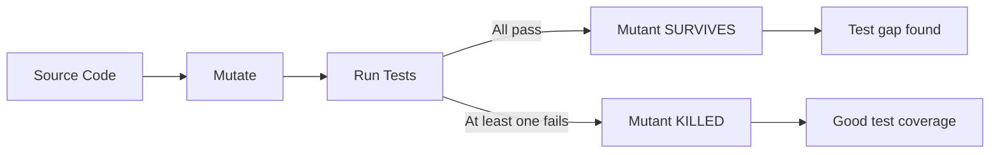

# Mutation Testing

## Overview

Mutation testing evaluates test suite quality by introducing small changes (**mutants**) into the source code and checking whether the tests detect them. If a test suite fails to detect a mutation, the mutant **survives** — indicating a gap in test coverage.

## How It Works



## Common Mutation Operators

| Operator | Example Mutation | What It Tests |
----------|----------------|---------------|
| Arithmetic | `a + b` → `a - b` | Math logic tested? |
| Relational | `a > b` → `a >= b` | Boundary conditions? |
| Conditional | `if (x)` → `if (!x)` | Both branches covered? |
| Return value | `return x` → `return 0` | Return value checked? |
| Statement | Delete a line | Dead code detected? |

## Mutation Score

``nMutation Score = (killed mutants / total mutants) × 100%
```

| Score Range | Interpretation |
-------------|----------------|
| 80–100% | Excellent test suite |
| 60–80% | Good, some gaps |
| < 60% | Significant test gaps |

## Tools and Integration

| Language | Tool | CI Integration |
----------|------|---------------|
| JavaScript | Stryker Mutator | GitHub Actions, Jenkins |
| Python | MutPy, mutmut | pytest plugin |
| Java | PIT, Javalanche | Maven/Gradle plugin |
| Go | go-mutesting | GitHub Actions |

```bash
# Stryker with Jest
npx stryker run

# mutmut with pytest
mutmut run
mutmut show  # show surviving mutants
```

## Practical Considerations

- **Equivalent mutants**: Changes that don't alter behavior (e.g., `x + 0`) inflate the denominator. Exclude known equivalents.
- **Performance**: Full mutation testing is slow. Use incremental mutation (only test changed code) in CI.
- **Combining with coverage**: Line coverage catches *untested code*; mutation testing catches *ineffective tests*.

## Interview Questions

**Q: How does mutation testing differ from code coverage?**
A: Code coverage measures whether code was *executed*. Mutation testing measures whether the test suite would *notice* if the code was wrong. A test can achieve 100% line coverage but 0% mutation score (all mutants survive).

**Q: What's an equivalent mutant and why is it a problem?**
A: A mutant that produces behaviorally identical code (e.g., `x + 1 - 1` → `x + 1`). It can never be killed, so it artificially lowers the mutation score. Tools should detect and exclude common equivalents.

## References

- [Stryker Mutator](https://stryker-mutator.io/)
- [Mutation Testing — Wikipedia](https://en.wikipedia.org/wiki/Mutation_testing)
- See also: [Unit Testing](./unit-testing.md), [TDD & BDD](./tdd-bdd.md), [Test Strategy](./test-strategy.md), [Mocking](./mocking.md)
