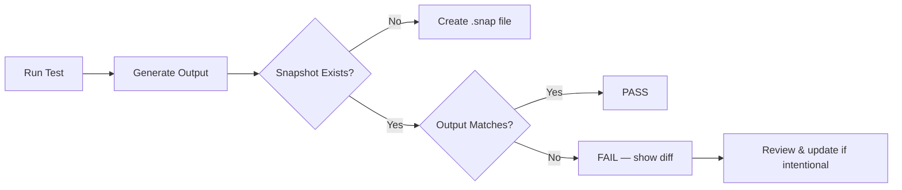

# Snapshot Testing

## Overview

Snapshot testing captures the output of a component or function and compares it against a stored reference (the snapshot). On subsequent runs, any difference is flagged as a failure. It's most commonly associated with Jest and React component testing.

## How It Works



## Jest Snapshots

```javascript
// Component
function UserProfile({ name, role }) {
  return `<div class="profile"><h1>${name}</h1><span>${role}</span></div>`;
}

// Test
const { UserProfile } = require('./UserProfile');

test('renders user profile', () => {
  expect(UserProfile({ name: 'Alice', role: 'Admin' })).toMatchSnapshot();
});
```

First run creates `__snapshots__/UserProfile.test.js.snap`:

```
exports[`renders user profile 1`] = `
"<div class=\"profile\"><h1>Alice</h1><span>Admin</span></div>"
`;
```

## Inline Snapshots

```javascript
test('formats address', () => {
  const formatted = formatAddress({ city: 'NYC', zip: '10001' });
  // Jest writes the expected value directly into the source on first run
  expect(formatted).toMatchInlineSnapshot(`"NYC, 10001"`);
});
```

Inline snapshots keep the expected value in the test file itself, making diffs visible during code review.

## When to Use

| Good Fit | Poor Fit |
|----------|----------|
| UI component render output | Non-deterministic output (timestamps, IDs) |
| API response shapes | Frequently changing output |
| Configuration serialization | Large, noisy snapshots (>50 lines) |
| Error messages | Data with floating-point precision |

## Pitfalls

- **Snapshot approval rot**: Teams blindly run `--updateSnapshot` without reviewing diffs.
- **Brittle tests**: One small UI change breaks dozens of snapshots.
- **False confidence**: Snapshots verify *exact* output, not *correct* behavior.

**Mitigation**: Keep snapshots small. Review every diff in code review. Combine with explicit assertions for critical behavior.

## Interview Questions

**Q: What's the difference between inline and external snapshots?**
A: External snapshots are stored in separate `.snap` files. Inline snapshots are written directly into the test source. Inline snapshots are preferred for small values because they're visible during code review.

**Q: When are snapshot tests inappropriate?**
A: When output is non-deterministic (timestamps, random IDs), when the output changes frequently, or when the snapshot is so large that reviewers can't meaningfully inspect it. In these cases, explicit assertions on specific fields are better.

## References

- [Jest Snapshot Testing](https://jestjs.io/docs/snapshot-testing)
- [Percy — Visual Snapshot Testing](https://percy.io/)
- See also: [Unit Testing](./unit-testing.md), [E2E Testing](./e2e-testing.md), [Test Strategy](./test-strategy.md)
