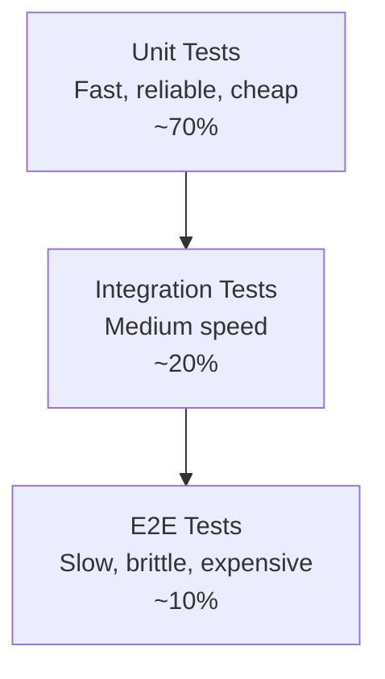

# Test Pyramids

## The Classic Test Pyramid

Mike Cohn's test pyramid prescribes many unit tests at the base, fewer integration tests in the middle, and even fewer end-to-end tests at the top.



| Level | Count | Speed | Isolation | Confidence per test |
|-------|-------|-------|-----------|-------------------|
| Unit | Many | Milliseconds | Full (mocked deps) | Low |
| Integration | Moderate | Seconds | Partial (real DB, mocks for HTTP) | Medium |
| E2E | Few | Minutes | None (full stack) | High |

## Testing Trophy (Kent C. Dodds)

In frontend-heavy applications, Dodds advocates a **trophy** shape with a thick static/integration layer:

```
      /\       Static: TypeScript, ESLint (compile-time)
     /  \      
    / E2E \    Integration: React Testing Library (component tests)
   /________\  Unit: Minimal (business logic only)
```

The key insight: testing **behavior** (what the user sees) is more valuable than testing **implementation** (internal function calls).

## Practical Guidance

### Rules of Thumb

- **Unit tests**: Test business logic, pure functions, edge cases. No frameworks, no I/O.
- **Integration tests**: Test component interactions, database queries, API contracts. Use test containers for real dependencies.
- **E2E tests**: Test critical user journeys only. Login, checkout, signup. Keep the suite under 30 minutes.

### Common Mistakes

| Mistake | Consequence |
|---------|-------------|
| Inverted pyramid (more E2E than unit) | Slow, flaky CI; developers stop running tests |
| Testing implementation details | Refactoring breaks tests; false confidence |
| No integration tests at all | Unit tests pass but the system doesn't work together |
| E2E tests for every feature | CI takes hours; flaky failures erode trust |

### CI Integration

```yaml
# GitHub Actions — parallel test layers
jobs:
  unit:
    runs-on: ubuntu-latest
    steps:
      - run: npm run test:unit
  integration:
    runs-on: ubuntu-latest
    services: [postgres]
    steps:
      - run: npm run test:integration
  e2e:
    runs-on: ubuntu-latest
    steps:
      - run: npx playwright test
```

## Interview Questions

**Q: What is the test pyramid and why does it matter?**
A: The test pyramid describes the ideal distribution of tests: many fast unit tests, fewer integration tests, and very few slow E2E tests. It matters because it balances speed (fast feedback) with confidence (realistic testing). An inverted pyramid leads to slow, flaky test suites.

**Q: When would you deviate from the test pyramid?**
A: For UI-heavy apps where business logic is thin, the testing trophy works better — more integration/component tests, fewer pure unit tests. For safety-critical systems (aerospace, medical), you may need more E2E and formal verification at the cost of speed.

## References

- [Kent C. Dodds — Write Tests](https://kentcdodds.com/blog/write-tests)
- [Martin Fowler — Testing Pyramid](https://martinfowler.com/bliki/TestPyramid.html)
- See also: [Test Strategy](./test-strategy.md), [Unit Testing](./unit-testing.md), [Integration Testing](./integration-testing.md), [E2E Testing](./e2e-testing.md), [TDD & BDD](./tdd-bdd.md)