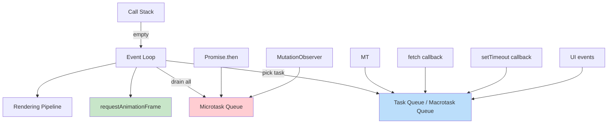

# Browser Event Loop

The event loop is the mechanism that allows JavaScript to perform non-blocking operations despite being single-threaded. Understanding it is essential for writing asynchronous code correctly and predicting execution order.

## Core Components



### Call Stack

JavaScript executes code on a single call stack. Each function call is pushed on; when it returns, it's popped off. The stack follows LIFO order:

```javascript
function foo() { bar(); console.log('foo'); }
function bar() { console.log('bar'); }
foo();
// Stack: foo → bar → (bar returns) → (foo continues) → (foo returns)
```

### Task Queue (Macrotask Queue)

Holds callbacks from: `setTimeout`, `setInterval`, I/O operations, UI events (click, scroll), `MessageChannel`. The event loop processes **one** task per iteration.

### Microtask Queue

Holds callbacks from: `Promise.then/catch/finally`, `queueMicrotask()`, `MutationObserver`. The event loop **drains all** microtasks before moving to the next task or rendering.

## Execution Order

```javascript
console.log('1'); // sync

setTimeout(() => console.log('2'), 0); // macrotask

Promise.resolve().then(() => console.log('3')); // microtask

console.log('4'); // sync

// Output: 1, 4, 3, 2
```

**Priority order:** Synchronous code → All microtasks → One macrotask → Render → Repeat.

## requestAnimationFrame

`requestAnimationFrame` (rAF) fires **before** the browser paints. It's the correct API for visual animations — the callback runs once per frame (~60fps) and the browser can optimize frame timing.

```javascript
// rAF vs setTimeout for animation
let lastTime = 0;
function animate(time) {
  const delta = time - lastTime;
  lastTime = time;
  element.style.transform = `translateX(${delta * 0.1}px)`;
  requestAnimationFrame(animate);
}
requestAnimationFrame(animate);
```

## The Full Event Loop Cycle

Each iteration of the event loop:

1. Execute the oldest **macrotask** from the task queue
2. **Drain all** microtasks (including newly queued ones)
3. If needed, perform **rendering** (rAF callbacks → style → layout → paint)
4. Repeat

| Queue | Source | Processed | Priority |
|---|---|---|---|
| Call Stack | Synchronous code | Immediately | Highest |
| Microtask Queue | Promises, MutationObserver | All at once | Second |
| rAF Queue | `requestAnimationFrame` | Once per frame | Third |
| Task Queue | setTimeout, events, I/O | One per loop | Lowest |

## Common Pitfalls

```javascript
// Pitfall: microtask starvation
function loop() {
  Promise.resolve().then(loop); // queues another microtask
}
loop(); // never reaches rendering or macrotasks

// Pitfall: async/await is microtask-based
async function main() {
  console.log('a');
  await Promise.resolve(); // yields to microtask queue
  console.log('b'); // runs as microtask
}
main();
console.log('c');
// Output: a, c, b
```

## Interview Questions

**Q1: What is the difference between macrotasks and microtasks?**
A: Macrotasks (setTimeout, I/O, events) are processed one per event loop tick. Microtasks (Promises, MutationObserver) are all drained before the next task. Microtasks always run before the next macrotask.

**Q2: Why does `setTimeout(fn, 0)` not execute immediately?**
A: Even with 0ms delay, the callback enters the task queue and must wait for the current call stack to clear and all microtasks to drain. The minimum delay is typically ~1ms in browsers (clamped by HTML spec to 4ms for nested timeouts).

**Q3: How does the event loop relate to rendering?**
A: After draining microtasks, the event loop checks if rendering is needed. It runs rAF callbacks, then performs style calculation, layout, and paint. Long-running macrotasks block rendering and cause jank.

**Q4: Can microtasks block the event loop?**
A: Yes. A microtask that queues another microtask creates an infinite drain loop, preventing rendering and macrotask processing. This is called microtask starvation.

## Cross-References

- [Browser Architecture](browser-architecture.md) — Process model and rendering engine
- [Rendering Performance](rendering-performance.md) — Frame budget and optimization
- [DOM](dom.md) — DOM operations and their synchronous nature

## References

- [HTML Spec — Event Loops](https://html.spec.whatwg.org/multipage/webappapis.html#event-loops)
- [Tasks, Microtasks, Queues and Schedules — Jake Archibald](https://jakearchibald.com/2015/tasks-microtasks-queues-and-schedules/)
