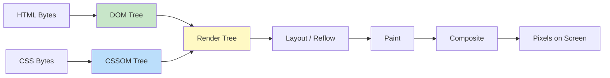

# Browser Rendering Pipeline

The browser rendering pipeline transforms HTML, CSS, and JavaScript into pixels on screen. Each stage has performance implications, and understanding this pipeline is key to building fast interfaces.

## The Critical Rendering Path



### Stage 1: DOM Construction

The browser parses HTML into the **Document Object Model** — a tree of nodes. The parser is incremental: it processes bytes as they arrive and can start building the DOM before the full response is received. JavaScript can modify the DOM, causing re-parsing.

### Stage 2: CSSOM Construction

CSS is parsed into the **CSS Object Model**. Unlike HTML, CSS is render-blocking: the browser won't paint until the CSSOM is complete. CSS parsing is also incremental but cascading rules require the full stylesheet to compute final styles.

### Stage 3: Render Tree

The DOM and CSSOM combine into the **render tree**, containing only visible nodes:

| Excluded | Included |
|---|---|
| `<head>`, `<meta>`, `<script>` | Visible `<div>`, `<span>`, `<p>` |
| `display: none` elements | `visibility: hidden` elements |
| Elements not matching media queries | Pseudo-elements (`::before`, `::after`) |

Each render tree node stores its computed styles — the final values after resolving inheritance, cascading, and defaults.

### Stage 4: Layout (Reflow)

The browser calculates the **geometry** of every render tree node: position (x, y) and size (width, height). This traverses the tree from root to leaves, computing box model dimensions based on the viewport and parent constraints.

Layout is expensive — a change to one element can trigger re-layout of its entire subtree and potentially ancestors.

### Stage 5: Paint

The browser generates **paint records** — ordered drawing instructions (fill background, draw border, render text, draw image). Paint is split into multiple layers for compositor optimization.

### Stage 6: Composite

Individual paint layers are rasterized (often on the GPU) and then **composited** together in the correct order to produce the final frame. Transform and opacity changes only affect compositing, skipping layout and paint.

## Per-Frame Pipeline

Every frame (~16.6ms at 60fps) follows this sequence:

1. **JavaScript** — event handlers, requestAnimationFrame callbacks
2. **Style Calculation** — recompute affected computed styles
3. **Layout** — recalculate geometry (if dirty)
4. **Paint** — generate new paint records (if dirty)
5. **Composite** — combine and rasterize layers

## Optimization Strategies

```javascript
// BAD: triggers layout thrashing
for (let i = 0; i < 100; i++) {
  const height = el.offsetHeight; // forced synchronous layout (read)
  items[i].style.height = height + 'px'; // invalidate layout (write)
}

// GOOD: batch reads, then batch writes
const height = el.offsetHeight;
for (let i = 0; i < 100; i++) {
  items[i].style.height = height + 'px';
}
```

| Property Change | Triggers Layout | Triggers Paint | Compositor Only |
|---|---|---|---|
| `width`, `height`, `margin` | Yes | Yes | No |
| `color`, `background` | No | Yes | No |
| `transform`, `opacity` | No | No | Yes |
| `box-shadow` | No | Yes | No |
| `top`, `left` (positioned) | Yes | Yes | No |

**Key principle:** Animate only `transform` and `opacity` to stay on the compositor thread and avoid layout/paint.

## Interview Questions

**Q1: What is the critical rendering path?**
A: The sequence from receiving HTML/CSS bytes to painting pixels: DOM construction → CSSOM construction → Render Tree → Layout → Paint → Composite. Optimizing this path (minimizing render-blocking resources, reducing layout scope) is the foundation of page load performance.

**Q2: Why is CSS render-blocking but JavaScript parser-blocking?**
A: CSS blocks rendering because the browser needs computed styles to build the render tree. JavaScript blocks parsing because it can modify the DOM (e.g., `document.write`). Using `async`/`defer` for scripts and inlining critical CSS are the primary optimizations.

**Q3: What is layout thrashing and how do you prevent it?**
A: Layout thrashing occurs when JavaScript alternates between reading layout properties (forcing synchronous layout) and writing layout properties (invalidating layout) in a loop. Prevent it by batching all reads first, then all writes, or using `FastDOM`.

**Q4: Why should you animate `transform` instead of `top/left`?**
A: `transform` and `opacity` are handled entirely by the compositor thread — they skip layout and paint, running on the GPU. Animating `top`/`left` triggers layout on the main thread for every frame, which is significantly more expensive.

**Q5: What is the difference between `display: none` and `visibility: hidden` in terms of rendering?**
A: `display: none` removes the element from the render tree entirely — no layout or paint. `visibility: hidden` keeps the element in the render tree and allocates space (layout runs), but skips painting its pixels.

## Cross-References

- [Browser Architecture](browser-architecture.md) — Process model and engine components
- [Browser Event Loop](browser-event-loop.md) — How rendering fits in the event loop cycle
- [Rendering Performance](rendering-performance.md) — Performance metrics and optimization techniques
- [DOM](dom.md) — DOM operations and their rendering impact

## References

- [Rendering Performance — web.dev](https://web.dev/learn/performance/rendering/)
- [How Browsers Work — Tali Garsiel](https://www.html5rocks.com/en/tutorials/internals/howbrowserswork/)
