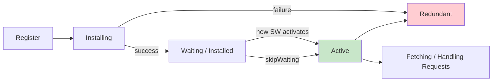

# Service Workers

Service Workers are proxy servers that run in the browser between your web application and the network. They enable offline-first experiences, background sync, and push notifications by intercepting and caching network requests.

## Lifecycle

A Service Worker goes through a well-defined lifecycle with distinct states:



```javascript
// Registration (in main thread)
if ('serviceWorker' in navigator) {
  navigator.serviceWorker.register('/sw.js', { scope: '/' })
    .then(reg => console.log('Registered:', reg.scope))
    .catch(err => console.error('Registration failed:', err));
}
```

| State | Description | Trigger |
|---|---|---|
| Installing | Initial install, runs `install` event | First registration or SW file change |
| Waiting | Installed but not controlling pages yet | Old SW still active |
| Active | Controls all pages in scope | All old tabs closed or `skipWaiting()` called |
| Redundant | SW failed or replaced | Install failure or new SW activated |

## The Cache API

The Cache API provides a persistent key-value store for request-response pairs, controlled entirely by JavaScript:

```javascript
// sw.js
const CACHE_NAME = 'v1';
const ASSETS = ['/', '/index.html', '/styles.css', '/app.js'];

// Install: pre-cache static assets
self.addEventListener('install', (event) => {
  event.waitUntil(
    caches.open(CACHE_NAME)
      .then(cache => cache.addAll(ASSETS))
      .then(() => self.skipWaiting())
  );
});

// Activate: clean old caches
self.addEventListener('activate', (event) => {
  event.waitUntil(
    caches.keys().then(keys =>
      Promise.all(keys
        .filter(key => key !== CACHE_NAME)
        .map(key => caches.delete(key))
      )
    ).then(() => self.clients.claim())
  );
});

// Fetch: cache-first strategy
self.addEventListener('fetch', (event) => {
  event.respondWith(
    caches.match(event.request)
      .then(cached => cached || fetch(event.request))
  );
});
```

## Caching Strategies

| Strategy | Behavior | Best For |
|---|---|---|
| Cache First | Check cache, fall back to network | Static assets with versioned URLs |
| Network First | Try network, fall back to cache | API responses that should be fresh |
| Stale While Revalidate | Serve cache, update cache from network | Frequently updated content |
| Cache Only | Serve from cache only | Fully pre-cached pages |
| Network Only | Always fetch from network | Non-cacheable requests (e.g., analytics) |

## Push Notifications

```javascript
// Subscribe to push
const subscription = await registration.pushManager.subscribe({
  userVisibleOnly: true,
  applicationServerKey: vapidPublicKey
});

// Handle push in service worker
self.addEventListener('push', (event) => {
  const data = event.data.json();
  event.waitUntil(
    self.registration.showNotification(data.title, {
      body: data.body,
      icon: '/icon.png'
    })
  );
});
```

## Workbox

[Workbox](https://developer.chrome.com/docs/workbox) is a Google library that simplifies Service Worker development with pre-built strategies, routing, and caching:

```javascript
import { registerRoute } from 'workbox-routing';
import { CacheFirst, StaleWhileRevalidate } from 'workbox-strategies';
import { ExpirationPlugin } from 'workbox-expiration';

registerRoute(/\.(?:js|css)$/, new StaleWhileRevalidate());
registerRoute(/\.(?:png|jpg|svg)$/, new CacheFirst({
  cacheName: 'images',
  plugins: [new ExpirationPlugin({ maxEntries: 50 })]
}));
```

## Interview Questions

**Q1: What is the difference between a Service Worker and a Web Worker?**
A: A Web Worker runs in a background thread for CPU-heavy computation with no network access. A Service Worker acts as a network proxy — it intercepts fetch requests, manages caches, handles push notifications, and can control multiple tabs. It persists across page reloads and operates independently of the page lifecycle.

**Q2: Why does a Service Worker require HTTPS?**
A: Service Workers can intercept and modify all network requests for their scope. Without HTTPS, a man-in-the-middle could inject a malicious Service Worker, compromising the security of every subsequent request. `localhost` is exempted for development.

**Q3: Explain the `skipWaiting()` and `clients.claim()` pattern.**
A: `skipWaiting()` in the install event makes the new SW immediately enter the active state without waiting for old tabs to close. `clients.claim()` in the activate event makes the active SW immediately control all open pages in its scope. Together, they ensure updates take effect immediately rather than requiring users to close and reopen tabs.

**Q4: What happens if a Service Worker throws an unhandled error during fetch?**
A: The browser falls back to the default network behavior — it attempts the original request as if no Service Worker was registered. However, unhandled promise rejections in the SW do not crash it; the SW stays active and continues handling subsequent events.

## Cross-References

- [Web Workers](web-workers.md) — Dedicated workers for computation
- [HTTP Fundamentals](http-fundamentals.md) — Request/response handling
- [Cookies & Storage](cookies-storage.md) — Comparing Cache API with other storage
- [Security](security-deep.md) — HTTPS requirement and scope security

## References

- [Service Workers — MDN](https://developer.mozilla.org/en-US/docs/Web/API/Service_Worker_API)
- [Workbox — Google Developers](https://developer.chrome.com/docs/workbox)
- [The Service Worker Lifecycle — web.dev](https://web.dev/learn/pwa/service-worker-lifecycle/)